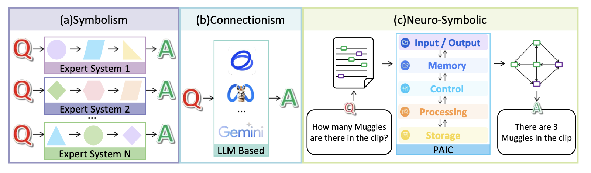

# Personal Autonomous Intelligence Computer

个人AI计算机

Hanqing Wu 1 Zile Yang 2 Jiahuan Zhang 2 Dongbai Chen 1 Baoping Hao 1 Hao Zhang 1 Hongying Han 1Wenlin Fu 1

Kaicheng Yu 1 2

## Abstract

摘要

In this position paper, we introduce a concept of personal autonomous intelligence computer (PAIC), to combine the advantage of two mainstream intelligence systems, connectionism and rule-based symbolism. Similar to a traditional von Neumann architecture, our PAIC consists of the input-output, memory, control, processing, and storage Unit. PAIC not only removes the limitation of the fix-length context window from the large language model but also achieves multi-hop reasoning-related precise manipulation of input with a novel pipeline. We also argue that, with the progressive increase of PAIC users on the Internet, the data flow of the current Internet will be reformed to achieve a decentralized local network. Our project page is publicly accessible at https: //github.com/KMind-Inc/PAIC

本文档提出了一种称为个人自主智能计算机的概念 (PAIC)，旨在结合两种主流智能系统 (connectionism 和 rule-based symbolism) 的优势。类似于传统的冯诺依曼架构，PAIC 也由输入输出、内存、控制、处理和存储单元组成。

PAIC 不仅突破了大型语言模型固定长度上下文窗口的限制，而且通过一种新颖的管道实现了与多跳推理相关的精确输入操作。我们还认为，随着 PAIC 用户在互联网上的逐渐增多，当前互联网的数据流将被重塑，以实现去中心化的本地网络。

我们的项目主页可以公开访问：[https://github.com/KMind-Inc/PAIC]

## 1. Introduction

1. 引言

Recent mainstream AI systems primarily utilize Large Language Models (LLMs), exemplars of connectionism, for their notable generalization capability (Xi et al., 2023). This approach facilitates general intelligence in diverse fields such as text-to-image generation (Kim et al., 2023; Ge et al., 2023), tool-use (Qin et al., 2023; Patil et al., 2023), research (Bran et al., 2023; Boiko et al., 2023), etc.

最近主流的人工智能系统主要利用大型语言模型 (LLMs) 来实现其显著的泛化能力，LLMs 是连接主义的代表 (Xi 等人，2023 年)。这种方法促进了人工智能在文本转图像生成 (Kim 等人，2023 年; Ge 等人，2023 年)、工具使用 (Qin 等人，2023 年; Patil 等人，2023 年)、研究 (Bran 等人，2023 年; Boiko 等人，2023 年) 等领域的发展。

However, the connectionism paradigm fundamentally involves a probabilistic model, inherently susceptible to errors, notably the “hallucination” phenomenon (Xu et al., 2023). In other words, due to the intrinsic structural design of LLMs and their reliance on neural network architectures, achieving precise data control solely through LLMs is inherently insufficient. If we provide paragraph excerpts from the classical English literature, *Harry Potter and the Philosopher’s Stone* (Rowling, 2015), to the ChatGPT-4 (OpenAI,2024), which is the state-of-the-art LLM-based AI system, and repeatedly ask it the following question, *“How many words or phrases which indicate the Muggle characters are directly and indirectly mentioned in the provided passage? Please return a number only.”*, it consistently failed to provide the correct answer.

然而，连接主义范式本质上是一个概率模型，容易出现错误，尤其容易出现“幻觉”现象 (Xu 等人，2023 年)。换句话说，由于大型语言模型 (LLMs) 内在的结构设计及其对神经网络架构的依赖，仅通过大型语言模型实现精确的数据控制在本质上是不够的。例如，即使是像 ChatGPT-4 (OpenAI，2024) 这样最先进的基于 LLM 的人工智能系统，也无法始终如一地执行此操作。ChatGPT-4 是一个以文本为条件的生成模型，擅长于创作故事和代码等，但对于需要精确推理和数据控制的任务，它可能会表现不佳。具体来说，如果我们向 ChatGPT-4 提供来自经典英国文学作品《哈利·波特与魔法石》(罗琳，2015) 的段落摘录，并反复询问以下问题：“请仅返回一个数字，指出该段落直接或间接提到的表示麻瓜角色的词语或短语有多少个？” ChatGPT-4 可能会持续给出错误的答案。

The complexity of this query stems from the necessity for an AI system to first identify and comprehend the context related to the “Muggle character” within the provided passage, in order to understand what the “Muggle character” is. Subsequently, it is required to interpret the entirety of the text to deduce which words or phrases align with the definition of the “Muggle character”. Finally, following the user specifications, “Please return a number only.”, it is tasked with accurately enumerating the number of words or phrases implying the “Muggle character”, and subsequently relaying the cumulative count back to the user. This indicates that the state-of-the-art LLM still struggles to precisely understand and manipulate the fine-grained structure of data, and we categorize it as *AI Precision* problem. To achieve the capability of data manipulation with finer granularity, we advocate for an AI system capable of multi-hop reasoning. For this “Muggle” Counting problem which is multi-hop reasoning-based, our system correctly identify all words or phrases which directly or indirectly indicate the meaning of the “Muggle character” .

这种查询的复杂性源于人工智能系统首先需要识别并理解提供段落中与“麻瓜角色”相关的上下文，以便理解什么是“麻瓜角色”。接下来，它还需要解释整个文本，以推断哪些词或短语符合“麻瓜角色”的定义。最后，根据用户规格“请仅返回一个数字。”，它需要准确计算暗示“麻瓜角色”的词或短语数量，然后将累积计数传回给用户。这表明即使是最先进的 LLM 仍然难以精确理解和操作数据细粒度的结构，我们将其归类为人工智能精度问题。为了实现更细粒度的操纵数据的能力，我们提倡一种能够进行多跳推理的人工智能系统。对于这个基于多跳推理的“麻瓜”计数问题，我们的系统可以正确识别所有直接或间接表示“麻瓜角色”含义的词或短语。

Conversely, the issue of hallucination is fundamentally nonexistent in the context of symbolic approaches. This is because the reasoning capability of the symbolism is based on explicitly set rules and logical operations (Zhang et al., 2021). In other words, symbolic methods utilize powerful declarative languages for knowledge representation, offering clear, interpretable reasoning processes (Zhang et al., 2021). Nevertheless, the symbolism paradigm’s reliance on a top-down, rule-based strategy limits its generalizability, necessitating substantial manual adjustments to tailor rules for diverse input scenarios. Hence, to attain a higher precision in data manipulation capability, we propose our solution, Personal Autonomous Intelligence Computer (PAIC), integrating the strengths of connectionism’s generalization capabilities with the precise data control offered by symbolism.

另一方面，符号方法从根本上不存在“幻觉”问题，因为符号推理能力基于明确设定好的规则和逻辑运算 (Zhang et al., 2021)。换句话说，符号方法利用强大的声明性语言进行知识表示，提供清晰可解释的推理过程 (Zhang et al., 2021)。然而，符号范式依赖于自上而下的基于规则的策略，从而限制了它的泛化能力，需要大量人工调整才能使规则适应各种输入场景。因此，为了在数据操纵能力方面实现更高的精度，我们提出了一种解决方案：个人自主智能计算机 (PAIC)，它结合了连接主义的泛化能力和符号主义提供的精确数据控制优势。

As depicted in the middle block of the Figure 1(c), our PAIC consists of common components in the Von Neumann Architecture (Von Neumann, 1993). Compared to the early approaches that only add an external memory unit to extend the context window (Packer et al., 2023), our PAIC aims to leverage a graph-driven approach to alleviate the hallucination. Specifically, we treat the large language model like a central processing unit of a traditional computer and decompose the reasoning tasks into various sub-tasks to avoid excessively using highly complex prompts. We then propose a novel data pipeline, dehydration-verification-rehydration, to realize a close-loop verification process to ensure the correctness of our PAIC’s execution.

承接上一段，正如我们在图 1(c) 的中间部分所描绘的，我们的 PAIC 由冯诺依曼架构 (冯诺依曼，1993) 中的常用组件组成。与早期仅通过添加外部存储器单元来扩展上下文窗口的方法 (Packer 等人，2023) 相比，我们的 PAIC 旨在利用一种图驱动的方法来减轻“幻觉”问题。具体来说，我们将大型语言模型视为传统计算机的中央处理单元，并将推理任务分解成各种子任务，以避免过度使用非常复杂的提示符。然后，我们提出了一种新颖的数据管道——脱水-验证-复水，通过闭环验证过程来确保我们 PAIC 执行的正确性。

Besides, our PAIC is also characterized by customized storage and user-defined capabilities. Specifically, deploying our product in a cloud computing environment not only liberates it from the fixed-length context window limitation of LLMs but also provides expandable storage capacity. Furthermore, unlike the domain-specific language models, we aim to build an operating system, dubbed kOS, that contains some common operations like parsing online content of web pages and also supports user-defined ones to ease the customization. To this end, we can easily reorganize these operations into lightweight downstream applications.

此外，我们的人工智能计算平台 (PAIC) 还具有定制存储和用户自定义功能的特性。具体而言，在云计算环境中部署我们的产品不仅可以使其摆脱大型语言模型固定长度上下文窗口的限制，还可以提供可扩展的存储容量。此外，与特定领域的语言模型不同，我们旨在构建一个名为 kOS 的操作系统，其中包含一些常见操作，例如解析网页的在线内容，并且还支持用户自定义操作，以简化定制过程。为此，我们可以轻松地将这些操作重新组织成轻量级的下游应用程序。

As user numbers grow and considering our PAIC’s continuous online presence, we hypothesize that an evolving network framework, building incrementally on current Internet architecture, will gradually emerge. We dub this novel network paradigm the *AI Internet*. More significantly, the advent of the AI Internet implies that the paradigm of information dissemination may undergo alterations. Current Internet architecture funnels a significant amount of data to platforms providing information alignment services, as evidenced by the growing preference for online shopping companies like Amazon and Alibaba. These informationmatching service-offering platforms align a boarder range of options with the user requirements, including some unique information such as the off-price merchandise. Several third-party platforms mandate their partner merchants to provide the lowest prices exclusively on their platforms, often resulting in artificially inflated prices on competing platforms (Com, 2021; b, 2021; Sheng et al., 2021). In essence, these platform companies monopolize a market segment by controlling both demand and supply information. In contrast, people can transmit their requests across the AI Internet through their PAICs. Subsequently, other PAICs possess the eligible answer will automatically reply to those PAICs that broadcast requests. Hence, the data eventually flows towards the demands instead of the third-party platform. In summary, our vision is:
随着用户数量的增长以及我们 PAIC 持续在线，我们假设一种不断演进的网络框架将会逐渐出现，它将基于当前的互联网架构逐步构建。我们将这种新颖的网络范式称为「AI 网络」。更重要的是，AI 网络的出现意味着信息传播范式可能会发生改变。

当前的互联网架构将大量数据导向提供信息匹配服务的平台，例如电商巨头亚马逊和阿里巴巴等。这些提供信息匹配服务的平台会将广泛的选择（包括一些独特信息，比如折扣商品）与用户需求进行匹配。然而，一些第三方平台会强制其合作商家仅在其平台上提供最低价格，这往往导致竞争平台上的价格人为抬高（Com, 2021; b, 2021; Sheng et al., 2021）。本质上，这些平台公司通过控制需求和供给信息来垄断细分市场。

相比之下，人们可以通过他们的 PAIC 在 AI 网络上传输他们的需求。然后，拥有合适答案的其他 PAIC 将自动回复广播请求的 PAIC。因此，数据最终会流向需求方，而不是第三方平台。

综上所述，我们的愿景是：

We propose an initial design structure of Personal Autonomous Intelligence Computer (PAIC), taking full advantage of the symbolism and connectionism, which are characterised by supporting the precise operation with multimodal data and the user-defined capability to alleviate the current hallucination problem of current generative models.

我们提出了一种个人自主智能计算机 (PAIC) 的初始设计结构，该结构充分利用了符号主义和连接主义的优势。符号主义支持使用多模态数据进行精确操作，而连接主义则通过用户自定义功能来缓解当前生成模型的幻觉问题。

We hypothesize a new paradigm of the internet will emerge with the growing number of our PAIC (or equivalently other types of agent-based systems) users, that the information will not inevitably flow to techgiants but decentralized local hosts. As such, it sheds light on resolving the current data monopolization phenomenon.

我们假设随着像我们 PAIC 这样的个人自主智能计算机（或其他类型的基于智能体的系统）用户数量的增长，将会出现一种新的互联网范式。在这种范式中，信息将不会不可避免地流向科技巨头，而是去中心化地存储在本地主机上。因此，这为解决当前数据垄断现象提供了启发性的思路。

Figure 1. Paradigm of symbolism, connectionism and our neuro-symbolic solution. For the resolution of the multi-hop reasoning- related queries, solutions can generally be categorized into three distinct paradigms, symbolism, connectionism, and neuro-symbolic: (a) representatives of symbolism, expert system (Wang et al., 2022a), primarily relies on the construction of a series of hand-crafted rules to facilitate reasoning in a specific case, hereby, lacking in generalizability; (b) quintessential embodiment of connectionism, Large Language Model (LLM), exhibits robust generalization capability in general inferential problems but always suffers from the hallucination problem (Xu et al., 2023), failing to generate the precise answer; (c) our solution, *Personal Autonomous Intelligence Computer*, composed of a set of distinct units, takes full advantage of both the symbolism and the connectionism, large language model, forming the structure data which contains the high-dimensional information, such as the knowledge graph to first translate an arbitrary user input into a verifiable graph structure so to resolve uncertainty introduced by generative connectionism pipeline.

图 1. 符号主义、连接主义和我们神经符号解决方案的范式。对于解决多跳推理相关查询，解决方案通常可以分为三种不同的范式：符号主义、连接主义和神经符号主义：

(a) 符号主义的代表，专家系统（Wang等人，2022 年 a），主要依靠构建一系列手工制作的规则来促进特定案例中的推理，因此缺乏泛化能力；

(b) 连接主义的典型代表，大型语言模型 (LLM)，在一般推理问题上表现出强大的泛化能力，但总是容易出现幻觉问题（Xu等人，2023 年），无法生成精确的答案；

(c) 我们的解决方案 - 个人自主智能计算机，由一组独立的单元组成，充分利用了符号主义和大语言模型（连接主义的一种），形成包含高维信息的结构化数据，例如知识图，以首先将任意用户输入转换为可验证的图结构，从而解决生成式连接主义管道引入的不确定性。

## 2. Personal Autonomous Intelligence Computer (PAIC)

个人AI计算机

As mentioned above, with the aim of achieving precise data manipulation, our solution is Personal Autonomous Intelligence Computer (PAIC). This section will illustrate how to accomplish this functionality built on the architecture of our PAIC.

如前所述，为了实现精准的数据操纵，我们的解决方案是个人自主智能计算机 (PAIC)。本节将说明如何在 PAIC 的架构上实现此功能。

### 2.1. Architecture

架构

Figure 2 illustrates that the PAIC architecture preserves the core elements of the traditional Von Neumann architecture (Von Neumann, 1993) rooted in the Turing Machine Model (Turing et al., 1936). Specifically, PAIC is composed of:

图 2 展示了 PAIC 架构保留了冯诺依曼结构 (Von Neumann, 1993) 的核心元素，该结构源于图灵机模型 (Turing et al., 1936)。具体来说，PAIC 由以下部分组成：

Input-Output (IO) Unit. As the purpose of our PAIC is to accurately understand and manipulate personal data, we shall support various input sources, such as traditional application (APP), Applet services, instant messager (IM) and its modalities include text, audio, images and videos. We also support a language user interface (LUI) which leverages a customized langauge model to process arbitrary user commands.

**输入输出 (IO)单元**： 为了准确理解和处理个人数据，PAIC 支持各种输入源，例如传统应用程序 (APP)、小程序服务、即时消息 (IM)，以及文本、音频、图像和视频等格式。我们还支持语言用户界面 (LUI)，它利用定制的语言模型来处理任意用户命令。

Control Unit. In our design, this unit serves as the ‘brain’ of the entire PAIC system. It comprises a *Decision Maker* for task and strategy selection, an *Evaluator* for performance assessment, and a *Job Manager* for task allocation, collectively executing precise control in accordance with user demands. Its internal design facilitates logical recursion, mirroring the human problem-solving process.

**控制单元**： 在我们的设计中，该单元是整个 PAIC 系统的“大脑”。它包含任务和策略选择的决策器、性能评估的评估器以及任务分配的作业管理器，共同根据用户需求执行精确控制。其内部设计促进逻辑递归，反映了人类的解决问题过程。

Processing Unit. It primarily consists of the *Language Module* and the *Job Executor*. The Job Executor is mainly responsible for the task execution, which can also leverage the external tools library to support arbitrary user-defined operations. Note that, the *Language Module* can be called by other units, for example, the IO Unit will use it to understand and decompose the user’s language instruction input.

**处理单元**： 它主要由语言模块和作业执行器组成。作业执行器主要负责任务执行，还可以利用外部工具库支持任意用户定义的操作。需要注意的是，语言模块可以被其他单元调用，例如，IO 单元将使用它来理解和分解用户的语言指令输入。

Tools Library. This unit mainly consists of external tools with two features, an automatic tool learning approach with Robotic Process Automation (Madakam et al., 2019) to support cross-platform applications, and a zoo of predefined tools pipeline, e.g. Photoshop and After Effects for photo and video editing.

**工具库**： 该单元主要由外部工具组成，具有两个功能：使用机器人流程自动化 (RPA) 的自动工具学习方法来支持跨平台应用程序，以及预定义工具管道的集合，例如用于照片和视频编辑的 Photoshop 和 After Effects。

Memory Unit. Similar to a traditional computer, the memory unit is designed to store the content of an active session when processing the user’s input command, including the embedding of various input formats, like text, images, videos and audio.

**内存单元**： 类似于传统计算机，内存单元在处理用户输入命令时被设计用来存储活动会话的内容，包括各种输入格式的嵌入，例如文本、图像、视频和音频。

Storage Unit. Unlike the memory unit, this unit is permanent data storage, such as previous conversations, and external uploaded data, so to let PAIC understand the user’s patterns and preferences. Note that, the content of memory and storage units can be updated accordingly with the help of our processing unit.

**存储单元**： 与内存单元不同，该单元是永久数据存储，例如之前的对话和外部上传的数据，以便 PAIC 了解用户的模式和偏好。需要注意的是，内存和存储单元的内容可以借助我们的处理单元进行更新。

### 2.2. kOS: An operating system for PAIC

kOS：PAIC的操作系统

An operating system (OS) is crucial for a computer, as it bridges computer and software architectures, manages core system functions, and facilitates user interaction and application execution. (Wilkes & Needham, 1979; Unwana et al., 2022). Similarly, we introduce, kOS, an operating system developed on our PAIC architecture. By analogy with the software and applications executed within the current OSs, a novel concept, *Action* (ACT). In our kOS, ACT is a certain program to combines certain machine learning operations with predefined logic to achieve certain functions. We categorize such ACT into three kinds of levels: native ACT, system ACT and customized ACT. *Native ACT (NACT)*, standing for the atomic functionalities of our PAIC that are launched on kOS, NACT can thus be considered kOS’s minimal execution unit, encapsulating the interaction paradigm among PAIC components in line with their essential functionalities. As illustrated by the Figure 3, it is evident that both the *System ACT (SACT)* and the *Customized ACT (CACT)* are implemented through a series of logical combinations based on pre-encapsulated NACTs, facilitating more complex capabilities.

对于计算机来说，操作系统 (OS) 至关重要，因为它桥接了计算机和软件架构，管理核心系统功能，并促进用户交互和应用程序执行（Wilkes & Needham, 1979; Unwana et al., 2022）。类似地，我们引入了在 PAIC 架构上开发的操作系统 kOS。

借鉴当前操作系统中执行的软件和应用程序，kOS 引入了全新概念——动作 (ACT)。ACT 是一个程序，它结合特定的机器学习操作和预定义逻辑来实现某些功能。我们将 ACT 分类为三种级别：原生动作 (NACT)、系统动作 (SACT) 和自定义动作 (CACT)。

- 原生动作 (NACT)：代表在 kOS 上启动的 PAIC 基本功能，因此 NACT 可以被视为 kOS 的最小执行单元，封装了 PAIC 组件之间与其基本功能相对应的交互范式。如图 3 所示，系统动作 (SACT) 和自定义动作 (CACT) 都通过一系列基于预封装的 NACT 的逻辑组合来实现，从而实现更复杂的功能。

Native ACT (NACT). NACT represents the smallest executable unit within our kOS. It encapsulates collaborative interactions among PAIC components, aligning with their core functionalities. For example, according to the Figure 3, the invocation of NACT *k get act request()* mainly relies on the collaboration between the IO and Processing Units, designed to decipher user intentions through query deconstruction.

原生动作 (NACT) 是我们 kOS 中最小的可执行单元。它封装了 PAIC 组件之间的协作交互，使其与核心功能保持一致。例如，如图 3 所示，调用 NACT k_get_act_request() 主要依赖于 IO 单元和处理单元之间的协作，旨在通过查询分解来解读用户意图。

System ACT (SACT). SACT is executed using a series of logical operations grounded in pre-encapsulated NACTs, facilitating enhanced capabilities. Taking the SACT *weblinkSummarise()* as an example, it essentially hinges on the NACT *k web get page data()* for obtaining the content of the input web link, *k semantic summarize()* for synthesizing the core concept of the input text, thereby, mainly in charge of summarizing the core content from the input web link. We illustrate the utilization example and code implementation of this SACT in Figure 17 and Figure 18.

系统动作 (SACT) 是通过一系列基于预封装的原生动作 (NACT) 的逻辑运算来执行的，从而实现更强的功能。以 SACT weblinkSummarise() 为例，它本质上依赖于 NACT k_web_get_page_data() 来获取输入网页链接的内容，k_semantic_summarize() 来综合输入文本的核心概念，因此，主要负责从输入的网页链接中总结核心内容。我们将在第 17 和 18 图中展示此 SACT 的使用示例和代码实现。

Customized ACT (CACT). In essence, CACT can be regarded as an extension of the SACT, typically implemented by invoking the corresponding NACTs and SACTs if necessary through a series of logical rules, thereby enabling more intelligent functions to meet personal requirements. Taking the CACT *webImageExtraction()* from Figure 3 as an example, this CACT is to extract the images from the input weblink, essentially relying on the NACT *k web get Image data()*

自定义动作 (CACT) 本质上可以看作是系统动作 (SACT) 的扩展，通常通过一系列逻辑规则调用相应的原生动作 (NACT) 和系统动作 (SACT)（如果需要），从而实现更智能的功能以满足个人需求。例如，如图 3 所示的 CACT webImageExtraction()，此动作旨在从输入的网页链接中提取图像，本质上依赖于原生动作 k_web_get_Image_data()

Please refer to Appendix C for a detailed explanation of all NACTs and SACTs.

请参阅附录 C 以获取所有原生动作 (NACT) 和系统动作 (SACT) 的详细解释。

## 3. Data Manipulation

数据处理

In order to delineate the process of the ultimate target of our PAIC, data manipulation with finer granularity, more comprehensively, this section will primarily dissect an example. In our system, operable data objects are categorized into four types: text, images, video, and audio. Note that, we understand that processing arbitrary user input is nearly impossible at this current state, so we set a limited context, defined by our System ACT or Customized ACT, for the following manipulation procedure. We believe that processing arbitrary language inputs given such limitations as desired is possible.

为了更全面、细致地描述我们 PAIC 的最终目标 - 更精细粒度的 数据处理 过程，本节将重点剖析一个示例。在我们的系统中，可操作的数据对象分为四种类型：文本、图像、视频和音频。请注意，我们理解到在当前阶段，处理任意用户输入几乎是不可能的，因此我们为以下操作过程设定了一个由系统动作 (SACT) 或自定义动作 (CACT) 定义的有限上下文。我们相信，在既定限制下处理任意语言输入是可能的。

In Figure 4, it is distinctly evident that the entire process of the data manipulation is segmented into three phases 3 , Data Dehydration (DD), Data Structure Equilibrium Recovery Recursion (DSERR), and Metadata Rehydration (MR). These three phases connected sequentially, DD → DSERR → MR, defines a novel paradigm to accomplish data manipulation with finer granularity. In response to this novel paradigm, we propose another novel comprehensive concept for measuring the overall performance, *AI Precision*. AI Precision is fundamentally a composite evaluation metric, which can be decomposed into the evaluation metrics for both the DD and DSERR phase performance measurement.

图 4 清晰地展示了整个数据处理过程被划分成三个阶段：数据脱水 (DD)、数据结构平衡恢复递归 (DSERR) 和元数据复水 (MR)。这三个依次连接的阶段 (DD → DSERR → MR) 定义了一种新的范式，以更精细的粒度来完成数据处理。 为了适应这种新范式，我们提出了另一个衡量整体性能的新颖综合概念 - AI 精度。AI 精度本质上是一个复合评估指标，可以分解为 DD 和 DSERR 阶段性能评估的评估指标。

Additionally, all the concepts and notation utilized for the later explanation are defined below:

此外，用于后续解释的所有概念和符号定义如下：

Node. Within the scope of this paper, it can be divided into the subject node and the object node. For example, “A is having dinner with B.”, the subject node represents “A”; the object node is “B”.

节点。在本文的范围内，它可以分为主题节点和对象节点。例如，“A正在与B共进晚餐”，主题节点表示“A”；对象节点是“B”。

Target Edge. It is the edge that is directly relative to the user query. Note that, some queries may contain more than one target edge. Specifically, we use ei→j Target to represent the Target Edge from node i to node j.

目标边缘。它是直接相对于用户查询的边缘。请注意，一些查询可能包含多个目标边缘。具体来说，我们使用ei→j Target来表示从节点i到节点j的目标边缘。

Relevant Edge. It refers to all the edges connected to the subject nodes and the object nodes of the “Target Edge”, excluding the “Target Edge” itself. Similar to the definition of the Target Edge, we use ei→j Relevant to represent the Relevant Edge from node i to node j.

相关边缘。它指的是连接到“目标边缘”的主题节点和对象节点的所有边缘，不包括“目标边缘”本身。与目标边缘的定义类似，我们使用ei→j相关来表示从节点i到节点j的相关边缘。

Irrelevant edge. Conversely, all the other edges not defined by the scope of the “Target Edge” and the “Relevant Edge” are classified as the “Irrelevant Edge”.

不相关的边缘。相反，所有其他未由“目标边缘”和“相关边缘”范围定义的边缘都被归类为“不相关边缘”。

Interaction. For example, “A is having dinner with B.”, the interaction within the scope of this paper is “have dinner”.

互动。例如，“A正在与B共进晚餐”，本文范围内的互动是“共进晚餐”。

### 3.1. Data Dehydration

数据脱水

Referring to the example shown from the Figure 4, the provided passage from the user query is ”A is having dinner with B. B is chatting on the phone with C. C is chatting with A”. The key step of this phase is to generate the high-dimensional structured data, which is a graph structure composed of the node and edge in our example. All nodes contain a subject and its coordinates in the format of “(sentence order, subject order in this sentence)”. All edges encapsulate information, excluding node details, like interactions between subjects and objects, auxiliary verbs, main verbs, and prepositions. Note that, one node can be the subject of one interaction or/ and the object of another interaction. The node coordinate is stored only when the node serves as the subject. All the edges are directional, pointing from the subject to the object.

参考图4中显示的示例，用户查询提供的段落是：“A与B一起吃晚饭。B正在与C通话。C正在与A聊天。”该阶段的关键步骤是生成高维结构化数据，即由节点和边组成的图结构，在我们的示例中。所有节点都包含一个主语及其坐标，格式为“(句子顺序，该句子中的主语顺序)”。所有边都封装了信息，不包括节点详细信息，如主语和宾语之间的交互、辅助动词、主动词和介词等。请注意，一个节点可以是一个交互的主语和/或另一个交互的宾语。只有当节点作为主语时，节点坐标才会被存储。所有边都是有方向的，从主语指向宾语。

Additionally, if provided, the corresponding attribute information for both the node and the edge will also be excavated. For example, any information pertaining to the node, such as basic background, relationships, categories, etc., will be documented. Similarly, the corresponding information relative to the original text, such as the sentence tense, the main verb, the auxiliary verb, the preposition, etc., will be recorded as the edge information. Unlike many knowledge graphs tailored for specific uses like relation extraction (Weston et al., 2013; Riedel et al., 2013), semantic parsing (Berant et al., 2013; Heck et al., 2013), and question-answering (Bordes et al., 2014b;a), etc., our graph structure supports not only a variety of tasks related to explicit or implicit relational reasoning but also the reverse operation of complete original text recovery.

此外，如果提供了的话，还将挖掘节点和边的相应属性信息。例如，关于节点的任何信息，如基本背景、关系、类别等，都将被记录下来。同样地，相对于原始文本的相应信息，如句子时态、主动词、助动词、介词等，将被记录为边的信息。与许多专门用于特定用途的知识图不同，例如关系抽取（Weston等，2013年；Riedel等，2013年）、语义解析（Berant等，2013年；Heck等，2013年）和问答（Bordes等，2014b；a）等，我们的图结构不仅支持与显式或隐式关系推理相关的各种任务，还支持完整原始文本恢复的逆向操作。

In more complex scenarios involving image, video, or audio data, the storage of high-dimensional structured data often relies on the method employed for its generation, and may require formats such as databases. Hence, a distinctly evident bottleneck is the capability of the high-dimensional structured data generation. The greater the capability to generate high-dimensional structured data, the finer the granularity of the data available for subsequent operations. In general, the approaches from the data mining area would be more suitable for this sort of problem (Shu & Ye, 2023).

在涉及图像、视频或音频数据的更复杂场景中，高维结构化数据的存储通常依赖于用于其生成的方法，并且可能需要数据库等格式。因此，一个明显的瓶颈是高维结构化数据生成的能力。生成高维结构化数据的能力越强，可用于后续操作的数据粒度就越细。一般来说，来自数据挖掘领域的方法更适合这种类型的问题（Shu＆Ye，2023年）。

Furthermore, proposing a suitable evaluation metric, such as the information entropy-like metric, for measuring how much information both the different and the same highdimensional structured data can contain is essential to find out the optimal high-dimensional structured data. We leave all these potential improvements in our future work.

此外，提出一个合适的评估指标，比如信息熵类似的指标，用于衡量不同和相同高维结构化数据所包含的信息量，对于找到最优的高维结构化数据至关重要。我们将所有这些潜在的改进留在了我们未来的工作中。

### 3.2. Data Structure Equilibrium Recovery Recursion

数据结构平衡恢复递归

The design of this phase is inspired by the reflection steps undertaken by humans in the problem-solving process. The most important step in this phase is to detect whether the structured data is in equilibrium, which is undertaken by the evaluator. More importantly, the criteria for achieving equilibrium are defined based on the user’s query.

这个阶段的设计受到人类在解决问题过程中所采取的反思步骤的启发。这个阶段中最重要的一步是检测结构化数据是否处于平衡状态，由评估器负责完成。更重要的是，实现平衡的标准是基于用户的查询定义的。

Following the example depicted by the Figure 4, the condition for achieving equilibrium is the absence of logical conflicts in both temporal and spatial dimensions. 

根据图4所示的示例，实现平衡的条件是在时间和空间维度上都没有逻辑冲突。

In our example, “Target Edge” set contains the eC→A Target only; ”Relevant Edge” contains the eA→B and the eB→C ; there Relevant Relevantaren’t any ”Irrelevant Edge”. Furthermore, the target edge and interaction identified in the preliminary step also serve as inputs for the current phase. Hence, by replacing the original interaction of the target edge with the target interaction (“chatting with”→“having breakfast with”), the equilibrium of the original structured data is disrupted. The following step is to evaluate whether the current structured data is in equilibrium. More specifically, all “Relevant Edges” are evaluated by the Language Module from the Processing Unit for potential temporal and spatial logical conflicts with the “Target Edge”. All ”Relevant Edges” exhibiting this type of logical conflict, will be fed into the Language Module for updating. Each of these ”Relevant Edges” will be allocated a set of reasonable interactions.

在我们的示例中，“目标边缘”集合仅包含 eC→A 目标；“相关边缘”包含 eA→B 和 eB→C；没有任何“不相关边缘”。此外，初步步骤中确定的目标边缘和交互也作为当前阶段的输入。因此，通过用目标交互替换目标边缘的原始交互（“与之聊天”→“与之一起吃早餐”），原始结构化数据的平衡被打破了。接下来的步骤是评估当前结构化数据是否处于平衡状态。更具体地说，所有的“相关边缘”都将由处理单元中的语言模块进行评估，以确定与“目标边缘”可能存在的时间和空间逻辑冲突。所有展现出这种逻辑冲突的“相关边缘”将被输入到语言模块进行更新。每个这样的“相关边缘”将被分配一组合理的交互。

In order to achieve the capability of data manipulation with finer granularity, we also introduce a concept to quantify the degree of disruption to the original text, counting the number of words changed from the original text. Hence, all the corresponding “Relevant Edge” will be eventually updated to an optimal “Edge” with the minimum number of words changed from the original text. All these updated “Edges” will then become the new “Target Edge” for the next recursion. Similarly, they follow all the aforementioned steps to update their own “Relevant Edges” exhibiting the same logical conflict. Note that, all the edges that had been classified as the “Relevant Edge” will not be considered as the “Relevant Edge” in the following process. The recursion terminates only when no more “Relevant Edges” are found that have temporal and spatial dimensional logical conflicts with the current ”Target Edge”. At this point, the resultant structured data can be regarded as returning to the equilibrium status, which will be output to the final phase.

为了实现对数据的更细粒度操作能力，我们还引入了一个概念来量化对原始文本的干扰程度，即计算从原始文本中更改的单词数量。因此，所有相应的“相关边缘”最终将被更新为具有从原始文本中更改的最小单词数的最优“边缘”。然后，所有这些更新的“边缘”将成为下一次递归的新“目标边缘”。同样地，它们遵循所有前述步骤来更新展示相同逻辑冲突的自己的“相关边缘”。请注意，所有被分类为“相关边缘”的边将不会在后续过程中被视为“相关边缘”。递归只有在不再找到与当前“目标边缘”存在时间和空间维度逻辑冲突的“相关边缘”时才终止。在这一点上，产生的结构化数据可以被视为返回到平衡状态，并将输出到最终阶段。

Based on the aforementioned description, it is not difficult to observe that the equilibrium condition plays a pivotal role in this phase. For this example, it mainly considers the logical conflict in the temporal and spatial dimensionality. Currently, all the conditions are composed of handcrafted rules according to the different applications. We emphasize that this equilibrium condition is defined by the user’s defined context. In the future, we propose to self-adaptively generate the equilibrium conditions via the user query, enhancing the generalization capability of the evaluator.

根据上述描述，不难观察到平衡条件在这一阶段起着关键作用。对于这个示例，它主要考虑了时间和空间维度上的逻辑冲突。目前，所有条件都由手工制定的规则组成，根据不同的应用而定。我们强调，这个平衡条件是由用户定义的上下文所定义的。在未来，我们提议通过用户查询自适应地生成平衡条件，增强评估器的泛化能力。

### 3.3. Metadata Rehydration

元数据再水化

This is the last phase of the data manipulation process, which mainly focues on recovering the text from the structured data in this example. As characteristics of such structure data, the coordinates of all the subject nodes had been stored in the DD phase. In addition, the rule for recovering the text from the structured data has also been predefined according to the user-provided passage. Therefore, all the raw sentences from the original text can be easily retrieved via our PAIC processing unit.

这是数据操作过程的最后一个阶段，主要专注于从结构化数据中恢复文本。作为这种结构数据的特点，所有主题节点的坐标都已经在DD阶段中存储。此外，根据用户提供的段落，从结构化数据中恢复文本的规则也已经预先定义好了。因此，所有原始文本中的原始句子都可以通过我们的PAIC处理单元轻松检索到。

Our final answer is “A is planning dinner with B. B is chatting on the phone with C. C is having breakfast with A”, where the cost is 2 words changed. Given our example, the answer from ChatGPT-4 as of January 8th, 2024, was completely erroneous and lacked logical coherence, which is shown by the Figure 13 in Appendix B. Additional testing examples have also been provided for the same version of the ChatGPT-4. None of the answers provided by ChatGPT4 is reasonable, which can be viewed from the Figure 14 and Figure 15 in Appendix B as well. Later on, another more challenging example related to four nodes is again fed to the ChatGPT-4 and our PAIC. Referring to the Figure 11, it is evident that ChatGPT-4 still fails to generate a reasonable answer6. Conversely, PAIC’s answer seems more reasonable, which can be viewed from the Figure 12 in Appendix B.

我们最终的答案是：“A正在计划与B共进晚餐。B正在与C通话。C正在与A一起吃早餐。”，其中更改的单词数量为2个。根据我们的示例，截至2024年1月8日的ChatGPT-4的答案完全错误且缺乏逻辑一致性，这在附录B的图13中有所体现。对于相同版本的ChatGPT-4还提供了额外的测试示例。从附录B的图14和图15中可以看出，ChatGPT-4提供的答案都不合理。后来，又给ChatGPT-4和我们的PAIC提供了另一个更具挑战性的涉及四个节点的例子。从图11可以看出，ChatGPT-4仍然未能生成一个合理的答案。相反，PAIC的答案似乎更合理，可以从附录B的图12中看出。

### 3.4. AI Precision

AI精度

We hypothesize that the composite concept, AI Precision, for textual data, should combine metrics for the information in structured data with those quantifying textual disruption and provide an initial version. However, we believe there exists much room for future improvement in this direction.

我们假设，针对文本数据的复合概念AI精度，应该结合衡量结构化数据信息的指标以及量化文本破坏的指标，并提供一个初步版本。然而，我们相信在这方面还存在很大的改进空间。

For the DD phase, the quality of the high-dimensional structure data directly determines the granularity of subsequent operable data. The greater the amount of information encapsulated in this high-dimensional structured data, the finer the granularity that can be achieved in data manipulation. Hence, a metric capable of measuring the information encapsulated in this structured data can expedite the process of identifying the optimal structured data configuration.

For the DSERR phase, in our example, we quantify textual disruption by the most intuitive metric: the number of words altered from the original text. We posit that undiscovered metrics, considering factors like story logic rationality, narrative arc integrity, inter-sentential correlation, and sentence coherence, could enhance tasks involving insertion, deletion, modification, and retrieval of textual data. Integrating these undiscovered metrics enables a more comprehensive quantification of textual disruption, vital for optimizing system responses.

## 4. AI Internet: Connecting All The PAICs

We hypothesize that with the increasing number of PAIC users in the current Internet space, the data flow will undergo a subtle change. We start by discussing the issues of data monopolization and privacy in modern Internet society, and outline how personal AI devices, such as our PAIC, can help with these concerns. We hope to shed light on a future where the additional value of our personal data is not exploited by tech giants, but instead returned to ourselves.

### 4.1. Data Monopolization and Data Privacy

Monopolization has become inevitable in the current structure of Internet society. As analyzing the entire Internet involves unnecessary complexity, we construct a simplified ‘Internet’ in the left part of Figure 5. Each node either be a shop or a customer. Imagine that one customer has a simple request: ’buy a diaper at the lowest price’. To this end, you need to inquire with all shops about the availability of diapers and then request pricing information. As ordinary individuals, we recognize that our time for this task is limited. Therefore, the most efficient method involves creating a super-node that aggregates all information from each store-node, allowing the customer to interact solely with the super-node. In reality, these super-nodes are the tech giants possessing the computational capacity to process all local nodes, thereby deriving profit either directly from each query or indirectly through advertisement.

However, this paradigm might lead to several downsides for customers. Firstly, although a single data record may appear insignificant, the growing number of customers enables these super-nodes to amass vast amounts of user-node interactions, including browsing histories, purchase records, and more. Furthermore, without resorting to selling this data to third parties, these super-nodes can offer targeted advertising services to commercial nodes such as the shopnode, thereby generating significant profits. In reality, these services constitute one of the most lucrative strategies employed by these giants. This phenomenon, characterized by data flowing from the end-user to the super-node while end-users seek useful information, is termed ‘user-seek-data’ principle.

### 4.2. The Reversal of the Information Paradigm

While the societal impact of data harvested by super-nodes remains contentious, we explore an alternate outcome arising with the integration of personal computational devices, like our Personal Autonomous Intelligence Computers (PAIC), into the Internet. Following the aforementioned case, we argue that there might be two reasons why supernodes will inevitably emerge: i) in a graphical network, the cost of broadcasting a request to the entire graph quadratically increases with the number of nodes; ii) each endnode has limited computational resources to process such large-scale data. In a traditional internet framework, each customer node typically represents an individual using a device such as a web browser, where manually comparing prices and quality is evidently tedious. We conjecture that this rationale underpins data monopolization. However, the advent of generative large language models is likely to shift this paradigm.

Envision a scenario where end-users, equipped with our personal autonomous intelligence computer (PAIC) or similar devices capable of accurately understanding user requests, could bypass the traditional sequential manual process. First, with the parallel support of our PAIC, users can effortlessly broadcast their requests to each shop node, enabling swift execution and summarization of price comparisons. In addition, our PAIC offers a language user interface, allowing end-user to customize their request. In this scenario, by merely sending anonymous links, such as using a web browser’s privacy mode to conceal digital footprints, users can significantly ensure their data privacy. Consequently, the optimal strategy for the super-node involves reporting accurate prices. In this paradigm, the autonomous execution of broadcasting and comparison allows data to flow directly to users with minimal human intervention. Hence we dub this ‘data-seek-user’ and this new paradigm *AI Internet*.

## 5. Literature Review

In this section we will introduce background knowledge closely related to the implementation of PAIC.

### 5.1. Von Neumann Architecture

Until now, the development of digital computers has been grounded in the Turing machine model (Turing, 1936). Turing introduced the stored program concept, wherein a Turing machine’s description number serves as both storable data and an executable program for a universal Turing machine. Subsequently, John von Neumann was inspired by Turing’s ideas and designed a structure that separated storage and calculation in the EDVAC project (Von Neumann, 1945), called the von Neumann architecture. It established the foundational architecture of today’s manufacturable computers. Today’s computers fundamentally embody the von Neumann architecture. Similarly, our PAIC, which retains all components of the von Neumann architecture, is evidently a computer.

### 5.2. Operating System

The operating system, serving as the human-computer interface, manages the allocation and scheduling of the computer’s software and hardware resources (Bullynck, 2018; Tanenbaum & Woodhull, 1997). It evolved from early systems based on punch cards and tapes, through the development of mainframes and microcomputers, and gradually transformed into modern graphical user interface operating systems such as Windows, Mac OS, and Linux (Field, 2022; MEI et al., 2022; Chakraborty, 2023). This entails a continuous quest for an enhanced, user-friendly experience. Different from traditional operating systems, our kOS controls PAIC by triggering NACTs via human language,

enabling more natural computer interaction.

### 5.3. Large Language Model Based Reasoning

The growing intelligence in LLMs has increasingly focused research on their use for complex reasoning tasks. A key focus is on utilizing advanced prompting methods to reduce hallucination issues in LLMs (Wei et al., 2022; Wang et al., 2022b; Liu et al., 2021; Petroni et al., 2019), etc. Another prevalent approach involves fine-tuning LLMs with domain-specific data featuring similar characteristics (Hu et al., 2023). Essentially, these works significantly increase the probability of aligning LLM behaviour with human preferences. Nevertheless, the phenomenon of hallucination has yet to be eradicated. Hence, our PAIC employs the core idea from the neuro-symbolic system to mitigate this unavoidable issue.

### 5.4. Knowledge Graph

Knowledge graphs have shown efficacy in enhancing user queries with relevant concepts, such as through Entity Query Feature Expansion (EQFE), which enriches query information using the query knowledge graph (Dalton et al., 2014). Consequently, knowledge graphs have been demonstrated to possess enhanced efficiency in search and retrieval tasks, thereby yielding more accurate answers in information retrieval-related endeavours, which is fundamentally one of the representations of our proposed concept, highdimensional structured data.

## 6. Conclusion and Future Directions

In conclusion, we propose PAIC, defining a novel paradigm, DD phase→ DSERR phase → MR phase, which supports

the capability of multimodal data manipulation with finer granularity. AI Precision, for evaluating the overall performance of the task involving data manipulation based on this new-style paradigm, is also proposed. More importantly, each phase of this paradigm offers various research opportunities, mainly including identifying optimal highdimensional structured data in the DD phase, adaptively establishing equilibrium conditions for any user query in the DSERR phase, and generating recovery rules in response to random user queries in the MR phase. We believe that these research topics hold instructive significance for the future design of more advanced AI systems.

Apart from that, we also propose an operating system built on our PAIC, kOS. We define the minimum execution unit of kOS, Native ACT, which encapsulates the interaction paradigm among PAIC components, aligning with their essential functionalities. Furthermore, kOS also supports the user-defined capabilities. Users can create their own ACTs, Customized ACTs, by invoking a series of Native ACTs to meet their specific requirements.

We hypothesize that the AI Internet will gradually evolve in tandem with the increasing number of PAIC users. In the future, AI Internet will be a decentralized network where information will no longer be tilted towards giants. Hopefully, this can provide a promising way to alleviate the issue of data monopolization.

