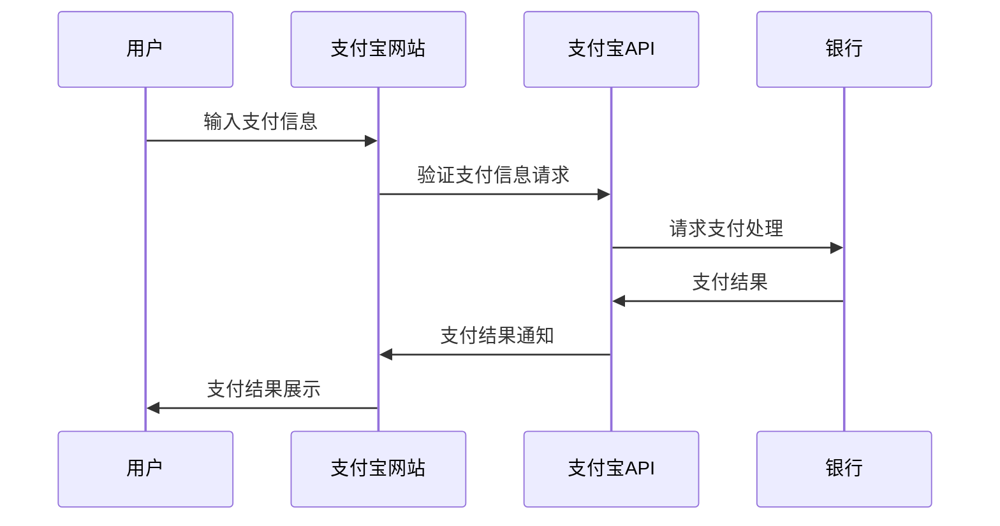
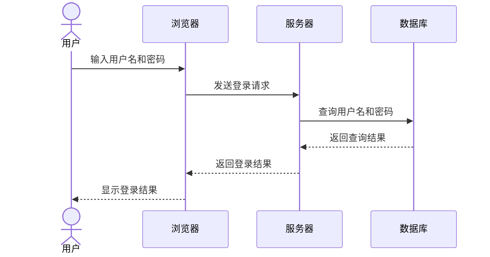
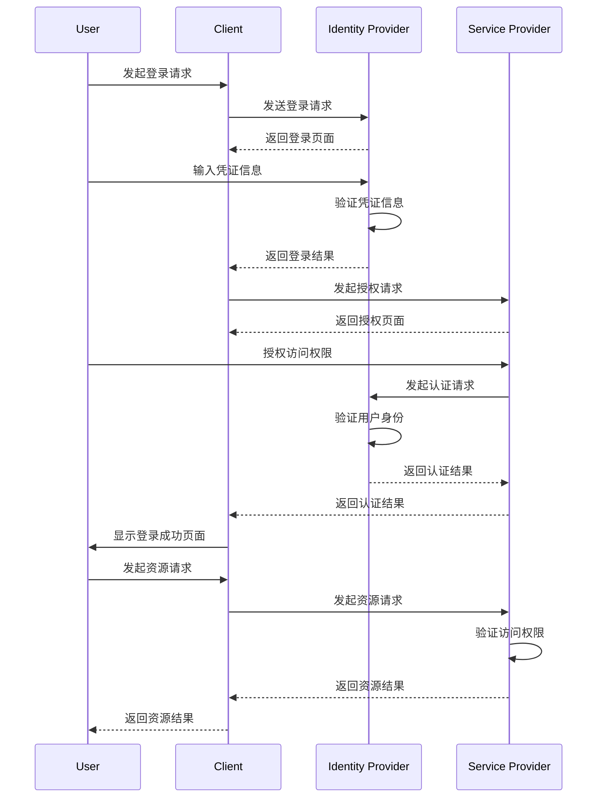
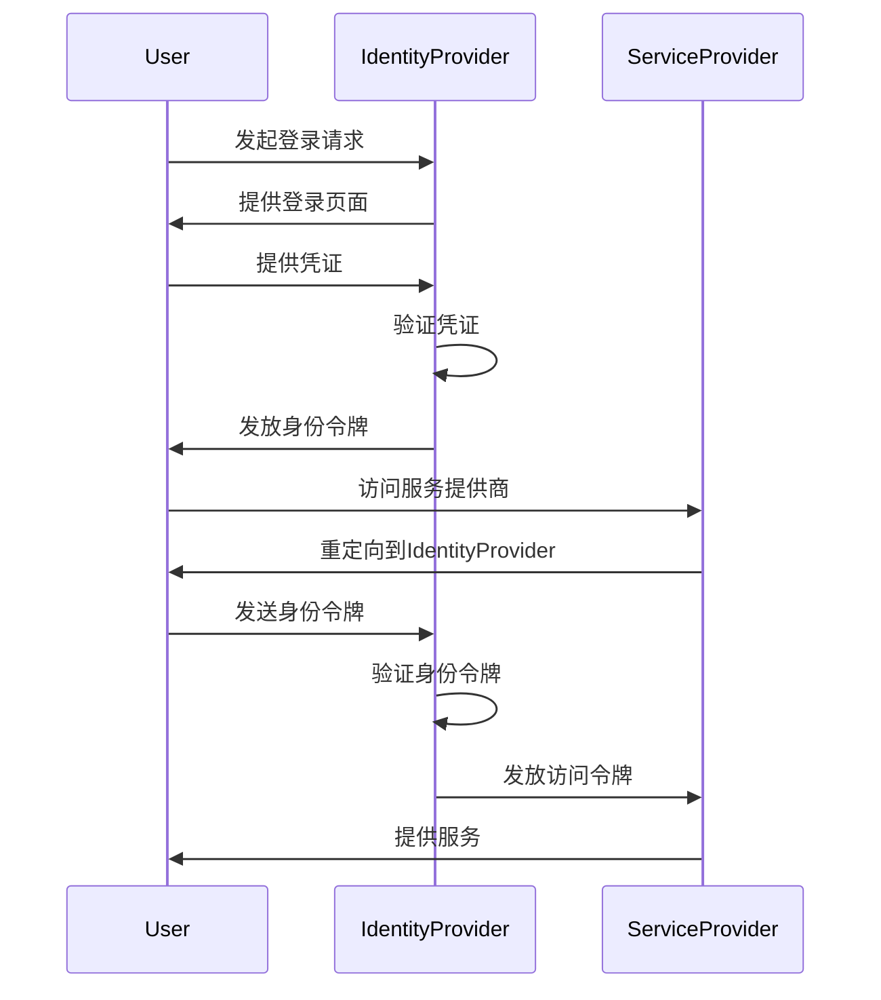

## 支付宝APP支付流程的时序图,添加上控制焦点功能

 ```mermaid
  sequenceDiagram

    actor 用户
    participant 支付宝APP
    participant 支付宝API
    participant 银行

    用户->>支付宝APP: 输入支付信息
    支付宝APP->>支付宝API: 验证支付信息请求
    支付宝API->>银行: 请求支付处理
    银行->>支付宝API: 支付结果
    支付宝API->>支付宝APP: 支付结果通知
    支付宝APP->>用户: 支付结果展示
 ```

## 支付宝网站支付流程的时序图,添加上控制焦点功能

 ```mermaid
  sequenceDiagram

    actor 用户
    participant 支付宝网站
    participant 支付宝API
    participant 银行

    用户->>支付宝网站: 输入支付信息
    支付宝网站->>支付宝API: 验证支付信息请求
    支付宝API->>银行: 请求支付处理
    银行->>支付宝API: 支付结果
    支付宝API->>支付宝网站: 支付结果通知
    支付宝网站->>用户: 支付结果展示
 ```








