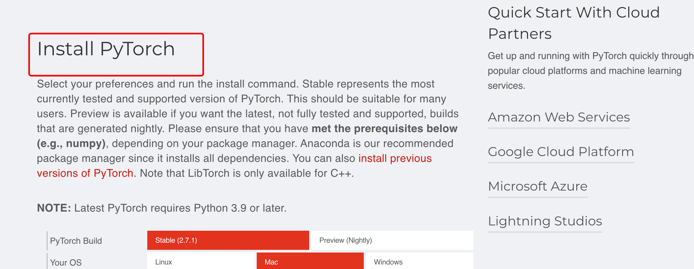
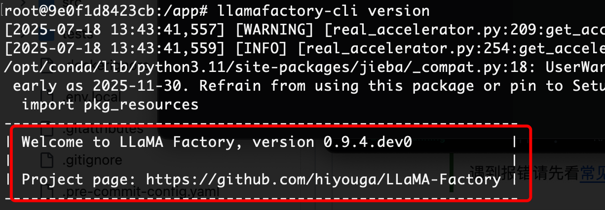

# [LLaMA-Factory 微调模型](https://github.com/hiyouga/LLaMA-Factory)

## 一、安装 LLaMA-Factory

### 1. 安装软硬件依赖

| 必需项           | 至少   | 推荐       |
| ---------------- | ------ | ---------- |
| **python**       | 3.9    | **3.10**   |
| **torch**        | 2.0.0  | **2.6.0**  |
| **torchvision**  | 0.15.0 | **0.21.0** |
| **transformers** | 4.49.0 | **4.50.0** |
| **datasets**     | 2.16.0 | **3.2.0**  |
| **accelerate**   | 0.34.0 | **1.2.1**  |
| **peft**         | 0.14.0 | **0.15.1** |
| **trl**          | 0.8.6  | **0.9.6**  |

| 可选项       | 至少   | 推荐   |
| ------------ | ------ | ------ |
| CUDA         | 11.6   | 12.2   |
| deepspeed    | 0.10.0 | 0.16.4 |
| bitsandbytes | 0.39.0 | 0.43.1 |
| vllm         | 0.4.3  | 0.8.2  |
| flash-attn   | 2.5.6  | 2.7.2  |

### 2. 安装 PyTorch

https://pytorch.org/ 

首页下翻，找到，选择后直接复制命令



### 3. 安装 CUDA


### 4. 安装LLaMA-Factory

#### 源码安装

```shell
git clone --depth 1 https://github.com/hiyouga/LLaMA-Factory.git
cd LLaMA-Factory
pip install -e ".[torch,metrics]" --no-build-isolation
```

#### Docker安装

```shell
docker run -it --rm --gpus=all --ipc=host hiyouga/llamafactory:latest

# 不使用GPU
docker run -it --rm --ipc=host \
	-v /Users/zengweixiong/temp/llamafactory/models:/app/models \
	-v /Users/zengweixiong/temp/llamafactory/data/dataset_info.json:/app/data/dataset_info.json \
	-v /Users/zengweixiong/temp/llamafactory/data/Qwen3-0.6B-Base.json:/app/data/Qwen3-0.6B-Base.json \
	-v /Users/zengweixiong/temp/llamafactory/output:/app/output \
	-p 7860:7860 \
	-p 8000:8000 \
	hiyouga/llamafactory:latest
```

安装成功执行
```shell
llamafactory-cli version
```



### 5. 准备训练数据集

关于数据集文件的格式，请参考 [data/README_zh.md](https://github.com/hiyouga/LLaMA-Factory/blob/main/data/README_zh.md) 的内容。你可以使用 HuggingFace / ModelScope / Modelers 上的数据集或加载本地数据集。使用 **[Easy Dataset](https://github.com/ConardLi/easy-dataset)** 或 **[GraphGen](https://github.com/open-sciencelab/GraphGen)** 构建用于微调的合成数据。

```json
[
  {
    "instruction": "根据提供的食材和设备，生成一道空气炸锅菜谱。",
    "input": "食材：鸡翅中、料酒、生抽、蚝油、五香粉、盐；设备：空气炸锅",
    "output": "菜名：空气炸锅鸡翅\n做法：\n1. 鸡翅洗净，用刀在表面划两刀；\n2. 加入料酒、生抽、蚝油、五香粉、盐腌制2小时；\n3. 空气炸锅180°C预热5分钟；\n4. 鸡翅放入炸篮，180°C炸10分钟，翻面再炸8分钟至表面金黄。"
  },
  {
    "instruction": "请使用空气炸锅和土豆制作一道简单的小吃。",
    "input": "食材：土豆、橄榄油、盐、黑胡椒",
    "output": "菜名：空气炸锅薯条\n做法：\n1. 土豆去皮切条，清水冲洗去淀粉后浸泡10分钟；\n2. 沥干水分后拌入橄榄油、盐、黑胡椒；\n3. 空气炸锅200°C预热5分钟；\n4. 炸篮中铺平薯条，炸15-18分钟，途中翻动一次，炸至酥脆。"
  },
  {
    "instruction": "根据提供的茄子和调味料，制作一道适合空气炸锅的素菜。",
    "input": "食材：茄子、大蒜、生抽、蚝油、香油、葱花",
    "output": "菜名：空气炸锅茄子\n做法：\n1. 茄子洗净切小块；\n2. 放入空气炸锅180°C炸10分钟；\n3. 同时准备蒜蓉酱：蒜末加生抽、蚝油、香油搅匀；\n4. 将炸好的茄子淋上酱料，撒上葱花即可。"
  },
  {
    "instruction": "使用空气炸锅和秋葵做一道简单健康的低脂菜肴。",
    "input": "食材：秋葵、橄榄油、盐、蒜粉",
    "output": "菜名：空气炸锅秋葵\n做法：\n1. 秋葵洗净去头，擦干水分；\n2. 加入橄榄油、盐和蒜粉拌匀；\n3. 空气炸锅200°C预热5分钟；\n4. 放入秋葵炸8分钟，中途翻动一次即可食用。"
  },
  {
    "instruction": "给出五花肉的空气炸锅做法，突出酥脆口感。",
    "input": "食材：五花肉、生抽、老抽、料酒、白胡椒、蒜粉",
    "output": "菜名：空气炸锅五花肉\n做法：\n1. 五花肉切厚片，加入所有调料腌制1小时；\n2. 空气炸锅180°C预热；\n3. 放入五花肉，180°C炸12分钟，翻面后再炸8分钟至外酥里嫩。"
  }
]
```

