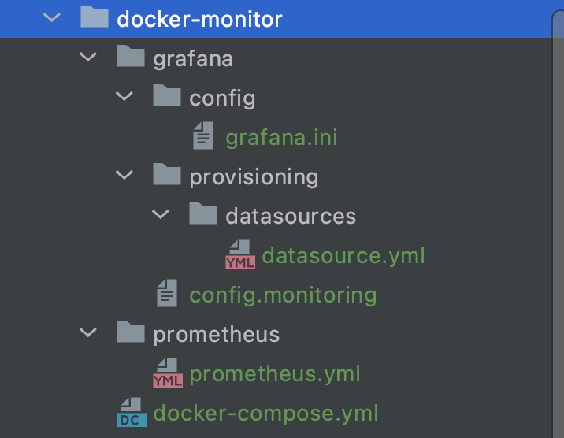
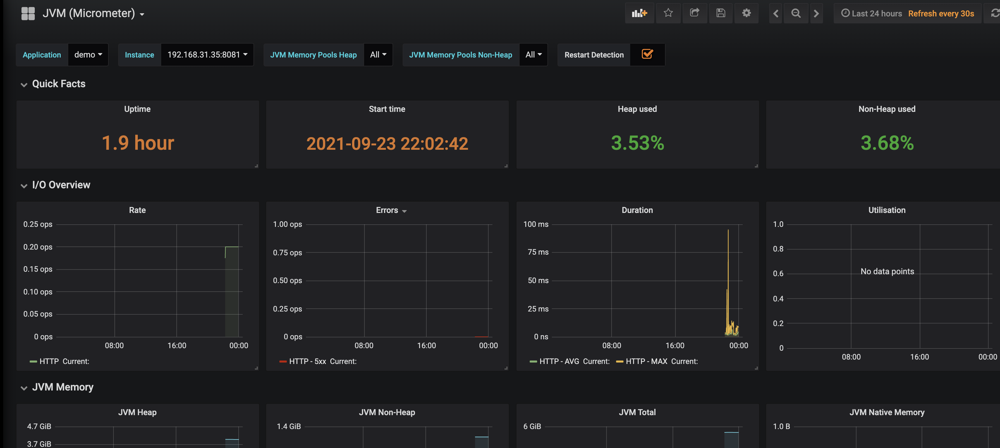
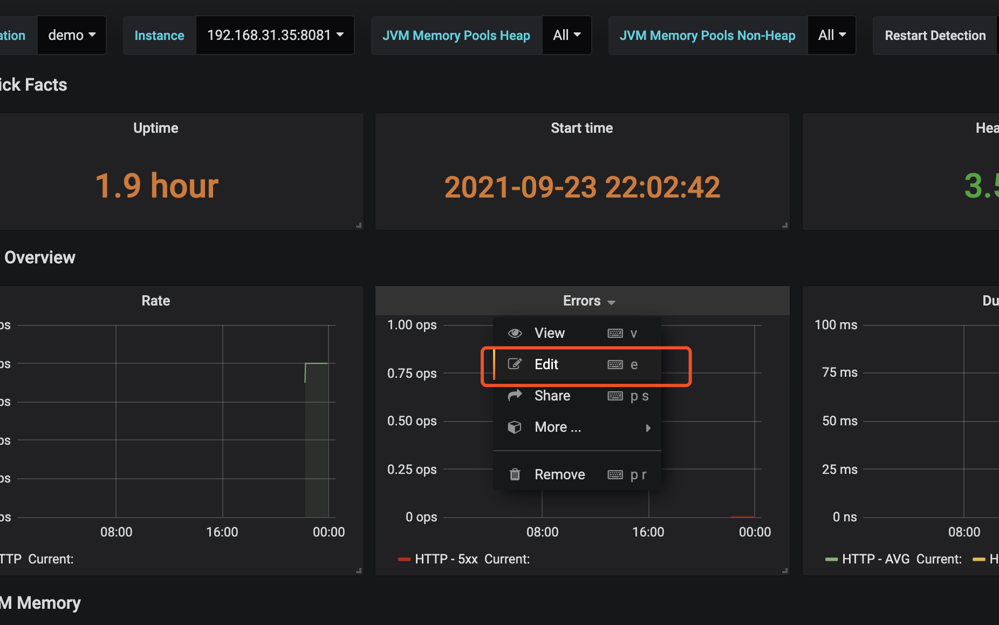
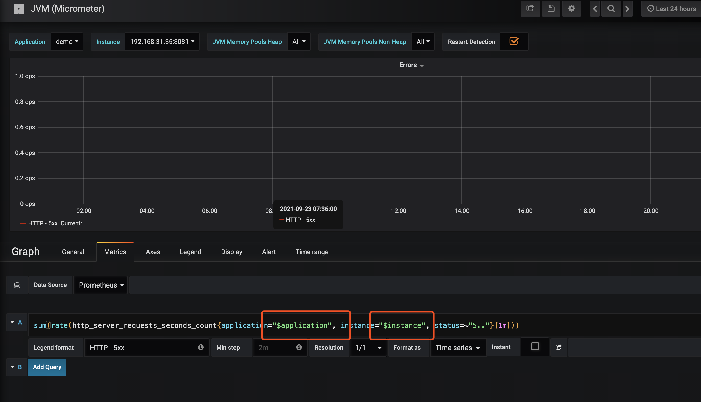
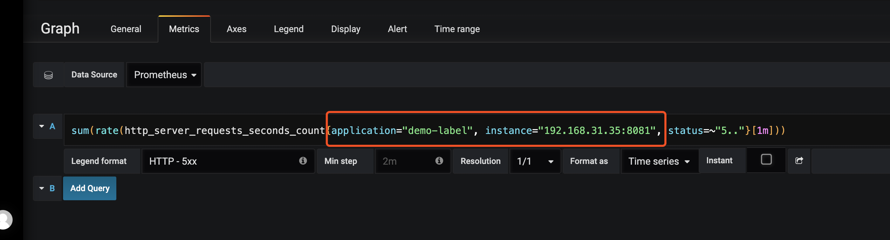
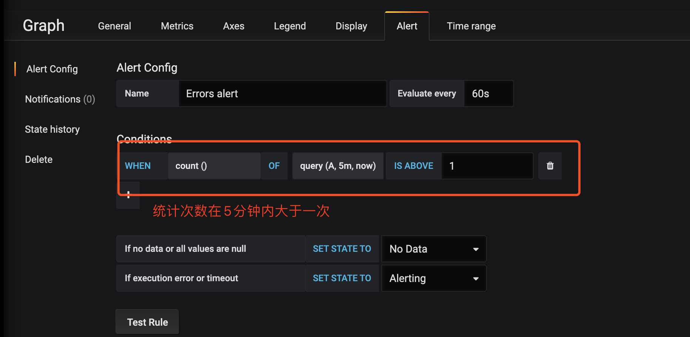

### 一. 官方架构图


### 二. 准备工作

**需要mysql数据库, redis, 至少一台centos7服务器**

**springboot项目添加以下配置和依赖**

```yaml
management: #开启SpringBoot Admin的监控
  endpoint:
    health:
      show-details: always
    prometheus:
      enabled: true
  endpoints:
    web:
      exposure:
        include: '*'
```

```xml
<!-- 开启springboot的应用监控 -->
<dependency>
    <groupId>org.springframework.boot</groupId>
    <artifactId>spring-boot-starter-actuator</artifactId>
</dependency>
<!-- 增加prometheus整合 -->
<dependency>
    <groupId>io.micrometer</groupId>
    <artifactId>micrometer-registry-prometheus</artifactId>
</dependency>
```


### 三. Prometheus Grafana Docker 部署

#### 1. **centos7 创建目录文件图**




##### 1) 监控redis mysql linux

```bash
# 监控 mysql
docker pull prom/mysqld-exporter
docker run --name mysqld-exporter -d -p 9104:9104 -e DATA_SOURCE_NAME="root:123456@(192.168.31.67:3306)/devops" prom/mysqld-exporter

# 监控 redis
docker pull oliver006/redis_exporter
docker run --name redis-exporter -d -p 9121:9121 oliver006/redis_exporter --redis.addr redis://192.168.31.67:6379

# 监控 linux
docker pull prom/node-exporter
docker run --name node-exporter -d -p 9100:9100 prom/node-exporter

```


#####  2) **docker-compose.yml**

```yaml
# prometheus  grafana  mysql redis 
version: "3"
services:
  prometheus:
    image: prom/prometheus:v2.4.3
    container_name: 'prometheus'
    restart: always
    volumes:
      - ./prometheus/:/etc/prometheus/    #映射prometheus的配置文件
      - /etc/localtime:/etc/localtime:ro  #同步容器与宿主机的时间，这个非常重要，如果时间不一致，会导致prometheus抓不到数据
    ports:
      - 9090:9090
  grafana:
    image: grafana/grafana:5.2.4
    container_name: grafana
    restart: always
    ports:
      - 3000:3000
    volumes:
      - ./grafana/config/grafana.ini:/etc/grafana/grafana.ini  # grafana报警邮件配置
      - ./grafana/provisioning/:/etc/grafana/provisioning/  # 配置grafana的prometheus数据源
      - /etc/localtime:/etc/localtime:ro
    env_file:
      - ./grafana/config.monitoring  #grafana登录配置
    depends_on:
      - prometheus  #grafana需要在prometheus之后启动
   
```

 

##### 3) **prometheus.yml**

```yaml
global: #全局配置
  scrape_interval: 15s  #全局定时任务抓取性能数据间隔
  
scrape_configs: #抓取性能数据任务配置
  - job_name: 'demo'  #抓取订单服务性能指标数据任务，一个job下可以配置多个抓紧的targets，比如订单服务多个实例机器
    scrape_interval: 10s  #每10s抓取一次
    metrics_path: '/actuator/prometheus'  #抓取的数据url
    static_configs:
      - targets: [ '192.168.31.67:8081' ]  # 抓取的服务的服务器地址和端口
        labels:
          application: 'demo-label'  #抓取任务标签

  - job_name: 'prometheus'  #抓取prometheus自身性能指标数据任务
    scrape_interval: 5s
    static_configs:
      - targets: [ '192.168.31.67:9090' ]

  - job_name: 'mysql'
    scrape_interval: 5s
    static_configs:
      - targets: ['192.168.31.67:9104']
        labels:
          instance: mysql

  - job_name: 'redis'
    scrape_interval: 5s
    static_configs:
      - targets: ['192.168.31.67:9121']
        labels:
          instance: redis

  - job_name: 'linux'
    scrape_interval: 10s
    static_configs:
      - targets: ['192.168.31.67:9100']
        labels:
          instance: linux-67
      - targets: ['192.168.31.251:9100']
        labels:
          instance: linux-251
      - targets: ['192.168.31.190:9100']
        labels:
          instance: linux-190
      - targets: ['192.168.31.119:9100']
        labels:
          instance: linux-119
```


##### 4) **grafana.ini**

```bash
#################################### SMTP / Emailing ##########################
# 配置邮件服务器
[smtp]
enabled = true
# 发件服务器
host = smtp.qq.com:465
# smtp账号
user = 1369866181@qq.com
# smtp 授权码，授权码获取请参看课上视频演示
password = smtp密码
# 发信邮箱
from_address = 1369866181@qq.com
# 发信人
from_name = Prometheus&Grafana
```


##### 5) **datasource.yml**

```yaml
# config file version
apiVersion: 1

deleteDatasources: # 如果之前存在name为Prometheus，orgId为1的数据源先删除
  - name: Prometheus
    orgId: 1

datasources: #配置Prometheus的数据源
  - name: Prometheus
    type: prometheus
    access: proxy
    orgId: 1
    url: http://prometheus:9090  #在相同的docker compose下，可以直接用prometheus服务名直接访问
    basicAuth: false
    isDefault: true
    version: 1
    editable: true
```


##### 6) **config.monitoring**

grafana管理界面的登录用户密码，**用户名是admin**

grafana管理界面是否允许注册，默认不允许

```bash
GF_SECURITY_ADMIN_PASSWORD=123456
GF_USERS_ALLOW_SIGN_UP=false
```


#### 2. docker开始编排

````bash
# 编排 prometheus grafana
docker-compose -f docker-compose.yml up -d

# 强制重新创建容器 刷新所有数据
docker-compose up --force-recreate -d
````


### 四. 效果图




### 五. 报警邮件设置










