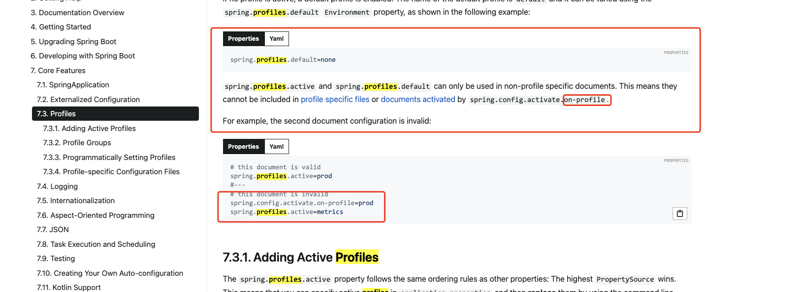

# 跨域问题

```java
@Bean
public CorsFilter corsFilter() {
    final UrlBasedCorsConfigurationSource urlBasedCorsConfigurationSource = new UrlBasedCorsConfigurationSource();
    final CorsConfiguration cors = new CorsConfiguration();
    cors.setAllowCredentials(true);
    cors.addAllowedHeader("*");
    cors.addAllowedMethod("*");
  
    //cors.addAllowedOrigin("*"); // 这里修改成下面的方式
    cors.setAllowedOriginPatterns(Collections.singletonList(CorsConfiguration.ALL));
  
    urlBasedCorsConfigurationSource.registerCorsConfiguration("/**", cors);
    return new CorsFilter(urlBasedCorsConfigurationSource);
    
}
```


## 配置文件问题

原有配置模式无效，必须添加 **not-profile**

```yaml
spring:
  profiles:
    active: dev

---
spring:
  profiles:
    active: test
```

