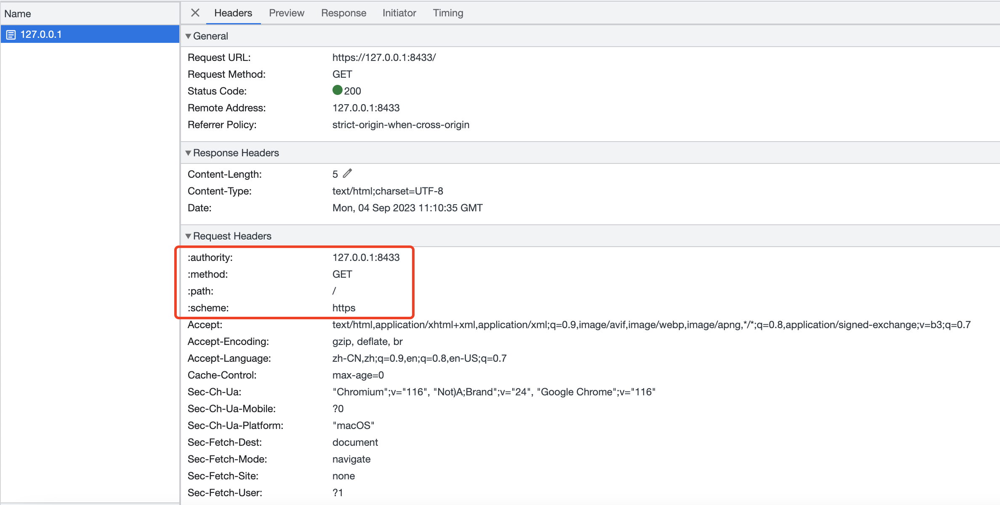

# HTTP2使用


## SpringBoot 开启HTTP2

### 生成SSL证书

```shell
keytool -genkey -alias http2 -keyalg RSA -keystore http2.jks
```


### application配置

**必须配置SSL证书**

```yaml
server:
  port: 8433
  http2:
    enabled: true
  ssl:
    key-store: classpath:http2.jks
    key-store-password: 123456
```


## 实例

