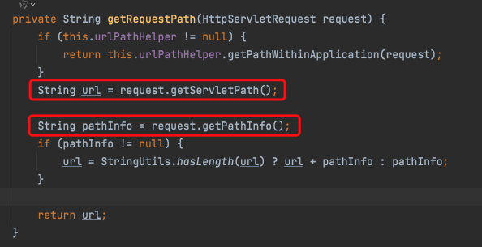

## SpringBoot的context-path不会被security的antMatchers匹配

antMatchers核心源码匹配的是 httpServletRequest.getServletPath()

### 原因：

Spring Security的`antMatchers`配置不包括`context-path`的原因是因为`antMatchers`是相对于应用程序根路径的。`context-path`是用于定义应用程序的根路径，而`antMatchers`只匹配相对于根路径的路径。

### 什么是context-path

`context-path` 是在Java Web应用中的概念，指的是应用程序在Web服务器上的根路径。在Servlet规范中，`context-path`是一个与应用程序相关的前缀，用于唯一标识和隔离不同的Web应用。

当你部署一个Web应用到Servlet容器（如Tomcat、Jetty等）中时，每个Web应用都有一个上下文路径。这个上下文路径就是 `context-path`。例如，如果你将一个Web应用部署到Tomcat的根目录，那么这个应用的`context-path`就是空字符串（""）。如果你将它部署到Tomcat的 `/myapp` 目录下，那么`context-path`就是 "/myapp"。