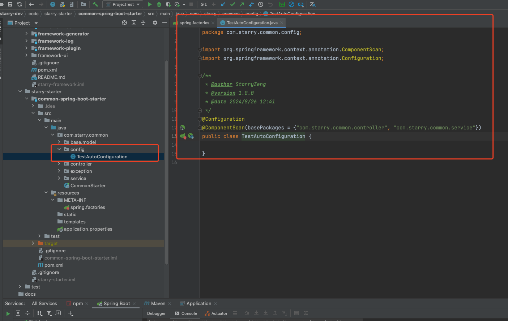
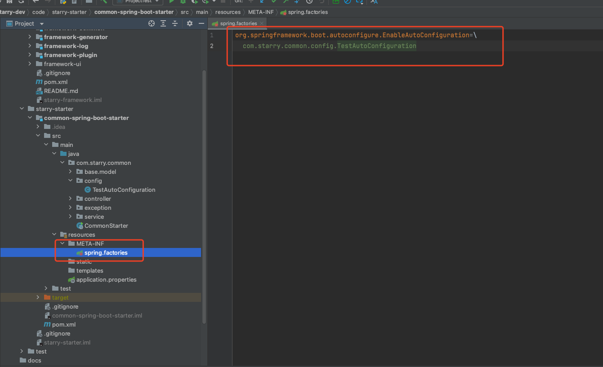

# 自定义 Starters 单模块结构


## POM

```xml
<dependency>
    <groupId>org.springframework.boot</groupId>
    <artifactId>spring-boot-autoconfigure</artifactId>
    <scope>provided</scope>
</dependency>


<plugin>
    <groupId>org.apache.maven.plugins</groupId>
    <artifactId>maven-jar-plugin</artifactId>
    <version> 3.3.0</version>
    <configuration>
        <archive>
            <manifestEntries>
                <Main-Class>com.starry.common.CommonStarter</Main-Class>
            </manifestEntries>
        </archive>
    </configuration>
</plugin>
```




