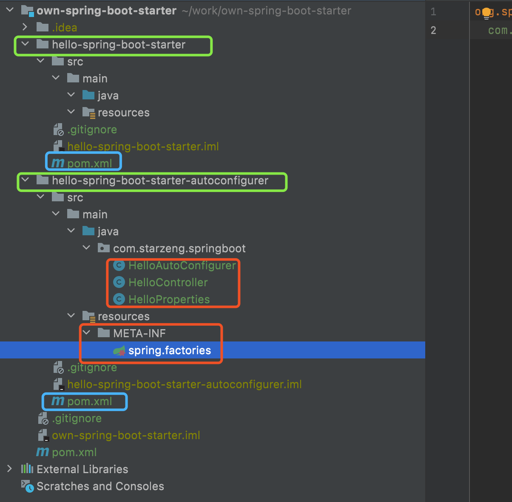
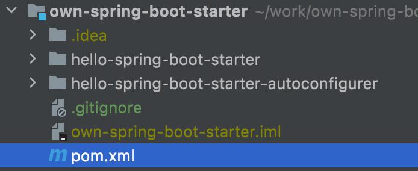
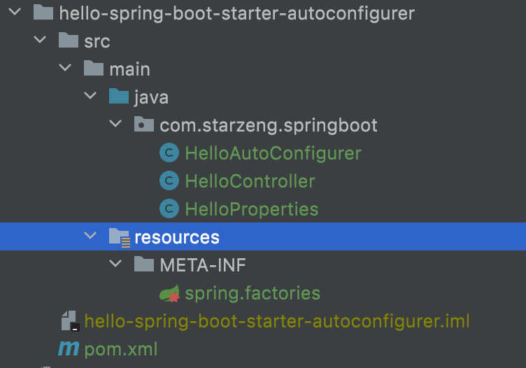
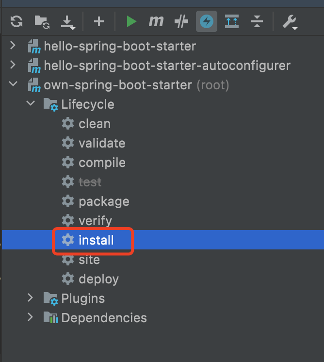
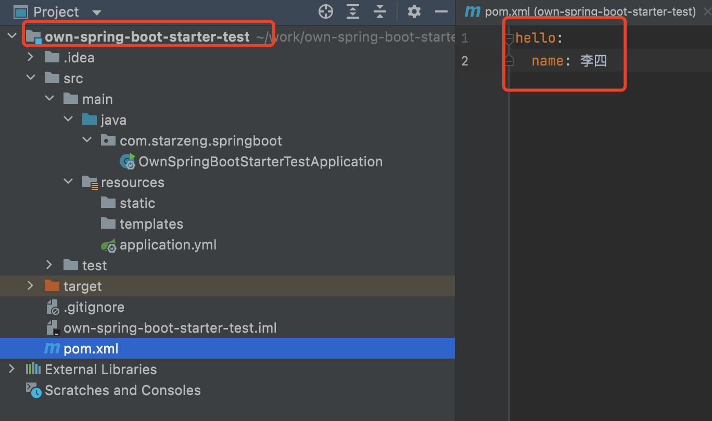
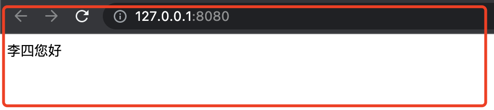

## 自定义 Spring Boot Starter

### 什么是 Spring Boot Starter

starter 是一个启动器，包含多个依赖，方便依赖配置


### 作用

公共框架集成，公共功能模块抽离，等使用

**官网地址：**

https://docs.spring.io/spring-boot/docs/2.3.12.RELEASE/reference/html/using-spring-boot.html#using-boot-starter

https://docs.spring.io/spring-boot/docs/2.3.12.RELEASE/reference/html/spring-boot-features.html#boot-features-custom-starter


### 命名规范

官方：	以 spring-boot-starter **前缀**

**自定义：以 spring-boot-starter 后缀**


### 自定义 starter

#### 创建项目

创建 Maven 父子项目

```java
own-spring-boot-starter
	|- hello-spring-boot-starter
	|- hello-spring-boot-starter-autoconfigurer
```

**工程目录图**




##### own-spring-boot-starter



只有pom文件，注意：**packaging 值为 pom**

###### pom.xml

```xml
<?xml version="1.0" encoding="UTF-8"?>
<project xmlns="http://maven.apache.org/POM/4.0.0" xmlns:xsi="http://www.w3.org/2001/XMLSchema-instance"
         xsi:schemaLocation="http://maven.apache.org/POM/4.0.0 https://maven.apache.org/xsd/maven-4.0.0.xsd">
    <modelVersion>4.0.0</modelVersion>
    <parent>
        <groupId>org.springframework.boot</groupId>
        <artifactId>spring-boot-starter-parent</artifactId>
        <version>2.3.12.RELEASE</version>
        <relativePath/> <!-- lookup parent from repository -->
    </parent>
    <groupId>com.starzeng</groupId>
    <artifactId>own-spring-boot-starter</artifactId>
    <version>0.0.1-SNAPSHOT</version>
    <name>own-spring-boot-starter</name>
    <description>own-spring-boot-starter</description>
  
    <packaging>pom</packaging>
    <modules>
        <module>hello-spring-boot-starter</module>
        <module>hello-spring-boot-starter-autoconfigurer</module>
    </modules>

    <properties>
        <java.version>1.8</java.version>
    </properties>

    <dependencies>
        <dependency>
            <groupId>org.springframework.boot</groupId>
            <artifactId>spring-boot-starter</artifactId>
        </dependency>
    </dependencies>

</project>
```


##### hello-spring-boot-starter


也只有 pom 文件，依赖创建的 autoconfigurer 项目

###### pom.xml

```xml
<?xml version="1.0" encoding="UTF-8"?>
<project xmlns="http://maven.apache.org/POM/4.0.0" xmlns:xsi="http://www.w3.org/2001/XMLSchema-instance"
         xsi:schemaLocation="http://maven.apache.org/POM/4.0.0 https://maven.apache.org/xsd/maven-4.0.0.xsd">
    <modelVersion>4.0.0</modelVersion>
    <parent>
        <groupId>org.springframework.boot</groupId>
        <artifactId>spring-boot-starter-parent</artifactId>
        <version>2.3.12.RELEASE</version>
        <relativePath/> <!-- lookup parent from repository -->
    </parent>
    <groupId>com.starzeng</groupId>
    <artifactId>hello-spring-boot-starter</artifactId>
    <version>0.0.1-SNAPSHOT</version>
    <name>hello-spring-boot-starter</name>
    <description> 一个空内容的项目, 只引入 hello-spring-boot-starter-autoconfigurer 依赖 </description>

    <properties>
        <java.version>1.8</java.version>
    </properties>
    <dependencies>
        <dependency>
            <groupId>com.starzeng</groupId>
            <artifactId>hello-spring-boot-starter-autoconfigurer</artifactId>
            <version>0.0.1-SNAPSHOT</version>
        </dependency>
    </dependencies>
</project>
```


##### hello-spring-boot-starter-autoconfigurer




pom 文件中添加依赖 **spring-boot-configuration-processor** 

###### pom.xml

```xml
<?xml version="1.0" encoding="UTF-8"?>
<project xmlns="http://maven.apache.org/POM/4.0.0" xmlns:xsi="http://www.w3.org/2001/XMLSchema-instance"
         xsi:schemaLocation="http://maven.apache.org/POM/4.0.0 https://maven.apache.org/xsd/maven-4.0.0.xsd">
    <modelVersion>4.0.0</modelVersion>
    <parent>
        <groupId>org.springframework.boot</groupId>
        <artifactId>spring-boot-starter-parent</artifactId>
        <version>2.3.12.RELEASE</version>
        <relativePath/> <!-- lookup parent from repository -->
    </parent>
    <groupId>com.starzeng</groupId>
    <artifactId>hello-spring-boot-starter-autoconfigurer</artifactId>
    <version>0.0.1-SNAPSHOT</version>
    <name>hello-spring-boot-starter-autoconfigurer</name>
    <description>hello-spring-boot-starter-autoconfigurer</description>
    <properties>
        <java.version>1.8</java.version>
    </properties>
    <dependencies>
        <dependency>
            <groupId>org.springframework.boot</groupId>
            <artifactId>spring-boot-starter-web</artifactId>
        </dependency>

        <dependency>
            <groupId>org.springframework.boot</groupId>
            <artifactId>spring-boot-configuration-processor</artifactId>
            <optional>true</optional>
        </dependency>
    </dependencies>

</project>
```


编写一个简单的接口用于测试项目测试

###### HelloController.java

```java
package com.starzeng.springboot;

import org.springframework.web.bind.annotation.RequestMapping;
import org.springframework.web.bind.annotation.RestController;

@RestController
public class HelloController {
    HelloProperties helloProperties;

    public HelloController(HelloProperties helloProperties) {
        this.helloProperties = helloProperties;
    }

    @RequestMapping("/")
    public String helloWorld() {
        return helloProperties.getName() + "您好";
    }
}
```


###### HelloProperties.java

```java
package com.starzeng.springboot;

import org.springframework.boot.context.properties.ConfigurationProperties;

@ConfigurationProperties("hello")
public class HelloProperties {
    private String name;

    public String getName() {
        return name;
    }

    public void setName(String name) {
        this.name = name;
    }
}

```


###### HelloAutoConfigurer.java

```java
package com.starzeng.springboot;

import org.springframework.beans.factory.annotation.Autowired;
import org.springframework.boot.autoconfigure.condition.ConditionalOnProperty;
import org.springframework.boot.context.properties.EnableConfigurationProperties;
import org.springframework.context.annotation.Bean;
import org.springframework.context.annotation.Configuration;

@Configuration
@ConditionalOnProperty(value = "hello.name")
@EnableConfigurationProperties(HelloProperties.class)
public class HelloAutoConfigurer {

    @Autowired
    HelloProperties helloProperties;

    @Bean
    public HelloController helloController(){
        return new HelloController(helloProperties);
    }
}
```


在 **resources** 文件夹下创建 **META-INF** 文件夹 和 **spring.factories** 文件

###### spring.factories

```properties
org.springframework.boot.autoconfigure.EnableAutoConfiguration=\
  com.starzeng.springboot.HelloAutoConfigurer
```


### 安装到 Maven 仓库




### 创建测试项目

默认创建 **own-spring-boot-starter-test**




pom 中添加依赖

```xml
<dependency>
    <groupId>com.starzeng</groupId>
    <artifactId>hello-spring-boot-starter</artifactId>
    <version>0.0.1-SNAPSHOT</version>
</dependency>
```

#### pom.xml

```xml
<?xml version="1.0" encoding="UTF-8"?>
<project xmlns="http://maven.apache.org/POM/4.0.0" xmlns:xsi="http://www.w3.org/2001/XMLSchema-instance"
         xsi:schemaLocation="http://maven.apache.org/POM/4.0.0 https://maven.apache.org/xsd/maven-4.0.0.xsd">
    <modelVersion>4.0.0</modelVersion>
    <parent>
        <groupId>org.springframework.boot</groupId>
        <artifactId>spring-boot-starter-parent</artifactId>
        <version>2.3.12.RELEASE</version>
        <relativePath/> <!-- lookup parent from repository -->
    </parent>
    <groupId>com.starzeng</groupId>
    <artifactId>own-spring-boot-starter-test</artifactId>
    <version>0.0.1-SNAPSHOT</version>
    <name>own-spring-boot-starter-test</name>
    <description>own-spring-boot-starter-test</description>
    <properties>
        <java.version>1.8</java.version>
    </properties>
    <dependencies>
        <dependency>
            <groupId>org.springframework.boot</groupId>
            <artifactId>spring-boot-starter</artifactId>
        </dependency>

        <dependency>
            <groupId>com.starzeng</groupId>
            <artifactId>hello-spring-boot-starter</artifactId>
            <version>0.0.1-SNAPSHOT</version>
        </dependency>

        <dependency>
            <groupId>org.springframework.boot</groupId>
            <artifactId>spring-boot-starter-test</artifactId>
            <scope>test</scope>
        </dependency>
    </dependencies>

    <build>
        <plugins>
            <plugin>
                <groupId>org.springframework.boot</groupId>
                <artifactId>spring-boot-maven-plugin</artifactId>
            </plugin>
        </plugins>
    </build>

</project>

```


#### application.yml

配置 autoconfigurer 项目中 HelloProperties 的属性 hello.name

```yaml
hello:
  name: 李四
```


#### 启动项目浏览器访问



**starter 自定义成功，一个简单的使用**


