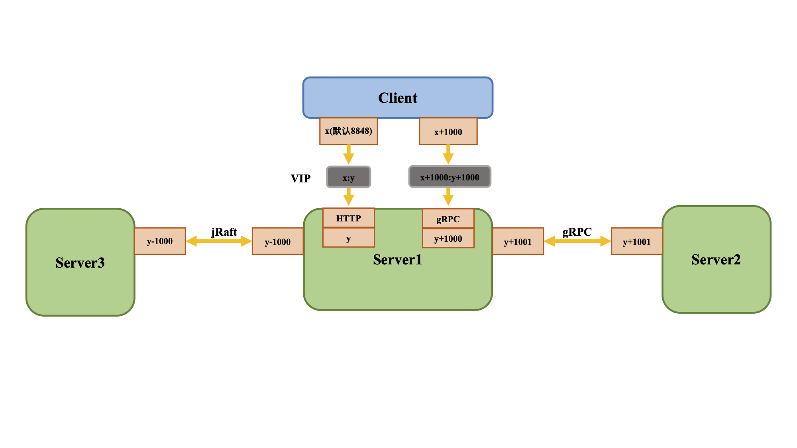

# 1.新增了gRPC的通信方式

| 端口 | 与主端口的偏移量 | 描述                                                       |
| ---- | ---------------- | ---------------------------------------------------------- |
| 9848 | 1000             | 客户端gRPC请求服务端端口，用于客户端向服务端发起连接和请求 |
| 9849 | 1001             | 服务端gRPC请求服务端端口，用于服务间同步等                 |

**使用VIP/nginx请求时，需要配置成TCP转发，不能配置http2转发，否则连接会被nginx断开。**




# 2. 废弃的功能

- 查看当前集群leader（将废弃）


# Nacos2.0长连接功能


# Nacos 2.0.0服务端新增的数个配置参数

| 参数                                             | 默认值          | 描述                                                         |
| ------------------------------------------------ | --------------- | ------------------------------------------------------------ |
| nacos.naming.clean.empty-service.interval        | 60000(单位毫秒) | Nacos自动清理空服务的工作间隔，将替代旧版本中的`nacos.naming.empty-service.clean.period-time-ms`参数 |
| nacos.naming.clean.empty-service.expired-time    | 60000(单位毫秒) | Nacos判断可清理的空服务的过期时间，当服务没有发布的实例，且超过该过期时间未发生更新后，将被判定为过期空服务而移除 |
| nacos.naming.clean.expired-metadata.interval     | 5000(单位毫秒)  | Nacos自动清理过期元数据的工作间隔                            |
| nacos.naming.clean.expired-metadata.expired-time | 60000(单位毫秒) | Nacos自动清理过期服务的过期时间，当服务或实例本身被移除超过该设定时间后，元数据信息将会被移除 |


# 兼容

配置中心兼容支持 Nacos1.0 起的所有版本客户端

服务发现兼容 Nacos1.2 起所有版本客户端


# 问题

### nacos1.X的客户端不具有长连接能力，因此仍然建议使用Nacos2.0.0客户端。

### 启动后，调用openAPI 报错 code:503,msg:server is DOWN now, please try again later!

Nacos在1.4版本后使用Jraft替换了自研的Raft实现，Jraft的选主比原先自研的Raft更加严格，会记录之前启动时的ip或host。因此重启时如果ip变动了，有可能造成选主失败，从而导致nacos无法正确提供服务。 解决方式为删除nacos目录下的data，再启动。

或者使用`-Dnacos.server.ip=${domain}`,然后将nacos/conf的cluster.conf配置domain列表，避免重启时ip变动导致的raft选主问题。

### 找不到符号`com.alibaba.nacos.consistency.entity`

这个包目录是由`protobuf`在编译时自动生成，您可以通过`mvn compile`来自动生成他们。如果您使用的是IDEA，也可以使用IDEA的protobuf插件。

### 启动时报错`Connection is unregistered.`或`Client not connected,current status:STARTING`.

原因是客户端gRPC无法和服务端创建连接，请先使用`telnet ${nacos.server.address}:${nacos.server.grpc.port}`进行测试，查看网络是否畅通，服务端端口是否已经正确监听。

若服务端没有问题，查看配置是否有误，服务端和客户端的所配置的端口应一致。

若配置也没有问题，查看是否有防火墙或VIP端口转发问题，Nacos2.0的gRPC端口均通过主端口的偏移量计算产生，因此端口转发也需要满足该偏移量。

### Nacos2.0增加了9848，9849端口来进行GRPC通信，我需要在application.properties中额外配置吗？

不需要，这两个端口在Nacos2.0内部是通过8848+1000以及8848+1001这种偏移量方式计算出来的，不需要用户额外在配置文件中配置。但如果使用的是docker或存在端口转发方式启动，需要把这两个端口进行配置。

### 启动nacos2.0时希望用nginx 代理，9848这个端口怎样处理，要通过nginx暴露出来么？以及docker是否需要映射？

如果存在防火墙或者nginx端口转发问题，需要进行相应的端口暴露配置。如在nginx中，在已经暴露8848(x)的基础上，需要额外暴露9848（x+1000)。


# Nacos 2.0.0 部署及升级文档

## 下载源码或者安装包

你可以通过源码和发行包两种方式来获取 Nacos。

### 从 Github 上下载源码方式

```bash
git clone https://github.com/alibaba/nacos.git
cd nacos/
mvn -Prelease-nacos -Dmaven.test.skip=true clean install -U  
ls -al distribution/target/

// change the $version to your actual path
cd distribution/target/nacos-server-$version/nacos/bin
```

### 下载编译后压缩包方式

您可以从 [最新稳定版本](https://github.com/alibaba/nacos/releases) 下载 `nacos-server-$version.zip` 包。

```bash
  unzip nacos-server-$version.zip 或者 tar -xvf nacos-server-$version.tar.gz
  cd nacos/bin
```

## .启动服务器

### Linux/Unix/Mac

单机启动命令(standalone代表着单机模式运行):

```bash
sh startup.sh -m standalone
```

如果您使用的是ubuntu系统，或者运行脚本报错提示[[符号找不到，可尝试如下运行：

```
bash startup.sh -m standalone
```

单机启动，使用内置数据库（注：使用内置Derby数据库需要保证~/nacos/data/derby-data文件夹下无残留数据）：

```
bash startup.sh -p embedded
```

集群启动（使用内嵌数据库）：

```
bash startup.sh -p embedded
```

集群启动（使用外置数据库）：

```
bash startup.sh
```

## 启动后自检

集群中所有机器部署为2.0.X版本并启动时，应当进行启动之后的检查。

当集群中所有节点logs/naming-server.log日志中观察到**upgrade check result true及Upgrade to 2.0.X**，便判定为集群准备完毕时，此时才可以使用Nacos2.0。

## 关闭双写

为了节省性能开销，当集群部署完成后，可以先观察一段时间运行情况，当确认无误后，可以关闭双写，从而释放性能，具体的关闭方式是通过API进行：

```
curl -X PUT 'localhost:8848/nacos/v1/ns/operator/switches?entry=doubleWriteEnabled&value=false'
```

关闭后可以从`logs/naming-server.log`日志中观察到`Disable Double write, stop and clean v1.x cache and features`字样。说明关闭双写。

**注意**，关闭双写后无法在进行平滑降级，请先确认关闭前集群正确运行。


# 升级步骤

以linux系统为例。window系统请自行替换`sh`脚本为`cmd`脚本。

## 1. 停止旧节点

选择集群中一台Nacos1.X节点，使用Nacos目录下`nacos/bin/shutdown.sh`进行停止。

## 2. 替换文件

下载并解压缩`nacos-server-2.0.2.tar.gz`，将其下的`bin`，`conf`，`target`目录覆盖原Nacos1.X的安装目录下。

## 3. 修改配置

自行修改`nacos/bin/startup.sh`中的JVM参数，`conf/cluster.conf`中的集群列表以及`conf/application.prpperties`中数据库或其他相关参数。

## 4. 启动Nacos2.0

使用nacos目录下`nacos/bin/startup.sh`启动nacos2.0，其他更多启动指令请查看[Nacos部署环境](https://nacos.io/zh-cn/docs/deployment.html) 。

## 5. 观察是否启动成功

首先查看nacos目录下 `logs/start.out`或`logs/nacos.log` 观察到nacos启动成功的日志，如 `Nacos started successfully in cluster mode. use xxx storage` 说明程序已启动成功。

之后在观察 `logs/naming-server.log` 中，可以看到有`upgrade check result false` 以及 `Check whether close double write`等日志信息。

属于正常现象。

## 6. 升级其他节点

待该节点的服务及实例信息已经同步完毕后（可从控制台进行确认）。重复1～5步骤，将其他的nacos节点也进行升级。

## 7. 确认升级完成

当集群中最后一个节点也升级到2.0.X版本时，集群会开始进行升级检测。每个节点会对该节点的服务信息和实例信息进行校验，并检测是否还有未完成的双写任务。

当该节点的服务信息和实例信息已经核对成功，并且没有双写任务存在时，该节点会判定自己已经做好升级准备，并修改自己的状态且通知其他Nacos节点。每台节点是否完成升级准备可以从控制台的集群管理中元数据信息中看到`"readyToUpgrade": false/true`。

当集群中所有节点均判定为准备完毕时。Nacos集群中的节点会进行升级切换，自动升级到Nacos2.0的处理逻辑。

可以从`logs/naming-server.log`日志中观察到`upgrade check result true`及`Upgrade to 2.0.X`。

#### 

## 8.1 关闭双写

当集群升级完成后，可以先观察一段时间运行情况，当确认无误后，可以关闭双写，从而释放性能，具体的关闭方式是通过API进行：

```
curl -X PUT 'localhost:8848/nacos/v1/ns/operator/switches?entry=doubleWriteEnabled&value=false'
```

关闭后可以从`logs/naming-server.log`日志中观察到`Disable Double write, stop and clean v1.x cache and features`字样。说明关闭双写。

**注意**，关闭双写后无法在进行平滑降级，请先确认关闭前集群正确运行。

## 8.2 降级

集群升级完毕后，依旧会进行双写，当升级后发现Nacos2.0存在问题时，可以快速进行降级，降级流程为重复步骤1～6，只是将版本改为对应的1.X版本。

当第一台降级完成后，集群即可观察到`logs/naming-server.log` 中的`upgrade check result false` ，且控制台集群管理中，所有新版本`"readyToUpgrade": false`。


# 升级相关的openAPI

在2.0.2版本中，nacos-server提供了一些方便查看升级状态及不同版本中的数据区别，方便用户排查升级中的问题。

## 查看统计

### 描述

查看当前升级状态

### 请求类型

GET

### 请求URL

/nacos/v1/ns/upgrade/ops/metrics

### 请求参数

无

### 返回参数

| 参数类型 | 描述     |
| :------- | :------- |
| string   | 升级状态 |

### 示例

```plain
upgraded                       = true
isAll20XVersion                = true
isDoubleWriteEnabled           = false
doubleWriteDelayTaskCount      =     0
serviceCountV1                 =     0
instanceCountV1                =     0
serviceCountV2                 =     0
instanceCountV2                =     0
subscribeCountV2               =     0
responsibleServiceCountV1      =     0
responsibleInstanceCountV1     =     0
ephemeralServiceCountV2        =     0
persistentServiceCountV2       =     0
ephemeralInstanceCountV2       =     0
persistentInstanceCountV2      =     0
service.V1.not.in.V2           =
service.V2.not.in.V1           =
```

## 查询服务

### 描述

查询对应Nacos版本中一个服务内容

### 请求类型

GET

### 请求路径

```plain
/nacos/v1/ns/upgrade/ops/service
```

### 请求参数

| 名称        | 类型   | 是否必选 | 描述                          |
| :---------- | :----- | :------- | ----------------------------- |
| serviceName | 字符串 | 是       | 服务名                        |
| groupName   | 字符串 | 否       | 分组名                        |
| namespaceId | 字符串 | 否       | 命名空间ID                    |
| ver         | 字符串 | 否       | 版本 `v1` 或者 `v2`, 默认`v2` |

### 示例请求

```plain
curl -X GET '127.0.0.1:8848/nacos/v1/ns/upgrade/ops/service?serviceName=nacos.test.2'
```

### 示例返回

```
{
    metadata: { },
    groupName: "DEFAULT_GROUP",
    namespaceId: "public",
    name: "nacos.test.2",
    selector: {
        type: "none"
    },
    protectThreshold: 0,
    clusters: [
        {
            healthChecker: {
                type: "TCP"
            },
            metadata: { },
            name: "c1"
        }
    ]
}
```

## 查询服务列表

### 描述

查询对应Nacos版本的服务列表

### 请求类型

GET

### 请求路径

```plain
/nacos/v1/ns/upgrade/ops/service/list
```

### 请求参数

| 名称        | 类型   | 是否必选 | 描述                          |
| :---------- | :----- | :------- | ----------------------------- |
| pageNo      | int    | 是       | 当前页码                      |
| pageSize    | int    | 是       | 分页大小                      |
| groupName   | 字符串 | 否       | 分组名                        |
| namespaceId | 字符串 | 否       | 命名空间ID                    |
| ver         | 字符串 | 否       | 版本 `v1` 或者 `v2`, 默认`v2` |

### 示例请求

```plain
curl -X GET '127.0.0.1:8848/nacos/v1/ns/upgrade/ops/service/list?pageNo=1&pageSize=2'
```

### 示例返回

```
{
    "count":148,
    "doms": [
        "nacos.test.1",
        "nacos.test.2"
    ]
}
```

## 查询实例列表

### 描述

查询对应Nacos版本中某个服务下的实例列表

### 请求类型

GET

### 请求路径

```plain
/nacos/v1/ns/upgrade/ops/instance/list
```

### 请求参数

| 名称        | 类型                       | 是否必选        | 描述                          |
| :---------- | :------------------------- | :-------------- | ----------------------------- |
| serviceName | 字符串                     | 是              | 服务名                        |
| groupName   | 字符串                     | 否              | 分组名                        |
| namespaceId | 字符串                     | 否              | 命名空间ID                    |
| clusters    | 字符串，多个集群用逗号分隔 | 否              | 集群名称                      |
| healthyOnly | boolean                    | 否，默认为false | 是否只返回健康实例            |
| ver         | 字符串                     | 否              | 版本 `v1` 或者 `v2`, 默认`v2` |

### 示例请求

```plain
curl -X GET '127.0.0.1:8848/nacos/v1/ns/upgrade/ops/instance/list?serviceName=nacos.test.1'
```

### 示例返回

```json
{
	"dom": "nacos.test.1",
	"cacheMillis": 1000,
	"useSpecifiedURL": false,
	"hosts": [{
		"valid": true,
		"marked": false,
		"instanceId": "10.10.10.10-8888-DEFAULT-nacos.test.1",
		"port": 8888,
		"ip": "10.10.10.10",
		"weight": 1.0,
		"metadata": {}
	}],
	"checksum": "3bbcf6dd1175203a8afdade0e77a27cd1528787794594",
	"lastRefTime": 1528787794594,
	"env": "",
	"clusters": ""
}
```

## 查询实例详情

### 描述

查询一个对应Nacos版本中某个服务下个某个实例详情。

### 请求类型

GET

### 请求路径

```plain
/nacos/v1/ns/upgrade/ops/instance
```

### 请求参数

| 名称        | 类型    | 是否必选        | 描述                          |
| :---------- | :------ | :-------------- | ----------------------------- |
| serviceName | 字符串  | 是              | 服务名                        |
| groupName   | 字符串  | 否              | 分组名                        |
| ip          | 字符串  | 是              | 实例IP                        |
| port        | 字符串  | 是              | 实例端口                      |
| namespaceId | 字符串  | 否              | 命名空间ID                    |
| cluster     | 字符串  | 否              | 集群名称                      |
| healthyOnly | boolean | 否，默认为false | 是否只返回健康实例            |
| ephemeral   | boolean | 否              | 是否临时实例                  |
| ver         | 字符串  | 否              | 版本 `v1` 或者 `v2`, 默认`v2` |

### 示例请求

```plain
curl -X GET '127.0.0.1:8848/nacos/v1/ns/upgrade/ops/instance?serviceName=nacos.test.2&ip=10.10.10.10&port=8888&cluster=DEFAULT'
```

### 示例返回

```json
{
	"metadata": {},
	"instanceId": "10.10.10.10-8888-DEFAULT-nacos.test.2",
	"port": 8888,
	"service": "nacos.test.2",
	"healthy": false,
	"ip": "10.10.10.10",
	"clusterName": "DEFAULT",
	"weight": 1.0
}
```

## 添加服务

### 描述

补充添加一个服务到对应Nacos版本下

### 请求类型

POST

### 请求路径

```plain
/nacos/v1/ns/upgrade/ops/service
```

### 请求参数

| 名称             | 类型           | 是否必选 | 描述                          |
| :--------------- | :------------- | :------- | ----------------------------- |
| serviceName      | 字符串         | 是       | 服务名                        |
| groupName        | 字符串         | 否       | 分组名                        |
| namespaceId      | 字符串         | 否       | 命名空间ID                    |
| protectThreshold | 浮点数         | 否       | 保护阈值,取值0到1,默认0       |
| metadata         | 字符串         | 否       | 元数据                        |
| selector         | JSON格式字符串 | 否       | 访问策略                      |
| ver              | 字符串         | 否       | 版本 `v1` 或者 `v2`, 默认`v2` |

### 示例请求

```plain
curl -X POST '127.0.0.1:8848/nacos/v1/ns/service?serviceName=nacos.test.2&metadata=k1%3dv1'
```

### 示例返回

```
ok
```

## 删除服务

### 描述

从对应Nacos版本中删除一个服务,如果删除v2服务，只有当服务下实例数为0时允许删除。

### 请求类型

DELETE

### 请求路径

```plain
/nacos/v1/ns/upgrade/ops/service
```

### 请求参数

| 名称        | 类型   | 是否必选 | 描述                          |
| :---------- | :----- | :------- | ----------------------------- |
| serviceName | 字符串 | 是       | 服务名                        |
| groupName   | 字符串 | 否       | 分组名                        |
| namespaceId | 字符串 | 否       | 命名空间ID                    |
| ver         | 字符串 | 否       | 版本 `v1` 或者 `v2`, 默认`v2` |

### 示例请求

```plain
curl -X DELETE '127.0.0.1:8848/nacos/v1/ns/service?serviceName=nacos.test.2'
```

### 示例返回

```
ok
```

## 注册实例

### 描述

注册一个实例到对应Nacos版本的服务下。

### 请求类型

POST

### 请求路径

```plain
/nacos/v1/ns/upgrade/ops/instance
```

### 请求参数

| 名称        | 类型    | 是否必选 | 描述                          |
| :---------- | :------ | :------- | ----------------------------- |
| ip          | 字符串  | 是       | 服务实例IP                    |
| port        | int     | 是       | 服务实例port                  |
| namespaceId | 字符串  | 否       | 命名空间ID                    |
| weight      | double  | 否       | 权重                          |
| enabled     | boolean | 否       | 是否上线                      |
| healthy     | boolean | 否       | 是否健康                      |
| metadata    | 字符串  | 否       | 扩展信息                      |
| clusterName | 字符串  | 否       | 集群名                        |
| serviceName | 字符串  | 是       | 服务名                        |
| groupName   | 字符串  | 否       | 分组名                        |
| ephemeral   | boolean | 否       | 是否临时实例                  |
| ver         | 字符串  | 否       | 版本 `v1` 或者 `v2`, 默认`v2` |

### 示例请求

```plain
curl -X POST 'http://127.0.0.1:8848/nacos/v1/ns/instance?port=8848&healthy=true&ip=11.11.11.11&weight=1.0&serviceName=nacos.test.3&encoding=GBK&namespaceId=n1'
```

### 示例返回

ok

## 注销实例

### 描述

删除对应Nacos版本服务下的一个实例。

### 请求类型

DELETE

### 请求路径

```plain
/nacos/v1/ns/upgrade/ops/instance
```

### 请求参数

| 名称        | 类型    | 是否必选 | 描述                          |
| :---------- | :------ | :------- | ----------------------------- |
| serviceName | 字符串  | 是       | 服务名                        |
| groupName   | 字符串  | 否       | 分组名                        |
| ip          | 字符串  | 是       | 服务实例IP                    |
| port        | int     | 是       | 服务实例port                  |
| clusterName | 字符串  | 否       | 集群名称                      |
| namespaceId | 字符串  | 否       | 命名空间ID                    |
| ephemeral   | boolean | 否       | 是否临时实例                  |
| ver         | 字符串  | 否       | 版本 `v1` 或者 `v2`, 默认`v2` |

### 示例请求

```plain
curl -X DELETE '127.0.0.1:8848/nacos/v1/ns/instance?serviceName=nacos.test.1&ip=1.1.1.1&port=8888&clusterName=TEST1'
```

### 示例返回

ok

# 升级过程中可能遇到的问题

## 1. 最后一台节点升级完成时，注册的服务出现波动（变成不健康或暂时被摘除）

升级过程中，为了节约性能，双写的内容仅是内容发生变更时的状态，心跳等内容不会被双写，因此切换版本时，可能有部分实例的心跳过久而健康检查又刚好开始执行，从而被标记非健康或摘除。

后续心跳处理将会把数据补充回来，最终会一致。

## 2. 升级完成后，升级的最后一台服务端报错`Server is DOWN`

这可能是因为Raft选主失败导致的，解决方法是重启最后一台升级的服务端。或先将最后一台服务端降级，之后再重新进行一次升级即可。


