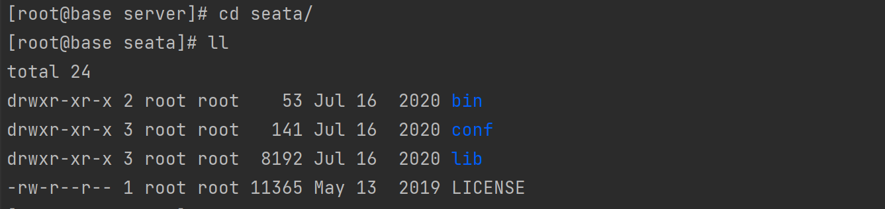

### 1. 下载安装

官网: https://seata.io/

下载地址: https://github.com/seata/seata/releases

选择对应的版本, 这里为 1.3.0


下载解压: 





### 2. 修改配置

#### 1> nacos 添加 seata 命名空间, ID和名称一致


#### 2> 指定 nacos 作为配置中心和注册中心


#### 3> 同步 seata server 配置到 nacos

##### 1)  seata server 配置 nacos-config.sh   config.txt 

下载地址: https://github.com/seata/seata/tree/develop/script/config-center/nacos/nacos-config.sh 

下载地址: https://github.com/seata/seata/blob/develop/script/config-center/config.txt


##### 2) 上传配置到 seata/script 目录下


##### 3) 修改config.txt


##### 4) 执行同步命令

```shell
sh nacos-config.sh -h 192.168.110.142 -p 8848 -g SEATA_GROUP -t seata
```

参数说明：

-h: host，默认值 localhost

-p: port，默认值 8848

-g: 配置分组，默认值为 'SEATA_GROUP'

-t: 租户信息，对应 Nacos 的命名空间ID字段, 默认值为空 ""


正确的结果


### 3. 启动 seata server

```bash
sh bin/seata-server.sh
```


后台启动命令

```bash
nohup bin/seata-server.sh > seata.log 2>&1 &
```


### 4. spring cloud 整合 seata

#### 1>  pom.xml 文件添加依赖

```xml
<!-- seata-->
<dependency>
    <groupId>com.alibaba.cloud</groupId>
    <artifactId>spring-cloud-starter-alibaba-seata</artifactId>
    <version>${spring-cloud-alibaba.version}</version>
</dependency>
```

#### 2>  application.yml


```yaml
spring:
  cloud:
    alibaba:
      seata:
        tx-service-group: default_tx_group # seata 事务分组

seata:
  # seata 服务分组，要与服务端 nacos-config.txt 中 service.vgroup_mapping 的后缀对应
  tx-service-group: default_tx_group
  registry:
    # 指定nacos作为注册中心
    type: nacos
    nacos:
      server-addr: 192.168.110.142:8848
      namespace: "seata"
      group: SEATA_GROUP
  config:
    # 指定nacos作为配置中心
    type: nacos
    nacos:
      server-addr: 192.168.110.142:8848
      namespace: "seata"
      group: SEATA_GROUP

```

在  *`org.springframework.cloud:spring-cloud-starter-alibaba-seata `*的 *`org.springframework.cloud.alibaba.seata.GlobalTransactionAutoConfiguration`* 类中，默认会使用  *`${spring.application.name}-seata-service-group`* 作为服务名注册到 Seata Server上，如果和 service.vgroup_mapping 配置不一致，会提示 *`no available server to connect`* 错误, 也可以通过配置 *`spring.cloud.alibaba.seata.tx-service-group`*修改后缀，但是必须和*`file.conf`*中的配置保持一致

#### 3> 微服务数据库添加 undo_log 表

```mysql
CREATE TABLE `undo_log` (
  `id` bigint(20) unsigned NOT NULL AUTO_INCREMENT,
  `branch_id` bigint(20) NOT NULL,
  `xid` varchar(100) NOT NULL,
  `context` varchar(128) NOT NULL,
  `rollback_info` longblob NOT NULL,
  `log_status` int(11) NOT NULL,
  `log_created` datetime NOT NULL,
  `log_modified` datetime NOT NULL,
  PRIMARY KEY (`id`),
  UNIQUE KEY `ux_undo_log` (`xid`,`branch_id`)
) ENGINE=InnoDB AUTO_INCREMENT=36 DEFAULT CHARSET=utf8;
```

#### 4> 排除 DataSourceAutoConfiguration

```java
@SpringBootApplication(scanBasePackages = "com.xxx", exclude = DataSourceAutoConfiguration.class)
```

#### 5> mybaits 配置 seata DataSourceProxy

```java

/**
 * MyBatis配置类
 *
 * 需要用到分布式事务的微服务都需要使用 seata DataSourceProxy 代理自己的数据源
 */
@Configuration
@MapperScan({"com.gckj.yqdb.dbms.dao", "com.gckj.yqdb.dao"})
public class MyBatisConfig {

    /**
     * 从配置文件获取属性构造datasource，注意前缀，这里用的是druid，根据自己情况配置,
     * 原生datasource前缀取"spring.datasource"
     *
     * @return
     */
    @Bean
    @ConfigurationProperties(prefix = "spring.datasource")
    public DataSource druidDataSource() {
        DruidDataSource druidDataSource = new DruidDataSource();
        return druidDataSource;
    }

    /**
     * 构造datasource代理对象，替换原来的datasource
     *
     * @param druidDataSource
     * @return
     */
    @Primary
    @Bean("dataSource")
    public DataSourceProxy dataSourceProxy(DataSource druidDataSource) {
        return new DataSourceProxy(druidDataSource);
    }


    @Bean(name = "sqlSessionFactory")
    public SqlSessionFactory sqlSessionFactoryBean(DataSourceProxy dataSourceProxy) throws Exception {
        SqlSessionFactoryBean factoryBean = new SqlSessionFactoryBean();
        //设置代理数据源
        factoryBean.setDataSource(dataSourceProxy);
        factoryBean.setMapperLocations(resolveMapperLocations(new String[]{"classpath:mapper/*.xml", "classpath*:com/**/mapper/*.xml"}));

        org.apache.ibatis.session.Configuration configuration = new org.apache.ibatis.session.Configuration();
        //使用jdbc的getGeneratedKeys获取数据库自增主键值
        configuration.setUseGeneratedKeys(true);
        //使用列别名替换列名
        configuration.setUseColumnLabel(true);
        //自动使用驼峰命名属性映射字段，如userId ---> user_id
        configuration.setMapUnderscoreToCamelCase(true);
        factoryBean.setConfiguration(configuration);

        return factoryBean.getObject();
    }

    public Resource[] resolveMapperLocations(String[] mapperLocations) {
        ResourcePatternResolver resourceResolver = new PathMatchingResourcePatternResolver();
        List<Resource> resources = new ArrayList<>();
        for (String mapperLocation : mapperLocations) {
            try {
                Resource[] mappers = resourceResolver.getResources(mapperLocation);
                resources.addAll(Arrays.asList(mappers));
            } catch (IOException e) {
                // ignore
            }
        }
        return resources.toArray(new Resource[resources.size()]);
    }

}
```

#### 6> @GlobalTransactional

```java
@GlobalTransactional(name = "fk_tjfk")
@Override
public CommonResult<ResultCode> tjfk(DbmsFkSaveParam dbmsFkSaveParam) {
    // 该角色是否可以提交反馈
    CommonResult<ResultCode> tjfkVerfiyRole = tjfkVerifyRole(dbmsFkSaveParam.getFkUserId());
    if (null != tjfkVerfiyRole) {
        return tjfkVerfiyRole;
    }
    // 反馈信息验证
    CommonResult<ResultCode> verify = isVerifyFk(dbmsFkSaveParam.getClUserId(),
            dbmsFkSaveParam.getFkUserId(), dbmsFkSaveParam.getYqId());
    if (null != verify) {
        return verify;
    }

    Long fkId = saveFk(dbmsFkSaveParam, (short) 5);

    // 提交反馈
    tjfk(dbmsFkSaveParam.getYqId(), dbmsFkSaveParam.getFkUserId(), dbmsFkSaveParam.getFkDwName());

    return CommonResult.success(ResultCode.SUCCESS);
}
```


#### 7>  编写微服务之间调用的例子测试是否回滚成功


### 5. 开启监控

nacos seata配置 metrics.enabled 值修改称 true, 重启 seata-server


