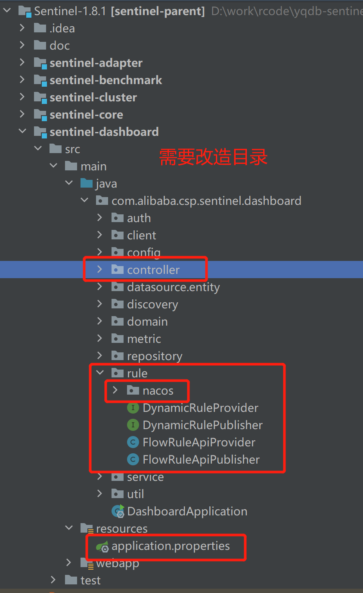
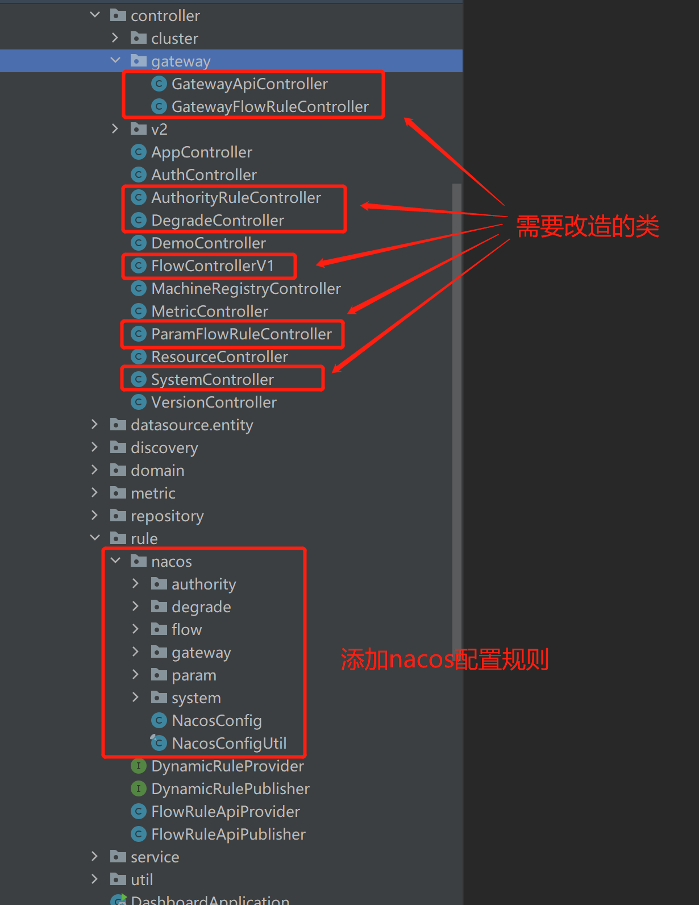
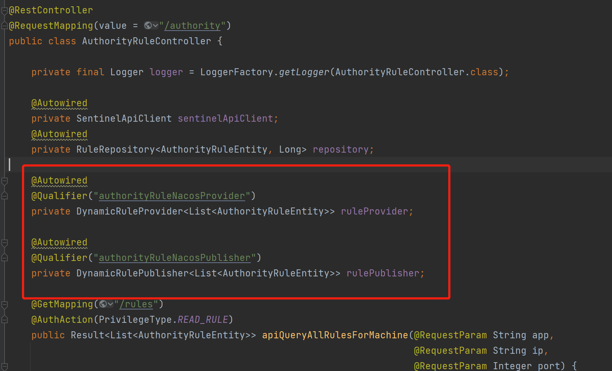
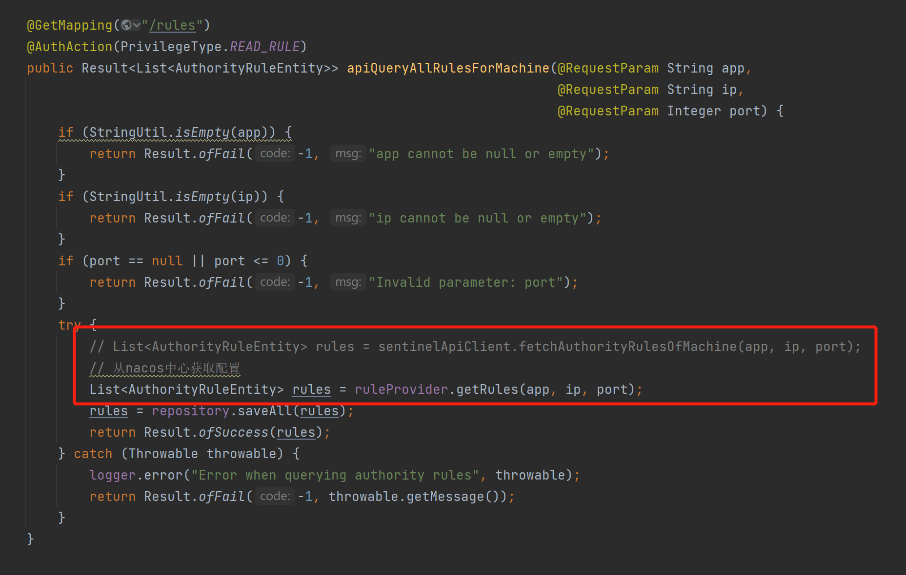
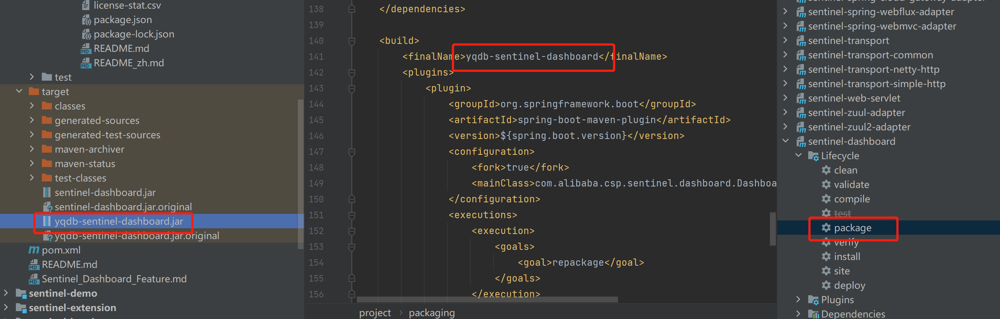
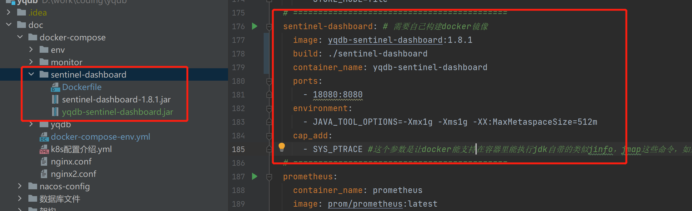
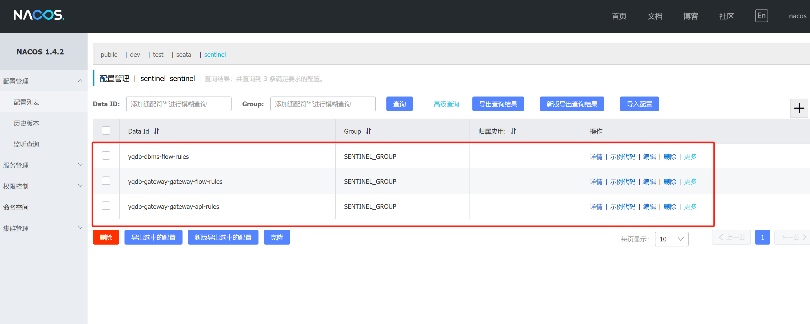
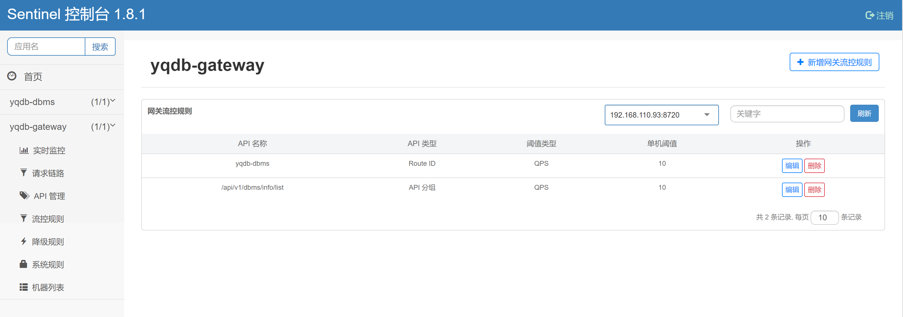

### 1. 下载

下载地址: https://github.com/alibaba/Sentinel/releases

下载1.8.1版本 导入IDEA工程


### 2. 改造目录结构






### 3. sentinel dashboard 源码改造

#### 1> 配置修改

##### application.properties 添加

```properties
sentinel.nacos.config.serverAddr=nacos地址:8848
sentinel.nacos.config.namespace=nacos sentinel命名空间ID
```

#### 2> naocs sentinel 规则转换

#####  1) NacosConfig

```java
@Configuration
public class NacosConfig {

    @Value("${sentinel.nacos.config.serverAddr}")
    private String serverAddr = "localhost:8848";

    @Value("${sentinel.nacos.config.namespace}")
    private String namespace = "sentinel";

    @Bean
    public ConfigService nacosConfigService() throws Exception {
        Properties properties = new Properties();
        properties.put(PropertyKeyConst.SERVER_ADDR, serverAddr);
        properties.put(PropertyKeyConst.NAMESPACE, namespace);
        return ConfigFactory.createConfigService(properties);
    }

}
```


##### 2) NacosConfigUtil

```java
public final class NacosConfigUtil {

    public static final String GROUP_ID = "SENTINEL_GROUP";

    public static final String FLOW_DATA_ID_POSTFIX = "-flow-rules";
    public static final String PARAM_FLOW_DATA_ID_POSTFIX = "-param-flow-rules";
    public static final String DEGRADE_DATA_ID_POSTFIX = "-degrade-rules";
    public static final String SYSTEM_DATA_ID_POSTFIX = "-system-rules";
    public static final String AUTHORITY_DATA_ID_POSTFIX = "-authority-rules";
    public static final String GATEWAY_FLOW_DATA_ID_POSTFIX = "-gateway-flow-rules";
    public static final String GATEWAY_API_DATA_ID_POSTFIX = "-gateway-api-rules";

    public static final String CLUSTER_MAP_DATA_ID_POSTFIX = "-cluster-map";

    /**
     * cc for `cluster-client`
     */
    public static final String CLIENT_CONFIG_DATA_ID_POSTFIX = "-cc-config";
    /**
     * cs for `cluster-server`
     */
    public static final String SERVER_TRANSPORT_CONFIG_DATA_ID_POSTFIX = "-cs-transport-config";
    public static final String SERVER_FLOW_CONFIG_DATA_ID_POSTFIX = "-cs-flow-config";
    public static final String SERVER_NAMESPACE_SET_DATA_ID_POSTFIX = "-cs-namespace-set";

    /**
     * 超时时间
     */
    public static final int READ_TIMEOUT = 3000;

    private NacosConfigUtil() {
    }


    /**
     * RuleEntity----->Rule
     *
     * @param entities
     * @return
     */
    public static String convertToRule(List<? extends RuleEntity> entities) {
        return JSON.toJSONString(entities.stream().map(RuleEntity::toRule).collect(Collectors.toList()));
    }

    /**
     * ApiDefinitionEntity----->ApiDefinition
     *
     * @param entities
     * @return
     */
    public static String convertToApiDefinition(List<? extends ApiDefinitionEntity> entities) {
        return JSON.toJSONString(entities.stream().map(ApiDefinitionEntity::toApiDefinition).collect(Collectors.toList()));
    }

    /**
     * GatewayFlowRuleEntity----->GatewayFlowRule
     *
     * @param entities
     * @return
     */
    public static String convertToGatewayFlowRule(List<? extends GatewayFlowRuleEntity> entities) {
        return JSON.toJSONString(entities.stream().map(GatewayFlowRuleEntity::toGatewayFlowRule).collect(Collectors.toList()));
    }
}
```


##### 3) DynamicRuleProvider 改造

```java
public interface DynamicRuleProvider<T> {

    default T getRules(String appName) throws Exception {
        return null;
    }

    /**
     * 获取规则
     *
     * @param appName app name
     * @param ip ip
     * @param port port
     * @return rules
     * @throws Exception
     */
    default T getRules(String appName, String ip, Integer port) throws Exception {
        return null;
    }

}
```


##### 4) authority 

###### AuthorityRuleNacosProvider

```java
@Component("authorityRuleNacosProvider")
public class AuthorityRuleNacosProvider implements DynamicRuleProvider<List<AuthorityRuleEntity>> {
    @Autowired
    private ConfigService configService;

    @Override
    public List<AuthorityRuleEntity> getRules(String appName, String ip, Integer port) throws Exception {
        String rules = configService.getConfig(appName + NacosConfigUtil.AUTHORITY_DATA_ID_POSTFIX,
                NacosConfigUtil.GROUP_ID, NacosConfigUtil.READ_TIMEOUT);
        if (StringUtil.isEmpty(rules)) {
            return new ArrayList<>();
        }
        List<AuthorityRule> list = JSON.parseArray(rules, AuthorityRule.class);
        return list.stream().map(rule -> AuthorityRuleEntity.fromAuthorityRule(appName, ip, port, rule))
                .collect(Collectors.toList());
    }


}
```

######  AuthorityRuleNacosPublisher

```java
@Component("authorityRuleNacosPublisher")
public class AuthorityRuleNacosPublisher implements DynamicRulePublisher<List<AuthorityRuleEntity>> {
    @Autowired
    private ConfigService configService;
    

    @Override
    public void publish(String app, List<AuthorityRuleEntity> rules) throws Exception {
        AssertUtil.notEmpty(app, "app name cannot be empty");
        if (rules == null) {
            return;
        }
        configService.publishConfig(app + NacosConfigUtil.AUTHORITY_DATA_ID_POSTFIX,
                NacosConfigUtil.GROUP_ID, NacosConfigUtil.convertToRule(rules));
    }
}
```


##### 5) degrade

###### DegradeRuleNacosProvider

```java
@Component("degradeRuleNacosProvider")
public class DegradeRuleNacosProvider implements DynamicRuleProvider<List<DegradeRuleEntity>> {
    @Autowired
    private ConfigService configService;

    @Override
    public List<DegradeRuleEntity> getRules(String appName, String ip, Integer port) throws Exception {
        String rules = configService.getConfig(appName + NacosConfigUtil.DEGRADE_DATA_ID_POSTFIX,
                NacosConfigUtil.GROUP_ID, NacosConfigUtil.READ_TIMEOUT);
        if (StringUtil.isEmpty(rules)) {
            return new ArrayList<>();
        }
        List<DegradeRule> list = JSON.parseArray(rules, DegradeRule.class);
        return list.stream().map(rule -> DegradeRuleEntity.fromDegradeRule(appName, ip, port, rule))
                .collect(Collectors.toList());
    }


}
```

###### DegradeRuleNacosPublisher

```java
@Component("degradeRuleNacosPublisher")
public class DegradeRuleNacosPublisher implements DynamicRulePublisher<List<DegradeRuleEntity>> {
    @Autowired
    private ConfigService configService;
    

    @Override
    public void publish(String app, List<DegradeRuleEntity> rules) throws Exception {
        AssertUtil.notEmpty(app, "app name cannot be empty");
        if (rules == null) {
            return;
        }
        configService.publishConfig(app + NacosConfigUtil.DEGRADE_DATA_ID_POSTFIX,
                NacosConfigUtil.GROUP_ID, NacosConfigUtil.convertToRule(rules));
    }
}
```


##### 6) flow

###### FlowRuleNacosProvider

```java
@Component("flowRuleNacosProvider")
public class FlowRuleNacosProvider implements DynamicRuleProvider<List<FlowRuleEntity>> {

    @Autowired
    private ConfigService configService;

    @Override
    public List<FlowRuleEntity> getRules(String appName, String ip, Integer port) throws NacosException {
        // 从Nacos配置中心拉取配置
        String rules = configService.getConfig(appName + NacosConfigUtil.FLOW_DATA_ID_POSTFIX,
                NacosConfigUtil.GROUP_ID, NacosConfigUtil.READ_TIMEOUT);
        if (StringUtil.isEmpty(rules)) {
            return new ArrayList<>();
        }
        // 解析json获取到 List<FlowRule>
        List<FlowRule> list = JSON.parseArray(rules, FlowRule.class);
        // FlowRule------->FlowRuleEntity
        return list.stream().map(rule -> FlowRuleEntity.fromFlowRule(appName, ip, port, rule))
                .collect(Collectors.toList());
    }

}
```

###### FlowRuleNacosPublisher

```java
@Component("flowRuleNacosPublisher")
public class FlowRuleNacosPublisher implements DynamicRulePublisher<List<FlowRuleEntity>> {

    @Autowired
    private ConfigService configService;

    @Override
    public void publish(String app, List<FlowRuleEntity> rules) throws Exception {
        AssertUtil.notEmpty(app, "app name cannot be empty");
        if (rules == null) {
            return;
        }
        //发布配置到Nacos配置中心
        configService.publishConfig(app + NacosConfigUtil.FLOW_DATA_ID_POSTFIX,
                NacosConfigUtil.GROUP_ID, NacosConfigUtil.convertToRule(rules));
    }
}
```

##### 7) gateway

###### ApiDefinition2

```java
public class ApiDefinition2 {
    private String apiName;
    private Set<ApiPathPredicateItem> predicateItems;

    public ApiDefinition2() {
    }

    public String getApiName() {
        return apiName;
    }

    public void setApiName(String apiName) {
        this.apiName = apiName;
    }

    public Set<ApiPathPredicateItem> getPredicateItems() {
        return predicateItems;
    }

    public void setPredicateItems(Set<ApiPathPredicateItem> predicateItems) {
        this.predicateItems = predicateItems;
    }

    @Override
    public String toString() {
        return "ApiDefinition2{" + "apiName='" + apiName + '\'' + ", predicateItems=" + predicateItems + '}';
    }


    public ApiDefinition toApiDefinition() {
        ApiDefinition apiDefinition = new ApiDefinition();
        apiDefinition.setApiName(apiName);

        Set<ApiPredicateItem> apiPredicateItems = new LinkedHashSet<>();
        apiDefinition.setPredicateItems(apiPredicateItems);

        if (predicateItems != null) {
            for (ApiPathPredicateItem predicateItem : predicateItems) {
                apiPredicateItems.add(predicateItem);
            }
        }

        return apiDefinition;
    }

}
```

###### GatewayApiRuleNacosProvider

```java
@Component("")
public class GatewayApiRuleNacosProvider implements DynamicRuleProvider<List<ApiDefinitionEntity>> {

    @Autowired
    private ConfigService configService;

    @Override
    public List<ApiDefinitionEntity> getRules(String appName, String ip, Integer port) throws Exception {
        String rules = configService.getConfig(appName + NacosConfigUtil.GATEWAY_API_DATA_ID_POSTFIX,
                NacosConfigUtil.GROUP_ID, NacosConfigUtil.READ_TIMEOUT);
        if (StringUtil.isEmpty(rules)) {
            return new ArrayList<>();
        }

        // 注意 ApiDefinition的属性Set<ApiPredicateItem> predicateItems中元素 是接口类型，JSON解析丢失数据
        // 重写实体类ApiDefinition2,再转换为ApiDefinition
        List<ApiDefinition2> list = JSON.parseArray(rules, ApiDefinition2.class);

        return list.stream().map(rule -> ApiDefinitionEntity.fromApiDefinition(appName, ip, port, rule.toApiDefinition()))
                .collect(Collectors.toList());
    }

}
```

###### GatewayApiRuleNacosPublisher

```java
@Component("gatewayApiRuleNacosPublisher")
public class GatewayApiRuleNacosPublisher implements DynamicRulePublisher<List<ApiDefinitionEntity>> {

    @Autowired
    private ConfigService configService;


    @Override
    public void publish(String app, List<ApiDefinitionEntity> rules) throws Exception {
        AssertUtil.notEmpty(app, "app name cannot be empty");
        if (rules == null) {
            return;
        }
        configService.publishConfig(app + NacosConfigUtil.GATEWAY_API_DATA_ID_POSTFIX,
                NacosConfigUtil.GROUP_ID, NacosConfigUtil.convertToApiDefinition(rules));
    }
}
```

###### GatewayFlowRuleNacosProvider

```java
@Component("gatewayFlowRuleNacosProvider")
public class GatewayFlowRuleNacosProvider implements DynamicRuleProvider<List<GatewayFlowRuleEntity>> {

    @Autowired
    private ConfigService configService;

    @Override
    public List<GatewayFlowRuleEntity> getRules(String appName, String ip, Integer port) throws Exception {
        String rules = configService.getConfig(appName + NacosConfigUtil.GATEWAY_FLOW_DATA_ID_POSTFIX,
                NacosConfigUtil.GROUP_ID, NacosConfigUtil.READ_TIMEOUT);
        if (StringUtil.isEmpty(rules)) {
            return new ArrayList<>();
        }
        List<GatewayFlowRule> list = JSON.parseArray(rules, GatewayFlowRule.class);
        return list.stream().map(rule -> GatewayFlowRuleEntity.fromGatewayFlowRule(appName, ip, port, rule))
                .collect(Collectors.toList());
    }

}
```

###### GatewayFlowRuleNacosPublisher

```java
@Component("gatewayFlowRuleNacosPublisher")
public class GatewayFlowRuleNacosPublisher implements DynamicRulePublisher<List<GatewayFlowRuleEntity>> {

    @Autowired
    private ConfigService configService;

    @Override
    public void publish(String app, List<GatewayFlowRuleEntity> rules) throws Exception {
        AssertUtil.notEmpty(app, "app name cannot be empty");
        if (rules == null) {
            return;
        }
        configService.publishConfig(app + NacosConfigUtil.GATEWAY_FLOW_DATA_ID_POSTFIX,
                NacosConfigUtil.GROUP_ID, NacosConfigUtil.convertToGatewayFlowRule(rules));
    }
}
```

##### 8) param

###### ParamFlowRuleNacosProvider 

```java
@Component("paramFlowRuleNacosProvider")
public class ParamFlowRuleNacosProvider implements DynamicRuleProvider<List<ParamFlowRuleEntity>> {
    @Autowired
    private ConfigService configService;

    @Override
    public List<ParamFlowRuleEntity> getRules(String appName, String ip, Integer port) throws Exception {
        String rules = configService.getConfig(appName + NacosConfigUtil.PARAM_FLOW_DATA_ID_POSTFIX,
                NacosConfigUtil.GROUP_ID, NacosConfigUtil.READ_TIMEOUT);
        if (StringUtil.isEmpty(rules)) {
            return new ArrayList<>();
        }
        List<ParamFlowRule> list = JSON.parseArray(rules, ParamFlowRule.class);
        return list.stream().map(rule -> ParamFlowRuleEntity.fromAuthorityRule(appName, ip, port, rule))
                .collect(Collectors.toList());
    }

}
```

###### ParamFlowRuleNacosPublisher

```java
@Component("paramFlowRuleNacosPublisher")
public class ParamFlowRuleNacosPublisher implements DynamicRulePublisher<List<ParamFlowRuleEntity>> {
    @Autowired
    private ConfigService configService;

    @Override
    public void publish(String app, List<ParamFlowRuleEntity> rules) throws Exception {
        AssertUtil.notEmpty(app, "app name cannot be empty");
        if (rules == null) {
            return;
        }
        configService.publishConfig(app + NacosConfigUtil.PARAM_FLOW_DATA_ID_POSTFIX,
                NacosConfigUtil.GROUP_ID, NacosConfigUtil.convertToRule(rules));
    }
}
```


##### 9) system

###### SystemRuleNacosProvider

```java
@Component("systemRuleNacosProvider")
public class SystemRuleNacosProvider implements DynamicRuleProvider<List<SystemRuleEntity>> {
    @Autowired
    private ConfigService configService;

    @Override
    public List<SystemRuleEntity> getRules(String appName, String ip, Integer port) throws Exception {
        String rules = configService.getConfig(appName + NacosConfigUtil.SYSTEM_DATA_ID_POSTFIX,
                NacosConfigUtil.GROUP_ID, NacosConfigUtil.READ_TIMEOUT);
        if (StringUtil.isEmpty(rules)) {
            return new ArrayList<>();
        }
        List<SystemRule> list = JSON.parseArray(rules, SystemRule.class);
        return list.stream().map(rule -> SystemRuleEntity.fromSystemRule(appName, ip, port, rule))
                .collect(Collectors.toList());
    }


}
```

###### SystemRuleNacosPublisher

```java
@Component("systemRuleNacosPublisher")
public class SystemRuleNacosPublisher implements DynamicRulePublisher<List<SystemRuleEntity>> {
    @Autowired
    private ConfigService configService;


    @Override
    public void publish(String app, List<SystemRuleEntity> rules) throws Exception {
        AssertUtil.notEmpty(app, "app name cannot be empty");
        if (rules == null) {
            return;
        }
        configService.publishConfig(app + NacosConfigUtil.SYSTEM_DATA_ID_POSTFIX,
                NacosConfigUtil.GROUP_ID, NacosConfigUtil.convertToRule(rules));
    }
}
```


#### 3> dashboard 接口改造

##### 1) AuthorityRuleController





```java
@RestController
@RequestMapping(value = "/authority")
public class AuthorityRuleController {

    private final Logger logger = LoggerFactory.getLogger(AuthorityRuleController.class);

    @Autowired
    private SentinelApiClient sentinelApiClient;
    @Autowired
    private RuleRepository<AuthorityRuleEntity, Long> repository;

    @Autowired
    @Qualifier("authorityRuleNacosProvider")
    private DynamicRuleProvider<List<AuthorityRuleEntity>> ruleProvider;

    @Autowired
    @Qualifier("authorityRuleNacosPublisher")
    private DynamicRulePublisher<List<AuthorityRuleEntity>> rulePublisher;

    @GetMapping("/rules")
    @AuthAction(PrivilegeType.READ_RULE)
    public Result<List<AuthorityRuleEntity>> apiQueryAllRulesForMachine(@RequestParam String app,
                                                                        @RequestParam String ip,
                                                                        @RequestParam Integer port) {
        if (StringUtil.isEmpty(app)) {
            return Result.ofFail(-1, "app cannot be null or empty");
        }
        if (StringUtil.isEmpty(ip)) {
            return Result.ofFail(-1, "ip cannot be null or empty");
        }
        if (port == null || port <= 0) {
            return Result.ofFail(-1, "Invalid parameter: port");
        }
        try {
            // List<AuthorityRuleEntity> rules = sentinelApiClient.fetchAuthorityRulesOfMachine(app, ip, port);
            // 从nacos中心获取配置
            List<AuthorityRuleEntity> rules = ruleProvider.getRules(app, ip, port);
            rules = repository.saveAll(rules);
            return Result.ofSuccess(rules);
        } catch (Throwable throwable) {
            logger.error("Error when querying authority rules", throwable);
            return Result.ofFail(-1, throwable.getMessage());
        }
    }

    private <R> Result<R> checkEntityInternal(AuthorityRuleEntity entity) {
        if (entity == null) {
            return Result.ofFail(-1, "bad rule body");
        }
        if (StringUtil.isBlank(entity.getApp())) {
            return Result.ofFail(-1, "app can't be null or empty");
        }
        if (StringUtil.isBlank(entity.getIp())) {
            return Result.ofFail(-1, "ip can't be null or empty");
        }
        if (entity.getPort() == null || entity.getPort() <= 0) {
            return Result.ofFail(-1, "port can't be null");
        }
        if (entity.getRule() == null) {
            return Result.ofFail(-1, "rule can't be null");
        }
        if (StringUtil.isBlank(entity.getResource())) {
            return Result.ofFail(-1, "resource name cannot be null or empty");
        }
        if (StringUtil.isBlank(entity.getLimitApp())) {
            return Result.ofFail(-1, "limitApp should be valid");
        }
        if (entity.getStrategy() != RuleConstant.AUTHORITY_WHITE
                && entity.getStrategy() != RuleConstant.AUTHORITY_BLACK) {
            return Result.ofFail(-1, "Unknown strategy (must be blacklist or whitelist)");
        }
        return null;
    }

    @PostMapping("/rule")
    @AuthAction(PrivilegeType.WRITE_RULE)
    public Result<AuthorityRuleEntity> apiAddAuthorityRule(@RequestBody AuthorityRuleEntity entity) {
        Result<AuthorityRuleEntity> checkResult = checkEntityInternal(entity);
        if (checkResult != null) {
            return checkResult;
        }
        entity.setId(null);
        Date date = new Date();
        entity.setGmtCreate(date);
        entity.setGmtModified(date);
        try {
            entity = repository.save(entity);
            // 发布配置到 nacos 中心
            publishRules(entity.getApp());
        } catch (Throwable throwable) {
            logger.error("Failed to add authority rule", throwable);
            return Result.ofThrowable(-1, throwable);
        }
//        if (!publishRules(entity.getApp(), entity.getIp(), entity.getPort())) {
//            logger.info("Publish authority rules failed after rule add");
//        }
        return Result.ofSuccess(entity);
    }

    @PutMapping("/rule/{id}")
    @AuthAction(PrivilegeType.WRITE_RULE)
    public Result<AuthorityRuleEntity> apiUpdateParamFlowRule(@PathVariable("id") Long id,
                                                              @RequestBody AuthorityRuleEntity entity) {
        if (id == null || id <= 0) {
            return Result.ofFail(-1, "Invalid id");
        }
        Result<AuthorityRuleEntity> checkResult = checkEntityInternal(entity);
        if (checkResult != null) {
            return checkResult;
        }
        entity.setId(id);
        Date date = new Date();
        entity.setGmtCreate(null);
        entity.setGmtModified(date);
        try {
            entity = repository.save(entity);
            if (entity == null) {
                return Result.ofFail(-1, "Failed to save authority rule");
            }
            // 发布配置到nacos配置中心
            publishRules(entity.getApp());
        } catch (Throwable throwable) {
            logger.error("Failed to save authority rule", throwable);
            return Result.ofThrowable(-1, throwable);
        }
//        if (!publishRules(entity.getApp(), entity.getIp(), entity.getPort())) {
//            logger.info("Publish authority rules failed after rule update");
//        }
        return Result.ofSuccess(entity);
    }

    @DeleteMapping("/rule/{id}")
    @AuthAction(PrivilegeType.DELETE_RULE)
    public Result<Long> apiDeleteRule(@PathVariable("id") Long id) {
        if (id == null) {
            return Result.ofFail(-1, "id cannot be null");
        }
        AuthorityRuleEntity oldEntity = repository.findById(id);
        if (oldEntity == null) {
            return Result.ofSuccess(null);
        }
        try {
            repository.delete(id);
            // 发布配置到nacos配置中心
            publishRules(oldEntity.getApp());
        } catch (Exception e) {
            return Result.ofFail(-1, e.getMessage());
        }
//        if (!publishRules(oldEntity.getApp(), oldEntity.getIp(), oldEntity.getPort())) {
//            logger.error("Publish authority rules failed after rule delete");
//        }
        return Result.ofSuccess(id);
    }

    private boolean publishRules(String app, String ip, Integer port) {
        List<AuthorityRuleEntity> rules = repository.findAllByMachine(MachineInfo.of(app, ip, port));
        return sentinelApiClient.setAuthorityRuleOfMachine(app, ip, port, rules);
    }

    /**
     * 发布配置到 nacos 中心
     *
     * @param app app name
     * @throws Exception
     */
    public void publishRules(String app) throws Exception {
        List<AuthorityRuleEntity> rule = repository.findAllByApp(app);
        rulePublisher.publish(app, rule);
    }
}
```


##### 2) DegradeController

```java
@RestController
@RequestMapping("/degrade")
public class DegradeController {

    private final Logger logger = LoggerFactory.getLogger(DegradeController.class);

    @Autowired
    private RuleRepository<DegradeRuleEntity, Long> repository;
    @Autowired
    private SentinelApiClient sentinelApiClient;


    @Autowired
    @Qualifier("degradeRuleNacosProvider")
    private DynamicRuleProvider<List<DegradeRuleEntity>> ruleProvider;

    @Autowired
    @Qualifier("degradeRuleNacosPublisher")
    private DynamicRulePublisher<List<DegradeRuleEntity>> rulePublisher;

    @GetMapping("/rules.json")
    @AuthAction(PrivilegeType.READ_RULE)
    public Result<List<DegradeRuleEntity>> apiQueryMachineRules(String app, String ip, Integer port) {
        if (StringUtil.isEmpty(app)) {
            return Result.ofFail(-1, "app can't be null or empty");
        }
        if (StringUtil.isEmpty(ip)) {
            return Result.ofFail(-1, "ip can't be null or empty");
        }
        if (port == null) {
            return Result.ofFail(-1, "port can't be null");
        }
        try {
            // List<DegradeRuleEntity> rules = sentinelApiClient.fetchDegradeRuleOfMachine(app, ip, port);
            // 从nacos配置中心获取数据
            List<DegradeRuleEntity> rules = ruleProvider.getRules(app, ip, port);
            rules = repository.saveAll(rules);
            return Result.ofSuccess(rules);
        } catch (Throwable throwable) {
            logger.error("queryApps error:", throwable);
            return Result.ofThrowable(-1, throwable);
        }
    }

    @PostMapping("/rule")
    @AuthAction(PrivilegeType.WRITE_RULE)
    public Result<DegradeRuleEntity> apiAddRule(@RequestBody DegradeRuleEntity entity) {
        Result<DegradeRuleEntity> checkResult = checkEntityInternal(entity);
        if (checkResult != null) {
            return checkResult;
        }
        Date date = new Date();
        entity.setGmtCreate(date);
        entity.setGmtModified(date);
        try {
            entity = repository.save(entity);
            // 发布到nacos配置中心
            publishRules(entity.getApp());
        } catch (Throwable t) {
            logger.error("Failed to add new degrade rule, app={}, ip={}", entity.getApp(), entity.getIp(), t);
            return Result.ofThrowable(-1, t);
        }
//        if (!publishRules(entity.getApp(), entity.getIp(), entity.getPort())) {
//            logger.warn("Publish degrade rules failed, app={}", entity.getApp());
//        }
        return Result.ofSuccess(entity);
    }

    @PutMapping("/rule/{id}")
    @AuthAction(PrivilegeType.WRITE_RULE)
    public Result<DegradeRuleEntity> apiUpdateRule(@PathVariable("id") Long id,
                                                   @RequestBody DegradeRuleEntity entity) {
        if (id == null || id <= 0) {
            return Result.ofFail(-1, "id can't be null or negative");
        }
        DegradeRuleEntity oldEntity = repository.findById(id);
        if (oldEntity == null) {
            return Result.ofFail(-1, "Degrade rule does not exist, id=" + id);
        }
        entity.setApp(oldEntity.getApp());
        entity.setIp(oldEntity.getIp());
        entity.setPort(oldEntity.getPort());
        entity.setId(oldEntity.getId());
        Result<DegradeRuleEntity> checkResult = checkEntityInternal(entity);
        if (checkResult != null) {
            return checkResult;
        }

        entity.setGmtCreate(oldEntity.getGmtCreate());
        entity.setGmtModified(new Date());
        try {
            entity = repository.save(entity);
            // 发布到nacos配置中心
            publishRules(entity.getApp());
        } catch (Throwable t) {
            logger.error("Failed to save degrade rule, id={}, rule={}", id, entity, t);
            return Result.ofThrowable(-1, t);
        }
//        if (!publishRules(entity.getApp(), entity.getIp(), entity.getPort())) {
//            logger.warn("Publish degrade rules failed, app={}", entity.getApp());
//        }
        return Result.ofSuccess(entity);
    }

    @DeleteMapping("/rule/{id}")
    @AuthAction(PrivilegeType.DELETE_RULE)
    public Result<Long> delete(@PathVariable("id") Long id) {
        if (id == null) {
            return Result.ofFail(-1, "id can't be null");
        }

        DegradeRuleEntity oldEntity = repository.findById(id);
        if (oldEntity == null) {
            return Result.ofSuccess(null);
        }

        try {
            repository.delete(id);
            // 发布到nacos配置中心
            publishRules(oldEntity.getApp());
        } catch (Throwable throwable) {
            logger.error("Failed to delete degrade rule, id={}", id, throwable);
            return Result.ofThrowable(-1, throwable);
        }
//        if (!publishRules(oldEntity.getApp(), oldEntity.getIp(), oldEntity.getPort())) {
//            logger.warn("Publish degrade rules failed, app={}", oldEntity.getApp());
//        }
        return Result.ofSuccess(id);
    }

    private boolean publishRules(String app, String ip, Integer port) {
        List<DegradeRuleEntity> rules = repository.findAllByMachine(MachineInfo.of(app, ip, port));
        return sentinelApiClient.setDegradeRuleOfMachine(app, ip, port, rules);
    }

    private <R> Result<R> checkEntityInternal(DegradeRuleEntity entity) {
        if (StringUtil.isBlank(entity.getApp())) {
            return Result.ofFail(-1, "app can't be blank");
        }
        if (StringUtil.isBlank(entity.getIp())) {
            return Result.ofFail(-1, "ip can't be null or empty");
        }
        if (entity.getPort() == null || entity.getPort() <= 0) {
            return Result.ofFail(-1, "invalid port: " + entity.getPort());
        }
        if (StringUtil.isBlank(entity.getLimitApp())) {
            return Result.ofFail(-1, "limitApp can't be null or empty");
        }
        if (StringUtil.isBlank(entity.getResource())) {
            return Result.ofFail(-1, "resource can't be null or empty");
        }
        Double threshold = entity.getCount();
        if (threshold == null || threshold < 0) {
            return Result.ofFail(-1, "invalid threshold: " + threshold);
        }
        Integer recoveryTimeoutSec = entity.getTimeWindow();
        if (recoveryTimeoutSec == null || recoveryTimeoutSec <= 0) {
            return Result.ofFail(-1, "recoveryTimeout should be positive");
        }
        Integer strategy = entity.getGrade();
        if (strategy == null) {
            return Result.ofFail(-1, "circuit breaker strategy cannot be null");
        }
        if (strategy < CircuitBreakerStrategy.SLOW_REQUEST_RATIO.getType()
                || strategy > RuleConstant.DEGRADE_GRADE_EXCEPTION_COUNT) {
            return Result.ofFail(-1, "Invalid circuit breaker strategy: " + strategy);
        }
        if (entity.getMinRequestAmount() == null || entity.getMinRequestAmount() <= 0) {
            return Result.ofFail(-1, "Invalid minRequestAmount");
        }
        if (entity.getStatIntervalMs() == null || entity.getStatIntervalMs() <= 0) {
            return Result.ofFail(-1, "Invalid statInterval");
        }
        if (strategy == RuleConstant.DEGRADE_GRADE_RT) {
            Double slowRatio = entity.getSlowRatioThreshold();
            if (slowRatio == null) {
                return Result.ofFail(-1, "SlowRatioThreshold is required for slow request ratio strategy");
            } else if (slowRatio < 0 || slowRatio > 1) {
                return Result.ofFail(-1, "SlowRatioThreshold should be in range: [0.0, 1.0]");
            }
        } else if (strategy == RuleConstant.DEGRADE_GRADE_EXCEPTION_RATIO) {
            if (threshold > 1) {
                return Result.ofFail(-1, "Ratio threshold should be in range: [0.0, 1.0]");
            }
        }
        return null;
    }

    /**
     * 发布配置到 nacos 中心
     *
     * @param app app name
     * @throws Exception
     */
    public void publishRules(String app) throws Exception {
        List<DegradeRuleEntity> rule = repository.findAllByApp(app);
        rulePublisher.publish(app, rule);
    }
}
```


##### 3) FlowControllerV1

```java
@RestController
@RequestMapping(value = "/v1/flow")
public class FlowControllerV1 {

    private final Logger logger = LoggerFactory.getLogger(FlowControllerV1.class);

    @Autowired
    private InMemoryRuleRepositoryAdapter<FlowRuleEntity> repository;

    @Autowired
    private SentinelApiClient sentinelApiClient;

    @Autowired
    @Qualifier("flowRuleNacosProvider")
    private DynamicRuleProvider<List<FlowRuleEntity>> ruleProvider;

    @Autowired
    @Qualifier("flowRuleNacosPublisher")
    private DynamicRulePublisher<List<FlowRuleEntity>> rulePublisher;

    @GetMapping("/rules")
    @AuthAction(PrivilegeType.READ_RULE)
    public Result<List<FlowRuleEntity>> apiQueryMachineRules(@RequestParam String app,
                                                             @RequestParam String ip,
                                                             @RequestParam Integer port) {

        if (StringUtil.isEmpty(app)) {
            return Result.ofFail(-1, "app can't be null or empty");
        }
        if (StringUtil.isEmpty(ip)) {
            return Result.ofFail(-1, "ip can't be null or empty");
        }
        if (port == null) {
            return Result.ofFail(-1, "port can't be null");
        }
        try {
            //  List<FlowRuleEntity> rules = sentinelApiClient.fetchFlowRuleOfMachine(app, ip, port);
            // 从nacos配置中心获取配置
            List<FlowRuleEntity> rules = ruleProvider.getRules(app, ip, port);
            rules = repository.saveAll(rules);
            return Result.ofSuccess(rules);
        } catch (Throwable throwable) {
            logger.error("Error when querying flow rules", throwable);
            return Result.ofThrowable(-1, throwable);
        }
    }

    private <R> Result<R> checkEntityInternal(FlowRuleEntity entity) {
        if (StringUtil.isBlank(entity.getApp())) {
            return Result.ofFail(-1, "app can't be null or empty");
        }
        if (StringUtil.isBlank(entity.getIp())) {
            return Result.ofFail(-1, "ip can't be null or empty");
        }
        if (entity.getPort() == null) {
            return Result.ofFail(-1, "port can't be null");
        }
        if (StringUtil.isBlank(entity.getLimitApp())) {
            return Result.ofFail(-1, "limitApp can't be null or empty");
        }
        if (StringUtil.isBlank(entity.getResource())) {
            return Result.ofFail(-1, "resource can't be null or empty");
        }
        if (entity.getGrade() == null) {
            return Result.ofFail(-1, "grade can't be null");
        }
        if (entity.getGrade() != 0 && entity.getGrade() != 1) {
            return Result.ofFail(-1, "grade must be 0 or 1, but " + entity.getGrade() + " got");
        }
        if (entity.getCount() == null || entity.getCount() < 0) {
            return Result.ofFail(-1, "count should be at lease zero");
        }
        if (entity.getStrategy() == null) {
            return Result.ofFail(-1, "strategy can't be null");
        }
        if (entity.getStrategy() != 0 && StringUtil.isBlank(entity.getRefResource())) {
            return Result.ofFail(-1, "refResource can't be null or empty when strategy!=0");
        }
        if (entity.getControlBehavior() == null) {
            return Result.ofFail(-1, "controlBehavior can't be null");
        }
        int controlBehavior = entity.getControlBehavior();
        if (controlBehavior == 1 && entity.getWarmUpPeriodSec() == null) {
            return Result.ofFail(-1, "warmUpPeriodSec can't be null when controlBehavior==1");
        }
        if (controlBehavior == 2 && entity.getMaxQueueingTimeMs() == null) {
            return Result.ofFail(-1, "maxQueueingTimeMs can't be null when controlBehavior==2");
        }
        if (entity.isClusterMode() && entity.getClusterConfig() == null) {
            return Result.ofFail(-1, "cluster config should be valid");
        }
        return null;
    }

    @PostMapping("/rule")
    @AuthAction(PrivilegeType.WRITE_RULE)
    public Result<FlowRuleEntity> apiAddFlowRule(@RequestBody FlowRuleEntity entity) {
        Result<FlowRuleEntity> checkResult = checkEntityInternal(entity);
        if (checkResult != null) {
            return checkResult;
        }
        entity.setId(null);
        Date date = new Date();
        entity.setGmtCreate(date);
        entity.setGmtModified(date);
        entity.setLimitApp(entity.getLimitApp().trim());
        entity.setResource(entity.getResource().trim());
        try {
            entity = repository.save(entity);

//            publishRules(entity.getApp(), entity.getIp(), entity.getPort()).get(5000, TimeUnit.MILLISECONDS);
            // 发布规则到nacos配置中心
            publishRules(entity.getApp());
            return Result.ofSuccess(entity);
        } catch (Throwable t) {
            Throwable e = t instanceof ExecutionException ? t.getCause() : t;
            logger.error("Failed to add new flow rule, app={}, ip={}", entity.getApp(), entity.getIp(), e);
            return Result.ofFail(-1, e.getMessage());
        }
    }

    @PutMapping("/save.json")
    @AuthAction(PrivilegeType.WRITE_RULE)
    public Result<FlowRuleEntity> apiUpdateFlowRule(Long id, String app,
                                                    String limitApp, String resource, Integer grade,
                                                    Double count, Integer strategy, String refResource,
                                                    Integer controlBehavior, Integer warmUpPeriodSec,
                                                    Integer maxQueueingTimeMs) {
        if (id == null) {
            return Result.ofFail(-1, "id can't be null");
        }
        FlowRuleEntity entity = repository.findById(id);
        if (entity == null) {
            return Result.ofFail(-1, "id " + id + " dose not exist");
        }
        if (StringUtil.isNotBlank(app)) {
            entity.setApp(app.trim());
        }
        if (StringUtil.isNotBlank(limitApp)) {
            entity.setLimitApp(limitApp.trim());
        }
        if (StringUtil.isNotBlank(resource)) {
            entity.setResource(resource.trim());
        }
        if (grade != null) {
            if (grade != 0 && grade != 1) {
                return Result.ofFail(-1, "grade must be 0 or 1, but " + grade + " got");
            }
            entity.setGrade(grade);
        }
        if (count != null) {
            entity.setCount(count);
        }
        if (strategy != null) {
            if (strategy != 0 && strategy != 1 && strategy != 2) {
                return Result.ofFail(-1, "strategy must be in [0, 1, 2], but " + strategy + " got");
            }
            entity.setStrategy(strategy);
            if (strategy != 0) {
                if (StringUtil.isBlank(refResource)) {
                    return Result.ofFail(-1, "refResource can't be null or empty when strategy!=0");
                }
                entity.setRefResource(refResource.trim());
            }
        }
        if (controlBehavior != null) {
            if (controlBehavior != 0 && controlBehavior != 1 && controlBehavior != 2) {
                return Result.ofFail(-1, "controlBehavior must be in [0, 1, 2], but " + controlBehavior + " got");
            }
            if (controlBehavior == 1 && warmUpPeriodSec == null) {
                return Result.ofFail(-1, "warmUpPeriodSec can't be null when controlBehavior==1");
            }
            if (controlBehavior == 2 && maxQueueingTimeMs == null) {
                return Result.ofFail(-1, "maxQueueingTimeMs can't be null when controlBehavior==2");
            }
            entity.setControlBehavior(controlBehavior);
            if (warmUpPeriodSec != null) {
                entity.setWarmUpPeriodSec(warmUpPeriodSec);
            }
            if (maxQueueingTimeMs != null) {
                entity.setMaxQueueingTimeMs(maxQueueingTimeMs);
            }
        }
        Date date = new Date();
        entity.setGmtModified(date);
        try {
            entity = repository.save(entity);
            if (entity == null) {
                return Result.ofFail(-1, "save entity fail: null");
            }
            // 发布规则到nacos配置中心
            publishRules(entity.getApp());
//            publishRules(entity.getApp(), entity.getIp(), entity.getPort()).get(5000, TimeUnit.MILLISECONDS);
            return Result.ofSuccess(entity);
        } catch (Throwable t) {
            Throwable e = t instanceof ExecutionException ? t.getCause() : t;
            logger.error("Error when updating flow rules, app={}, ip={}, ruleId={}", entity.getApp(),
                    entity.getIp(), id, e);
            return Result.ofFail(-1, e.getMessage());
        }
    }

    @DeleteMapping("/delete.json")
    @AuthAction(PrivilegeType.WRITE_RULE)
    public Result<Long> apiDeleteFlowRule(Long id) {

        if (id == null) {
            return Result.ofFail(-1, "id can't be null");
        }
        FlowRuleEntity oldEntity = repository.findById(id);
        if (oldEntity == null) {
            return Result.ofSuccess(null);
        }

        try {
            repository.delete(id);
        } catch (Exception e) {
            return Result.ofFail(-1, e.getMessage());
        }
        try {
//            publishRules(oldEntity.getApp(), oldEntity.getIp(), oldEntity.getPort()).get(5000, TimeUnit.MILLISECONDS);
            // 发布规则到nacos配置中心
            publishRules(oldEntity.getApp());
            return Result.ofSuccess(id);
        } catch (Throwable t) {
            Throwable e = t instanceof ExecutionException ? t.getCause() : t;
            logger.error("Error when deleting flow rules, app={}, ip={}, id={}", oldEntity.getApp(),
                    oldEntity.getIp(), id, e);
            return Result.ofFail(-1, e.getMessage());
        }
    }

    private CompletableFuture<Void> publishRules(String app, String ip, Integer port) {
        List<FlowRuleEntity> rules = repository.findAllByMachine(MachineInfo.of(app, ip, port));
        return sentinelApiClient.setFlowRuleOfMachineAsync(app, ip, port, rules);
    }

    /**
     * 发布配置到 nacos 中心
     *
     * @param app app name
     * @throws Exception
     */
    public void publishRules(String app) throws Exception {
        List<FlowRuleEntity> rule = repository.findAllByApp(app);
        rulePublisher.publish(app, rule);
    }
}
```


##### 4) gateway

###### GatewayApiController

```java
@RestController
@RequestMapping(value = "/gateway/api")
public class GatewayApiController {

    private final Logger logger = LoggerFactory.getLogger(GatewayApiController.class);

    @Autowired
    private InMemApiDefinitionStore repository;

    @Autowired
    private SentinelApiClient sentinelApiClient;

    @Autowired
    @Qualifier("gatewayApiRuleNacosProvider")
    private DynamicRuleProvider<List<ApiDefinitionEntity>> ruleProvider;

    @Autowired
    @Qualifier("gatewayApiRuleNacosPublisher")
    private DynamicRulePublisher<List<ApiDefinitionEntity>> rulePublisher;

    @GetMapping("/list.json")
    @AuthAction(AuthService.PrivilegeType.READ_RULE)
    public Result<List<ApiDefinitionEntity>> queryApis(String app, String ip, Integer port) {

        if (StringUtil.isEmpty(app)) {
            return Result.ofFail(-1, "app can't be null or empty");
        }
        if (StringUtil.isEmpty(ip)) {
            return Result.ofFail(-1, "ip can't be null or empty");
        }
        if (port == null) {
            return Result.ofFail(-1, "port can't be null");
        }

        try {
//            List<ApiDefinitionEntity> apis = sentinelApiClient.fetchApis(app, ip, port).get();
            // 从nacos配置中心获取规则
            List<ApiDefinitionEntity> apis = ruleProvider.getRules(app, ip, port);
            repository.saveAll(apis);
            return Result.ofSuccess(apis);
        } catch (Throwable throwable) {
            logger.error("queryApis error:", throwable);
            return Result.ofThrowable(-1, throwable);
        }
    }

    @PostMapping("/new.json")
    @AuthAction(AuthService.PrivilegeType.WRITE_RULE)
    public Result<ApiDefinitionEntity> addApi(HttpServletRequest request, @RequestBody AddApiReqVo reqVo) {

        String app = reqVo.getApp();
        if (StringUtil.isBlank(app)) {
            return Result.ofFail(-1, "app can't be null or empty");
        }

        ApiDefinitionEntity entity = new ApiDefinitionEntity();
        entity.setApp(app.trim());

        String ip = reqVo.getIp();
        if (StringUtil.isBlank(ip)) {
            return Result.ofFail(-1, "ip can't be null or empty");
        }
        entity.setIp(ip.trim());

        Integer port = reqVo.getPort();
        if (port == null) {
            return Result.ofFail(-1, "port can't be null");
        }
        entity.setPort(port);

        // API名称
        String apiName = reqVo.getApiName();
        if (StringUtil.isBlank(apiName)) {
            return Result.ofFail(-1, "apiName can't be null or empty");
        }
        entity.setApiName(apiName.trim());

        // 匹配规则列表
        List<ApiPredicateItemVo> predicateItems = reqVo.getPredicateItems();
        if (CollectionUtils.isEmpty(predicateItems)) {
            return Result.ofFail(-1, "predicateItems can't empty");
        }

        List<ApiPredicateItemEntity> predicateItemEntities = new ArrayList<>();
        for (ApiPredicateItemVo predicateItem : predicateItems) {
            ApiPredicateItemEntity predicateItemEntity = new ApiPredicateItemEntity();

            // 匹配模式
            Integer matchStrategy = predicateItem.getMatchStrategy();
            if (!Arrays.asList(URL_MATCH_STRATEGY_EXACT, URL_MATCH_STRATEGY_PREFIX, URL_MATCH_STRATEGY_REGEX).contains(matchStrategy)) {
                return Result.ofFail(-1, "invalid matchStrategy: " + matchStrategy);
            }
            predicateItemEntity.setMatchStrategy(matchStrategy);

            // 匹配串
            String pattern = predicateItem.getPattern();
            if (StringUtil.isBlank(pattern)) {
                return Result.ofFail(-1, "pattern can't be null or empty");
            }
            predicateItemEntity.setPattern(pattern);

            predicateItemEntities.add(predicateItemEntity);
        }
        entity.setPredicateItems(new LinkedHashSet<>(predicateItemEntities));

        // 检查API名称不能重复
        List<ApiDefinitionEntity> allApis = repository.findAllByMachine(MachineInfo.of(app.trim(), ip.trim(), port));
        if (allApis.stream().map(o -> o.getApiName()).anyMatch(o -> o.equals(apiName.trim()))) {
            return Result.ofFail(-1, "apiName exists: " + apiName);
        }

        Date date = new Date();
        entity.setGmtCreate(date);
        entity.setGmtModified(date);

        try {
            entity = repository.save(entity);
            // 发布规则到nacos配置中心
            publishRules(entity.getApp());
        } catch (Throwable throwable) {
            logger.error("add gateway api error:", throwable);
            return Result.ofThrowable(-1, throwable);
        }

//        if (!publishApis(app, ip, port)) {
//            logger.warn("publish gateway apis fail after add");
//        }

        return Result.ofSuccess(entity);
    }

    @PostMapping("/save.json")
    @AuthAction(AuthService.PrivilegeType.WRITE_RULE)
    public Result<ApiDefinitionEntity> updateApi(@RequestBody UpdateApiReqVo reqVo) {
        String app = reqVo.getApp();
        if (StringUtil.isBlank(app)) {
            return Result.ofFail(-1, "app can't be null or empty");
        }

        Long id = reqVo.getId();
        if (id == null) {
            return Result.ofFail(-1, "id can't be null");
        }

        ApiDefinitionEntity entity = repository.findById(id);
        if (entity == null) {
            return Result.ofFail(-1, "api does not exist, id=" + id);
        }

        // 匹配规则列表
        List<ApiPredicateItemVo> predicateItems = reqVo.getPredicateItems();
        if (CollectionUtils.isEmpty(predicateItems)) {
            return Result.ofFail(-1, "predicateItems can't empty");
        }

        List<ApiPredicateItemEntity> predicateItemEntities = new ArrayList<>();
        for (ApiPredicateItemVo predicateItem : predicateItems) {
            ApiPredicateItemEntity predicateItemEntity = new ApiPredicateItemEntity();

            // 匹配模式
            int matchStrategy = predicateItem.getMatchStrategy();
            if (!Arrays.asList(URL_MATCH_STRATEGY_EXACT, URL_MATCH_STRATEGY_PREFIX, URL_MATCH_STRATEGY_REGEX).contains(matchStrategy)) {
                return Result.ofFail(-1, "Invalid matchStrategy: " + matchStrategy);
            }
            predicateItemEntity.setMatchStrategy(matchStrategy);

            // 匹配串
            String pattern = predicateItem.getPattern();
            if (StringUtil.isBlank(pattern)) {
                return Result.ofFail(-1, "pattern can't be null or empty");
            }
            predicateItemEntity.setPattern(pattern);

            predicateItemEntities.add(predicateItemEntity);
        }
        entity.setPredicateItems(new LinkedHashSet<>(predicateItemEntities));

        Date date = new Date();
        entity.setGmtModified(date);

        try {
            entity = repository.save(entity);
            // 发布规则到nacos配置中心
            publishRules(entity.getApp());
        } catch (Throwable throwable) {
            logger.error("update gateway api error:", throwable);
            return Result.ofThrowable(-1, throwable);
        }

//        if (!publishApis(app, entity.getIp(), entity.getPort())) {
//            logger.warn("publish gateway apis fail after update");
//        }

        return Result.ofSuccess(entity);
    }

    @PostMapping("/delete.json")
    @AuthAction(AuthService.PrivilegeType.DELETE_RULE)

    public Result<Long> deleteApi(Long id) {
        if (id == null) {
            return Result.ofFail(-1, "id can't be null");
        }

        ApiDefinitionEntity oldEntity = repository.findById(id);
        if (oldEntity == null) {
            return Result.ofSuccess(null);
        }

        try {
            repository.delete(id);
            // 发布规则到nacos配置中心
            publishRules(oldEntity.getApp());
        } catch (Throwable throwable) {
            logger.error("delete gateway api error:", throwable);
            return Result.ofThrowable(-1, throwable);
        }

//        if (!publishApis(oldEntity.getApp(), oldEntity.getIp(), oldEntity.getPort())) {
//            logger.warn("publish gateway apis fail after delete");
//        }

        return Result.ofSuccess(id);
    }

    private boolean publishApis(String app, String ip, Integer port) {
        List<ApiDefinitionEntity> apis = repository.findAllByMachine(MachineInfo.of(app, ip, port));
        return sentinelApiClient.modifyApis(app, ip, port, apis);
    }

    /**
     * 发布配置到 nacos 中心
     *
     * @param app app name
     * @throws Exception
     */
    public void publishRules(String app) throws Exception {
        List<ApiDefinitionEntity> rule = repository.findAllByApp(app);
        rulePublisher.publish(app, rule);
    }


}
```


###### GatewayFlowRuleController

```java
@RestController
@RequestMapping(value = "/gateway/flow")
public class GatewayFlowRuleController {

    private final Logger logger = LoggerFactory.getLogger(GatewayFlowRuleController.class);

    @Autowired
    private InMemGatewayFlowRuleStore repository;

    @Autowired
    private SentinelApiClient sentinelApiClient;

    @Autowired
    @Qualifier("gatewayFlowRuleNacosProvider")
    private DynamicRuleProvider<List<GatewayFlowRuleEntity>> ruleProvider;

    @Autowired
    @Qualifier("gatewayFlowRuleNacosPublisher")
    private DynamicRulePublisher<List<GatewayFlowRuleEntity>> rulePublisher;

    @GetMapping("/list.json")
    @AuthAction(AuthService.PrivilegeType.READ_RULE)
    public Result<List<GatewayFlowRuleEntity>> queryFlowRules(String app, String ip, Integer port) {

        if (StringUtil.isEmpty(app)) {
            return Result.ofFail(-1, "app can't be null or empty");
        }
        if (StringUtil.isEmpty(ip)) {
            return Result.ofFail(-1, "ip can't be null or empty");
        }
        if (port == null) {
            return Result.ofFail(-1, "port can't be null");
        }

        try {
//            List<GatewayFlowRuleEntity> rules = sentinelApiClient.fetchGatewayFlowRules(app, ip, port).get();
            // 从nacos配置中心获取规则
            List<GatewayFlowRuleEntity> rules = ruleProvider.getRules(app, ip, port);
            repository.saveAll(rules);
            return Result.ofSuccess(rules);
        } catch (Throwable throwable) {
            logger.error("query gateway flow rules error:", throwable);
            return Result.ofThrowable(-1, throwable);
        }
    }

    @PostMapping("/new.json")
    @AuthAction(AuthService.PrivilegeType.WRITE_RULE)
    public Result<GatewayFlowRuleEntity> addFlowRule(@RequestBody AddFlowRuleReqVo reqVo) {

        String app = reqVo.getApp();
        if (StringUtil.isBlank(app)) {
            return Result.ofFail(-1, "app can't be null or empty");
        }

        GatewayFlowRuleEntity entity = new GatewayFlowRuleEntity();
        entity.setApp(app.trim());

        String ip = reqVo.getIp();
        if (StringUtil.isBlank(ip)) {
            return Result.ofFail(-1, "ip can't be null or empty");
        }
        entity.setIp(ip.trim());

        Integer port = reqVo.getPort();
        if (port == null) {
            return Result.ofFail(-1, "port can't be null");
        }
        entity.setPort(port);

        // API类型, Route ID或API分组
        Integer resourceMode = reqVo.getResourceMode();
        if (resourceMode == null) {
            return Result.ofFail(-1, "resourceMode can't be null");
        }
        if (!Arrays.asList(RESOURCE_MODE_ROUTE_ID, RESOURCE_MODE_CUSTOM_API_NAME).contains(resourceMode)) {
            return Result.ofFail(-1, "invalid resourceMode: " + resourceMode);
        }
        entity.setResourceMode(resourceMode);

        // API名称
        String resource = reqVo.getResource();
        if (StringUtil.isBlank(resource)) {
            return Result.ofFail(-1, "resource can't be null or empty");
        }
        entity.setResource(resource.trim());

        // 针对请求属性
        GatewayParamFlowItemVo paramItem = reqVo.getParamItem();
        if (paramItem != null) {
            GatewayParamFlowItemEntity itemEntity = new GatewayParamFlowItemEntity();
            entity.setParamItem(itemEntity);

            // 参数属性 0-ClientIP 1-Remote Host 2-Header 3-URL参数 4-Cookie
            Integer parseStrategy = paramItem.getParseStrategy();
            if (!Arrays.asList(PARAM_PARSE_STRATEGY_CLIENT_IP, PARAM_PARSE_STRATEGY_HOST, PARAM_PARSE_STRATEGY_HEADER
                    , PARAM_PARSE_STRATEGY_URL_PARAM, PARAM_PARSE_STRATEGY_COOKIE).contains(parseStrategy)) {
                return Result.ofFail(-1, "invalid parseStrategy: " + parseStrategy);
            }
            itemEntity.setParseStrategy(paramItem.getParseStrategy());

            // 当参数属性为2-Header 3-URL参数 4-Cookie时，参数名称必填
            if (Arrays.asList(PARAM_PARSE_STRATEGY_HEADER, PARAM_PARSE_STRATEGY_URL_PARAM, PARAM_PARSE_STRATEGY_COOKIE).contains(parseStrategy)) {
                // 参数名称
                String fieldName = paramItem.getFieldName();
                if (StringUtil.isBlank(fieldName)) {
                    return Result.ofFail(-1, "fieldName can't be null or empty");
                }
                itemEntity.setFieldName(paramItem.getFieldName());
            }

            String pattern = paramItem.getPattern();
            // 如果匹配串不为空，验证匹配模式
            if (StringUtil.isNotEmpty(pattern)) {
                itemEntity.setPattern(pattern);
                Integer matchStrategy = paramItem.getMatchStrategy();
                if (!Arrays.asList(PARAM_MATCH_STRATEGY_EXACT, PARAM_MATCH_STRATEGY_CONTAINS, PARAM_MATCH_STRATEGY_REGEX).contains(matchStrategy)) {
                    return Result.ofFail(-1, "invalid matchStrategy: " + matchStrategy);
                }
                itemEntity.setMatchStrategy(matchStrategy);
            }
        }

        // 阈值类型 0-线程数 1-QPS
        Integer grade = reqVo.getGrade();
        if (grade == null) {
            return Result.ofFail(-1, "grade can't be null");
        }
        if (!Arrays.asList(FLOW_GRADE_THREAD, FLOW_GRADE_QPS).contains(grade)) {
            return Result.ofFail(-1, "invalid grade: " + grade);
        }
        entity.setGrade(grade);

        // QPS阈值
        Double count = reqVo.getCount();
        if (count == null) {
            return Result.ofFail(-1, "count can't be null");
        }
        if (count < 0) {
            return Result.ofFail(-1, "count should be at lease zero");
        }
        entity.setCount(count);

        // 间隔
        Long interval = reqVo.getInterval();
        if (interval == null) {
            return Result.ofFail(-1, "interval can't be null");
        }
        if (interval <= 0) {
            return Result.ofFail(-1, "interval should be greater than zero");
        }
        entity.setInterval(interval);

        // 间隔单位
        Integer intervalUnit = reqVo.getIntervalUnit();
        if (intervalUnit == null) {
            return Result.ofFail(-1, "intervalUnit can't be null");
        }
        if (!Arrays.asList(INTERVAL_UNIT_SECOND, INTERVAL_UNIT_MINUTE, INTERVAL_UNIT_HOUR, INTERVAL_UNIT_DAY).contains(intervalUnit)) {
            return Result.ofFail(-1, "Invalid intervalUnit: " + intervalUnit);
        }
        entity.setIntervalUnit(intervalUnit);

        // 流控方式 0-快速失败 2-匀速排队
        Integer controlBehavior = reqVo.getControlBehavior();
        if (controlBehavior == null) {
            return Result.ofFail(-1, "controlBehavior can't be null");
        }
        if (!Arrays.asList(CONTROL_BEHAVIOR_DEFAULT, CONTROL_BEHAVIOR_RATE_LIMITER).contains(controlBehavior)) {
            return Result.ofFail(-1, "invalid controlBehavior: " + controlBehavior);
        }
        entity.setControlBehavior(controlBehavior);

        if (CONTROL_BEHAVIOR_DEFAULT == controlBehavior) {
            // 0-快速失败, 则Burst size必填
            Integer burst = reqVo.getBurst();
            if (burst == null) {
                return Result.ofFail(-1, "burst can't be null");
            }
            if (burst < 0) {
                return Result.ofFail(-1, "invalid burst: " + burst);
            }
            entity.setBurst(burst);
        } else if (CONTROL_BEHAVIOR_RATE_LIMITER == controlBehavior) {
            // 1-匀速排队, 则超时时间必填
            Integer maxQueueingTimeoutMs = reqVo.getMaxQueueingTimeoutMs();
            if (maxQueueingTimeoutMs == null) {
                return Result.ofFail(-1, "maxQueueingTimeoutMs can't be null");
            }
            if (maxQueueingTimeoutMs < 0) {
                return Result.ofFail(-1, "invalid maxQueueingTimeoutMs: " + maxQueueingTimeoutMs);
            }
            entity.setMaxQueueingTimeoutMs(maxQueueingTimeoutMs);
        }

        Date date = new Date();
        entity.setGmtCreate(date);
        entity.setGmtModified(date);

        try {
            entity = repository.save(entity);
            // 发布规则到nacos配置中心
            publishRules(entity.getApp());
        } catch (Throwable throwable) {
            logger.error("add gateway flow rule error:", throwable);
            return Result.ofThrowable(-1, throwable);
        }

//        if (!publishRules(app, ip, port)) {
//            logger.warn("publish gateway flow rules fail after add");
//        }

        return Result.ofSuccess(entity);
    }

    @PostMapping("/save.json")
    @AuthAction(AuthService.PrivilegeType.WRITE_RULE)
    public Result<GatewayFlowRuleEntity> updateFlowRule(@RequestBody UpdateFlowRuleReqVo reqVo) {

        String app = reqVo.getApp();
        if (StringUtil.isBlank(app)) {
            return Result.ofFail(-1, "app can't be null or empty");
        }

        Long id = reqVo.getId();
        if (id == null) {
            return Result.ofFail(-1, "id can't be null");
        }

        GatewayFlowRuleEntity entity = repository.findById(id);
        if (entity == null) {
            return Result.ofFail(-1, "gateway flow rule does not exist, id=" + id);
        }

        // 针对请求属性
        GatewayParamFlowItemVo paramItem = reqVo.getParamItem();
        if (paramItem != null) {
            GatewayParamFlowItemEntity itemEntity = new GatewayParamFlowItemEntity();
            entity.setParamItem(itemEntity);

            // 参数属性 0-ClientIP 1-Remote Host 2-Header 3-URL参数 4-Cookie
            Integer parseStrategy = paramItem.getParseStrategy();
            if (!Arrays.asList(PARAM_PARSE_STRATEGY_CLIENT_IP, PARAM_PARSE_STRATEGY_HOST, PARAM_PARSE_STRATEGY_HEADER
                    , PARAM_PARSE_STRATEGY_URL_PARAM, PARAM_PARSE_STRATEGY_COOKIE).contains(parseStrategy)) {
                return Result.ofFail(-1, "invalid parseStrategy: " + parseStrategy);
            }
            itemEntity.setParseStrategy(paramItem.getParseStrategy());

            // 当参数属性为2-Header 3-URL参数 4-Cookie时，参数名称必填
            if (Arrays.asList(PARAM_PARSE_STRATEGY_HEADER, PARAM_PARSE_STRATEGY_URL_PARAM, PARAM_PARSE_STRATEGY_COOKIE).contains(parseStrategy)) {
                // 参数名称
                String fieldName = paramItem.getFieldName();
                if (StringUtil.isBlank(fieldName)) {
                    return Result.ofFail(-1, "fieldName can't be null or empty");
                }
                itemEntity.setFieldName(paramItem.getFieldName());
            }

            String pattern = paramItem.getPattern();
            // 如果匹配串不为空，验证匹配模式
            if (StringUtil.isNotEmpty(pattern)) {
                itemEntity.setPattern(pattern);
                Integer matchStrategy = paramItem.getMatchStrategy();
                if (!Arrays.asList(PARAM_MATCH_STRATEGY_EXACT, PARAM_MATCH_STRATEGY_CONTAINS, PARAM_MATCH_STRATEGY_REGEX).contains(matchStrategy)) {
                    return Result.ofFail(-1, "invalid matchStrategy: " + matchStrategy);
                }
                itemEntity.setMatchStrategy(matchStrategy);
            }
        } else {
            entity.setParamItem(null);
        }

        // 阈值类型 0-线程数 1-QPS
        Integer grade = reqVo.getGrade();
        if (grade == null) {
            return Result.ofFail(-1, "grade can't be null");
        }
        if (!Arrays.asList(FLOW_GRADE_THREAD, FLOW_GRADE_QPS).contains(grade)) {
            return Result.ofFail(-1, "invalid grade: " + grade);
        }
        entity.setGrade(grade);

        // QPS阈值
        Double count = reqVo.getCount();
        if (count == null) {
            return Result.ofFail(-1, "count can't be null");
        }
        if (count < 0) {
            return Result.ofFail(-1, "count should be at lease zero");
        }
        entity.setCount(count);

        // 间隔
        Long interval = reqVo.getInterval();
        if (interval == null) {
            return Result.ofFail(-1, "interval can't be null");
        }
        if (interval <= 0) {
            return Result.ofFail(-1, "interval should be greater than zero");
        }
        entity.setInterval(interval);

        // 间隔单位
        Integer intervalUnit = reqVo.getIntervalUnit();
        if (intervalUnit == null) {
            return Result.ofFail(-1, "intervalUnit can't be null");
        }
        if (!Arrays.asList(INTERVAL_UNIT_SECOND, INTERVAL_UNIT_MINUTE, INTERVAL_UNIT_HOUR, INTERVAL_UNIT_DAY).contains(intervalUnit)) {
            return Result.ofFail(-1, "Invalid intervalUnit: " + intervalUnit);
        }
        entity.setIntervalUnit(intervalUnit);

        // 流控方式 0-快速失败 2-匀速排队
        Integer controlBehavior = reqVo.getControlBehavior();
        if (controlBehavior == null) {
            return Result.ofFail(-1, "controlBehavior can't be null");
        }
        if (!Arrays.asList(CONTROL_BEHAVIOR_DEFAULT, CONTROL_BEHAVIOR_RATE_LIMITER).contains(controlBehavior)) {
            return Result.ofFail(-1, "invalid controlBehavior: " + controlBehavior);
        }
        entity.setControlBehavior(controlBehavior);

        if (CONTROL_BEHAVIOR_DEFAULT == controlBehavior) {
            // 0-快速失败, 则Burst size必填
            Integer burst = reqVo.getBurst();
            if (burst == null) {
                return Result.ofFail(-1, "burst can't be null");
            }
            if (burst < 0) {
                return Result.ofFail(-1, "invalid burst: " + burst);
            }
            entity.setBurst(burst);
        } else if (CONTROL_BEHAVIOR_RATE_LIMITER == controlBehavior) {
            // 2-匀速排队, 则超时时间必填
            Integer maxQueueingTimeoutMs = reqVo.getMaxQueueingTimeoutMs();
            if (maxQueueingTimeoutMs == null) {
                return Result.ofFail(-1, "maxQueueingTimeoutMs can't be null");
            }
            if (maxQueueingTimeoutMs < 0) {
                return Result.ofFail(-1, "invalid maxQueueingTimeoutMs: " + maxQueueingTimeoutMs);
            }
            entity.setMaxQueueingTimeoutMs(maxQueueingTimeoutMs);
        }

        Date date = new Date();
        entity.setGmtModified(date);

        try {
            entity = repository.save(entity);
            // 发布规则到nacos配置中心
            publishRules(entity.getApp());
        } catch (Throwable throwable) {
            logger.error("update gateway flow rule error:", throwable);
            return Result.ofThrowable(-1, throwable);
        }

//        if (!publishRules(app, entity.getIp(), entity.getPort())) {
//            logger.warn("publish gateway flow rules fail after update");
//        }

        return Result.ofSuccess(entity);
    }


    @PostMapping("/delete.json")
    @AuthAction(AuthService.PrivilegeType.DELETE_RULE)
    public Result<Long> deleteFlowRule(Long id) {

        if (id == null) {
            return Result.ofFail(-1, "id can't be null");
        }

        GatewayFlowRuleEntity oldEntity = repository.findById(id);
        if (oldEntity == null) {
            return Result.ofSuccess(null);
        }

        try {
            repository.delete(id);
            // 发布规则到nacos配置中心
            publishRules(oldEntity.getApp());
        } catch (Throwable throwable) {
            logger.error("delete gateway flow rule error:", throwable);
            return Result.ofThrowable(-1, throwable);
        }

//        if (!publishRules(oldEntity.getApp(), oldEntity.getIp(), oldEntity.getPort())) {
//            logger.warn("publish gateway flow rules fail after delete");
//        }

        return Result.ofSuccess(id);
    }

    private boolean publishRules(String app, String ip, Integer port) {
        List<GatewayFlowRuleEntity> rules = repository.findAllByMachine(MachineInfo.of(app, ip, port));
        return sentinelApiClient.modifyGatewayFlowRules(app, ip, port, rules);
    }


    /**
     * 发布配置到 nacos 中心
     *
     * @param app app name
     * @throws Exception
     */
    public void publishRules(String app) throws Exception {
        List<GatewayFlowRuleEntity> rule = repository.findAllByApp(app);
        rulePublisher.publish(app, rule);
    }
}
```


##### 5) ParamFlowRuleController

```java
@RestController
@RequestMapping(value = "/paramFlow")
public class ParamFlowRuleController {

    private final Logger logger = LoggerFactory.getLogger(ParamFlowRuleController.class);

    @Autowired
    private SentinelApiClient sentinelApiClient;
    @Autowired
    private AppManagement appManagement;
    @Autowired
    private RuleRepository<ParamFlowRuleEntity, Long> repository;

    @Autowired
    @Qualifier("paramFlowRuleNacosProvider")
    private DynamicRuleProvider<List<ParamFlowRuleEntity>> ruleProvider;

    @Autowired
    @Qualifier("paramFlowRuleNacosPublisher")
    private DynamicRulePublisher<List<ParamFlowRuleEntity>> rulePublisher;

    private boolean checkIfSupported(String app, String ip, int port) {
        try {
            return Optional.ofNullable(appManagement.getDetailApp(app))
                    .flatMap(e -> e.getMachine(ip, port))
                    .flatMap(m -> VersionUtils.parseVersion(m.getVersion())
                            .map(v -> v.greaterOrEqual(version020)))
                    .orElse(true);
            // If error occurred or cannot retrieve machine info, return true.
        } catch (Exception ex) {
            return true;
        }
    }

    @GetMapping("/rules")
    @AuthAction(PrivilegeType.READ_RULE)
    public Result<List<ParamFlowRuleEntity>> apiQueryAllRulesForMachine(@RequestParam String app,
                                                                        @RequestParam String ip,
                                                                        @RequestParam Integer port) {
        if (StringUtil.isEmpty(app)) {
            return Result.ofFail(-1, "app cannot be null or empty");
        }
        if (StringUtil.isEmpty(ip)) {
            return Result.ofFail(-1, "ip cannot be null or empty");
        }
        if (port == null || port <= 0) {
            return Result.ofFail(-1, "Invalid parameter: port");
        }
        if (!checkIfSupported(app, ip, port)) {
            return unsupportedVersion();
        }
        try {
//            return sentinelApiClient.fetchParamFlowRulesOfMachine(app, ip, port)
//                .thenApply(repository::saveAll)
//                .thenApply(Result::ofSuccess)
//                .get();
            List<ParamFlowRuleEntity> rules = ruleProvider.getRules(app, ip, port);
            if (rules != null && !rules.isEmpty()) {
                for (ParamFlowRuleEntity entity : rules) {
                    entity.setApp(app);
                    if (entity.getClusterConfig() != null && entity.getClusterConfig().getFlowId() != null) {
                        entity.setId(entity.getClusterConfig().getFlowId());
                    }
                }
            }
            rules = repository.saveAll(rules);
            return Result.ofSuccess(rules);
        } catch (ExecutionException ex) {
            logger.error("Error when querying parameter flow rules", ex.getCause());
            if (isNotSupported(ex.getCause())) {
                return unsupportedVersion();
            } else {
                return Result.ofThrowable(-1, ex.getCause());
            }
        } catch (Throwable throwable) {
            logger.error("Error when querying parameter flow rules", throwable);
            return Result.ofFail(-1, throwable.getMessage());
        }
    }

    private boolean isNotSupported(Throwable ex) {
        return ex instanceof CommandNotFoundException;
    }

    @PostMapping("/rule")
    @AuthAction(AuthService.PrivilegeType.WRITE_RULE)
    public Result<ParamFlowRuleEntity> apiAddParamFlowRule(@RequestBody ParamFlowRuleEntity entity) {
        Result<ParamFlowRuleEntity> checkResult = checkEntityInternal(entity);
        if (checkResult != null) {
            return checkResult;
        }
        if (!checkIfSupported(entity.getApp(), entity.getIp(), entity.getPort())) {
            return unsupportedVersion();
        }
        entity.setId(null);
        entity.getRule().setResource(entity.getResource().trim());
        Date date = new Date();
        entity.setGmtCreate(date);
        entity.setGmtModified(date);
        try {
            entity = repository.save(entity);
            // 发布规则到nacos配置中心
            publishRules(entity.getApp());
//            publishRules(entity.getApp(), entity.getIp(), entity.getPort()).get();
            return Result.ofSuccess(entity);
        } catch (ExecutionException ex) {
            logger.error("Error when adding new parameter flow rules", ex.getCause());
            if (isNotSupported(ex.getCause())) {
                return unsupportedVersion();
            } else {
                return Result.ofThrowable(-1, ex.getCause());
            }
        } catch (Throwable throwable) {
            logger.error("Error when adding new parameter flow rules", throwable);
            return Result.ofFail(-1, throwable.getMessage());
        }
    }

    private <R> Result<R> checkEntityInternal(ParamFlowRuleEntity entity) {
        if (entity == null) {
            return Result.ofFail(-1, "bad rule body");
        }
        if (StringUtil.isBlank(entity.getApp())) {
            return Result.ofFail(-1, "app can't be null or empty");
        }
        if (StringUtil.isBlank(entity.getIp())) {
            return Result.ofFail(-1, "ip can't be null or empty");
        }
        if (entity.getPort() == null || entity.getPort() <= 0) {
            return Result.ofFail(-1, "port can't be null");
        }
        if (entity.getRule() == null) {
            return Result.ofFail(-1, "rule can't be null");
        }
        if (StringUtil.isBlank(entity.getResource())) {
            return Result.ofFail(-1, "resource name cannot be null or empty");
        }
        if (entity.getCount() < 0) {
            return Result.ofFail(-1, "count should be valid");
        }
        if (entity.getGrade() != RuleConstant.FLOW_GRADE_QPS) {
            return Result.ofFail(-1, "Unknown mode (blockGrade) for parameter flow control");
        }
        if (entity.getParamIdx() == null || entity.getParamIdx() < 0) {
            return Result.ofFail(-1, "paramIdx should be valid");
        }
        if (entity.getDurationInSec() <= 0) {
            return Result.ofFail(-1, "durationInSec should be valid");
        }
        if (entity.getControlBehavior() < 0) {
            return Result.ofFail(-1, "controlBehavior should be valid");
        }
        return null;
    }

    @PutMapping("/rule/{id}")
    @AuthAction(AuthService.PrivilegeType.WRITE_RULE)
    public Result<ParamFlowRuleEntity> apiUpdateParamFlowRule(@PathVariable("id") Long id,
                                                              @RequestBody ParamFlowRuleEntity entity) {
        if (id == null || id <= 0) {
            return Result.ofFail(-1, "Invalid id");
        }
        ParamFlowRuleEntity oldEntity = repository.findById(id);
        if (oldEntity == null) {
            return Result.ofFail(-1, "id " + id + " does not exist");
        }

        Result<ParamFlowRuleEntity> checkResult = checkEntityInternal(entity);
        if (checkResult != null) {
            return checkResult;
        }
        if (!checkIfSupported(entity.getApp(), entity.getIp(), entity.getPort())) {
            return unsupportedVersion();
        }
        entity.setId(id);
        Date date = new Date();
        entity.setGmtCreate(oldEntity.getGmtCreate());
        entity.setGmtModified(date);
        try {
            entity = repository.save(entity);
            // 发布规则到nacos配置中心
            publishRules(entity.getApp());
//            publishRules(entity.getApp(), entity.getIp(), entity.getPort()).get();
            return Result.ofSuccess(entity);
        } catch (ExecutionException ex) {
            logger.error("Error when updating parameter flow rules, id=" + id, ex.getCause());
            if (isNotSupported(ex.getCause())) {
                return unsupportedVersion();
            } else {
                return Result.ofThrowable(-1, ex.getCause());
            }
        } catch (Throwable throwable) {
            logger.error("Error when updating parameter flow rules, id=" + id, throwable);
            return Result.ofFail(-1, throwable.getMessage());
        }
    }

    @DeleteMapping("/rule/{id}")
    @AuthAction(PrivilegeType.DELETE_RULE)
    public Result<Long> apiDeleteRule(@PathVariable("id") Long id) {
        if (id == null) {
            return Result.ofFail(-1, "id cannot be null");
        }
        ParamFlowRuleEntity oldEntity = repository.findById(id);
        if (oldEntity == null) {
            return Result.ofSuccess(null);
        }

        try {
            repository.delete(id);
            // 发布规则到nacos配置中心
            publishRules(oldEntity.getApp());
//            publishRules(oldEntity.getApp(), oldEntity.getIp(), oldEntity.getPort()).get();
            return Result.ofSuccess(id);
        } catch (ExecutionException ex) {
            logger.error("Error when deleting parameter flow rules", ex.getCause());
            if (isNotSupported(ex.getCause())) {
                return unsupportedVersion();
            } else {
                return Result.ofThrowable(-1, ex.getCause());
            }
        } catch (Throwable throwable) {
            logger.error("Error when deleting parameter flow rules", throwable);
            return Result.ofFail(-1, throwable.getMessage());
        }
    }

    private CompletableFuture<Void> publishRules(String app, String ip, Integer port) {
        List<ParamFlowRuleEntity> rules = repository.findAllByMachine(MachineInfo.of(app, ip, port));
        return sentinelApiClient.setParamFlowRuleOfMachine(app, ip, port, rules);
    }

    private <R> Result<R> unsupportedVersion() {
        return Result.ofFail(4041,
                "Sentinel client not supported for parameter flow control (unsupported version or dependency absent)");
    }

    private final SentinelVersion version020 = new SentinelVersion().setMinorVersion(2);

    /**
     * 发布配置到 nacos 中心
     *
     * @param app app name
     * @throws Exception
     */
    public void publishRules(String app) throws Exception {
        List<ParamFlowRuleEntity> rule = repository.findAllByApp(app);
        rulePublisher.publish(app, rule);
    }
}
```


##### 6) SystemController

```java
@RestController
@RequestMapping("/system")
public class SystemController {

    private final Logger logger = LoggerFactory.getLogger(SystemController.class);

    @Autowired
    private RuleRepository<SystemRuleEntity, Long> repository;
    @Autowired
    private SentinelApiClient sentinelApiClient;

    @Autowired
    @Qualifier("systemRuleNacosProvider")
    private DynamicRuleProvider<List<SystemRuleEntity>> ruleProvider;

    @Autowired
    @Qualifier("systemRuleNacosPublisher")
    private DynamicRulePublisher<List<SystemRuleEntity>> rulePublisher;

    private <R> Result<R> checkBasicParams(String app, String ip, Integer port) {
        if (StringUtil.isEmpty(app)) {
            return Result.ofFail(-1, "app can't be null or empty");
        }
        if (StringUtil.isEmpty(ip)) {
            return Result.ofFail(-1, "ip can't be null or empty");
        }
        if (port == null) {
            return Result.ofFail(-1, "port can't be null");
        }
        if (port <= 0 || port > 65535) {
            return Result.ofFail(-1, "port should be in (0, 65535)");
        }
        return null;
    }

    @GetMapping("/rules.json")
    @AuthAction(PrivilegeType.READ_RULE)
    public Result<List<SystemRuleEntity>> apiQueryMachineRules(String app, String ip,
                                                               Integer port) {
        Result<List<SystemRuleEntity>> checkResult = checkBasicParams(app, ip, port);
        if (checkResult != null) {
            return checkResult;
        }
        try {
//            List<SystemRuleEntity> rules = sentinelApiClient.fetchSystemRuleOfMachine(app, ip, port);
            List<SystemRuleEntity> rules = ruleProvider.getRules(app, ip, port);
            rules = repository.saveAll(rules);
            return Result.ofSuccess(rules);
        } catch (Throwable throwable) {
            logger.error("Query machine system rules error", throwable);
            return Result.ofThrowable(-1, throwable);
        }
    }

    private int countNotNullAndNotNegative(Number... values) {
        int notNullCount = 0;
        for (int i = 0; i < values.length; i++) {
            if (values[i] != null && values[i].doubleValue() >= 0) {
                notNullCount++;
            }
        }
        return notNullCount;
    }

    @RequestMapping("/new.json")
    @AuthAction(PrivilegeType.WRITE_RULE)
    public Result<SystemRuleEntity> apiAdd(String app, String ip, Integer port,
                                           Double highestSystemLoad, Double highestCpuUsage, Long avgRt,
                                           Long maxThread, Double qps) {

        Result<SystemRuleEntity> checkResult = checkBasicParams(app, ip, port);
        if (checkResult != null) {
            return checkResult;
        }

        int notNullCount = countNotNullAndNotNegative(highestSystemLoad, avgRt, maxThread, qps, highestCpuUsage);
        if (notNullCount != 1) {
            return Result.ofFail(-1, "only one of [highestSystemLoad, avgRt, maxThread, qps,highestCpuUsage] "
                + "value must be set > 0, but " + notNullCount + " values get");
        }
        if (null != highestCpuUsage && highestCpuUsage > 1) {
            return Result.ofFail(-1, "highestCpuUsage must between [0.0, 1.0]");
        }
        SystemRuleEntity entity = new SystemRuleEntity();
        entity.setApp(app.trim());
        entity.setIp(ip.trim());
        entity.setPort(port);
        // -1 is a fake value
        if (null != highestSystemLoad) {
            entity.setHighestSystemLoad(highestSystemLoad);
        } else {
            entity.setHighestSystemLoad(-1D);
        }

        if (null != highestCpuUsage) {
            entity.setHighestCpuUsage(highestCpuUsage);
        } else {
            entity.setHighestCpuUsage(-1D);
        }

        if (avgRt != null) {
            entity.setAvgRt(avgRt);
        } else {
            entity.setAvgRt(-1L);
        }
        if (maxThread != null) {
            entity.setMaxThread(maxThread);
        } else {
            entity.setMaxThread(-1L);
        }
        if (qps != null) {
            entity.setQps(qps);
        } else {
            entity.setQps(-1D);
        }
        Date date = new Date();
        entity.setGmtCreate(date);
        entity.setGmtModified(date);
        try {
            entity = repository.save(entity);
            // 发布规则到nacos配置中心
            publishRules(entity.getApp());
        } catch (Throwable throwable) {
            logger.error("Add SystemRule error", throwable);
            return Result.ofThrowable(-1, throwable);
        }
//        if (!publishRules(app, ip, port)) {
//            logger.warn("Publish system rules fail after rule add");
//        }
        return Result.ofSuccess(entity);
    }

    @GetMapping("/save.json")
    @AuthAction(PrivilegeType.WRITE_RULE)
    public Result<SystemRuleEntity> apiUpdateIfNotNull(Long id, String app, Double highestSystemLoad,
            Double highestCpuUsage, Long avgRt, Long maxThread, Double qps) {
        if (id == null) {
            return Result.ofFail(-1, "id can't be null");
        }
        SystemRuleEntity entity = repository.findById(id);
        if (entity == null) {
            return Result.ofFail(-1, "id " + id + " dose not exist");
        }

        if (StringUtil.isNotBlank(app)) {
            entity.setApp(app.trim());
        }
        if (highestSystemLoad != null) {
            if (highestSystemLoad < 0) {
                return Result.ofFail(-1, "highestSystemLoad must >= 0");
            }
            entity.setHighestSystemLoad(highestSystemLoad);
        }
        if (highestCpuUsage != null) {
            if (highestCpuUsage < 0) {
                return Result.ofFail(-1, "highestCpuUsage must >= 0");
            }
            if (highestCpuUsage > 1) {
                return Result.ofFail(-1, "highestCpuUsage must <= 1");
            }
            entity.setHighestCpuUsage(highestCpuUsage);
        }
        if (avgRt != null) {
            if (avgRt < 0) {
                return Result.ofFail(-1, "avgRt must >= 0");
            }
            entity.setAvgRt(avgRt);
        }
        if (maxThread != null) {
            if (maxThread < 0) {
                return Result.ofFail(-1, "maxThread must >= 0");
            }
            entity.setMaxThread(maxThread);
        }
        if (qps != null) {
            if (qps < 0) {
                return Result.ofFail(-1, "qps must >= 0");
            }
            entity.setQps(qps);
        }
        Date date = new Date();
        entity.setGmtModified(date);
        try {
            entity = repository.save(entity);
            // 发布规则到nacos配置中心
            publishRules(entity.getApp());
        } catch (Throwable throwable) {
            logger.error("save error:", throwable);
            return Result.ofThrowable(-1, throwable);
        }
//        if (!publishRules(entity.getApp(), entity.getIp(), entity.getPort())) {
//            logger.info("publish system rules fail after rule update");
//        }
        return Result.ofSuccess(entity);
    }

    @RequestMapping("/delete.json")
    @AuthAction(PrivilegeType.DELETE_RULE)
    public Result<?> delete(Long id) {
        if (id == null) {
            return Result.ofFail(-1, "id can't be null");
        }
        SystemRuleEntity oldEntity = repository.findById(id);
        if (oldEntity == null) {
            return Result.ofSuccess(null);
        }
        try {
            repository.delete(id);
            // 发布规则到nacos配置中心
            publishRules(oldEntity.getApp());
        } catch (Throwable throwable) {
            logger.error("delete error:", throwable);
            return Result.ofThrowable(-1, throwable);
        }
//        if (!publishRules(oldEntity.getApp(), oldEntity.getIp(), oldEntity.getPort())) {
//            logger.info("publish system rules fail after rule delete");
//        }
        return Result.ofSuccess(id);
    }

    private boolean publishRules(String app, String ip, Integer port) {
        List<SystemRuleEntity> rules = repository.findAllByMachine(MachineInfo.of(app, ip, port));
        return sentinelApiClient.setSystemRuleOfMachine(app, ip, port, rules);
    }

    /**
     * 发布配置到 nacos 中心
     *
     * @param app app name
     * @throws Exception
     */
    public void publishRules(String app) throws Exception {
        List<SystemRuleEntity> rule = repository.findAllByApp(app);
        rulePublisher.publish(app, rule);
    }
}
```


### 4. 以上改造完成 打包 sentinel dashboard jar包 运行

```bash
```






### 5. 效果图






### 


