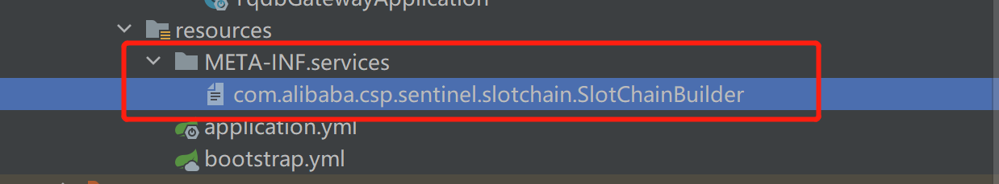

### 1. 添加依赖

```xml
<!--添加Sentinel的依赖-->
<dependency>
    <groupId>com.alibaba.cloud</groupId>
    <artifactId>spring-cloud-starter-alibaba-sentinel</artifactId>
</dependency>

<dependency>
    <groupId>com.alibaba.csp</groupId>
    <artifactId>sentinel-datasource-nacos</artifactId>
</dependency>

<dependency>
    <groupId>com.alibaba.cloud</groupId>
    <artifactId>spring-cloud-alibaba-sentinel-gateway</artifactId>
</dependency>
```


### 2. 网关 yml 配置

```yaml
spring:
  cloud:
    # sentinel配置
    sentinel:
      transport:
        dashboard: sentinel-dashboard:18080 # sentinel-dashboard 地址
      datasource:
        gateway-flow-rules: # 流控规则
          nacos:
            server-addr: nacos:8848 # nacos 地址
            dataId: ${spring.application.name}-gateway-flow-rules
            groupId: SENTINEL_GROUP
            namespace: sentinel
            data-type: json
            rule-type: gw-flow # 规定这么写不能写错
        gateway-api-rules: # api 规则
          nacos:
            server-addr: nacos:8848
            dataId: ${spring.application.name}-gateway-api-rules
            groupId: SENTINEL_GROUP
            namespace: sentinel
            data-type: json
            rule-type: gw-api-group # 规定这么写不能写错
        system-rules: # 系统规则
          nacos:
            server-addr: nacos:8848
            dataId: ${spring.application.name}-system-rules
            groupId: SENTINEL_GROUP
            namespace: sentinel
            data-type: json
            rule-type: system # 规定这么写不能写错


```


### 2. GatewayBlockExceptionHandler 

```java
@Component
public class GatewayBlockExceptionHandler extends DefaultBlockRequestHandler {

    private static final String DEFAULT_BLOCK_MSG_PREFIX = "Blocked by Sentinel: ";

    @Override
    public Mono<ServerResponse> handleRequest(ServerWebExchange exchange, Throwable ex) {
        ex.printStackTrace();
        if (acceptsHtml(exchange)) {
            return htmlErrorResponse(ex);
        }
        // JSON result by default.
        return ServerResponse.status(HttpStatus.TOO_MANY_REQUESTS)
                .contentType(MediaType.APPLICATION_JSON_UTF8)
                .body(fromObject(buildErrorResult(ex)));
    }

    private Mono<ServerResponse> htmlErrorResponse(Throwable ex) {
        ex.printStackTrace();
        return ServerResponse.status(HttpStatus.TOO_MANY_REQUESTS)
                .contentType(MediaType.TEXT_PLAIN)
                .syncBody(new String(JSON.toJSONString(buildErrorResult(ex))));
    }

    private CommonResult<ResultCode> buildErrorResult(Throwable ex) {
        ex.printStackTrace();
        if (ex instanceof ParamFlowException) {
            return CommonResult.failed(ResultCode.TO_MANY_REQUEST_ERROR);
        } else if (ex instanceof DegradeException) {
            return CommonResult.failed(ResultCode.BACKGROUND_DEGRADE_ERROR);
        } else {
            return CommonResult.failed(ResultCode.BAD_GATEWAY);
        }
    }

    /**
     * Reference from {@code DefaultErrorWebExceptionHandler} of Spring Boot.
     */
    private boolean acceptsHtml(ServerWebExchange exchange) {
        try {
            List<MediaType> acceptedMediaTypes = exchange.getRequest().getHeaders().getAccept();
            acceptedMediaTypes.remove(MediaType.ALL);
            MediaType.sortBySpecificityAndQuality(acceptedMediaTypes);
            return acceptedMediaTypes.stream()
                    .anyMatch(MediaType.TEXT_HTML::isCompatibleWith);
        } catch (InvalidMediaTypeException ex) {
            return false;
        }
    }

}
```


### 3. 配置 SPI

com.alibaba.csp.sentinel.slotchain.SlotChainBuilder 文件内容

```java
com.alibaba.csp.sentinel.adapter.gateway.common.slot.GatewaySlotChainBuilder
```




