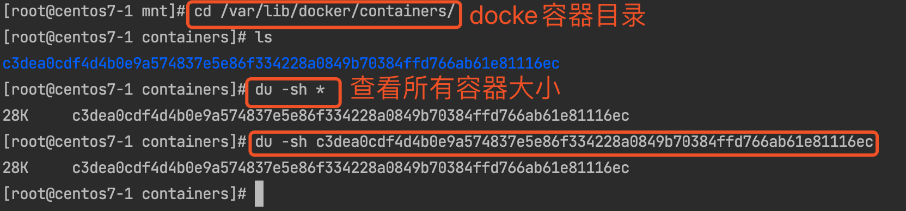

### 1. 配置centos7系统

查看系统信息

```bash
[root@centos7-1 ~]# uname -r
3.10.0-1160.el7.x86_64
[root@centos7-1 ~]# cat /etc/centos-release
```

更新yum

```bash
[root@centos7-1 ~]# yum -y update
```

卸载docker

```bash
[root@centos7-1 ~]# sudo yum remove -y docker*
```

安装yum-utils软件包，使用yum-config-manager设置yum源，更新yum包索引

```bash
[root@centos7-1 ~]# yum install -y yum-utils
  
// 这个地址要去浏览器验证下是否正确
[root@centos7-1 ~]# yum-config-manager --add-repo https://mirrors.aliyun.com/docker-ce/linux/centos/docker-ce.repo
// 生效
[root@centos7-1 ~]# yum makecache
```

查看docker版本，并安装（安装低一个版本的保证稳定性）

```bash
[root@centos7-1 ~]# yum list docker-ce --showduplicates | sort -r
docker-ce.x86_64            3:19.03.9-3.el7                     docker-ce-stable

// 安装时注意版本 docker-ce-[version].x86_64 , 其中[versio]等于中间的版本 3:19.03.9-3.el7后面跟上 .x86_64 其中的x小写
[root@centos7-1 ~]# sudo yum -y install docker-ce-3:19.03.15-3.el7.x86_64
  
// 安装完成
[root@centos7-1 ~]# yum list installed|grep docker
containerd.io.x86_64            1.4.9-3.1.el7                  @docker-ce-stable
docker-ce.x86_64                3:19.03.8-3.el7                @docker-ce-stable
docker-ce-cli.x86_64            1:20.10.8-3.el7                @docker-ce-stable
docker-scan-plugin.x86_64       0.8.0-3.el7                    @docker-ce-stable
```

启动docker

```bash
[root@centos7-1 ~]# sudo systemctl start docker
// 开启开机启动
[root@centos7-1 ~]# systemctl enable docker
// 查看版本
[root@centos7-1 ~]# docker version
```

配置docker镜像加速，这里配置阿里云镜像加速

````bash
[root@centos7-1 ~]# sudo mkdir -p /etc/docker
[root@centos7-1 ~]# sudo tee /etc/docker/daemon.json <<-'EOF'
{
   "registry-mirrors": [
       "https://fwprcl4o.mirror.aliyuncs.com",
       "http://hub-mirror.c.163.com"
   ]
}
EOF

[root@centos7-1 ~]# sudo systemctl daemon-reload
[root@centos7-1 ~]# sudo systemctl restart docker
[root@centos7-1 ~]# docker info 
````


### 2. 使用Dockerfile构建Docker镜像

```bash 
[root@centos7-1 mnt]# vim Dockerfile 
// dockerfile 内容
FROM nginx
run echo 'hello world' > /usr/share/nginx/html/index.html

// 注意结尾的点，代表当前目录
[root@centos7-1 mnt]# docker build -t nginx:myversion .

// 查看镜像
[root@centos7-1 mnt]# docker images

// 运行构建的容器
[root@centos7-1 mnt]# docker run --name nginx-my -d -p 80:80 nginx:myversion
```


### 3. 将镜像推送到镜像仓库（这里以阿里云镜像仓库为例）

```bash
$ docker login --username=你的账号 registry.cn-hangzhou.aliyuncs.com
$ docker tag [ImageId] registry.cn-hangzhou.aliyuncs.com/starzeng/java-docker-demo:[镜像版本号]
$ docker push registry.cn-hangzhou.aliyuncs.com/starzeng/java-docker-demo:[镜像版本号]

// 例如
[root@centos7-1 mnt]# docker login --username=***@qq.com registry.cn-hangzhou.aliyuncs.com
[root@centos7-1 mnt]# docker tag 8083f52812ba registry.cn-hangzhou.aliyuncs.com/starzeng/java-docker-demo:1.0
[root@centos7-1 mnt]# docker push registry.cn-hangzhou.aliyuncs.com/starzeng/java-docker-demo:1.0
```


### 4. 查看容器信息

```bash 
// 查看容器目录
[root@centos7-1 mnt]# cd /var/lib/docker/containers/
[root@centos7-1 containers]# du -sh *
[root@centos7-1 containers]# du -sh c3dea0cdf4d4b0e9a574837e5e86f334228a0849b70384ffd766ab61e81116ec
```



```bash
// 打印容器使用信息，每秒一次
[root@centos7-1 containers]# docker stats
// 打印容器最新的使用信息
[root@centos7-1 containers]# docker stats --no-stream
// 容器最大内存的使用默认接近物理内存，可以设置容器最大内存
// 设置nginx使用内存为2g
[root@centos7-1 containers]# docker run --name mynginx -m 2g -d -p 80:80 nginx
```

