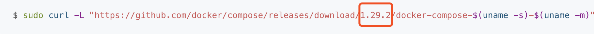

### docker-compose安装

#### 线上安装

按照官方文档安装就不多说了 https://docs.docker.com/compose/install/

#### 离线安装

下载安装文件，参照官方建议安装版本  https://github.com/docker/compose/releases



下载安装文件上传


```java
[root@centos7-1 mnt]# mv docker-compose-Linux-x86_64 /usr/local/bin/docker-compose
[root@centos7-1 mnt]# sudo chmod +x /usr/local/bin/docker-compose 
[root@centos7-1 mnt]# docker-compose -version
```


#### 编写docker-compose 的 yml 文件

```yaml
###################################################
# mysql:5.7                 root    123456
# mongo:3.2
# redis:5.0                 123456
#
# elasticsearch 7.13.4
# logstash:7.13.4 日志收集
# kibana:7.13.4
#
# nacos/nacos‐server:1.4.2
# prom/prometheus:latest
# grafana/grafana:latest
#
# zookeeper:3.5
#
# rabbitmq:3.7.25‐management
#
# rocketmqinc/rocketmq:latest
# styletang/rocketmq-console-ng:latest
#
# seataio/seata-server:1.4.0
#
# sentinel
#
# 单独下载安装
# apache/skywalking-oap-server:8.7.0-es7
# apache/skywalking-ui:8.7.0
#
###################################################
version: '3.8'
services:
  mysql:
    image: mysql:5.7
    container_name: mysql
    command: mysqld --character-set-server=utf8mb4 --collation-server=utf8mb4_unicode_ci  #覆盖容器启动后默认执行的启动mysql命令
    restart: always  #关机或者重启机器时，docker同时重启容器，一般mysql服务可以这么设置，保持服务一直都在
    environment:
      MYSQL_ROOT_PASSWORD: 123456 #设置root帐号密码
    ports:
      - 3306:3306
    volumes:
      - /server/mysql/data:/var/lib/mysql #数据文件挂载
      - /server/mysql/conf:/etc/mysql/conf.d #配置文件挂载
      - /server/mysql/log:/var/log/mysql #日志文件挂载
  # ===========================================
  mongo:
    image: mongo:3.2
    container_name: mongo
    volumes:
      - /server/mongo/db:/data/db #数据文件挂载
    ports:
      - 27017:27017
  # ===========================================
  redis:
    image: redis:5.0
    container_name: redis
    volumes:
      - /server/redis/data:/data #数据文件挂载
      - /server/redis/conf/redis.conf:/etc/redis/redis.conf #配置文件挂载;
    ports:
      - 6379:6379
    command: redis-server /etc/redis/redis.conf --appendonly yes # 如果不能访问, 看配置文件是否配置外网访问
  # ===========================================
  rabbitmq:
    image: rabbitmq:3.7.25-management
    container_name: rabbitmq
    volumes:
      - /server/rabbitmq/data:/var/lib/rabbitmq #数据文件挂载
      - /server/rabbitmq/log:/var/log/rabbitmq #日志文件挂载
    ports:
      - 5672:5672
      - 15672:15672
      - 15675:15675
      - 1833:1833
  # ===========================================
  elasticsearch:
    image: elasticsearch:7.13.4
    container_name: elasticsearch
    environment:
      - cluster.name=elasticsearch # 设置集群名称为elasticsearch
      - discovery.type=single-node # 以单一节点模式启动
      - ES_JAVA_OPTS=-Xms1024m -Xmx1024m # 设置使用jvm内存大小，稍微配置大点，不然有可能启动不成功
    volumes:
      - /server/elasticsearch/plugins:/usr/share/elasticsearch/plugins #插件文件挂载
      - /server/elasticsearch/data:/usr/share/elasticsearch/data #数据文件挂载
      - /server/elasticsearch/logs:/usr/share/elasticsearch/logs #日志文件挂载
    ports:
      - 9200:9200
      - 9300:9300
  #    networks:
  #      - esnet
  # ===========================================
  logstash:
    image: logstash:7.13.4
    container_name: logstash
    volumes:
      - /server/logstash/logstash-springboot.conf:/usr/share/logstash/pipeline/logstash.conf #挂载logstash的配置文件，docker对单个文件的挂载需要先在宿主机建好对应文件才能挂载成功
    depends_on:
      - elasticsearch #kibana在elasticsearch启动之后再启动
    links:
      - elasticsearch:es #可以用es这个域名访问elasticsearch服务
    ports:
      - 4560:4560
  # ===========================================
  kibana:
    image: kibana:7.13.4
    container_name: kibana
    links: #同一个compose文件管理的服务可以直接用服务名访问，如果要给服务取别名则可以用links实现，如下面的es就是elasticsearch服务的别名
      - elasticsearch:es #可以用es这个域名访问elasticsearch服务
    depends_on:
      - elasticsearch #kibana在elasticsearch启动之后再启动
    environment:
      - elasticsearch.hosts=http://es:9200 #设置访问elasticsearch的地址
    ports:
      - 5601:5601
  # ===========================================
  nacos:
    image: nacos/nacos-server:1.4.2
    container_name: nacos-standalone-mysql
    volumes:
      - /server/nacos/logs/:/home/nacos/logs
      - /server/nacos/init.d/custom.properties:/home/nacos/init.d/custom.properties
    ports:
      - 8848:8848
    depends_on:
      - mysql
    links:
      - mysql:mysql
    restart: on-failure
    environment:
      - PREFER_HOST_MODE=hostname
      - MODE=standalone
      - SPRING_DATASOURCE_PLATFORM=mysql
      - MYSQL_SERVICE_HOST=mysql # nacos.log 报 No DataSource set ; 宿主机控制台: docker inspect mysql|grep IPAddress ; 替换外网IP
      - MYSQL_SERVICE_DB_NAME=nacos_config
      - MYSQL_SERVICE_PORT=3306
      - MYSQL_SERVICE_USER=root
      - MYSQL_SERVICE_PASSWORD=123456
      - MYSQL_SERVICE_DB_PARAM=characterEncoding=utf8&connectTimeout=10000&socketTimeout=3000&autoReconnect=true&useSSL=false
  # ===========================================
  seata-server:
    image: seataio/seata-server:1.4.0
    container_name: seata-server
    hostname: seata-server
    ports:
      - 8091:8091
    environment:
      - SEATA_PORT=8091
      - STORE_MODE=file
  # ===========================================
  sentinel-dashboard: # 需要自己构建docker镜像
    #    image: mall/sentinel-dashboard-1.8.1.jar
    image: tlmall/tuling-sentinel-dashboard.jar
    build: ./sentinel-dashboard
    container_name: tuling-sentinel-dashboard
    ports:
      - 18080:8080
    environment:
      - JAVA_TOOL_OPTIONS=-Xmx1g -Xms1g -XX:MaxMetaspaceSize=512m
    cap_add:
      - SYS_PTRACE #这个参数是让docker能支持在容器里能执行jdk自带的类似jinfo，jmap这些命令，如果不需要在容器里执行这些命令可以不加
  # ===========================================
  prometheus:
    container_name: prometheus
    image: prom/prometheus:latest
    volumes:
      - /server/prometheus/prometheus-standalone.yaml:/etc/prometheus/prometheus.yml
    ports:
      - 9090:9090
    depends_on:
      - nacos
    restart: on-failure # 在容器非正常退出时（退出状态非0），才会重启容器
  # ===========================================
  grafana:
    container_name: grafana
    image: grafana/grafana:latest
    ports:
      - 3000:3000
    restart: on-failure
  # ===========================================
  zookeeper:
    image: zookeeper:3.5
    container_name: zookeeper
    ports:
      - 2181:2181
    volumes:
      - /server/zookeeper/data:/data
      - /server/zookeeper/datalog:/datalog
      - /server/zookeeper/conf:/conf
  # ===========================================
  rocketmq:
    image: rocketmqinc/rocketmq
    container_name: rocketmq
    restart: always
    ports:
      - 9876:9876
    volumes:
      - /server/rocketmq/logs:/home/rocketmq/logs
      - /server/rocketmq/store:/home/rocketmq/store
    command: sh mqnamesrv
  # ===========================================
  broker:
    image: rocketmqinc/rocketmq
    container_name: rmqbroker
    restart: always
    ports:
      - 10909:10909
      - 10911:10911
      - 10912:10912
    volumes:
      - /server/rocketmq/logs:/home/rocketmq/logs
      - /server/rocketmq/store:/home/rocketmq/store
      - /server/rocketmq/conf/broker.conf:/opt/rocketmq-4.4.0/conf/broker.conf  #这个配置需要先在宿主机对应目录放好broker.conf配置文件,文件内容参考下面文档
    command: sh mqbroker -n namesrv:9876 -c ../conf/broker.conf
    depends_on:
      - rocketmq
    environment:
      - JAVA_HOME=/usr/lib/jvm/jre
  # ===========================================
  console:
    image: styletang/rocketmq-console-ng
    container_name: rocketmq-console-ng
    restart: always
    ports:
      - 8076:8080
    depends_on:
      - rocketmq
    environment:
      - JAVA_OPTS= -Dlogging.level.root=info -Drocketmq.namesrv.addr=rocketmq:9876
      - Dcom.rocketmq.sendMessageWithVIPChannel=false
  # ===========================================
  #  skywalking-oap-server:
  #    image: apache/skywalking-oap-server:8.7.0-es7
  #    container_name: skywalking-oap-server
  #    restart: always
  #    depends_on:
  #      - elasticsearch
  #    links:
  #      - elasticsearch:es
  #    ports:
  #      - 11800:11800
  #      - 12800:12800
  #    environment:
  #      TZ: Asia/Shanghai
  #      SW_STORAGE: elasticsearch7
  #      SW_STORAGE_ES_CLUSTER_NODES: es:9200
  # ===========================================
  #  skywalking-ui:
  #    image: apache/skywalking-ui:8.7.0
  #    container_name: skywalking-ui
  #    restart: always
  #    depends_on:
  #      - skywalking-oap-server
  #    links:
  #      - skywalking-oap-server:soaps
  #    ports:
  #      - 18080:8080
  #    environment:
  #      TZ: Asia/Shanghai
  #      SW_OAP_ADDRESS: soaps:12800

  # ===========================================
  nginx:
    image: nginx:latest
    container_name: nginx
    ports:
      - 80:80
    volumes:
      - /server/nginx/html:/usr/share/nginx/html
      - /server/nginx/log:/var/log/nginx
      - /server/nginx/conf/nginx.conf:/etc/nginx/nginx.conf


  # ===========================================
  # ===========================================


```

#### 运行

**这里不建议用docker 搭建mysql, redis, skywalking, es 等基础设施**

```bash
docker-compose -f docker-compose-env.yml up -d 
```


其他命令

```bash
# 强制重启
docker-compose up --force-recreate -d


```


