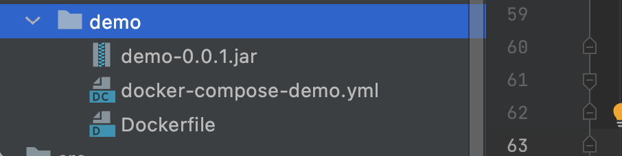

#### docker-compose-demo.yml

```yaml
version: '3.8'
services:
  demo:
    image: demo:0.0.1
    build: .
    container_name: demo
    ports:
      - 8082:8082
    volumes:
      - /etc/localtime:/etc/localtime:ro #同步宿主机与容器时间
    environment:
      - JAVA_TOOL_OPTIONS=-Xmx512m -Xms512m -XX:MaxMetaspaceSize=512m
    cap_add:
      - SYS_PTRACE #这个参数是让docker能支持在容器里能执行jdk自带的类似jinfo，jmap这些命令

```


#### Dockerfile

```dockerfile
FROM java:8
ADD ./demo-0.0.1.jar /app.jar
ENTRYPOINT ["java","-jar","/app.jar"]
```


#### 构建docker镜像

```bash
```

