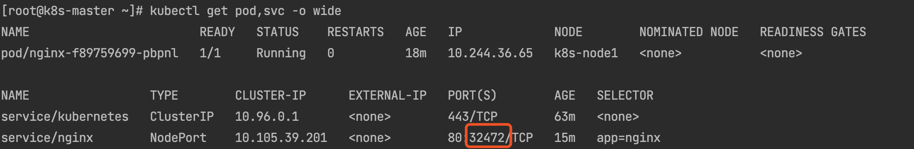
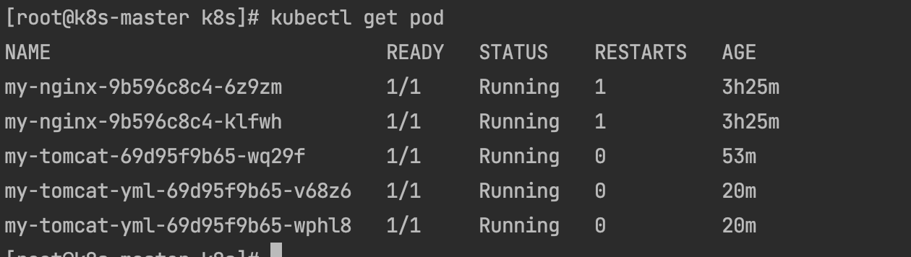

### 一. 准备至少3台centos7服务器，并安装好docker

推荐2核4G, 至少2G

参考: [centos7上docker搭建.md](./01 centos7上docker搭建.md)

### 二. k8s服务器配置, 以下步骤在所有节点服务器上执行

#### 1. 关闭防火墙

```bash
[root@www ~]# systemctl stop firewalld
[root@www ~]# systemctl disable firewalld
```

#### 2. 关闭 selinux

````bash
# 查看selinux状态 SELinux status: enabled
[root@www ~]# /usr/sbin/sestatus -v
# 永久关闭
[root@www ~]# sed -i s#SELINUX=enforcing#SELINUX=disabled# /etc/selinux/config
# 临时关闭 setenforce 0 
# 重启查看是否关闭
[root@www ~]# systemctl reboot
[root@www ~]# /usr/sbin/sestatus -v
````

#### 3. 关闭 swap

```bash
# 临时关闭 swapoff ‐a 
# 永久关闭
[root@www ~]# vim /etc/fstab 
# 注释掉swap这行 
# /dev/mapper/centos‐swap swap swap defaults 0 0
#重启生效 free‐m 查看下swap交换区是否都为0，如果都为0则swap关闭成功
[root@www ~]# systemctl reboot
[root@www ~]# free -m
```


#### 4. 所有服务器设置别名

hostnamectl set-hostname <hostname>

````bash
# 第一台
[root@k8s-master ~]# hostnamectl set-hostname k8s-master
# 第二台
[root@k8s-node1 ~]# hostnamectl set-hostname k8s-node1
# 第三台
[root@k8s-node2 ~]# hostnamectl set-hostname k8s-node2
......

# 查看是否设置成功
[root@k8s-node1 ~]# hostname
````

#### 5. 只在k8s-master主机上执行以下命令, 注意IP修改

```bash
# 追加到hosts文件
[root@k8s-master ~]# cat >> /etc/hosts << EOF
192.168.31.251 k8s‐master
192.168.31.190 k8s‐node1
192.168.31.118 k8s‐node2
EOF

```

#### 6. 将桥接的IPv4流量传递到iptables

```bash
# 这有个空等号左右没有空格不生效
[root@k8s-master ~]# cat >> /etc/sysctl.d/k8s.conf << EOF
net.bridge.bridge-nf-call-ip6tables = 1
net.bridge.bridge-nf-call-iptables = 1
EOF

# 生效
[root@k8s-master ~]# sysctl --system
```


#### 7. 设置时间同步

```bash
[root@k8s-master ~]# yum install ‐y ntpdate 
[root@k8s-master ~]# ntpdate time.windows.com
```

#### 8. 添加k8s yum源, 注意在浏览器检查url是否正确

```bash
cat <<EOF > /etc/yum.repos.d/kubernetes.repo
[kubernetes]
name=Kubernetes
baseurl=https://mirrors.aliyun.com/kubernetes/yum/repos/kubernetes-el7-x86_64/
enabled=1
gpgcheck=1
repo_gpgcheck=1
gpgkey=https://mirrors.aliyun.com/kubernetes/yum/doc/yum-key.gpg https://mirrors.aliyun.com/kubernetes/yum/doc/rpm-package-key.gpg
EOF

setenforce 0

yum install -y kubelet kubeadm kubectl

systemctl enable kubelet && systemctl start kubelet

[root@k8s-master ~]# yum makecache
```

#### 9. k8s安装, 

```bash
# 删除
[root@k8s-master ~]# yum remove ‐y kubelet kubeadm kubectl
# 查看版本,选择比最新低一个的稳定版本
[root@k8s-master ~]# yum list kubelet --showduplicates | sort -r
# 安装
[root@k8s-master ~]# yum install -y kubelet-1.18.0 kubeadm-1.18.0 kubectl-1.18.0
# 成功
[root@k8s-master ~]# yum list installed | grep kube*
cri-tools.x86_64                     1.13.0-0                       @kubernetes 
kubeadm.x86_64                       1.18.0-0                       @kubernetes 
kubectl.x86_64                       1.18.0-0                       @kubernetes 
kubelet.x86_64                       1.18.0-0                       @kubernetes 
kubernetes-cni.x86_64                0.8.7-0                        @kubernetes 
```

#### 10. 设置开机启动

```bash
[root@k8s-master ~]# systemctl enable kubelet
[root@k8s-master ~]# systemctl start kubelet 
```

### 三. k8s-master集群配置

#### 1. 在k8s-master中执行

##### 初始化master, 注意docker k8s的版本是否对应

````bash
[root@k8s-master ~]# kubeadm init \
  --apiserver-advertise-address=192.168.31.251 \
  --image-repository registry.aliyuncs.com/google_containers \
  --kubernetes-version v1.18.0 \
  --service-cidr=10.96.0.0/12 \
  --pod-network-cidr=10.244.0.0/16
````

ERROR

```bash
[root@k8s-node2 ~]# kubeadm join 10.211.55.14:6443 --token m50sr6.i1oy47wlce18ftt5     --discovery-token-ca-cert-hash sha256:4a2adf158af6505dbe2ff7809fd19684b0037b89b4e96891d654eb1f992ceb91
W0908 17:19:53.009373   15405 join.go:346] [preflight] WARNING: JoinControlPane.controlPlane settings will be ignored when control-plane flag is not set.
[preflight] Running pre-flight checks
        [WARNING IsDockerSystemdCheck]: detected "cgroupfs" as the Docker cgroup driver. The recommended driver is "systemd". Please follow the guide at https://kubernetes.io/docs/setup/cri/
error execution phase preflight: [preflight] Some fatal errors occurred:
        [ERROR FileAvailable--etc-kubernetes-kubelet.conf]: /etc/kubernetes/kubelet.conf already exists
        [ERROR Port-10250]: Port 10250 is in use
        [ERROR FileAvailable--etc-kubernetes-pki-ca.crt]: /etc/kubernetes/pki/ca.crt already exists
[preflight] If you know what you are doing, you can make a check non-fatal with `--ignore-preflight-errors=...`
To see the stack trace of this error execute with --v=5 or higher

# 解决办法
# 1. [WARNING IsDockerSystemdCheck]
# 查看docker
[root@k8s-node2 ~]# docker info | grep Cgroup
[root@k8s-node2 ~]# vim /etc/docker/daemon.json 
{
	"registry-mirrors": [
		"https://fwprcl4o.mirror.aliyuncs.com/",
		"https://registry.docker-cn.com",
		"http://hub-mirror.c.163.com"
	],
	"exec-opts": [
		"native.cgroupdriver=systemd"
	]
}
[root@k8s-node2 ~]# systemctl restart docker

# 2. [ERROR FileAvailable--etc-kubernetes-kubelet.conf]
#		 [ERROR FileAvailable--etc-kubernetes-pki-ca.crt]
# 删除文件 /etc/kubernetes
[root@k8s-node2 ~]# rm -rf /etc/kubernetes

# 3. [ERROR Port-10250]
[root@k8s-node2 ~]# kubeadm reset

```


##### k8s-master上执行,安装 Pod 网络插件

```bash
[root@k8s-master ~]# mkdir -p $HOME/.kube
[root@k8s-master ~]# sudo cp -i /etc/kubernetes/admin.conf $HOME/.kube/config
[root@k8s-master ~]# sudo chown $(id -u):$(id -g) $HOME/.kube/config

export KUBECONFIG=/etc/kubernetes/admin.conf

[root@k8s-master ~]# kubectl apply -f  https://docs.projectcalico.org/manifests/calico.yaml
# 如果上面这个calico网络插件安装不成功可以试下下面这个
# kubectl apply ‐f https://raw.githubusercontent.com/coreos/flannel/mast er/Documentation/kubeflannel.yml
```


#### 2. 在所有的k8s-node中执行

##### 将node节点加入master节点

**这里需要注意: 子节点在加入集群的时候不启动**

````bash
[root@k8s-node2 ~]# kubeadm join 10.211.55.14:6443 --token m50sr6.i1oy47wlce18ftt5 \
--discovery-token-ca-cert-hash sha256:4a2adf158af6505dbe2ff7809fd19684b0037b89b4e96891d654eb1f992ceb91
````

##### 安装完成

```bash
[root@k8s-master ~]# kubectl get nodes
```


##### 删除节点

```bash
# 主节点执行
[root@k8s-master ~]# kubectl drain node3 --delete-local-data --force --ignore-daemonsets
[root@k8s-master ~]# kubectl delete node node3
# 子节点执行, 彻底重 cluster 删除
[root@k8s-node2 cni]# kubeadm reset
```

##### 节点重新加入

```bash
# 主节点执行
[root@k8s-master ~]# kubeadm token create --print-join-command
kubeadm join 10.211.55.14:6443 --token fxd5n5.r6fbymc7nc3hcmtd     --discovery-token-ca-cert-hash sha256:4a2adf158af6505dbe2ff7809fd19684b0037b89b4e96891d654eb1f992ceb91 

# 子节点执行加入命令
# 子节点必须先执行 kubeadm reset 彻底删除
[root@k8s-node2 cni]# kubeadm join 10.211.55.14:6443 --token fxd5n5.r6fbymc7nc3hcmtd     --discovery-token-ca-cert-hash sha256:4a2adf158af6505dbe2ff7809fd19684b0037b89b4e96891d654eb1f992ceb91 

# 主节点执行,查看是否加入成功
[root@k8s-master ~]# kubectl get nodes

there is no need to specify a resource type as a separate argument when passing arguments in resource/name form (e.g. 'kubectl get resource/<resource_name>' instead of 'kubectl get resource resource/<resource_name>'
```


### 四. k8s部署Nginx实践

kubectl官方使用文档: https://kubernetes.io/zh/docs/reference/kubectl/overview/

##### 部署nginx

```bash
# 创建
[root@k8s-master ~]# kubectl create deployment my-nginx --image=nginx
# 集群外部访问
[root@k8s-master ~]# kubectl expose deployment my-nginx --port=80 --type=NodePort
# 扩容
[root@k8s-master ~]# kubectl scale --replicas=3 deployment my-nginx
# 查看
[root@k8s-master ~]# kubectl get pod,svc -o wide
```



任意节点IP加上上面红框的端口就可以访问nginx了


###### 打印容器日志

```bash
[root@k8s-master ~]# kubectl logs my-nginx-9b596c8c4-4kgvf
```

###### 查看pod容器环境变量

```bash
[root@k8s-master ~]# kubectl exec my-nginx-9b596c8c4-4kgvf -- env
```

###### 进入pod容器

```bash
[root@k8s-master ~]# kubectl exec -it my-nginx-9b596c8c4-4kgvf bash
```

###### 实时观察pod变动

```bash
[root@k8s-master ~]# kubectl get pod -w
```

###### 扩容缩容

--replicas=3该参数控制发布多少个pod

```bash
[root@k8s-master ~]# kubectl scale --replicas=3 deployment my-nginx
```


##### 部署tomcat

```bash
# 创建
[root@k8s-master ~]# kubectl create deployment my-tomcat --image=tomcat:7.0.57
# 集群外部访问
[root@k8s-master ~]# kubectl expose deployment my-tomcat --port=8080 --type=NodePort
# 查看
[root@k8s-master ~]# kubectl get pod,svc -o wide
# 扩容
[root@k8s-master ~]# kubectl scale --replicas=3 deployment my-tomcat
```

###### 滚动升级

````bash
# 升级 tomcat 7.0.57 到 8.0.14
[root@k8s-master ~]# kubectl set image deployment my-tomcat tomcat=tomcat:8.0.14
# 查看环境变量
[root@k8s-master ~]# kubectl exec my-tomcat-685fb7c875-nngw2 -- env
# 查看详情
[root@k8s-master ~]# kubectl describe pod my-tomcat-685fb7c875-nngw2
````

###### 滚动历史记录

```bash
[root@k8s-master ~]# kubectl rollout history deploy my-tomcat
```


###### 回滚

```bash
# --to-revision=1 回滚到那个版本
[root@k8s-master ~]# kubectl rollout undo deployment my-tomcat --to-revision=1
```


### 五. (重点)资源清单

#### 1. 清单格式

```yaml
# 资源清单yaml的格式
# 如果没有给定group名称，那么默认为croe
# 使用kubectl api-versions获取当前k8s版本上所有的apiVersion版本信息(每个版本可能不同)
apiVersion: group/apiversion  
kind:       		#资源类别
metadata:  			#资源元数据
   name
   namespace  	#k8s自身的namespace
   lables				#k8s自身的namespace
   annotations  #主要目的是方便用户阅读查找
spec: 期望的状态（disired state）
status: 当前状态，本字段由kubernetes自身维护，用户不能去定义
#配置清单主要有五个一级字段，其中status字段用户不能定义，由k8s自身维护
```

#### 2. 输出清单

```bash
[root@k8s-master ~]# kubectl create deployment my-tomcat --image=tomcat:7.0.57 --dry-run -o yaml
```


##### 编辑 deployment-demo.yaml

```yaml
apiVersion: apps/v1
kind: Deployment
metadata:
  creationTimestamp: null
  labels:
    app: my-tomcat
  name: my-tomcat-yml # 修改
spec:
  replicas: 2 # 修改成2个
  selector:
    matchLabels:
      app: my-tomcat
  strategy: {}
  template:
    metadata:
      creationTimestamp: null
      labels:
        app: my-tomcat
    spec:
      containers:
      - image: tomcat:7.0.57
        name: tomcat
        resources: {}
status: {}
```

#####  基于yaml文件部署

```bash
[root@k8s-master k8s]# kubectl apply -f deployment-demo.yaml 
[root@k8s-master k8s]# kubectl get all
```


##### 创建service资源yaml文件

```bash
[root@k8s-master k8s]# kubectl expose deployment my-tomcat --name=tomcat --port=8080 --type=NodePort --dry-run -o yaml
```


##### 编辑 service-demo.yaml

```yaml
apiVersion: v1
kind: Service
metadata:
  creationTimestamp: null
  labels:
    app: my-tomcat
  name: tomcat-service-yaml
spec:
  ports:
  - port: 8082
    protocol: TCP
    targetPort: 8081
  selector:
    app: my-tomcat
  type: NodePort
status:
  loadBalancer: {}
```

```bash
[root@k8s-master k8s]# kubectl apply -f service-demo.yaml 
[root@k8s-master k8s]# kubectl get service
```


##### 已有资源输出清单

```bash
[root@k8s-master k8s]# kubectl get pod
[root@k8s-master k8s]# kubectl get pod my-nginx-9b596c8c4-klfwh -o yaml # yaml可以替换成json等格式
```




##### 命令

```bash
kubectl create deployment       #创建一个deployment来管理创建的容器
kubectl get       #显示一个或多个资源，可以使用标签过滤，默认查看当前名称空间的资源
kubectl expose    #将一个资源暴露为一个新的kubernetes的service资源，资源包括pod (po)， service (svc)， replicationcontroller (rc)，deployment(deploy)， replicaset (rs)
kubectl describe  #显示特定资源或资源组的详细信息
kubectl scale     #可以对Deployment, ReplicaSet, Replication Controller, 或者StatefulSet设置新的值，可以指定一个或多个先决条件
kubectl set       #更改现有的应用程序资源
kubectl rollout   #资源回滚管理
```


#### 3. 微服务发布

服务发布步骤

deployment  ==>  pod  ==>  service 


**k8s中有哪些资源**

工作负载型资源(workload)： Pod，ReplicaSet，Deployment，StatefulSet，DaemonSet等等

服务发现及负载均衡型资源(ServiceDiscovery LoadBalance):  Service，Ingress等等

配置与存储型资源： Volume(存储卷)，CSI(容器存储接口,可以扩展各种各样的第三方存储卷)

特殊类型的存储卷：ConfigMap(当配置中心来使用的资源类型)，Secret(保存敏感数据)，DownwardAPI(把外部环境中的信息输出给容器)

以上这些资源都是配置在名称空间级别 

集群级资源：Namespace，Node，Role，ClusterRole，RoleBinding(角色绑定)，ClusterRoleBinding(集群角色绑定) 

元数据型资源：HPA(Pod水平扩展)，PodTemplate(Pod模板,用于让控制器创建Pod时使用的模板)，LimitRange(用来定义硬件资源限制的)


