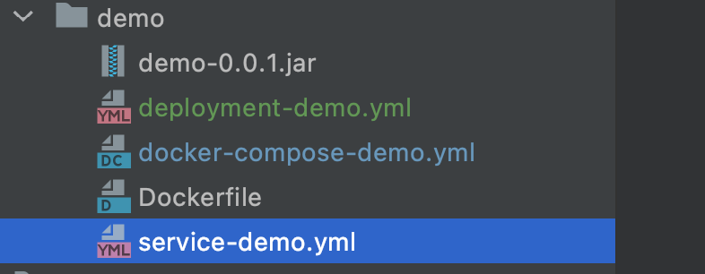

### 1. 创建微服务应用的docker镜像

```bash
# 这里需要注意后面的 . 代表的是Dockerfile文件
docker build -t demo:0.0.1 .
```


### 2. 编写deployment文件

deployment-demo.yml

```yaml
apiVersion: apps/v1
kind: Deployment
metadata:
  creationTimestamp: null
  labels:
    app: demo
  name: demo  #修改deployment的名称
spec:
  replicas: 2  #修改pod副本为两个
  selector:
    matchLabels:
      app: demo
  strategy: {}
  template:
    metadata:
      creationTimestamp: null
      labels:
        app: demo
    spec:
      containers:
        - image: demo:0.0.1
          name: demo
          resources: {}
status: {}

```


### 3. 编写service文件

service-demo.yml

```yaml
apiVersion: v1
kind: Service
metadata:
  creationTimestamp: null
  labels:
    app: demo
  name: demo #修改service名称
spec:
  ports:
    - port: 8082  #service的虚拟ip对应的端口，在集群内网机器可以访问用service的虚拟ip加该端口号访问服务
      nodePort: 8082  #service在宿主机上映射的外网访问端口，端口范围必须在30000-32767之间
      protocol: TCP
      targetPort: 8082  #pod暴露的端口，一般与pod内部容器暴露的端口一致
  selector:
    app: demo
  type: NodePort
status:
  loadBalancer: {}
```


