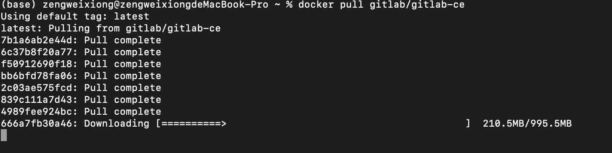

# 1. gitlab 安装

## 查看

```shell
# 搜索 gitlab-ce
$ docker search gitlab/gitlab-ce
```


## 安装

```shell
$ docker pull gitlab/gitlab-ce:latest
```




# 2. 启动

```shell
$ docker run -d  -p 443:443 -p 80:80 -p 222:22 --name gitlab --restart always -v /Users/zengweixiong/work/server/gitlab/config:/etc/gitlab -v /Users/zengweixiong/work/server/gitlab/log:/var/log/gitlab -v /Users/zengweixiong/work/server/gitlab/data:/var/opt/gitlab gitlab/gitlab-ce

# -d：后台运行
# -p：将容器内部端口向外映射
# --name：命名容器名称
# -v：将容器内数据文件夹或者日志、配置等文件夹挂载到宿主机指定目录
```


# 3. 修改配置


```shell
# 配置http协议所使用的访问地址,不加端口号默认为80
external_url 'http://127.0.0.1'

# 配置ssh协议所使用的访问地址和端口
gitlab_rails['gitlab_ssh_host'] = '127.0.0.1'
gitlab_rails['gitlab_shell_ssh_port'] = 222 # 此端口是run时22端口映射的222端口
```


