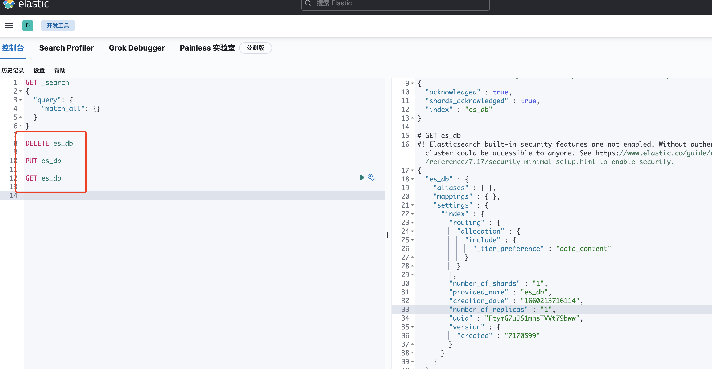

# Kibana 安装成功


## 打开开发工具





## 开始使用


## 安装分词器

### ICU 分词器analysis-icu

```shell
#查看已安装插件
bin/elasticsearch‐plugin list
#安装插件
bin/elasticsearch‐plugin install analysis‐icu 5 
#删除插件
bin/elasticsearch‐plugin remove analysis‐icu
```


### IK 分词器 elasticsearch-analysis-ik

https://github.com/medcl/elasticsearch-analysis-ik


