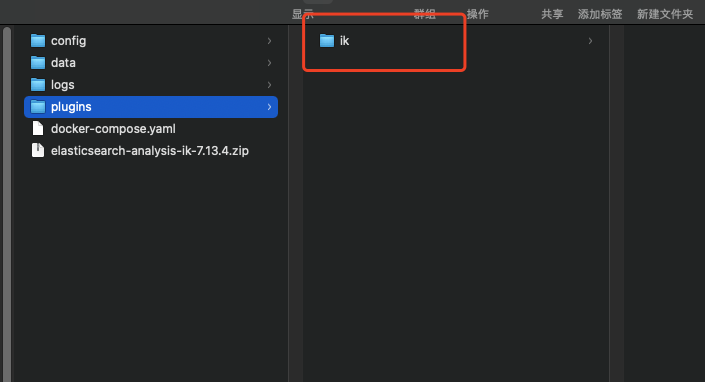

# IK 分词器


## 安装

https://github.com/infinilabs/analysis-ik


下载对应的releases版本


下载后解压到ES安装目录的 plugins 目录下，文件名称改为 IK




重启ES


报错：需要删除 .DS_Store 文件，必须保持 plugins 目录干净

```java
Exception in thread "main" java.nio.file.NotDirectoryException: /usr/share/elasticsearch/plugins/.DS_Store
        at java.base/sun.nio.fs.UnixFileSystemProvider.newDirectoryStream(UnixFileSystemProvider.java:438)
        at java.base/java.nio.file.Files.newDirectoryStream(Files.java:476)
        at java.base/java.nio.file.Files.list(Files.java:3765)
        at org.elasticsearch.tools.launchers.BootstrapJvmOptions.getPluginInfo(BootstrapJvmOptions.java:49)
        at org.elasticsearch.tools.launchers.BootstrapJvmOptions.bootstrapJvmOptions(BootstrapJvmOptions.java:34)
        at org.elasticsearch.tools.launchers.JvmOptionsParser.jvmOptions(JvmOptionsParser.java:137)
        at org.elasticsearch.tools.launchers.JvmOptionsParser.main(JvmOptionsParser.java:86)
```


## 使用

**ik_smart** 最粗粒度的拆分

**ik_max_word** 最细粒度的拆分


