### 1. 创建分支

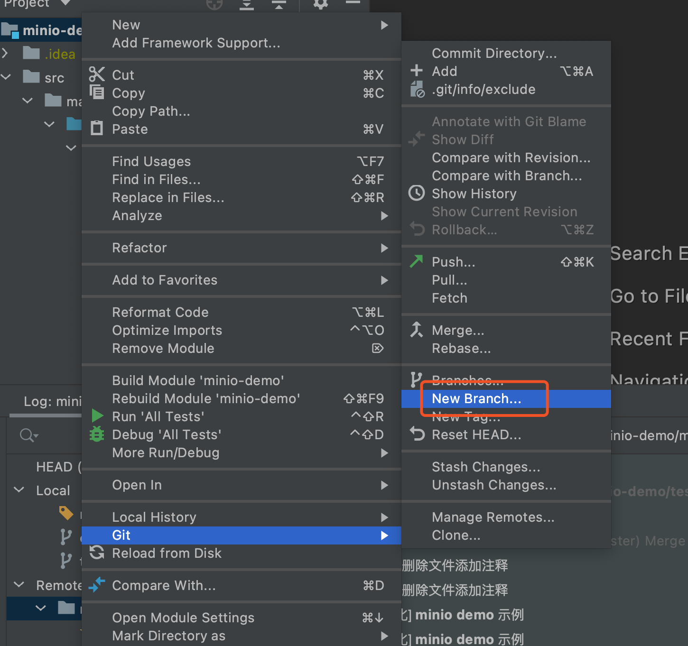

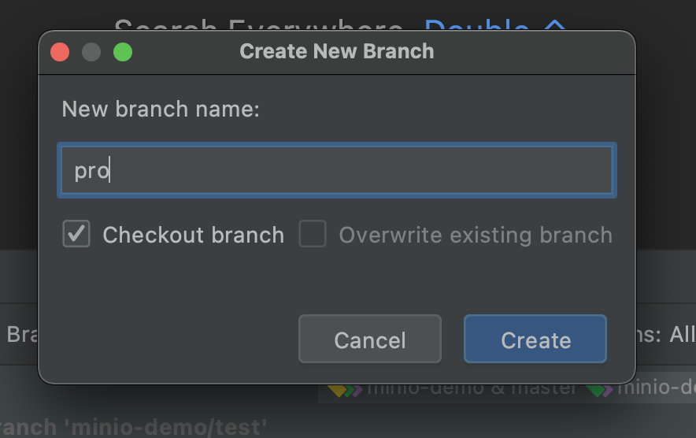

### 2. push 分支到远程仓库

### 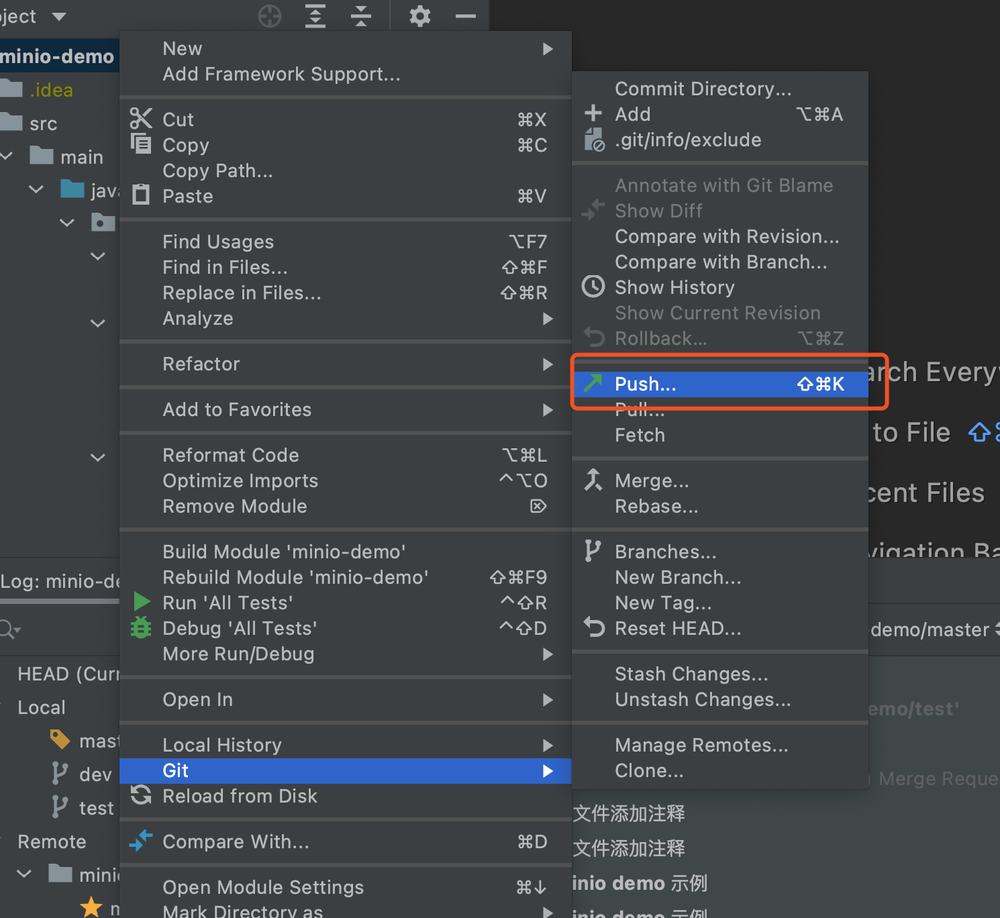

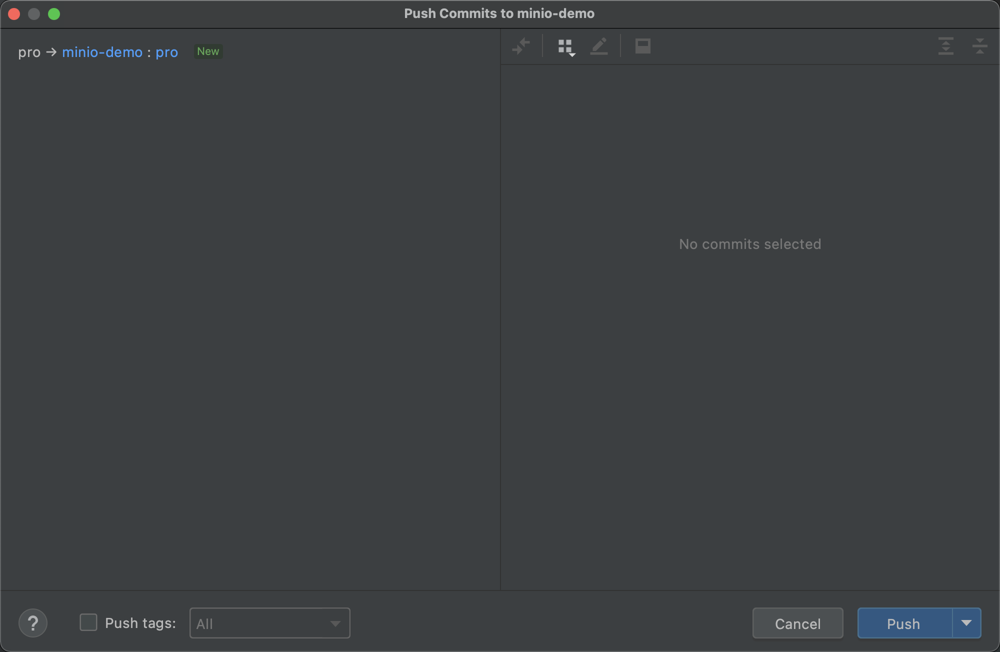

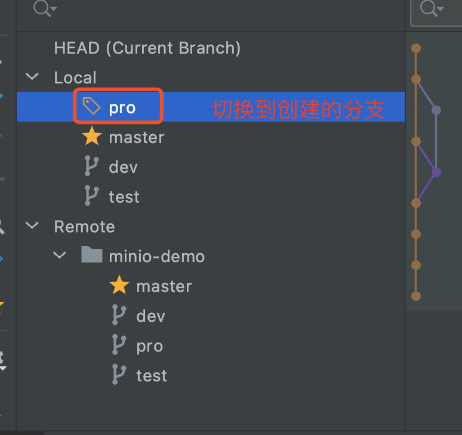

### 3. 新分支添加新文件

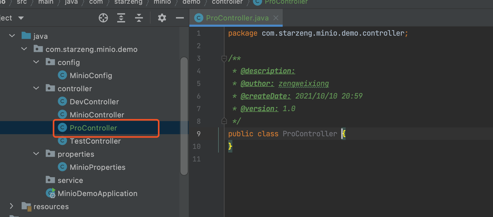

新内容提交并push到远程仓库

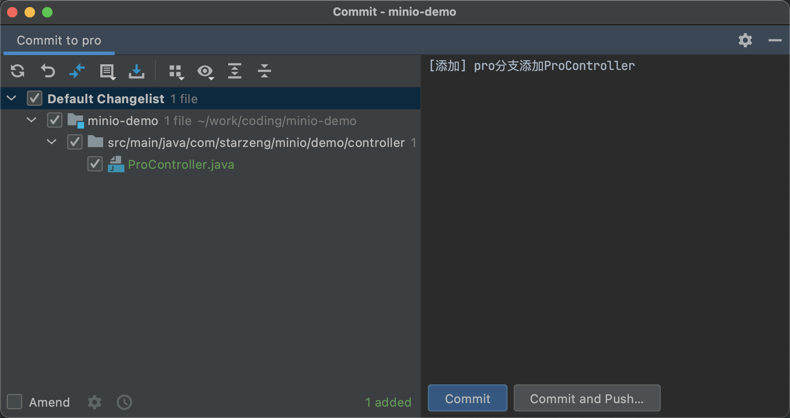

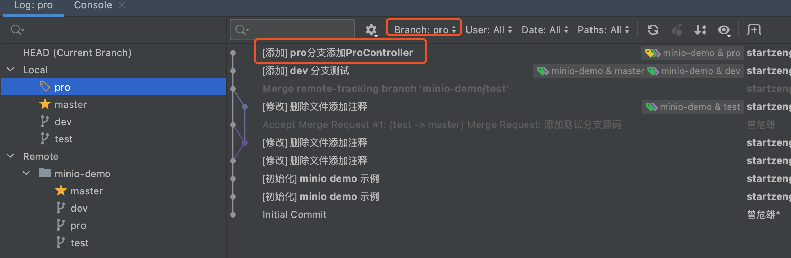

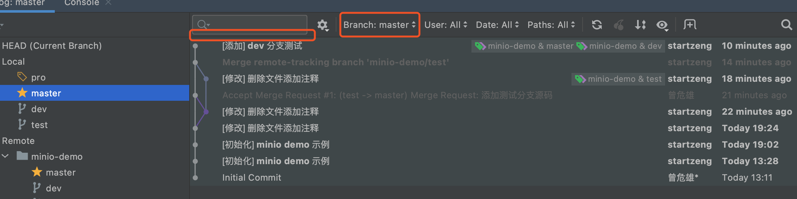

### 4. 合并分支pro到master分支

#### 1) 先切换到master分支

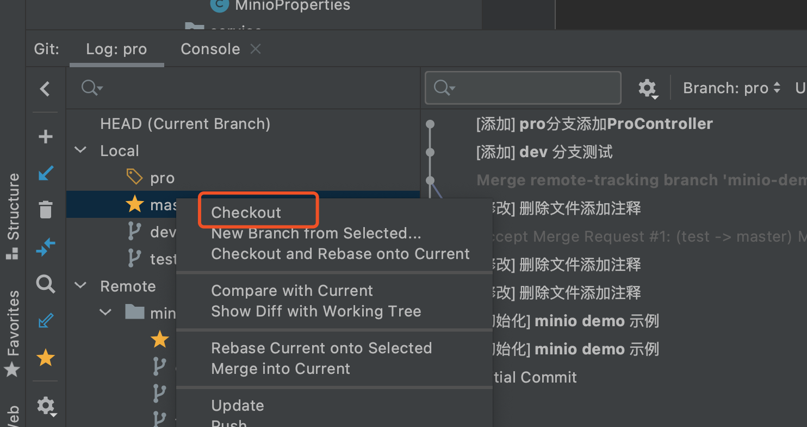

#### 2) 合并pro分支到master分支

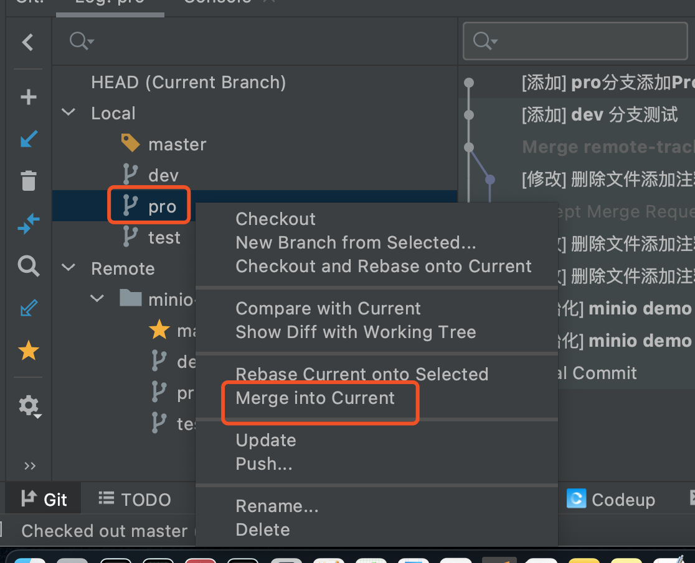

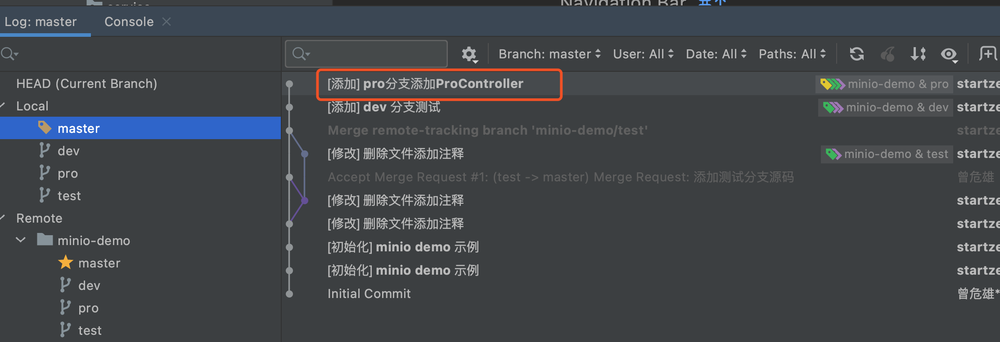

#### 3) push到远程仓库master分支

### 5. 合并master分支到dev分支

#### 1) 切换dev分支

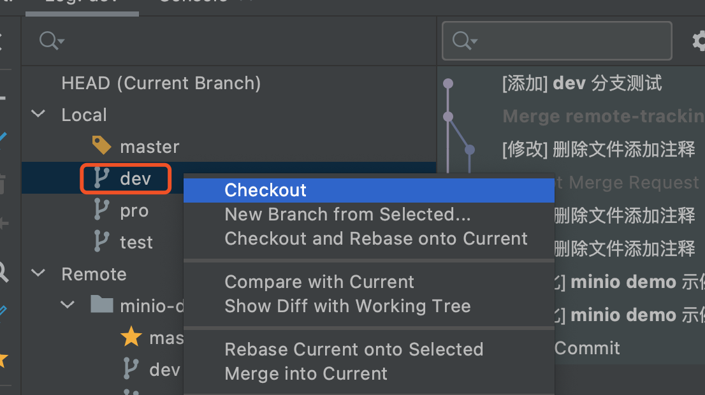

#### 2) 合并mater分支到dev分支

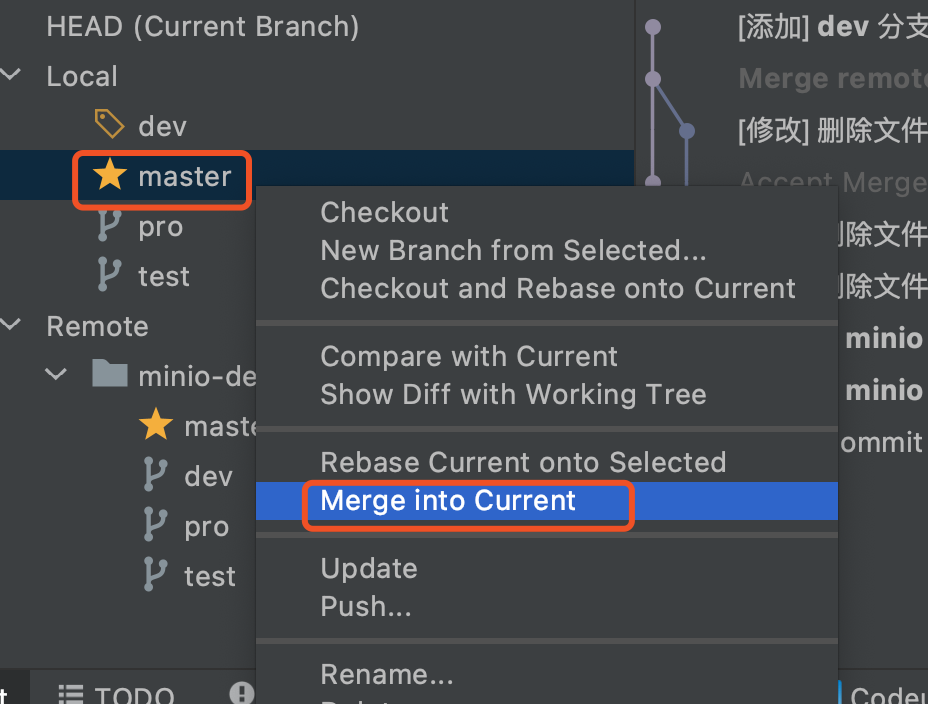

#### 3) push到远程仓库dev分支

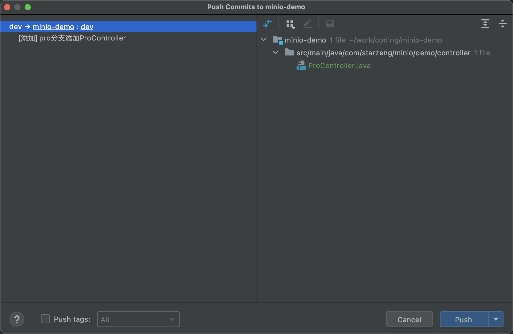

### 6. 注意

**分支相互合并, 注意冲突时以谁的版本为主**

