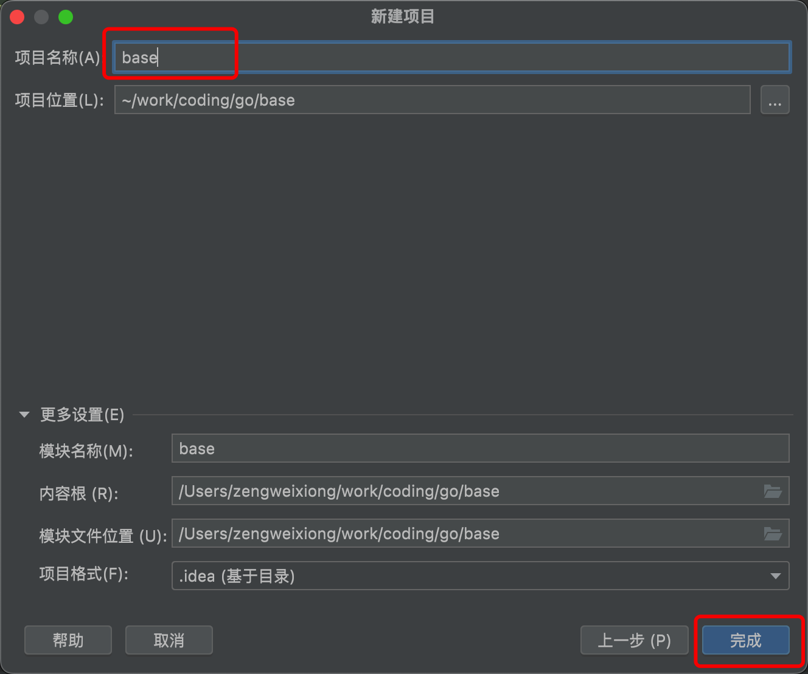

## IDEA创建Golang项目

### 一、安装

1. 安装 Go 环境：https://go.dev/dl/
    go env 设置好 GOROOT / GOPATH（可在 IDEA 设置里自动识别）
    使用 Go Modules（推荐）

2. 插件搜索 Go，选择由 JetBrains 发布的插件（图标是蓝色“G”）

  安装完成后重启


### 二、IDEA创建GO项目

#### 创建一个名称为base的go项目




#### 第一个go示例：Hello World！


#### 一个标准的示例


#### 属性名 / 方法名首字母大写的意义

这是 **Go 语言的语法规则之一**，它控制 **可见性（访问权限）**：

| 名称首字母 | 是否可被外部包访问 |
| ---------- | ------------------ |
| 大写       | ✅ 可以访问（导出） |
| 小写       | ❌ 仅包内可见       |


#### Go Modules（类似 Maven）

```go
go mod init myapp           # 初始化模块
go build / go run / go tidy # 构建、运行、整理依赖
```


#### 关键词速记

| 概念     | Go 关键写法                     |
| -------- | ------------------------------- |
| 包       | `package main / model / ...`    |
| 导入     | `import "fmt"`                  |
| 函数     | `func add(a int) int`           |
| 方法     | `func (p Person) Info() string` |
| 结构体   | `type Person struct {...}`      |
| 控制结构 | `if`、`for`、`switch`           |
| 错误处理 | `if err != nil`                 |
| 模块管理 | `go.mod`、`go tidy`             |
| 并发     | `go func()`、`chan`             |


#### main练习代码

```go
package main

import (
	"fmt"
	"starzeng.com/base/constant"
	"starzeng.com/base/greet"
	"starzeng.com/base/model"
	"starzeng.com/base/utils"
)

func main() {
	p := model.Person{
		Name: "StarryZeng",
		Age:  34,
		Sex:  1,
	}

	info := p.Info()
	fmt.Println(info)

	sex := model.GetSex(0)
	fmt.Println(sex)

	greet.Say(p.Name)

	sum := utils.Add(1, 2)
	fmt.Printf("和为: %d\n", sum)

	for i := 0; i < 2; i++ {
		fmt.Println(constant.PREFIX, i)
	}

	ints := []int{1, 2, 3, 4, 5, 6}
	for i, v := range ints {
		fmt.Println(i, v)
	}

	n := 1
	switch n {
	case 1:
		fmt.Println(1)
	case 2:
		fmt.Println(2)
	default:
		fmt.Println("default")
	}

	x, y := swap("X", "Y")
	fmt.Println(x, "---", y)

}

func swap(x, y string) (string, string) {
	return x, y
}

```


