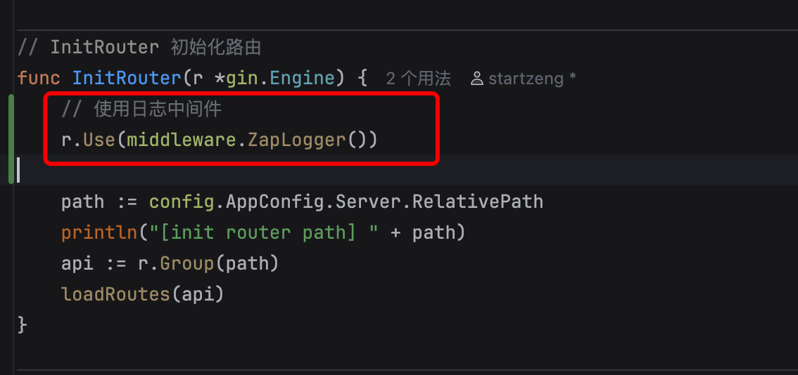

## Go 日志框架 zap

### 安装

go.uber.org/zap

```go
go get go.uber.org/zap

go mod tidy
go mod vendor
```


### 封装 log

logger_zap.go

```go
package logger

import "go.uber.org/zap"

var log *zap.SugaredLogger

func init() {
	production, _ := zap.NewProduction()
	log = production.Sugar()
}

func Debugw(message string) {
	log.Debugw(message)
}

func Infow(message string) {
	log.Infow(message)
}

func Warnw(message string) {
	log.Warnw(message)
}

func Errorw(message string) {
	log.Errorw(message)
}

func Fatalw(message string) {
	log.Fatalw(message)
}

```

### gin 日志中间件使用

zap_logger.go

```go
package middleware

import (
	"github.com/gin-gonic/gin"
	"starzeng.com/gin-demo/pkg/logger"
	"time"
)

func ZapLogger() gin.HandlerFunc {
	return func(c *gin.Context) {
		start := time.Now()
		path := c.Request.URL.Path
		c.Next()
		cost := time.Since(start)
		logger.Infow("HTTP Request",
			"method", c.Request.Method,
			"path", path,
			"status", c.Writer.Status(),
			"latency", cost.String(),
			"ip", c.ClientIP(),
		)
	}
}
```

使用




### trace

API -> Redis -> MySql 的日志记录


