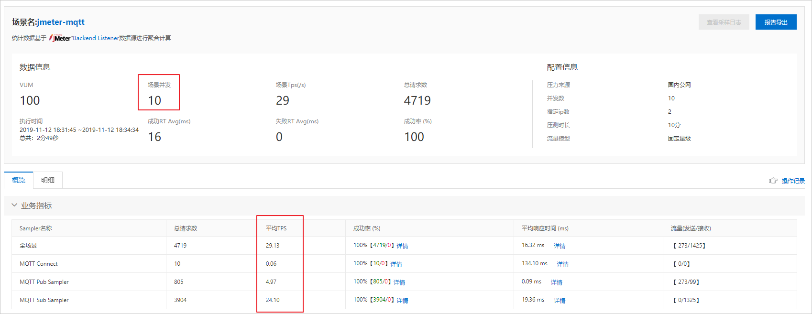

# JMeter压测MQTT服务

如果需要压测MQTT服务，则需使用MQTT插件和JMeter生成JMeter脚本，再将脚本上传到PTS控制台进行压测。本文介绍如何使用JMeter压测MQTT服务。

## 前提条件

- 已部署可在公网访问的MQTT服务。
- 已安装[JMeter 5.x版本](https://jmeter.apache.org/download_jmeter.cgi)。

## 背景信息

[MQTT](http://mqtt.org/)是专为移动互联网（Mobile Internet）、物联网（IoT）设计的超轻量级消息协议，用于连接移动端与云服务双向通信，广泛应用于各种应用领域，如端向云汇报状态、云向端推送消息、端向端发送消息（即时聊天）等场景。

现有使用MQTT发布广播消息，共有5个订阅客户端，每个消息订阅客户端都收到一份消息的场景，本文以此类场景为例介绍如何使用PTS的JMeter模式压测MQTT服务。

## 步骤一：安装MQTT插件

1. 下载[mqtt-jmeter](https://github.com/emqx/mqtt-jmeter)插件最新版本JAR包：[mqtt-xmeter-1.0.1-jar-with-dependencies.jar](http://docs-aliyun.cn-hangzhou.oss.aliyun-inc.com/assets/attach/143479/cn_zh/1573570926962/mqtt-xmeter-1.0.1-jar-with-dependencies.jar)。

2. 拷贝插件JAR包到JMeter安装目录的`lib/ext/`子目录下。

   ```
   cp mqtt-xmeter-1.0.1-jar-with-dependencies.jar "${JMETER_HOME:?}"/lib/ext/
   ```

## 步骤二：准备客户端信息CSV文件

每个MQTT客户端需要提供以下信息：

- 用户名和密码。

  为保证安全，MQTT服务器通常需要认证，最常用的认证方式即用户名和密码认证。

- 客户端ID（ClientId）。

  客户端ID是全局唯一ID，客户端唯一标识，通常与用户设备关联。如关联手机序列号，则可通过客户端ID变化检测用户是否更换了新手机。每个用户可能有一个或多个客户端ID。

客户端信息CSV文件应包含UserName、Password、ClientId这3列数据。例如期望压测10000台客户端设备同时在线的场景，则需要准备10000条客户端信息。

如客户端信息示例CSV文件`client.csv`内容如下：

```
UserName,Password,ClientId
pts_test,pts-pass1,client-test0001
pts_test,pts-pass1,client-test0002
pts_test,pts-pass1,client-test0003
```

**说明**

- 做压测时建议使用测试用户数据，避免泄露真实用户信息，避免真实用户产生脏数据。
- 使用预先准备的测试客户端ID方便服务器做客户端ID校验，同时方便跟踪排查问题。
- 手动编辑CSV文件很容易出错，推荐使用EXECL、Numbers等软件导出，或使用[Apache commons-csv](https://maven.aliyun.com/repository/central/org/apache/commons/commons-csv/1.7/commons-csv-1.7.jar)程序生成。

## 步骤三： 本地编辑JMeter脚本

本文以JMeter 5.x英文图形界面为例。

1. 读取客户端CSV数据文件。

   1. 打开JMeter，并新建脚本。

   2. 在JMeter左侧文件目录中右键单击**Test Plan**，选择***\*Add\** > \**Threads (Users)\** > \**Thread Group\****。

   3. 在JMeter左侧文件目录中右键单击**Test Plan**，选择***\*Add\** > \**Listener\** > \**View Results Tree\****，添加View Results Tree监听器，方便本地调试测试脚本。

   4. 在**Test Plan**区域右键单击**Thread Group**，选择***\*Add\** > \**Logic Controller\** > \**Once Only Controller\****。JMeter中一个线程模拟一个MQTT客户端设备，使用Once Only Controller保证一个线程仅读取一次客户端CSV数据文件，绑定一条客户端信息。

   5. 在

      Test Plan

      区域右键单击

      Once Only Controller

      ， 选择

      **Add** > **Config Element** > **CSV Data Set Config**

      。并在

      CSV Data Set Config

      对话框中配置以下信息。

      

      - Filename

        ：客户端信息CSV文件名

        ```
        client.csv
        ```

        。

        **说明** 只输入文件名`client.csv`，不要包含文件路径，以实现文件最大的通用性。将`client.csv`文件保存到JMeter进程启动目录以保证能够被读取到。

      - **File encoding**：CSV文件编码格式，本示例使用`UTF-8`。

      - **Recycle on EOF**：是否循环读取文件。本示例中选择`False`，一条客户端信息只能被读取使用一次（与一个线程绑定），不允许循环读文件。

2. 建立MQTT连接。

   同样使用**Once Only Controller**控制一个客户端（对应一个线程）只需执行一次建连操作。

   1. 在**Test Plan**区域右键单击**Once Only Controller**，选择***\*Add\** > \**Sampler\** > \**MQTT Connect\****。

   2. 在

      MQTT Connect

      对话框中配置以下信息。

      

      | 配置                               | 参数                                                         | 说明                                                     |
      | :--------------------------------- | :----------------------------------------------------------- | :------------------------------------------------------- |
      | MQTT连接配置                       | **Server name or IP**                                        | MQTT服务器公网地址。客户端设备通常使用公网访问MQTT服务。 |
      | **Port number**                    | MQTT服务器端口。例如`1883`，即使用标准TCP端口。              |                                                          |
      | **MQTT version**                   | MQTT版本。例如`3.1.1`，目前主流MQTT服务器都支持3.1.1版本。   |                                                          |
      | **Timeout(s)**                     | 超时秒数填写，即客户端建立连接、发送消息等相关操作的超时时间。例如`10`。 |                                                          |
      | **Protocols**                      | 连接协议。选择`TCP`，即使用标准TCP连接协议。                 |                                                          |
      | MQTT客户端配置                     | **User name**                                                | 从CSV文件读取**userName**字段。填写`${userName}`。       |
      | **Password**                       | 从CSV文件读取**Password**字段。填写`${password}`。           |                                                          |
      | **ClientId**                       | 从CSV文件读取ClientId字段。填写`${clientId}`。               |                                                          |
      | **Add random suffix for ClientId** | 是否添加后缀。本例使用预先准备好的固定客户端ID，不要添加后缀，则取消勾选。 |                                                          |
      | **Keep alive(s)**                  | 活动心跳间隔秒数。例如`300`，即连接空闲时，每5分钟发送一次活动心跳。 |                                                          |

3. 配置发布消息。

   1. 在**Test Plan**区域右键单击**Thread Group**，选择***\*Add\** > \**Sampler\** > \**MQTT Pub Sampler\****

   2. 在

      MQTT Pub Sampler

      对话框中配置以下信息。

      

      - **QoS Level**：客户端向服务器发布消息的服务质量。本示例中选择`0`，即只发送一次，丢失不重发，可按需选择其他级别。
      - **Topic name**：消息topic。MQTT topic支持层次结构，使用正斜线（/）分割，类似文件路径，如`pts_test/jmeter`等。
      - **Add timestamp in payload**：是否添加消息头添加发送时间戳。一般选中此项，方便测试时检查消息延迟。
      - **Payloads**：消息体。本示例中填写`Aliyun PTS From ${clientId}`，即在消息体中添加客户端ID，方便测试和调试检查。

4. 订阅接收消息。

   1. 在**Test Plan**区域右键单击**Thread Group**，选择***\*Add\** > \**Sampler\** > \**MQTT Sub Sampler\****。

   2. 在

      MQTT Sub Sampler

      对话框中配置以下信息。

      

      - **QoS Level**：服务器向客户端推送消息的服务质量。本示例选择`0`，即只发送一次，丢失不重发，可按需选择其他级别。
      - **Topic name**：消息topic。应与发布消息的topic匹配，如本例中为`pts_test`。
      - **Payload includes timestamp**：是否在接收消息后从消息头解析发送时间。一般选中此项，可计算出消息延迟，即从发布端、途经服务器、最后到达订阅端花费的总时间。
      - **Sample on**： 选择**specified elapsed time (ms)**，值填写`1000`，表示持续接收消息1000毫秒。这段时间内，可能一条消息都接收不到，也可能接收到多条消息。
      - **Debug response**：一般选中此项，用于记录接收到的消息内容，方便调试排查问题。正式执行性能测试时可取消该选项以优化性能和减少内存占用。

   3. 在**Test Plan**区域单击**Thread Group**，配置**Loop Count**为`3`（循环执行3次）。

   4. 在JMeter页面左上角单击保存图标，然后执行脚本。

      在View Results Tree页面，查看脚本执行结果。

      

      查看脚本执行结果：

      

5. 添加消息订阅线程组。

   当前脚本配置下，执行一次消息订阅可能未收到消息但仍记录为1次结果，可能收到多个消息但不能拆分记录消息延迟，导致压测统计数据不准确。

   为了解决此问题，**MQTT Sub Sampler**支持另一种工作模式：每收到一条消息产生一个有效的执行结果，这样将更合理。但这种模式下，没有收到消息时线程将一直阻塞，为了避免阻塞整个线程，应将订阅消息拆分到不同的线程组。发布消息线程组移除订阅操作后，应添加等待时间避免单个客户端发布消息过快。实际场景通常是客户端数量多，但每个客户端的消息量少。

   1. 在**Test Plan**区域右键单击**MQTT Pub Sampler**，选择***\*Add\** > \**Timer\** > \**Constant Timer\****，设置延时1000毫秒，即每次发布消息后等待1秒。

   2. 新建消息订阅线程组，从消息发布线程组复制读取CSV和MQTT连接配置，共享CSV文件。

      此时一个客户端（对应一条CSV记录）要么用于发布消息，要么用于订阅消息，不能两者同时使用。

   3. 在新消息订阅线程组下的单击**MQTT Sub Sampler**，然后在**MQTT Sub Sampler**对话框中配置**Sample on**为**number of received messages**，值设为`1`，即每收到一条消息产生一条执行结果。

   4. 执行脚本。

      测试执行脚本结果如下：

      

## 步骤四：使用PTS压测MQTT消息

在PTS控制台使用[JMeter压测场景](https://pts.aliyun.com/platinum/index.htm?spm=a2c4g.11186623.2.33.6cae5e84qGAqjP#/Jmtertest)，上传mqtt-jmeter插件JAR包、JMeter脚本和客户端信息CSV文件。详情请参见[JMeter压测](https://help.aliyun.com/document_detail/91788.htm#multiTask4485)。


## 压测结果分析

开始压测后，压测过程中可看到实时并发数（发布消息客户端和订阅消息客户端总数），TPS和RT（消息延迟）等统计信息。



本示例中发布消息为广播，每个消息订阅客户端都收到一份消息，总共有5个订阅客户端，因此可看到接收消息数约是发布消息数的5倍。压测结束后将生成压测报告，可查看场景并发、TPS、响应时间等变化趋势图和统计数据汇总等信息。如果出现错误，还可以结合请求采样日志和JMeter日志等进行排查。


## 常见问题

发布消息包含中文字符时，为什么查看接收到的消息包含乱码？

由于MQTT消息体为二进制数据，发布消息时字符串使用系统编码（UTF-8或GBK）转为二进制，接收消息时默认使用ISO-8859-1将二进制转为字符串，两边编码不一致导致乱码现象。