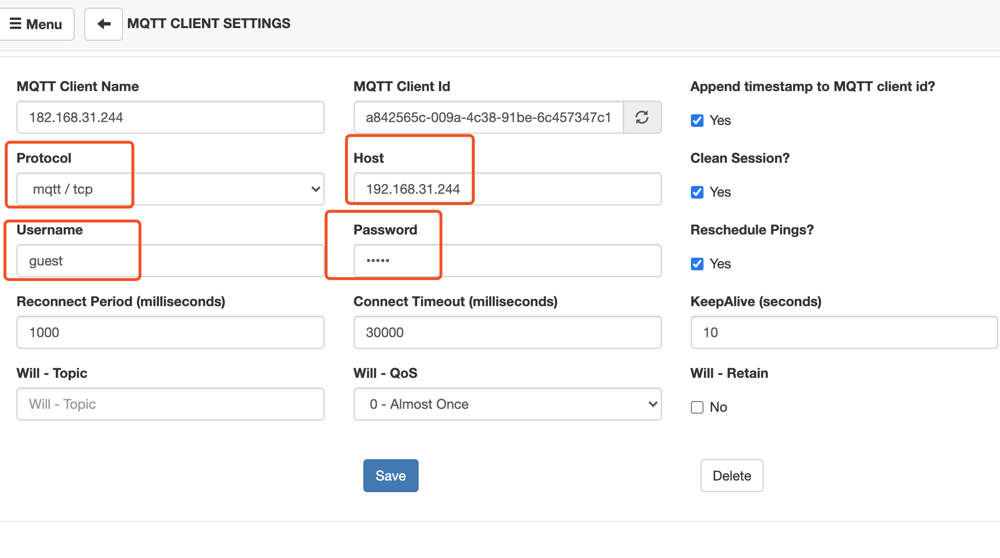
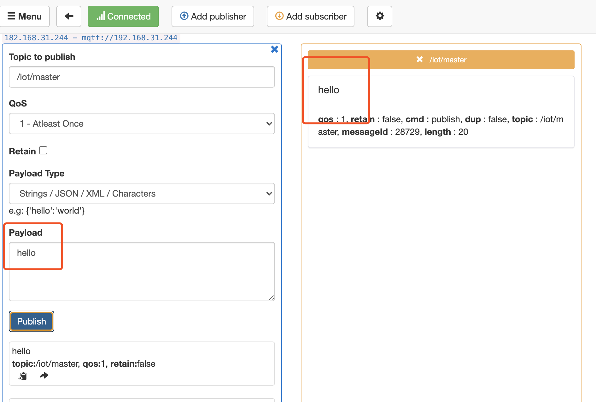
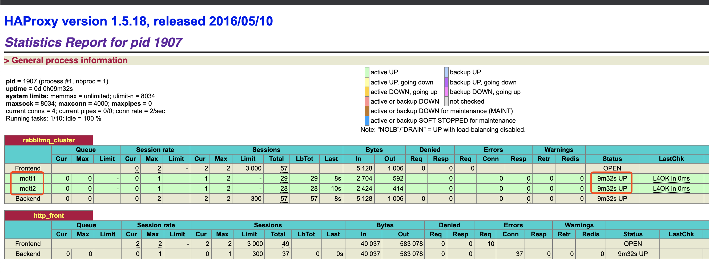

### 一. 准备3台至少2核4G的centos7主机

全部修改hostname

```bash
# RabbitMQ 集群下 mqtt1主节点 mqtt2子节点
# mqtt1 192.168.31.244
# mqtt2 192.168.31.104
hostnamectl set-hostname mqtt1
hostnamectl set-hostname mqtt2

# HAProxy 192.168.
# haproxy 31.254
hostnamectl set-hostname haproxy
```

安装好docker，docker-compose


### 二. 单机docker安装开启MQTT插件

#### 1. docker安装

在centos7创建目录 server

```bash
sudo mkdir server
```

在目录下创建 docker-compose-rabbitmq.yaml 文件

```bash
###################################################
# rabbitmq:3.8-management
###################################################
version: '3.8'
services:
  rabbitmq:
    image: rabbitmq:3.8-management
    container_name: rabbitmq
    volumes:
      - /server/rabbitmq/data:/var/lib/rabbitmq #数据文件挂载
      - /server/rabbitmq/log:/var/log/rabbitmq #日志文件挂载
    ports:
      - 5672:5672
      - 15672:15672
      - 15675:15675
      - 1883:1883 # mqtt监听端口，不要写错了
```

然后执行命令

```bash
docker-compose -f docker-compose-rabbitmq.yaml up -d
```

查看RabbitMQ容器是否启动

```bash
docker ps -a
```


#### 2. 开启MQTT插件

进入容器

```bash
docker exec -it rabbitmq bash
```

执行命令开启mqtt插件

```bash
rabbitmq-plugins enable rabbitmq_mqtt	
```

查看是否开启

```bash
rabbitmq-plugins list
```


#### 3. 用 MQTTBox 测试 MQTT 



**链接失败，请检查防火墙是否关闭或者开放端口**


```bash
# 永久关闭防火墙
systemctl status firewalld
systemctl stop firewalld
systemctl disable firewalld

# 永久关闭SELINUX
/usr/sbin/sestatus -v
sed -i s#SELINUX=enforcing#SELINUX=disabled# /etc/selinux/config

# 重启
systemctl reboot
/usr/sbin/sestatus -v
```

链接成功，开始测试




### 三. 集群搭建

#### 1. centos7 配置

```bash
vim /etc/sysctl.conf
# 端口转发
net.ipv4.ip_forward = 1  

# 重启network服务
systemctl restart network && systemctl restart docker

# 查看是否修改成功
sysctl net.ipv4.ip_forward

```


#### 2. 主机搭建（推荐）

主机mqtt1，mqtt2分别安装好rabbitmq，安装参考官网

```bash
# 环境准备, 配置好后记录号mqtt1，mqtt2对应的IP
hostnamectl set-hostname mqtt1
hostnamectl set-hostname mqtt2
```

mqtt1，mqtt2的rabbitmq统一$HOME/.erlang.cookie 值

```bash
# mqtt1服务器
# 将mqtt1中的 .erlang.cookie 同步到 mqtt2 中
scp  /var/lib/rabbitmq/.erlang.cookie  mqtt2的IP:/var/lib/rabbitmq/.erlang.cookie

# mqtt2服务器
# Rabbitmq 集群添加节点
# 重启mqtt2主机的rabbitmq服务，并执行
[root@mqtt2 ~]# rabbitmqctl stop_app
[root@mqtt2 ~]# rabbitmqctl join_cluster --ram rabbit@mqtt1
[root@mqtt2 ~]# rabbitmqctl start_app
[root@mqtt2 ~]# systemctl restart rabbitmq-server.service 

# mqtt1服务器
[root@mqtt1 ~]# rabbitmq-plugins enable rabbitmq_management
# 查看集群信息 
[root@mqtt1 ~]# rabbitmqctl cluster_status
```

访问：http://192.168.31.244:15672/#/

#### 2. docker搭建

第一步：**mqtt1**执行

```bash
docker run -d --hostname mqtt1 \
--add-host="mqtt1":192.168.31.244 \
--add-host="mqtt2":192.168.31.104 \
--name rabbitmq \
--restart=always \
-p "1883:1883" \
-p "4369:4369" \
-p "5672:5672"  \
-p "15672:15672"  \
-p "25672:25672"  \
-v /mqttserver/rabbitmq:/var/lib/rabbitmq \
-e RABBITMQ_DEFAULT_USER=admin \
-e RABBITMQ_DEFAULT_PASS=admin  \
-e RABBITMQ_ERLANG_COOKIE='mqttcookie' \
rabbitmq:3.8-management
```

第二步：**mqtt2**执行

```bash
docker run -d --hostname mqtt2 \
--add-host="mqtt1":192.168.31.244 \
--add-host="mqtt2":192.168.31.104 \
--name rabbitmq \
--restart=always \
-p "1883:1883" \
-p "4369:4369" \
-p "5672:5672"  \
-p "15672:15672"  \
-p "25672:25672"  \
-v /mqttserver/rabbitmq:/var/lib/rabbitmq \
-e RABBITMQ_DEFAULT_USER=admin \
-e RABBITMQ_DEFAULT_PASS=admin  \
-e RABBITMQ_ERLANG_COOKIE='mqttcookie' \
rabbitmq:3.8-management
```

第三步：**mqtt1**执行

```bash
# 进入rabbitmq容器
docker exec -it rabbitmq bash

# 停止MQ服务
rabbitmqctl stop_app 
# 重置MQ
rabbitmqctl reset
# 启动MQ服务
rabbitmqctl start_app
# 查看用户
rabbitmqctl list_users
# 设置管理员
rabbitmqctl set_user_tags admin administrator
# 设置权限
rabbitmqctl set_permissions -p "/" admin ".*" ".*" ".*"
# 退出容器
exit

#重启rabbitmq容器
docker restart rabbitmq
```

第四步：**mqtt2**执行，

```bash
# 进入rabbitmq容器
docker exec -it rabbitmq bash

[root@mqtt2 ~]# rabbitmqctl stop_app
# 添加到主节点mqtt1中
[root@mqtt2 ~]# rabbitmqctl join_cluster --ram rabbit@mqtt1
[root@mqtt2 ~]# rabbitmqctl start_app
[root@mqtt2 ~]# rabbitmqctl cluster_status
```

访问：http://192.168.31.244:15672/#/


#### 3. // TODO docker-compose搭建

```bash
```


### 四. 集成 HAProxy 负载均衡

#### 1. 安装HAProxy

```bash
yum search haproxy --showduplicates | sort -r
yum install -y haproxy-1.5.18-9.el7.x86_64
yum list installed|grep haproxy
systemctl start haproxy
systemctl status
systemctl stop haproxy
```

#### 2. 替换配置：

```bash
cd /etc/haproxy/haproxy.cfg
mv haproxy.cfg haproxy.cfg.back
vim /etc/haproxy/haproxy.cfg
```

haproxy.cfg替换内容

```bash
#---------------------------------------------------------------------
# Example configuration for a possible web application.  See the
# full configuration options online.
#
#   http://haproxy.1wt.eu/download/1.4/doc/configuration.txt
#
#---------------------------------------------------------------------

#---------------------------------------------------------------------
# Global settings
#---------------------------------------------------------------------
global
    # to have these messages end up in /var/log/haproxy.log you will
    # need to:
    #
    # 1) configure syslog to accept network log events.  This is done
    #    by adding the '-r' option to the SYSLOGD_OPTIONS in
    #    /etc/sysconfig/syslog
    #
    # 2) configure local2 events to go to the /var/log/haproxy.log
    #   file. A line like the following can be added to
    #   /etc/sysconfig/syslog
    #
    #    local2.*                       /var/log/haproxy.log
    #
    log         127.0.0.1 local2

    chroot      /var/lib/haproxy
    pidfile     /var/run/haproxy.pid
    maxconn     4000
    user        haproxy
    group       haproxy
    daemon

    # turn on stats unix socket
    stats socket /var/lib/haproxy/stats

#---------------------------------------------------------------------
# common defaults that all the 'listen' and 'backend' sections will
# use if not designated in their block
#---------------------------------------------------------------------
defaults
    mode                    http
    log                     global
    option                  httplog
    option                  dontlognull
    option http-server-close
    option forwardfor       except 127.0.0.0/8
    option                  redispatch
    retries                 3
    timeout http-request    10s
    timeout queue           1m
    timeout connect         10s
    timeout client          1m
    timeout server          1m
    timeout http-keep-alive 10s
    timeout check           10s
    maxconn                 3000


#对MQ集群进行监听
listen rabbitmq_cluster
    bind 0.0.0.0:1883
    option tcplog
    mode tcp 
    option  clitcpka
    timeout connect 1s 
    timeout client  10s
    timeout server  10s
    balance roundrobin
    server mqtt1 192.168.31.244:1883 check  
    server mqtt2 192.168.31.104:1883 check 

#开启haproxy监控服务	
listen http_front
    bind 0.0.0.0:1080
    stats refresh 30s
    stats uri /haproxy_stats
    stats auth admin:admin
```

#### 4. 重新启动

```bash
systemctl start haproxy
systemctl status
```

访问查看：http://192.168.31.254:1080/haproxy_stats




### 备注：建议物理机安装RabbitMQ，Docker容器建议部署Java


