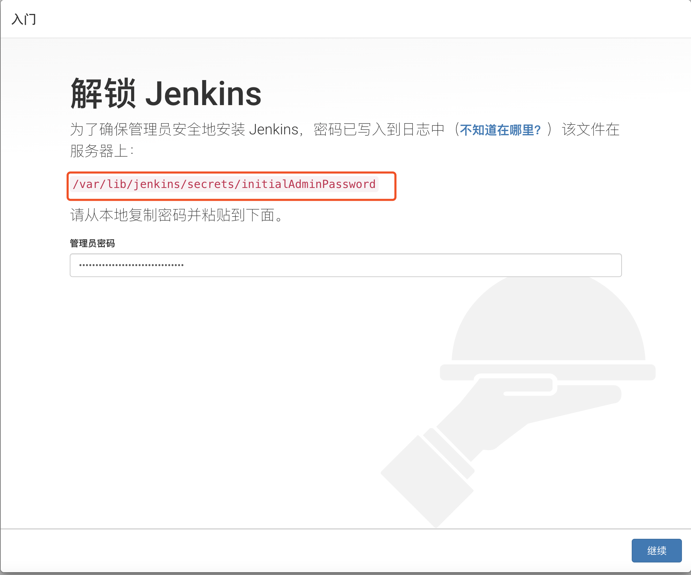
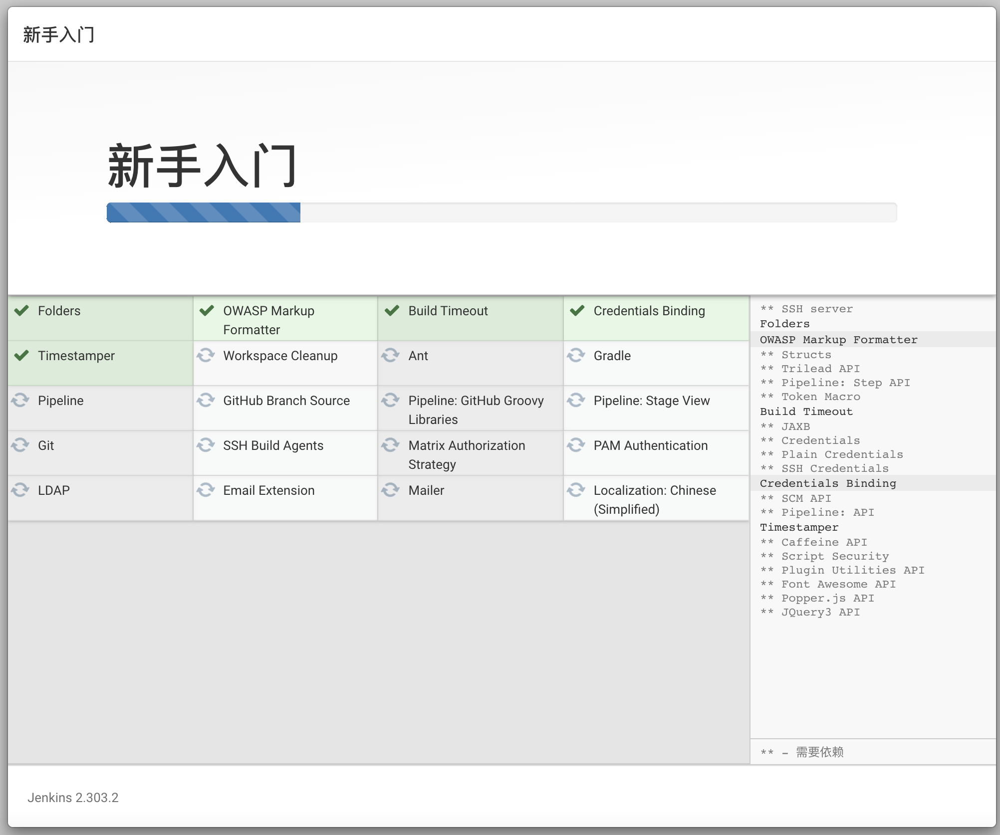
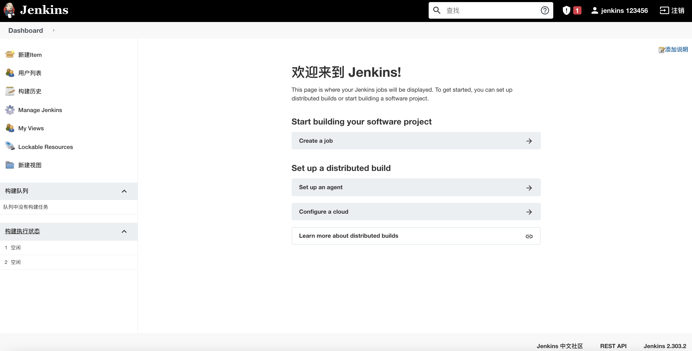
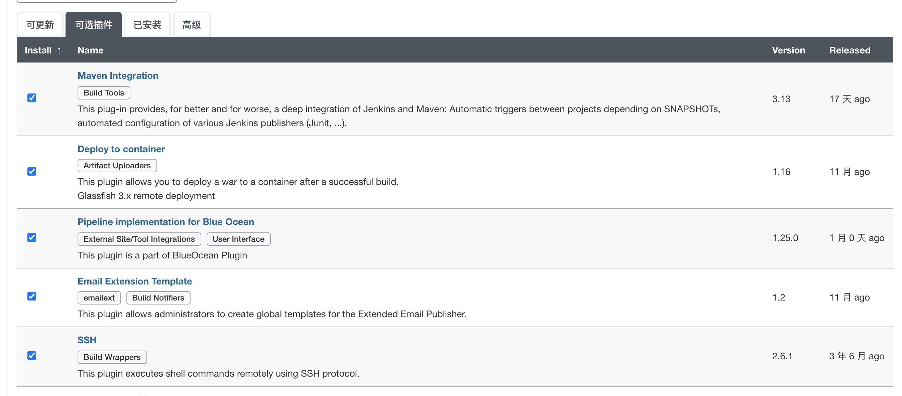
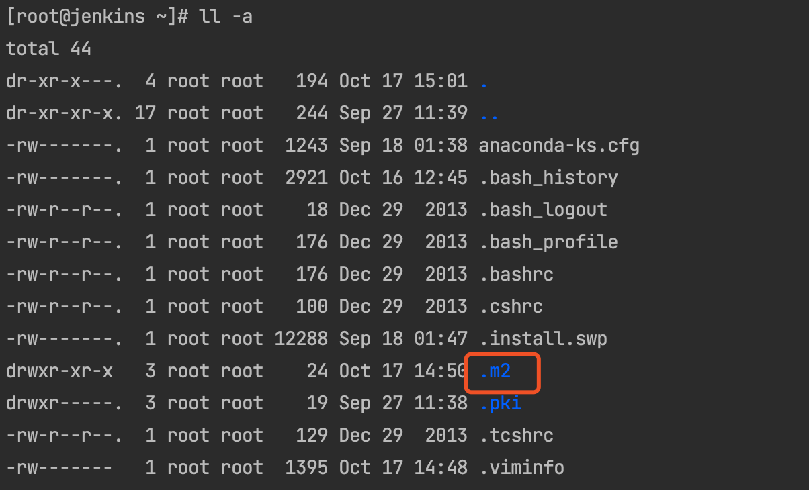

# CentOS7 安装

## 1. 安装 JDK 11 

```bash
yum list installed |grep java  

yum list java  

yum -y remove openjdk-11-jdk* 

yum install -y java-11-openjdk*
```


## 2. 安装 wegt

```bash
yum install -y wget
```


## 3. 安装 Jenkins 长期支持版本

```bash
sudo wget -O /etc/yum.repos.d/jenkins.repo https://pkg.jenkins.io/redhat-stable/jenkins.repo

sudo rpm --import https://pkg.jenkins.io/redhat-stable/jenkins.io.key

sudo yum upgrade

sudo yum install epel-release java-11-openjdk-devel

sudo yum install jenkins

sudo systemctl daemon-reload

```


## 4. Start Jenkins

### 启动命令

```bash
sudo systemctl start jenkins

sudo systemctl status jenkins

# 设置开机启动
sudo systemctl enable jenkins
# 查看是否设置成功
systemctl list-units --type=service | grep jenkins
```


### 打开浏览器

http://192.168.31.58:8080/


### 查看密码

```bash
cat /var/lib/jenkins/secrets/initialAdminPassword
```




### 开始安装插件

默认选择安装***<u>推荐的插件</u>***




### 创建账号


### 一路默认


### 安装完成




## 5. 安装插件




## 6. Centos7 安装 Java Git Maven

### java

```bash
yum install -y java-1.8.0-openjdk*
java -version

# 目录
JAVA_HOME: /usr/lib/jvm/java-1.8.0-openjdk-1.8.0.302.b08-0.el7_9.x86_64
```


### git

```bash
yum list installed|grep git
 
yum install -y git
  
git --version

```

### apache-maven

```bash
# 使用配置工具配置第三方epel源仓库
yum-config-manager --add-repo http://repos.fedorapeople.org/repos/dchen/apache-maven/epel-apache-maven.repo

yum-config-manager --enable epel-apache-maven

yum repolist 

# 安装maven
yum install -y apache-maven

mvn -version

# 上传一个pom.xml文件, 并在改目录下执行以下命令, 生成 .m2
mvn clean

# 目录
Maven home: /usr/share/apache-maven
/etc/maven/settings.xml
~/.m2
 
```




# 谢谢观看!


