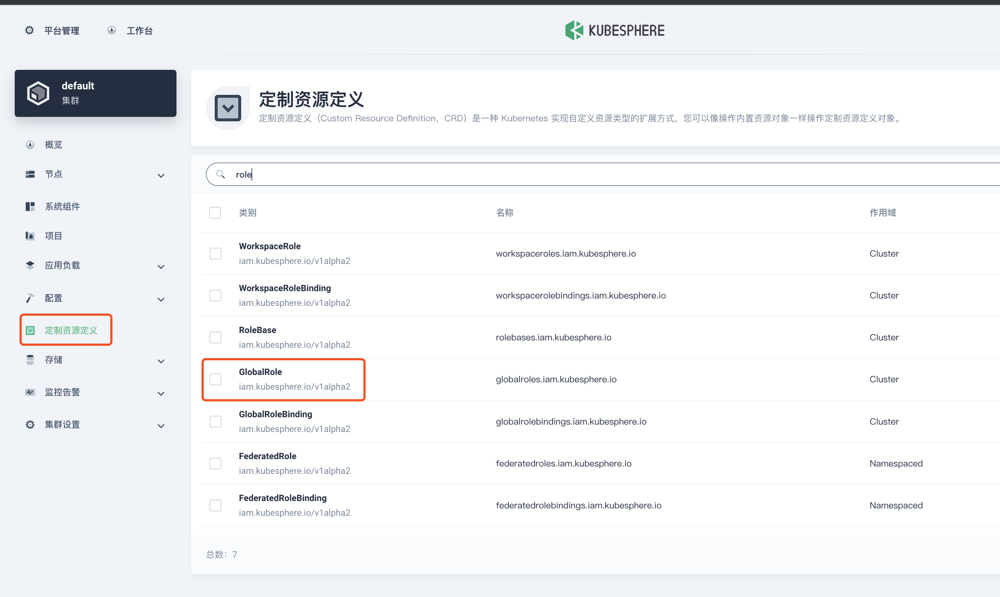
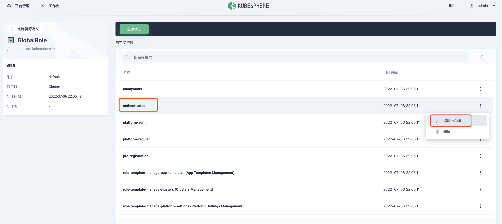
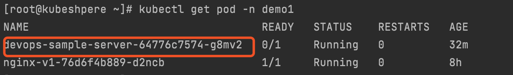
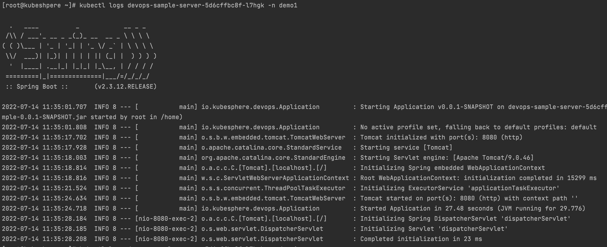
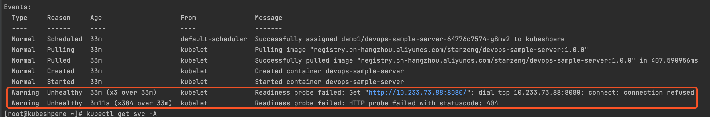
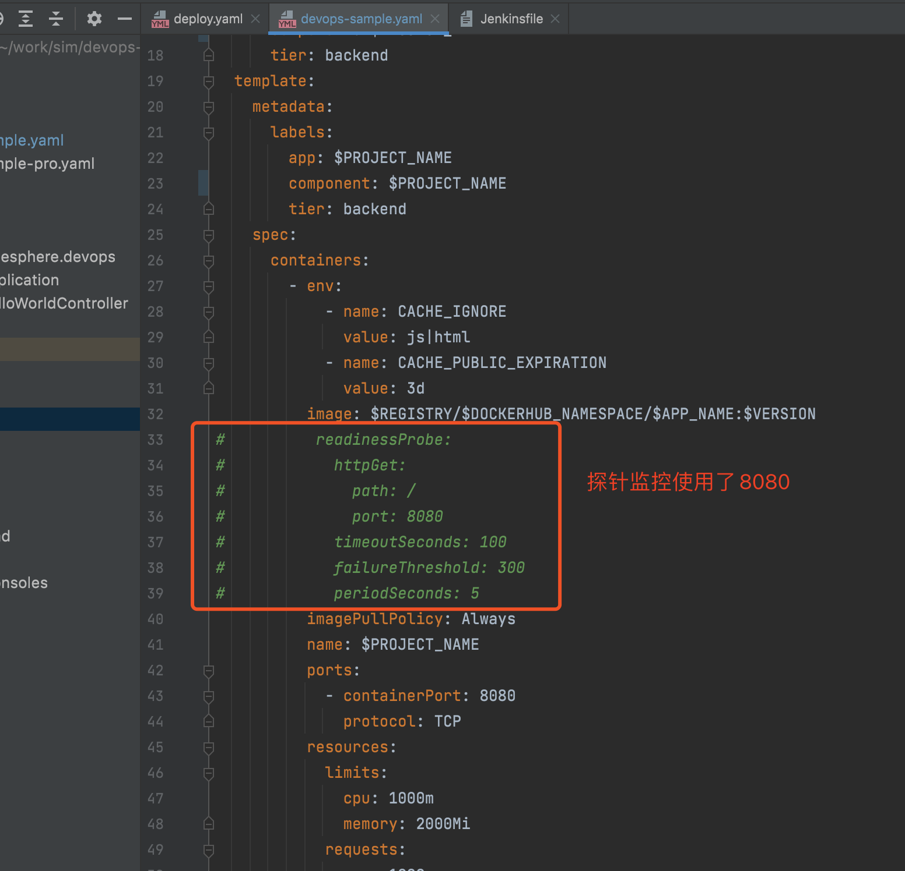

### 部署过程中的几个常见问题

### 1. workspace-manager 角色不能创建 workspace

`workspacetemplates.tenant.kubesphere.io is forbidden: User "ws-manager" cannot create resource "workspacetemplates" in API group "tenant.kubesphere.io" at the cluster scope`

**解决方法：**

登录 ` admin` 账号，定义资源定义 > `GlobalRole` 





在最后面添加 `workspacetemplates.tenant.kubesphere.io`

```yaml
  - apiGroups:
      - tenant.kubesphere.io
    resources:
      - workspacetemplates
    verbs:
      - create
```


### 2. devops 运行失败，devops-jenkins 重启问题解决方案

**clusterconfiguration  >  ks-install 中 devops 配置修改**

```yaml
spec:
  devops:                  
    enabled: true            
    jenkinsMemoryLim: 4Gi      # 原来为 2Gi
    jenkinsMemoryReq: 2500Mi 	 # 原来为 1500Mi
    jenkinsVolumeSize: 40Gi    # 8Gi     
    jenkinsJavaOpts_Xms: 2000m # 1200m 
    jenkinsJavaOpts_Xmx: 2000m # 1600m
    jenkinsJavaOpts_MaxRAM: 4g # 2g
```


### 3. devops 运行成功，最小副本不可用，容器未准备就绪

**查看pod状态**



**执行 ` kubectl logs <pod name> -n <namespace name>`**

```bash
[root@kubeshpere ~]# kubectl logs devops-sample-server-5d6cffbc8f-l7hgk -n demo1
```

**查看pod日志，启动成功**



**查看pod描述**

**执行 ` kubectl describe pod <pod name> -n <namespace name>`**

```bash
[root@kubeshpere ~]# kubectl describe pod devops-sample-server-64776c7574-g8mv2 -n demo1
```



看以上描述：pod启动成功，请求失败，查看部署配置哪里需要请求

探针请求的8080端口已被springboot占用，所以失败，注释就行




### 4. Unable to connect to the server: x509: certificate signed by unknown authority (possibly because of "crypto/rsa: verification error" while trying to verify candidate authority certificate "kubernetes")


