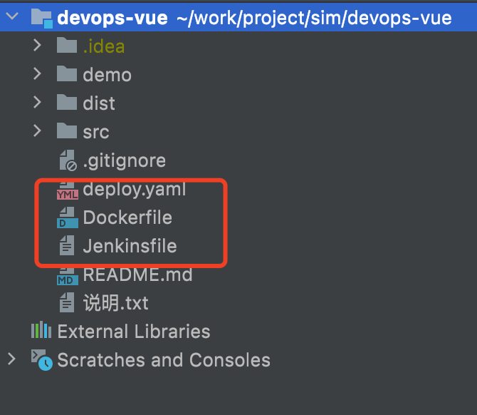

# KubeSphere 部署 VUE 项目


## 工程目录




## Dockerfile

```dockerfile
FROM nginx:latest
COPY / /usr/share/nginx/html
EXPOSE 80
```


## deploy.yaml

```yaml
---
apiVersion: apps/v1
kind: Deployment
metadata:
  labels:
    app: $APP_NAME
    tier: backend
  name: $APP_NAME
  namespace: $KUBE_NAMESPACE
spec:
  progressDeadlineSeconds: 600
  replicas: 1
  selector:
    matchLabels:
      app: $APP_NAME
      tier: backend
  template:
    metadata:
      labels:
        app: $APP_NAME
        tier: backend
    spec:
      volumes:
        - name: host-time
          hostPath:
            path: /etc/localtime
            type: ''
      imagePullSecrets:
        - name: docker-secret-01
      containers:
        - env:
            - name: test
              value: test
          image: $REGISTRY/$DOCKERHUB_NAMESPACE/$APP_NAME:$BRANCH_NAME-$BUILD_NUMBER
          imagePullPolicy: Always
          name: $APP_NAME
          ports:
            - containerPort: 80
              protocol: TCP
          resources:
            limits:
              cpu: 4000m
              memory: 4000Mi
            requests:
              cpu: 1000m
              memory: 1000Mi
          volumeMounts:
            - name: host-time
              readOnly: true
              mountPath: /etc/localtime
          terminationMessagePath: /dev/termination-log
          terminationMessagePolicy: File
      dnsPolicy: ClusterFirst
      restartPolicy: Always
      terminationGracePeriodSeconds: 30

---
apiVersion: v1
kind: Service
metadata:
  labels:
    app: $APP_NAME
  name: $APP_NAME
  namespace: $KUBE_NAMESPACE
spec:
  ports:
    - name: http
      port: 80
      protocol: TCP
      targetPort: 80
#      nodePort: 30861
  selector:
    app: $APP_NAME
    tier: backend
  sessionAffinity: None
  type: NodePort

---
kind: Secret
apiVersion: v1
metadata:
  name: docker-secret-01
  namespace: $KUBE_NAMESPACE
  annotations:
    kubesphere.io/creator: admin
data:
  .dockerconfigjson: >-
    eyJhdXRocyI6eyJodHRwczovL3JlZ2lzdHJ5LmNuLWhhbmd6aG91LmFsaXl1bmNzLmNvbSI6eyJ1c2VybmFtZSI6IjEzNjk4NjYxODFAcXEuY29tIiwicGFzc3dvcmQiOiJ6d3gxOTkwMTIiLCJlbWFpbCI6IiIsImF1dGgiOiJNVE0yT1RnMk5qRTRNVUJ4Y1M1amIyMDZlbmQ0TVRrNU1ERXkifX19
type: kubernetes.io/dockerconfigjson

```


## Jenkinsfile

```shell
pipeline {
  agent {
    node {
      label 'nodejs'
    }
  }

  environment {
    // kubeconfig
    KUBECONFIG_CREDENTIAL_ID = 'kubeconfig'

    // docker hub
    DOCKER_CREDENTIAL_ID = 'dockerhub-id'
    REGISTRY = 'registry.cn-hangzhou.aliyuncs.com'
    DOCKERHUB_NAMESPACE = 'starzeng'

    // git hub
    GIT_ID = 'git-id'
    GITHUB_URL = 'https://e.coding.net/wuhanlianxu/sim/devops-vue.git'
    BRANCH_NAME = 'master'

    // app
    APP_NAME = 'devops-vuedemo-server'
    KUBE_NAMESPACE = 'demo1'
    VERSION = '1.0.0'
  }

  stages {

    stage ('git checkout') {
      steps {
        git(branch: "$BRANCH_NAME", url: "$GITHUB_URL", credentialsId: env.GIT_ID, changelog: true, poll: false)
      }
    }

    stage('image build & push') {
      agent none
      steps {
        container('nodejs') {
          sh 'docker build -f Dockerfile -t $REGISTRY/$DOCKERHUB_NAMESPACE/$APP_NAME:$BRANCH_NAME-$BUILD_NUMBER .'
          withCredentials([usernamePassword(credentialsId: env.DOCKER_CREDENTIAL_ID, passwordVariable: 'DOCKER_PASSWORD', usernameVariable: 'DOCKER_USERNAME' ,)]) {
            sh 'echo "$DOCKER_PASSWORD" | docker login $REGISTRY -u "$DOCKER_USERNAME" --password-stdin'
            sh 'docker push $REGISTRY/$DOCKERHUB_NAMESPACE/$APP_NAME:$BRANCH_NAME-$BUILD_NUMBER'
          }
        }
      }
    }

    stage('deploy') {
      steps {
        container ('nodejs') {
          withCredentials([kubeconfigFile(credentialsId: env.KUBECONFIG_CREDENTIAL_ID, variable: 'KUBECONFIG')]) {
            sh 'envsubst < deploy.yaml | kubectl apply -f -'
          }
        }
      }
    }

  }

}
```


