# KubeShpere 部署 nacos 集群

**官方文档地址**

**https://nacos.io/zh-cn/docs/what-is-nacos.html**


### 1. 下载当前最稳定的包

https://github.com/alibaba/nacos/releases


### 2. 安装mysql，并创建nacos_config数据库

导入下载包中的SQL


### 3. 创建nacos配置

#### 修改下载包中的配置文件

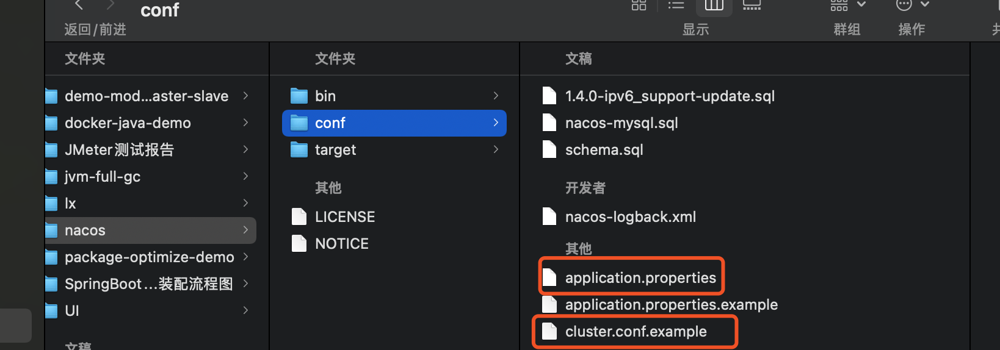

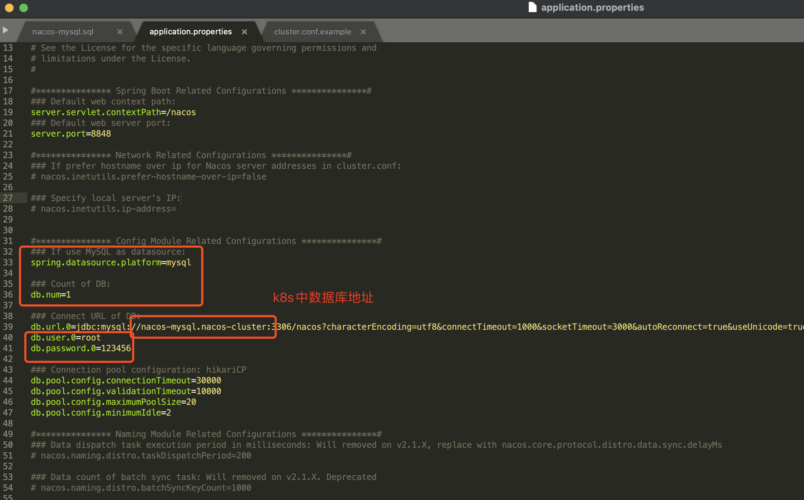

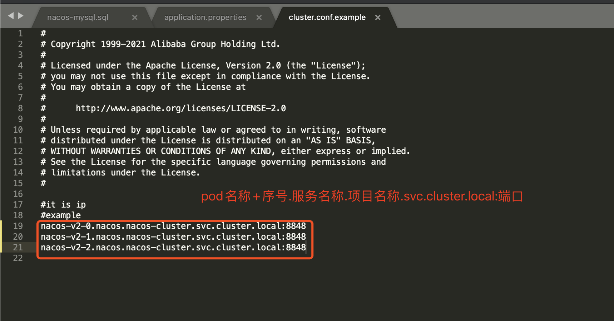

#### application.properties

```yaml
#
# Copyright 1999-2021 Alibaba Group Holding Ltd.
#
# Licensed under the Apache License, Version 2.0 (the "License");
# you may not use this file except in compliance with the License.
# You may obtain a copy of the License at
#
#      http://www.apache.org/licenses/LICENSE-2.0
#
# Unless required by applicable law or agreed to in writing, software
# distributed under the License is distributed on an "AS IS" BASIS,
# WITHOUT WARRANTIES OR CONDITIONS OF ANY KIND, either express or implied.
# See the License for the specific language governing permissions and
# limitations under the License.
#

#*************** Spring Boot Related Configurations ***************#
### Default web context path:
server.servlet.contextPath=/nacos
### Default web server port:
server.port=8848

#*************** Network Related Configurations ***************#
### If prefer hostname over ip for Nacos server addresses in cluster.conf:
# nacos.inetutils.prefer-hostname-over-ip=false

### Specify local server's IP:
# nacos.inetutils.ip-address=


#*************** Config Module Related Configurations ***************#
### If use MySQL as datasource:
spring.datasource.platform=mysql

### Count of DB:
db.num=1

### Connect URL of DB:
db.url.0=jdbc:mysql://nacos-mysql.nacos-cluster:3306/nacos_config?characterEncoding=utf8&connectTimeout=1000&socketTimeout=3000&autoReconnect=true&useUnicode=true&useSSL=false&serverTimezone=UTC
db.user.0=root
db.password.0=123456

### Connection pool configuration: hikariCP
db.pool.config.connectionTimeout=30000
db.pool.config.validationTimeout=10000
db.pool.config.maximumPoolSize=20
db.pool.config.minimumIdle=2

#*************** Naming Module Related Configurations ***************#
### Data dispatch task execution period in milliseconds: Will removed on v2.1.X, replace with nacos.core.protocol.distro.data.sync.delayMs
# nacos.naming.distro.taskDispatchPeriod=200

### Data count of batch sync task: Will removed on v2.1.X. Deprecated
# nacos.naming.distro.batchSyncKeyCount=1000

### Retry delay in milliseconds if sync task failed: Will removed on v2.1.X, replace with nacos.core.protocol.distro.data.sync.retryDelayMs
# nacos.naming.distro.syncRetryDelay=5000

### If enable data warmup. If set to false, the server would accept request without local data preparation:
# nacos.naming.data.warmup=true

### If enable the instance auto expiration, kind like of health check of instance:
# nacos.naming.expireInstance=true

### will be removed and replaced by `nacos.naming.clean` properties
nacos.naming.empty-service.auto-clean=true
nacos.naming.empty-service.clean.initial-delay-ms=50000
nacos.naming.empty-service.clean.period-time-ms=30000

### Add in 2.0.0
### The interval to clean empty service, unit: milliseconds.
# nacos.naming.clean.empty-service.interval=60000

### The expired time to clean empty service, unit: milliseconds.
# nacos.naming.clean.empty-service.expired-time=60000

### The interval to clean expired metadata, unit: milliseconds.
# nacos.naming.clean.expired-metadata.interval=5000

### The expired time to clean metadata, unit: milliseconds.
# nacos.naming.clean.expired-metadata.expired-time=60000

### The delay time before push task to execute from service changed, unit: milliseconds.
# nacos.naming.push.pushTaskDelay=500

### The timeout for push task execute, unit: milliseconds.
# nacos.naming.push.pushTaskTimeout=5000

### The delay time for retrying failed push task, unit: milliseconds.
# nacos.naming.push.pushTaskRetryDelay=1000

### Since 2.0.3
### The expired time for inactive client, unit: milliseconds.
# nacos.naming.client.expired.time=180000

#*************** CMDB Module Related Configurations ***************#
### The interval to dump external CMDB in seconds:
# nacos.cmdb.dumpTaskInterval=3600

### The interval of polling data change event in seconds:
# nacos.cmdb.eventTaskInterval=10

### The interval of loading labels in seconds:
# nacos.cmdb.labelTaskInterval=300

### If turn on data loading task:
# nacos.cmdb.loadDataAtStart=false


#*************** Metrics Related Configurations ***************#
### Metrics for prometheus
#management.endpoints.web.exposure.include=*

### Metrics for elastic search
management.metrics.export.elastic.enabled=false
#management.metrics.export.elastic.host=http://localhost:9200

### Metrics for influx
management.metrics.export.influx.enabled=false
#management.metrics.export.influx.db=springboot
#management.metrics.export.influx.uri=http://localhost:8086
#management.metrics.export.influx.auto-create-db=true
#management.metrics.export.influx.consistency=one
#management.metrics.export.influx.compressed=true

#*************** Access Log Related Configurations ***************#
### If turn on the access log:
server.tomcat.accesslog.enabled=true

### The access log pattern:
server.tomcat.accesslog.pattern=%h %l %u %t "%r" %s %b %D %{User-Agent}i %{Request-Source}i

### The directory of access log:
server.tomcat.basedir=

#*************** Access Control Related Configurations ***************#
### If enable spring security, this option is deprecated in 1.2.0:
#spring.security.enabled=false

### The ignore urls of auth, is deprecated in 1.2.0:
nacos.security.ignore.urls=/,/error,/**/*.css,/**/*.js,/**/*.html,/**/*.map,/**/*.svg,/**/*.png,/**/*.ico,/console-ui/public/**,/v1/auth/**,/v1/console/health/**,/actuator/**,/v1/console/server/**

### The auth system to use, currently only 'nacos' and 'ldap' is supported:
nacos.core.auth.system.type=nacos

### If turn on auth system:
nacos.core.auth.enabled=false

### Turn on/off caching of auth information. By turning on this switch, the update of auth information would have a 15 seconds delay.
nacos.core.auth.caching.enabled=true

### Since 1.4.1, Turn on/off white auth for user-agent: nacos-server, only for upgrade from old version.
nacos.core.auth.enable.userAgentAuthWhite=false

### Since 1.4.1, worked when nacos.core.auth.enabled=true and nacos.core.auth.enable.userAgentAuthWhite=false.
### The two properties is the white list for auth and used by identity the request from other server.
nacos.core.auth.server.identity.key=serverIdentity
nacos.core.auth.server.identity.value=security

### worked when nacos.core.auth.system.type=nacos
### The token expiration in seconds:
nacos.core.auth.plugin.nacos.token.expire.seconds=18000
### The default token:
nacos.core.auth.plugin.nacos.token.secret.key=SecretKey012345678901234567890123456789012345678901234567890123456789

### worked when nacos.core.auth.system.type=ldap，{0} is Placeholder,replace login username
#nacos.core.auth.ldap.url=ldap://localhost:389
#nacos.core.auth.ldap.basedc=dc=example,dc=org
#nacos.core.auth.ldap.userDn=cn=admin,${nacos.core.auth.ldap.basedc}
#nacos.core.auth.ldap.password=admin
#nacos.core.auth.ldap.userdn=cn={0},dc=example,dc=org


#*************** Istio Related Configurations ***************#
### If turn on the MCP server:
nacos.istio.mcp.server.enabled=false

#*************** Core Related Configurations ***************#

### set the WorkerID manually
# nacos.core.snowflake.worker-id=

### Member-MetaData
# nacos.core.member.meta.site=
# nacos.core.member.meta.adweight=
# nacos.core.member.meta.weight=

### MemberLookup
### Addressing pattern category, If set, the priority is highest
# nacos.core.member.lookup.type=[file,address-server]
## Set the cluster list with a configuration file or command-line argument
# nacos.member.list=192.168.16.101:8847?raft_port=8807,192.168.16.101?raft_port=8808,192.168.16.101:8849?raft_port=8809
## for AddressServerMemberLookup
# Maximum number of retries to query the address server upon initialization
# nacos.core.address-server.retry=5
## Server domain name address of [address-server] mode
# address.server.domain=jmenv.tbsite.net
## Server port of [address-server] mode
# address.server.port=8080
## Request address of [address-server] mode
# address.server.url=/nacos/serverlist

#*************** JRaft Related Configurations ***************#

### Sets the Raft cluster election timeout, default value is 5 second
# nacos.core.protocol.raft.data.election_timeout_ms=5000
### Sets the amount of time the Raft snapshot will execute periodically, default is 30 minute
# nacos.core.protocol.raft.data.snapshot_interval_secs=30
### raft internal worker threads
# nacos.core.protocol.raft.data.core_thread_num=8
### Number of threads required for raft business request processing
# nacos.core.protocol.raft.data.cli_service_thread_num=4
### raft linear read strategy. Safe linear reads are used by default, that is, the Leader tenure is confirmed by heartbeat
# nacos.core.protocol.raft.data.read_index_type=ReadOnlySafe
### rpc request timeout, default 5 seconds
# nacos.core.protocol.raft.data.rpc_request_timeout_ms=5000

#*************** Distro Related Configurations ***************#

### Distro data sync delay time, when sync task delayed, task will be merged for same data key. Default 1 second.
# nacos.core.protocol.distro.data.sync.delayMs=1000

### Distro data sync timeout for one sync data, default 3 seconds.
# nacos.core.protocol.distro.data.sync.timeoutMs=3000

### Distro data sync retry delay time when sync data failed or timeout, same behavior with delayMs, default 3 seconds.
# nacos.core.protocol.distro.data.sync.retryDelayMs=3000

### Distro data verify interval time, verify synced data whether expired for a interval. Default 5 seconds.
# nacos.core.protocol.distro.data.verify.intervalMs=5000

### Distro data verify timeout for one verify, default 3 seconds.
# nacos.core.protocol.distro.data.verify.timeoutMs=3000

### Distro data load retry delay when load snapshot data failed, default 30 seconds.
# nacos.core.protocol.distro.data.load.retryDelayMs=30000

```

#### cluster.conf

```yaml
#
# Copyright 1999-2021 Alibaba Group Holding Ltd.
#
# Licensed under the Apache License, Version 2.0 (the "License");
# you may not use this file except in compliance with the License.
# You may obtain a copy of the License at
#
#      http://www.apache.org/licenses/LICENSE-2.0
#
# Unless required by applicable law or agreed to in writing, software
# distributed under the License is distributed on an "AS IS" BASIS,
# WITHOUT WARRANTIES OR CONDITIONS OF ANY KIND, either express or implied.
# See the License for the specific language governing permissions and
# limitations under the License.
#

#it is ip
#example
nacos-v2-0.nacos.nacos-cluster.svc.cluster.local:8848
nacos-v2-1.nacos.nacos-cluster.svc.cluster.local:8848
nacos-v2-2.nacos.nacos-cluster.svc.cluster.local:8848

```

#### 创建配置字典 nacos-conf

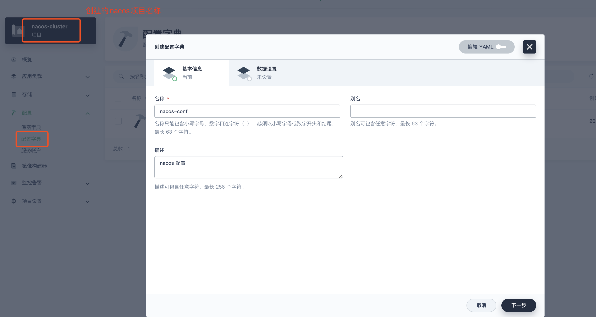

添加数据

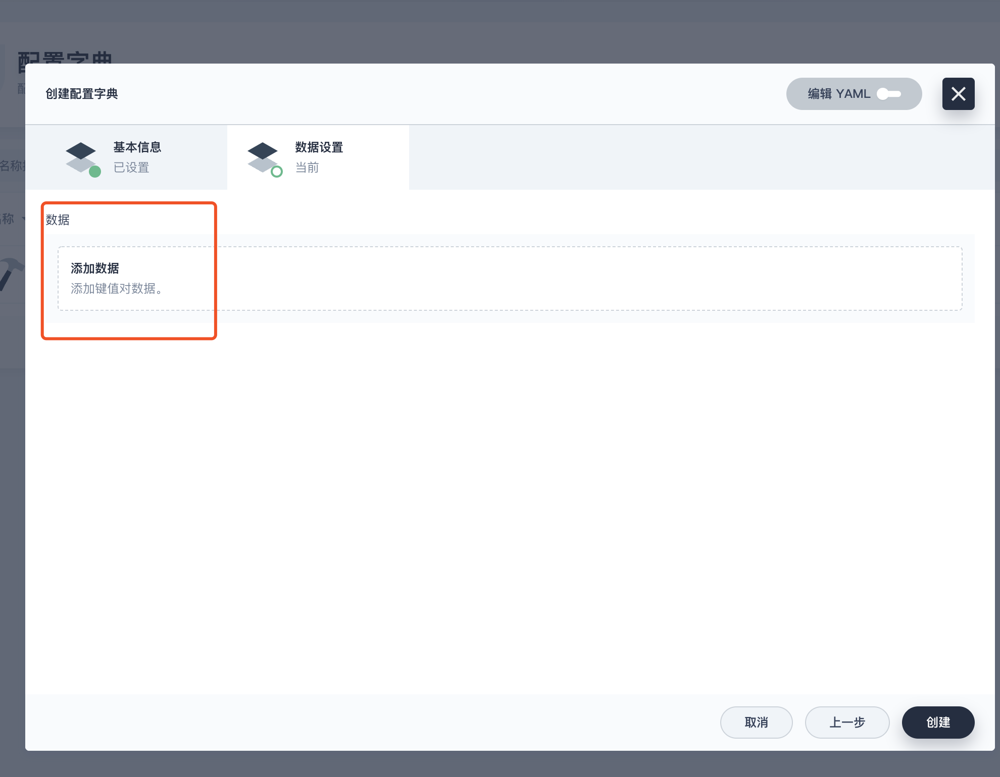


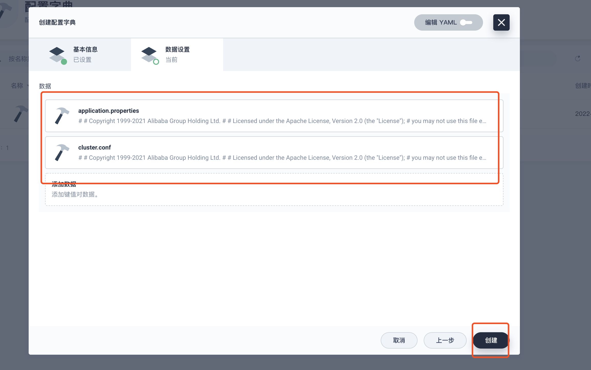

#### 创建完成


### 4. 创建服务

#### 选择有状态服务

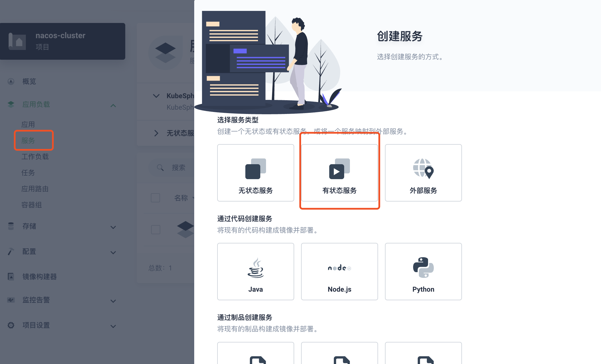

#### 填写服务名称和版本

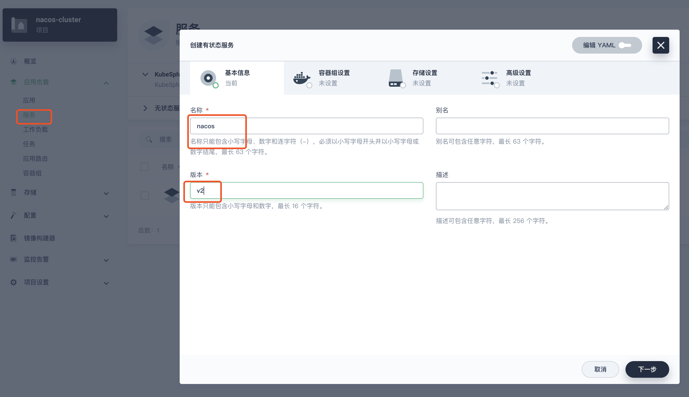

#### 配置容器

选择镜像 `nacos/nacos-server:v2.1.0`


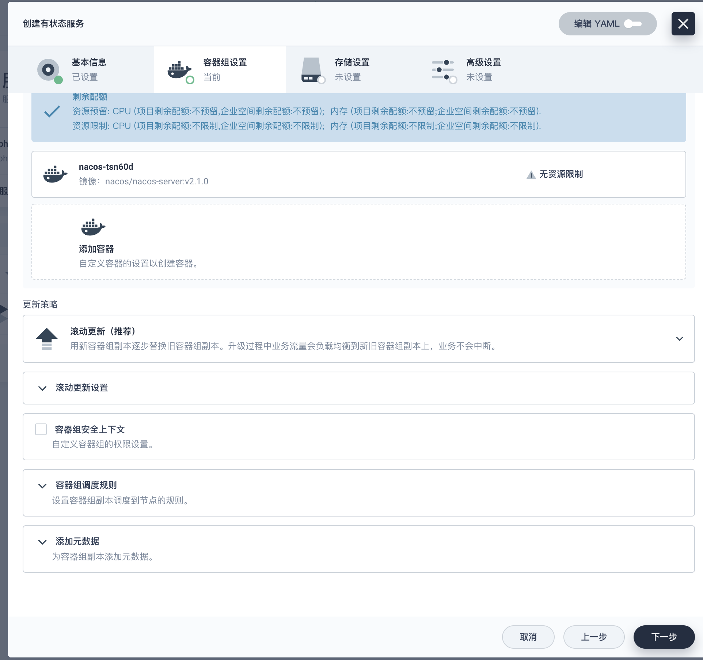

#### 挂载配置

选择配置好的nacos配置

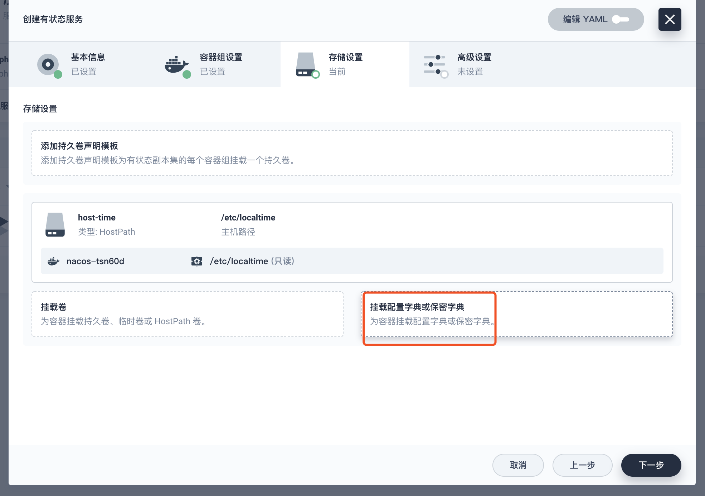

挂载配置字典， 路径` /home/nacos/conf/application.properties`  `/home/nacos/conf/cluster.conf`

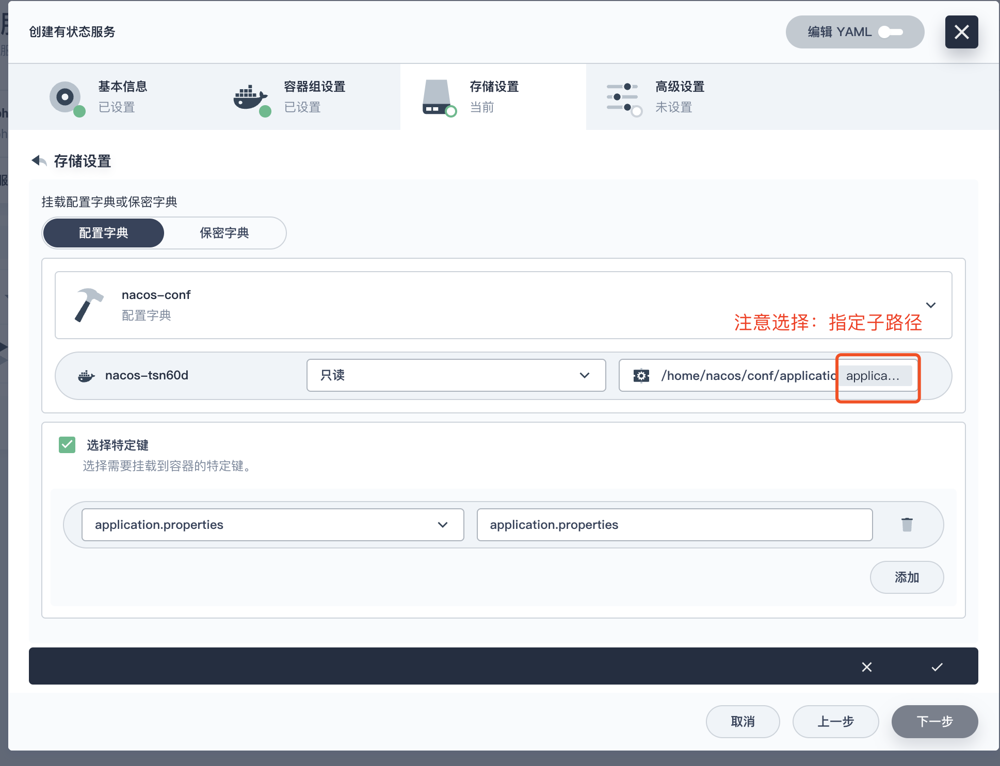

配置完成

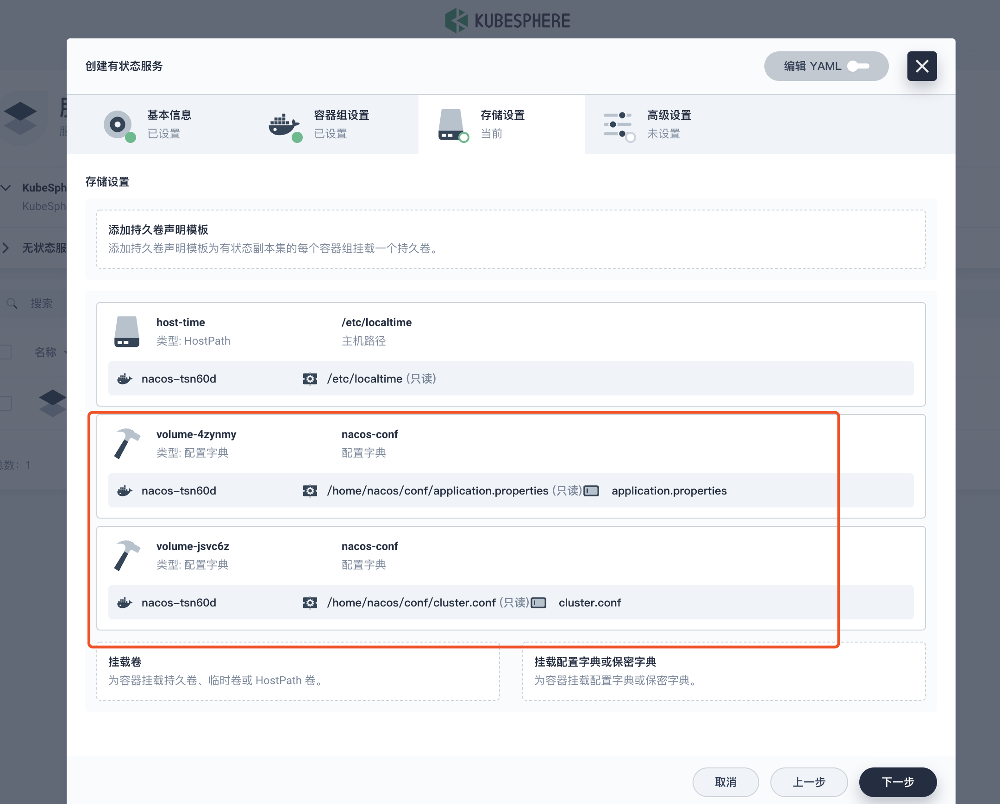

#### 完成创建服务

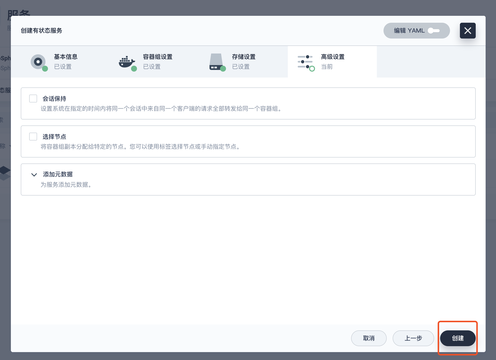

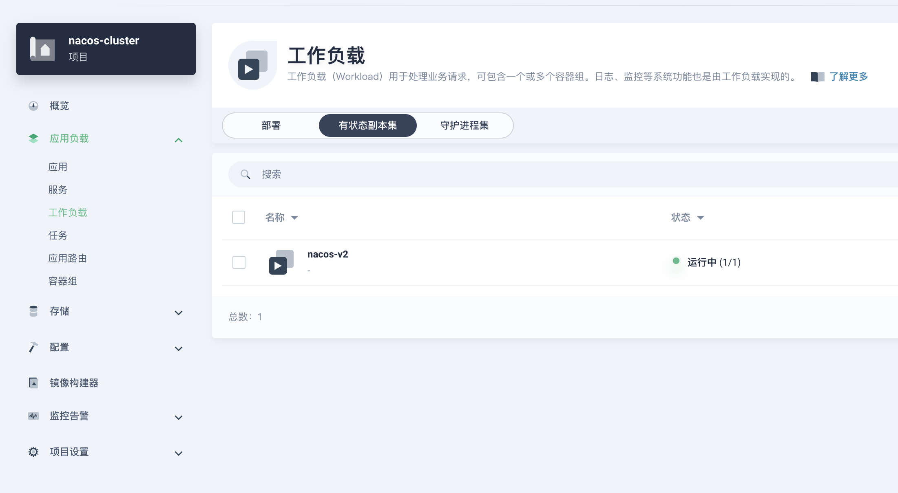


### 5. 创建应用路由


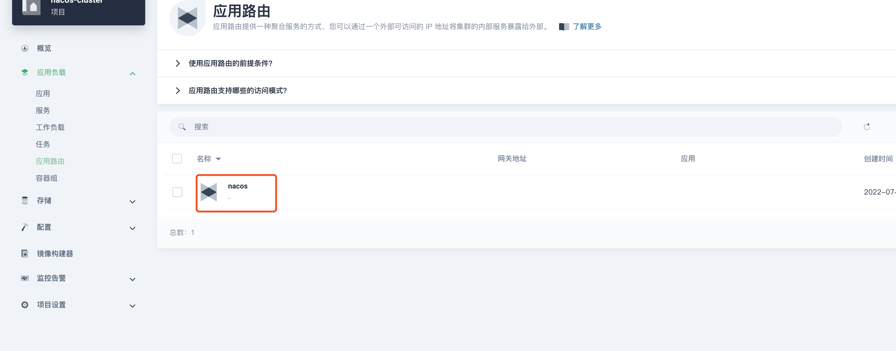


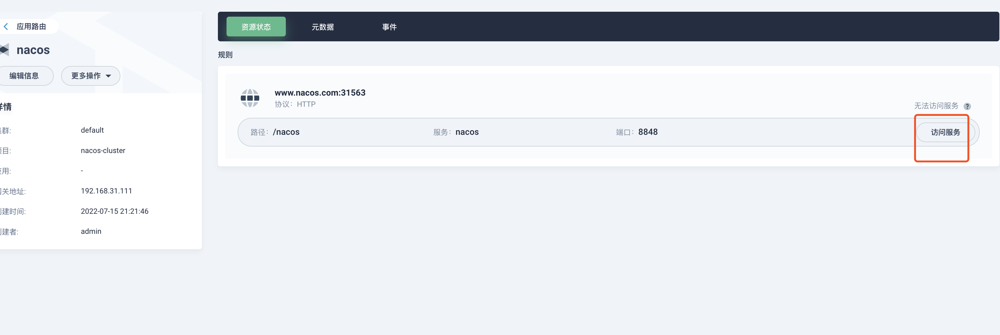


#### 账号密码：nacos	nacos 

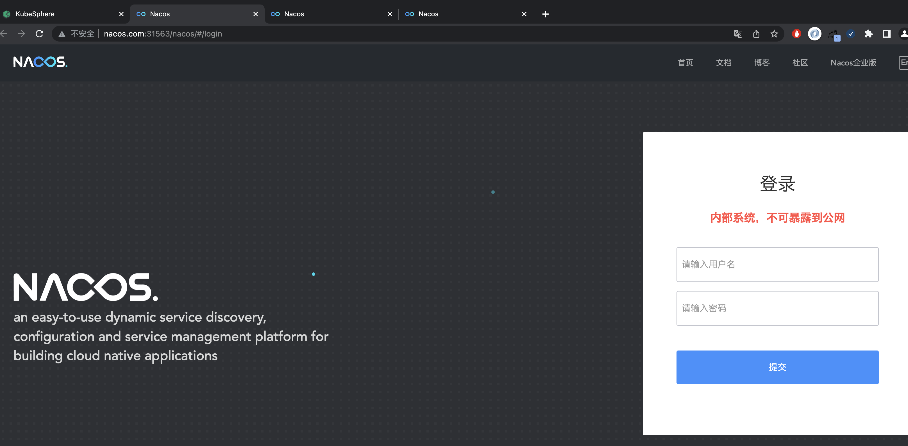


#### 集群管理

工作负载 > 扩容缩容

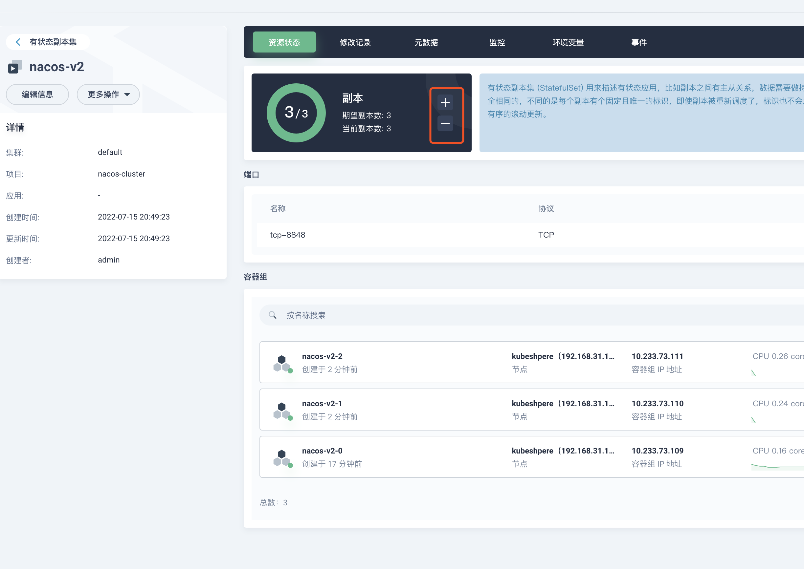


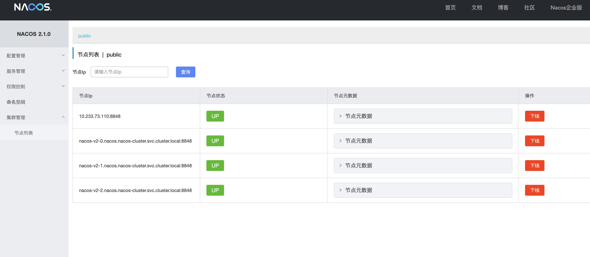


```yaml
---
apiVersion: v1
kind: Service
metadata:
  name: nacos-headless
  labels:
    app: nacos-headless
spec:
  type: ClusterIP
  clusterIP: None
  ports:
    - port: 8848
      name: server
      targetPort: 8848
    - port: 9848
      name: client-rpc
      targetPort: 9848
    - port: 9849
      name: raft-rpc
      targetPort: 9849
    ## 兼容1.4.x版本的选举端口
    - port: 7848
      name: old-raft-rpc
      targetPort: 7848
  selector:
    app: nacos
---
apiVersion: v1
kind: ConfigMap
metadata:
  name: nacos-cm
data:
  mysql.db.name: "nacos_devtest"
  mysql.port: "3306"
  mysql.user: "nacos"
  mysql.password: "nacos"
---
apiVersion: apps/v1
kind: StatefulSet
metadata:
  name: nacos
spec:
  serviceName: nacos-headless
  replicas: 3
  template:
    metadata:
      labels:
        app: nacos
      annotations:
        pod.alpha.kubernetes.io/initialized: "true"
    spec:
      affinity:
        podAntiAffinity:
          requiredDuringSchedulingIgnoredDuringExecution:
            - labelSelector:
                matchExpressions:
                  - key: "app"
                    operator: In
                    values:
                      - nacos
              topologyKey: "kubernetes.io/hostname"
      containers:
        - name: k8snacos
          imagePullPolicy: Always
          image: nacos/nacos-server:latest
          resources:
            requests:
              memory: "2Gi"
              cpu: "500m"
          ports:
            - containerPort: 8848
              name: client
            - containerPort: 9848
              name: client-rpc
            - containerPort: 9849
              name: raft-rpc
            - containerPort: 7848
              name: old-raft-rpc
          env:
            - name: NACOS_REPLICAS
              value: "3"
            - name: MYSQL_SERVICE_DB_NAME
              valueFrom:
                configMapKeyRef:
                  name: nacos-cm
                  key: mysql.db.name
            - name: MYSQL_SERVICE_PORT
              valueFrom:
                configMapKeyRef:
                  name: nacos-cm
                  key: mysql.port
            - name: MYSQL_SERVICE_USER
              valueFrom:
                configMapKeyRef:
                  name: nacos-cm
                  key: mysql.user
            - name: MYSQL_SERVICE_PASSWORD
              valueFrom:
                configMapKeyRef:
                  name: nacos-cm
                  key: mysql.password
            - name: NACOS_SERVER_PORT
              value: "8848"
            - name: NACOS_APPLICATION_PORT
              value: "8848"
            - name: PREFER_HOST_MODE
              value: "hostname"
            - name: NACOS_SERVERS
              value: "nacos-0.nacos-headless.default.svc.cluster.local:8848 nacos-1.nacos-headless.default.svc.cluster.local:8848 nacos-2.nacos-headless.default.svc.cluster.local:8848"
  selector:
    matchLabels:
      app: nacos

```


