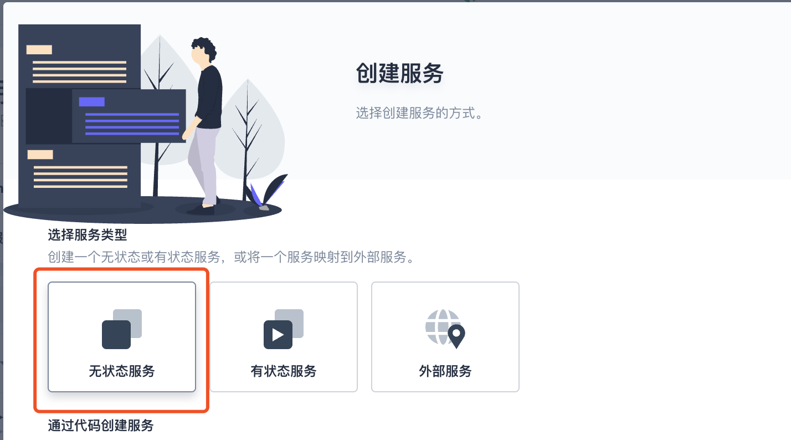
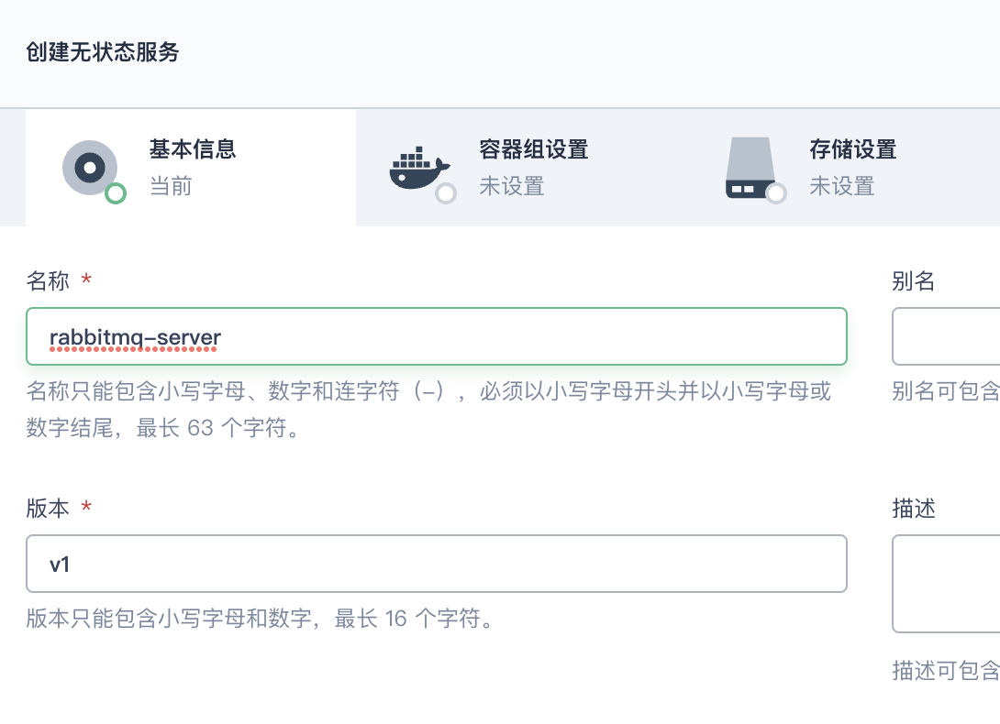
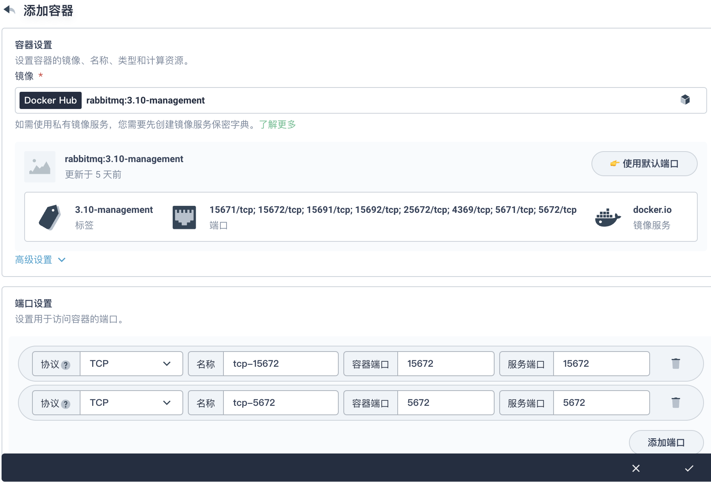
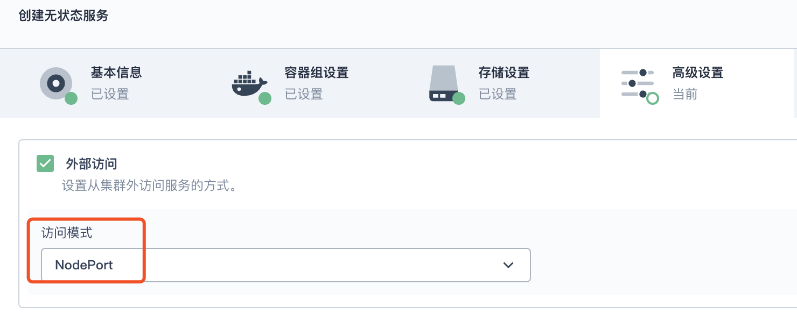
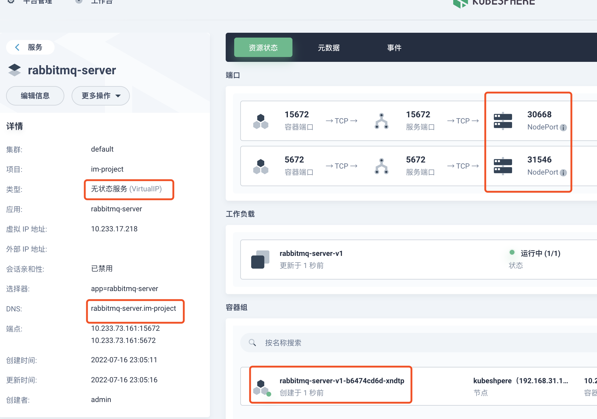
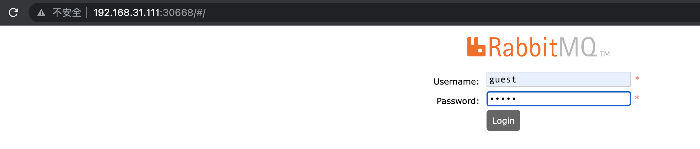
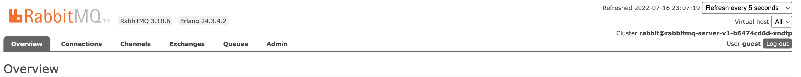

## KubeShpere 部署 RabbitMQ 

**官方文档地址**

https://www.rabbitmq.com/

### 创建无状态服务

### 设置服务名称

### 容器设置

选择镜像：**rabbitmq:3.10-management**，设置对应的端口，勾选同步主机时区

默认全部下一步

### 创建成功

### 访问测试

账号密码：guest / guest

