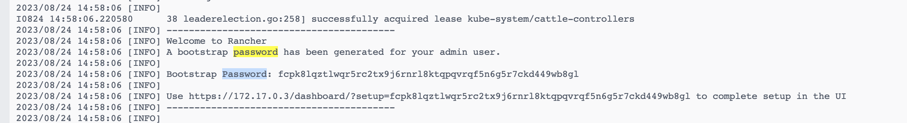

**文档**：https://docs.ranchermanager.rancher.io/zh/


拉取rancher镜像

```shell
docker pull rancher/rancher:v2.7.5
```

**docker 单点运行 rancher**

```sh
  docker run --name=rancher -d --restart=unless-stopped \
  -p 8881:80 -p 8443:443 \
  --privileged \
  rancher/rancher:v2.7.5
```





**本地环境登录密码：**

管理员 admin  hBfnryEHzpNFDajW

开发者 developer  sQ3OjFZlyNml634c

