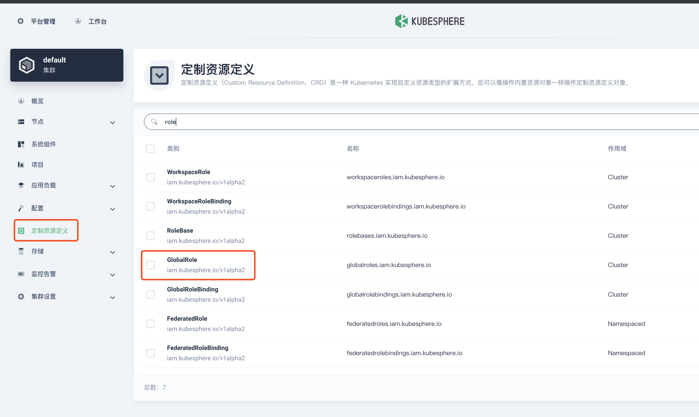
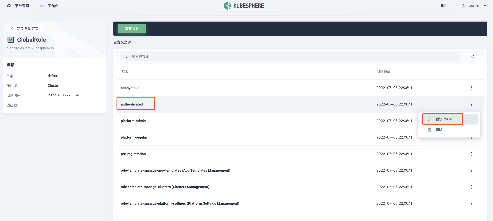

### 1. workspace-manager 角色不能创建 workspace

`workspacetemplates.tenant.kubesphere.io is forbidden: User "ws-manager" cannot create resource "workspacetemplates" in API group "tenant.kubesphere.io" at the cluster scope`

**解决方法：**

登录 ` admin` 账号，定义资源定义 > `GlobalRole` 





在最后面添加 `workspacetemplates.tenant.kubesphere.io`

```yaml
  - apiGroups:
      - tenant.kubesphere.io
    resources:
      - workspacetemplates
    verbs:
      - create
```


