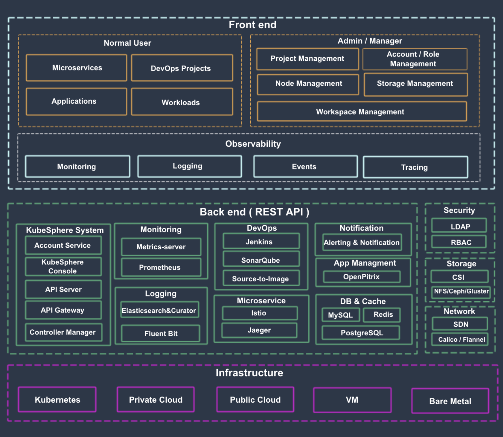
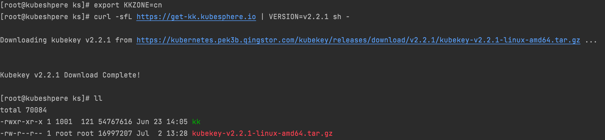
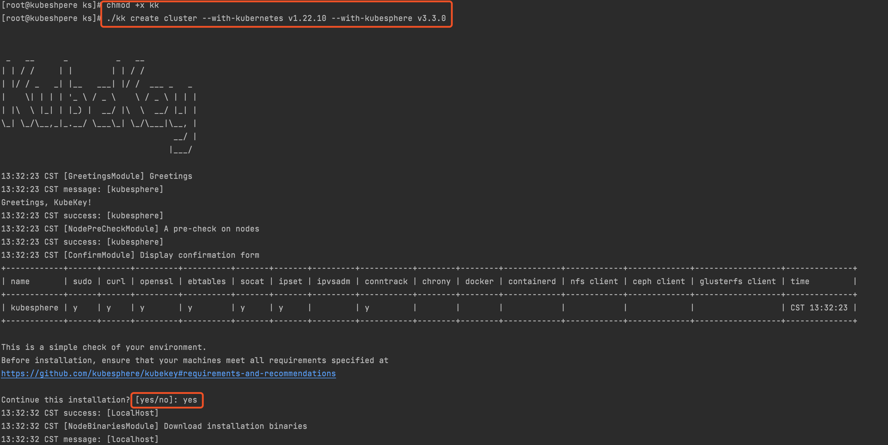
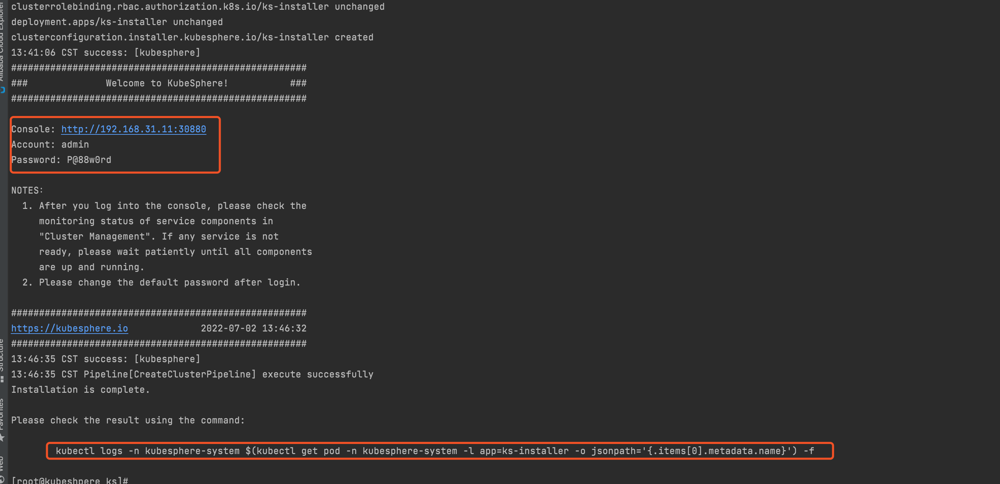
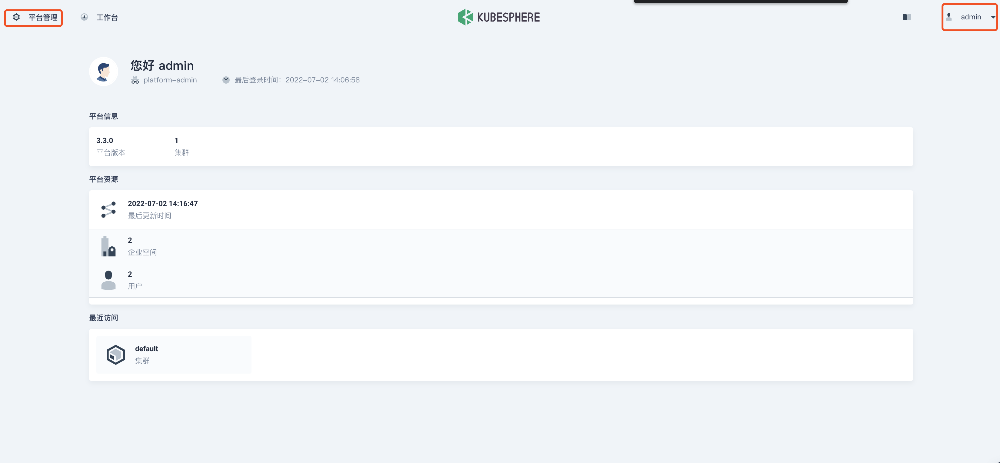
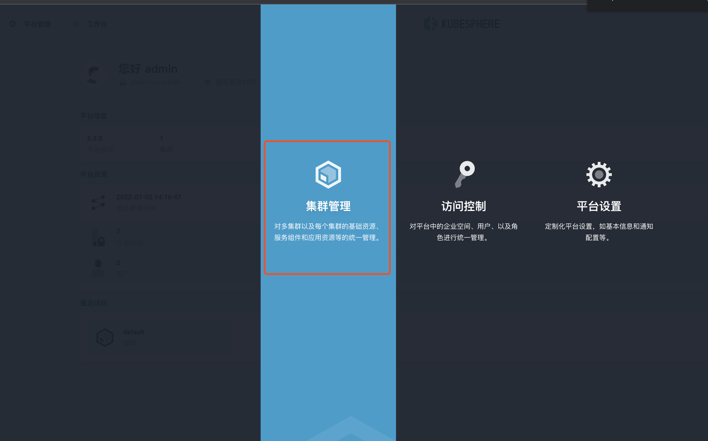
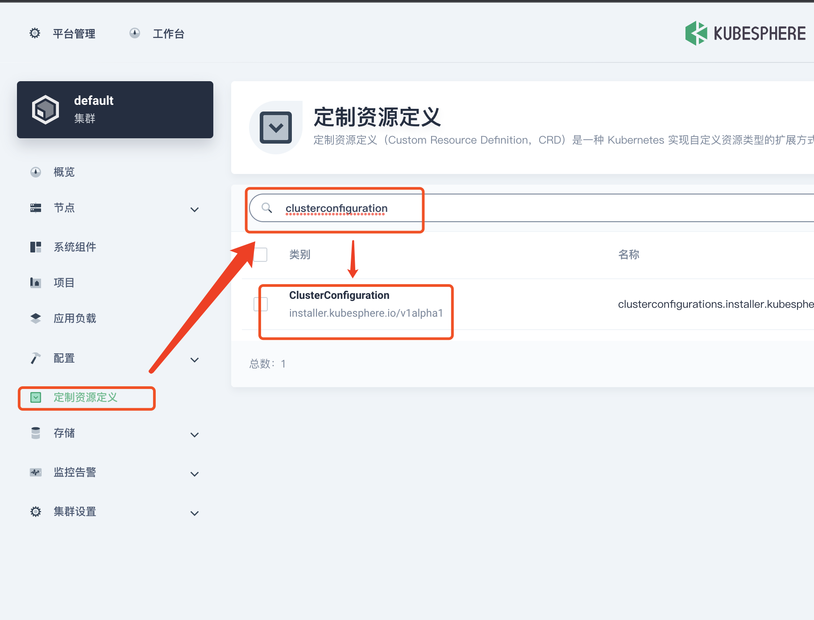
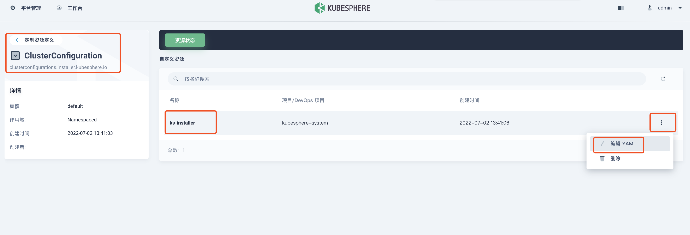
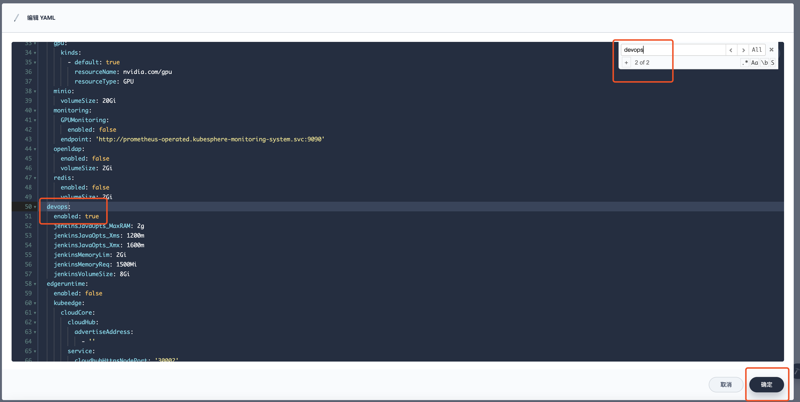
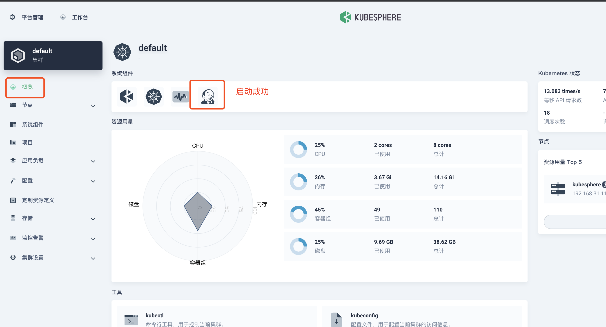

## 在 Linux 上以 All-in-One 模式安装 KubeSphere

**[官网文档](https://kubesphere.com.cn/docs/v3.3/quick-start/all-in-one-on-linux/)**

**笔记只记录简单安装, 原理和架构图请看官网文档**

**了解架构原理出了问题才能更好的解决**



### 1. 安装条件

**纯净的centos7系统**

配置最好 **CPU8核 16G内存 50G磁盘** 以上

**查看系统信息**

```bash
[root@kubeshpere ~]# uname -r
3.10.0-1160.el7.x86_64
[root@kubeshpere ~]# cat /etc/centos-release
```

**更新yum**

```bash
[root@kubeshpere ~]# yum -y update
```

**安装yum-utils软件包，使用yum-config-manager设置yum源，更新yum包索引**

```bash
[root@kubeshpere ~]# yum install -y yum-utils
  
// 这个地址要去浏览器验证下是否正确
[root@kubeshpere ~]# yum-config-manager --add-repo https://mirrors.aliyun.com/docker-ce/linux/centos/docker-ce.repo
// 生效
[root@kubeshpere ~]# yum makecache
```

**关闭防火墙**

```bash
[root@kubeshpere ~]# systemctl stop firewalld
[root@kubeshpere ~]# systemctl disable firewalld
[root@kubeshpere ~]# systemctl status firewalld
```

**关闭 selinux**

````bash
# 查看selinux状态 SELinux status: enabled
[root@kubeshpere ~]# /usr/sbin/sestatus -v
# 永久关闭
[root@kubeshpere ~]# sed -i s#SELINUX=enforcing#SELINUX=disabled# /etc/selinux/config
# 临时关闭 setenforce 0 
# 重启查看是否关闭
[root@kubeshpere ~]# systemctl reboot
[root@kubeshpere ~]# /usr/sbin/sestatus -v
````

**关闭 swap**

```bash
# 临时关闭 swapoff ‐a 
# 永久关闭
[root@kubeshpere ~]# vim /etc/fstab
# 注释掉swap这行 
# /dev/mapper/centos‐swap swap swap defaults 0 0
#重启生效 free‐m 查看下swap交换区是否都为0，如果都为0则swap关闭成功
[root@kubeshpere ~]# systemctl reboot
[root@kubeshpere ~]# free -m
```

**将桥接的IPv4流量传递到iptables**

```bash
# 这有个空等号左右没有空格不生效
[root@kubeshpere ~]# cat >> /etc/sysctl.d/k8s.conf << EOF
net.bridge.bridge-nf-call-ip6tables = 1
net.bridge.bridge-nf-call-iptables = 1
EOF

# 生效
[root@kubeshpere ~]# sysctl --system
```

**确认可以使用 sudo curl openssl tar 命令**

```shell
[root@kubeshpere ~]# yum install -y socat

[root@kubeshpere ~]# yum install -y conntrack
```

**请确保 `/etc/resolv.conf` 中的 DNS 地址可用**

**配置docker镜像加速，这里配置阿里云镜像加速 [从阿里云获取加速器地址](https://www.alibabacloud.com/help/zh/doc-detail/60750.htm?spm=a2c63.p38356.b99.18.4f4133f0uTKb8S)**

````bash
[root@kubeshpere ~]# sudo mkdir -p /etc/docker

[root@kubeshpere ~]# sudo tee /etc/docker/daemon.json <<-'EOF'
{
   "registry-mirrors": [
       "https://fwprcl4o.mirror.aliyuncs.com",
       "http://hub-mirror.c.163.com"
   ]
}
EOF

[root@kubeshpere ~]# sudo systemctl daemon-reload
````


### 2. 下载安装

需要合适的网络访问github, 如果不行可以下载安装包解压安装, 方法参考官网下载的shell脚本内容

访问受限先执行: **export KKZONE=cn**

```bash
[root@kubeshpere ks]# export KKZONE=cn

[root@kubeshpere ks]# curl -sfL https://get-kk.kubesphere.io | VERSION=v2.2.1 sh -
```



```bash
[root@kubeshpere ks]# chmod +x kk
```

**安装版本参考官方**

```bash
[root@kubeshpere ks]# export KKZONE=cn

[root@kubeshpere ks]# ./kk create cluster --with-kubernetes v1.22.10 --with-kubesphere v3.3.0
```



**等待安装完成, 验证安装结果**



```bash
[root@kubeshpere ks]# kubectl logs -n kubesphere-system $(kubectl get pod -n kubesphere-system -l app=ks-installer -o jsonpath='{.items[0].metadata.name}') -f
```


使用以下命令检查运行状态

````bash
[root@kubeshpere ks]# kubectl get pod --all-namespaces
````


### 3. 浏览器访问

```bash
Console: http://192.168.0.2:30880
Account: admin
Password: P@88w0rd
```


### 4.  卸载

```bash
[root@kubeshpere ks]# ./kk delete cluster
```


### 5. 宕机重启设置

一般情况下, 服务器在重启的时候 docker 和 k8s 会自愈,  kubesphere也会自动恢复运行。

所以我们只需要**设置 docker 和 k8s 开机重启启动**就行了。

执行以下命令, 开机后稍等一段时间就可以访问kubesphere了

```bash
[root@kubeshpere ks]# systemctl enable kubelet

[root@kubeshpere ks]# systemctl enable docker
```


查看k8s集群pod状态

```bash
[root@kubeshpere ks]# kubectl get pod --all-namespaces
```


### 6. 启动可插拔组件

https://kubesphere.com.cn/docs/v3.3/pluggable-components/overview/

按需启动, 如果资源可以建议启动所有

**admin** 用户登录控制台，点击左上角的**平台管理**，选择**集群管理**。







点击**定制资源定义**，在搜索栏中输入 **clusterconfiguration**，点击搜索结果查看其详细页面。







**以devops为例**

**修改 devops 的enable 的值为 true** 



**在 kubectl 中执行以下命令检查安装过程：**

```bash
kubectl logs -n kubesphere-system $(kubectl get pod -n kubesphere-system -l 'app in (ks-install, ks-installer)' -o jsonpath='{.items[0].metadata.name}') -f
```

**点击确定后等待片刻, 会提示重新登录, 查看是否启动**




