## 构建和部署 Maven 项目


**[官网地址](https://kubesphere.com.cn/docs/v3.3/devops-user-guide/examples/a-maven-project/)**

官方示例：https://github.com/kubesphere/devops-maven-sample


### 1. 使用条件

#### 1> 有一个 docker hub 镜像仓库

**例如: 阿里云镜像仓库**

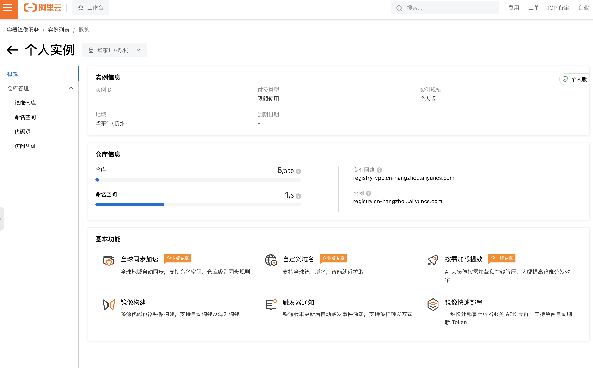


#### 2> kubeshpere 开启了 devops 插件

具体参考官网：https://kubesphere.com.cn/docs/v3.3/pluggable-components/devops/


#### 3> 创建 企业空间、项目、用户

具体参考官网：https://kubesphere.com.cn/docs/v3.3/quick-start/create-workspace-and-project/


#### 4> 修改 devops-agent 的 maven 配置


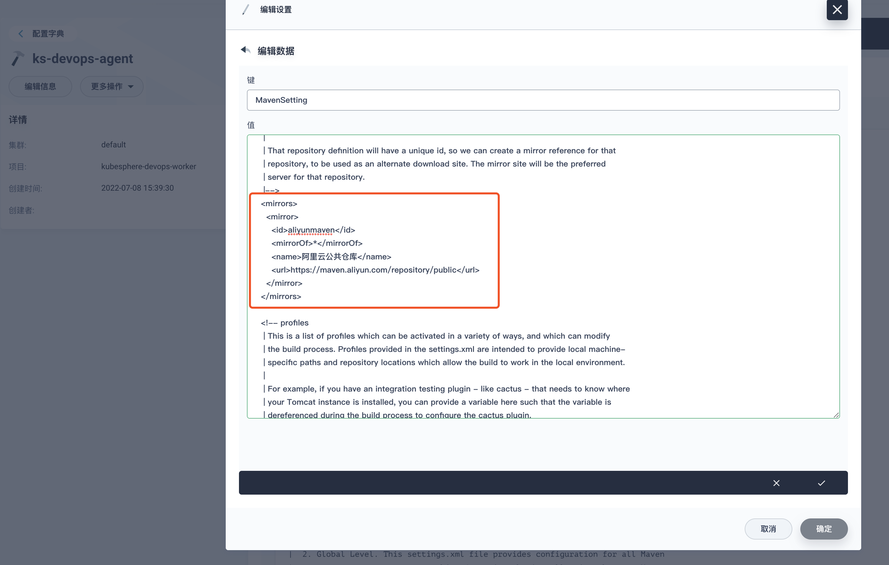


### 2. 开始使用

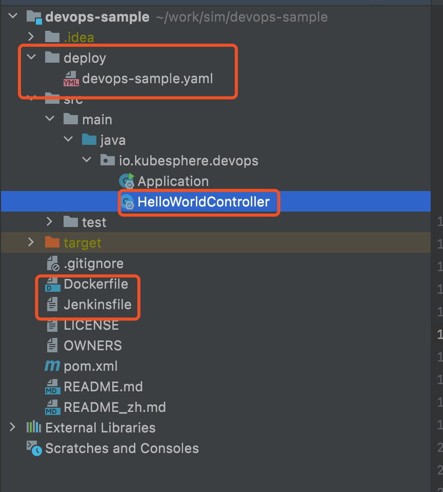

#### 1> 创建 springboot 项目

https://start.spring.io/

创建一个web项目，编写一个 hello world 的接口。

```java
/**
 * Hello !
 */
@RestController
@RequestMapping("/hello")
public class HelloWorldController {

    @RequestMapping("/test")
    public String sayHello() {
        String format = new SimpleDateFormat("yyyy-MM-dd HH:mm:ss.SSSZ").format(new Date());
        return "CI/CD ===> kubesphere devops : " + format;
    }
}
```


#### 2> springboot 添加 devops 配置文件

参考官网：https://kubesphere.com.cn/docs/v3.3/devops-user-guide/examples/a-maven-project/


##### Dockerfile

```dockerfile
FROM java:openjdk-8-jre-alpine
WORKDIR /home
COPY target/*.jar /home
ENTRYPOINT java -jar -Duser.timezone=GMT+8 *.jar
```


##### Jenkinsfile

```bash
pipeline {
  agent {
    label 'maven'
  }

  environment {
    // kubeconfig
    KUBECONFIG_CREDENTIAL_ID = 'kubeconfig'

    // docker hub
    DOCKER_CREDENTIAL_ID = 'dockerhub-id'
    REGISTRY = 'registry.cn-hangzhou.aliyuncs.com'
    DOCKERHUB_NAMESPACE = 'starzeng'

    // git hub
    GIT_ID = 'git-id'
    GITHUB_URL = 'https://e.coding.net/wuhanlianxu/sim/devops-sample.git'
    BRANCH_NAME = 'master'

    // app
    APP_NAME = 'devops-sample-server'
    KUBE_NAMESPACE = 'demo1'
    VERSION = '1.0.0'
  }

  stages {

    stage ('git checkout') {
      steps {
        git(branch: "$BRANCH_NAME", url: "$GITHUB_URL", credentialsId: env.GIT_ID, changelog: true, poll: false)
      }
    }

    stage('image build & push') {
      agent none
      steps {
        container('maven') {
          sh 'mvn clean install -Dmaven.test.skip=true'
          sh 'docker build -f Dockerfile -t $REGISTRY/$DOCKERHUB_NAMESPACE/$APP_NAME:$BRANCH_NAME-$BUILD_NUMBER .'
          withCredentials([usernamePassword(credentialsId: env.DOCKER_CREDENTIAL_ID, passwordVariable: 'DOCKER_PASSWORD', usernameVariable: 'DOCKER_USERNAME' ,)]) {
            sh 'echo "$DOCKER_PASSWORD" | docker login $REGISTRY -u "$DOCKER_USERNAME" --password-stdin'
            sh 'docker push $REGISTRY/$DOCKERHUB_NAMESPACE/$APP_NAME:$BRANCH_NAME-$BUILD_NUMBER'
          }
        }
      }
    }

    stage('deploy') {
      steps {
        container ('maven') {
          withCredentials([kubeconfigFile(credentialsId: env.KUBECONFIG_CREDENTIAL_ID, variable: 'KUBECONFIG')]) {
            sh 'envsubst < deploy/devops-sample.yaml | kubectl apply -f -'
          }
        }
      }
    }

  }

}

```


##### k8s 使用docker私库

登录管理员账号，切换到集群管理，**配置 > 保密字典** 创建拉取私有镜像的密钥

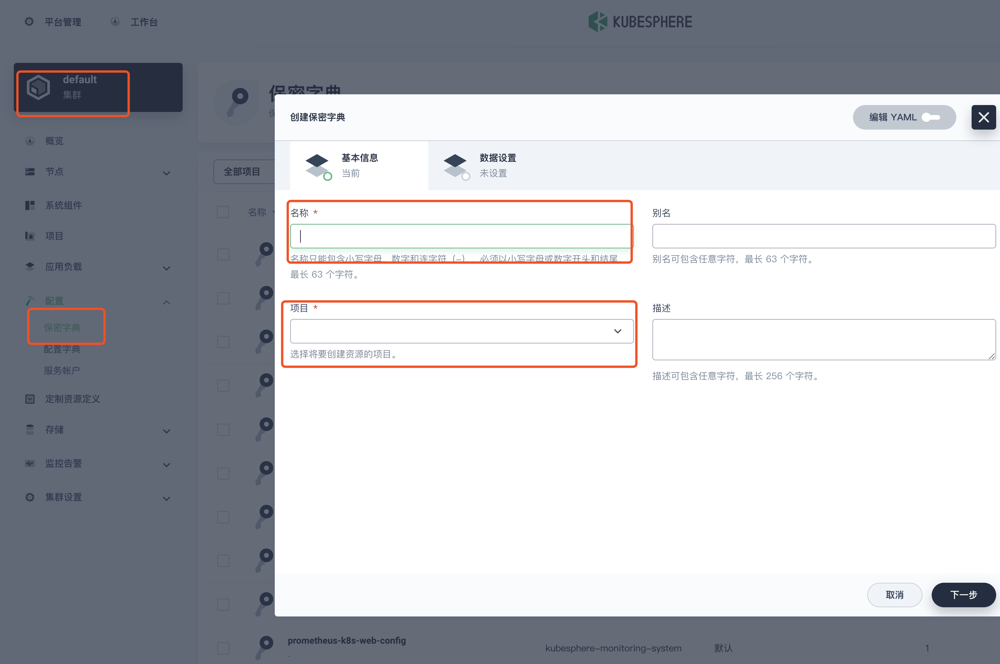


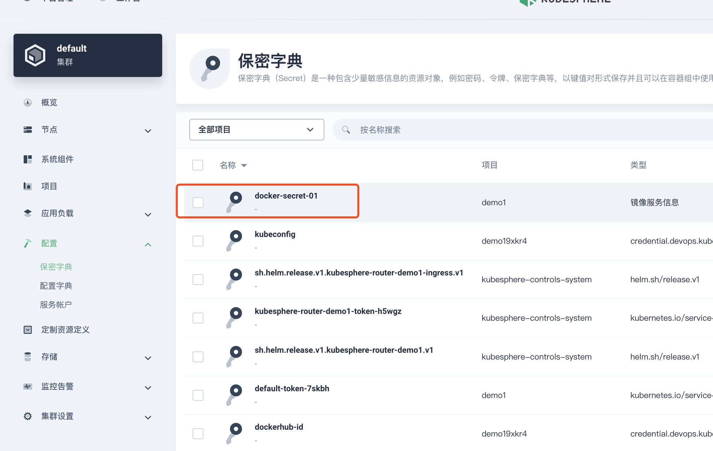

在`deploy.yaml`文件中添加一行

```YAML
imagePullSecrets:
	- name: 上面的秘典名称
```

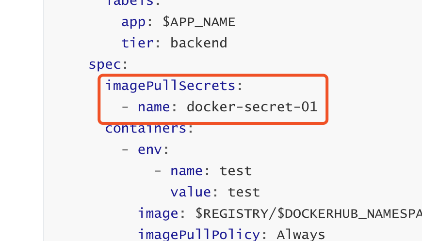


##### devops-sample

```yaml
---
apiVersion: apps/v1
kind: Deployment
metadata:
  labels:
    app: $APP_NAME
    tier: backend
  name: $APP_NAME
  namespace: $KUBE_NAMESPACE
spec:
  progressDeadlineSeconds: 600
  replicas: 1
  selector:
    matchLabels:
      app: $APP_NAME
      tier: backend
  template:
    metadata:
      labels:
        app: $APP_NAME
        tier: backend
    spec:
      volumes:
        - name: host-time
          hostPath:
            path: /etc/localtime
            type: ''
      imagePullSecrets:
        - name: docker-secret-01
      containers:
        - env:
            - name: test
              value: test
          image: $REGISTRY/$DOCKERHUB_NAMESPACE/$APP_NAME:$BRANCH_NAME-$BUILD_NUMBER
          imagePullPolicy: Always
          name: $APP_NAME
          ports:
            - containerPort: 8080
              protocol: TCP
          resources:
            limits:
              cpu: 1000m
              memory: 2000Mi
            requests:
              cpu: 1000m
              memory: 1000Mi
          volumeMounts:
            - name: host-time
              readOnly: true
              mountPath: /etc/localtime
          terminationMessagePath: /dev/termination-log
          terminationMessagePolicy: File
      dnsPolicy: ClusterFirst
      restartPolicy: Always
      terminationGracePeriodSeconds: 30

---
apiVersion: v1
kind: Service
metadata:
  labels:
    app: $APP_NAME
  name: $APP_NAME
  namespace: $KUBE_NAMESPACE
spec:
  ports:
    - name: http
      port: 8080
      protocol: TCP
      targetPort: 8080
#      nodePort: 30861
  selector:
    app: $APP_NAME
    tier: backend
  sessionAffinity: None
  type: NodePort

#---
#kind: Secret
#apiVersion: v1
#metadata:
#  name: docker-secret-01
#  namespace: $KUBE_NAMESPACE
#  annotations:
#    kubesphere.io/creator: admin
#data:
#  .dockerconfigjson: >-
#    eyJhdXRocyI6eyJodHRwczovL3JlZ2lzdHJ5LmNuLWhhbmd6aG91LmFsaXl1bmNzLmNvbSI6eyJ1c2VybmFtZSI6IjEzNjk4NjYxODFAcXEuY29tIiwicGFzc3dvcmQiOiJ6d3gxOTkwMTIiLCJlbWFpbCI6IiIsImF1dGgiOiJNVE0yT1RnMk5qRTRNVUJ4Y1M1amIyMDZlbmQ0TVRrNU1ERXkifX19
#type: kubernetes.io/dockerconfigjson

```


#### 3> **创建凭证**

**登录 kubesphere** 

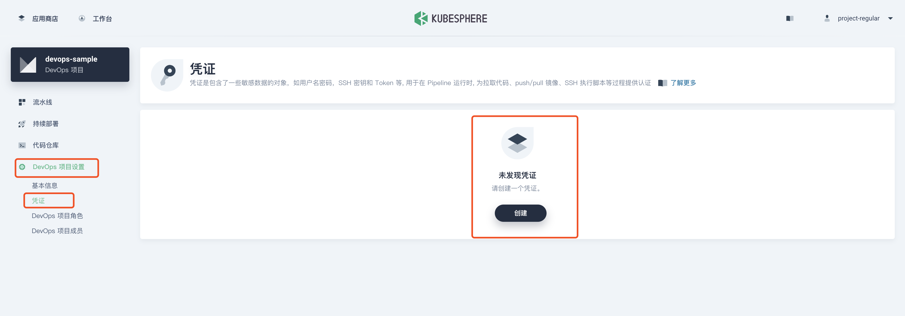

| 凭证 ID      | 类型         | 用途                  |
| :----------- | :----------- | :-------------------- |
| dockerhub-id | 用户名和密码 | 仓库，例如 Docker Hub |
| kubeconfig   | kubeconfig   | 部署工作负载          |
| git-id       | 用户名和密码 | git 仓库拉取账号密码  |

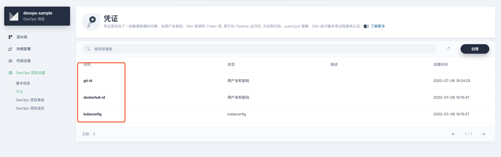

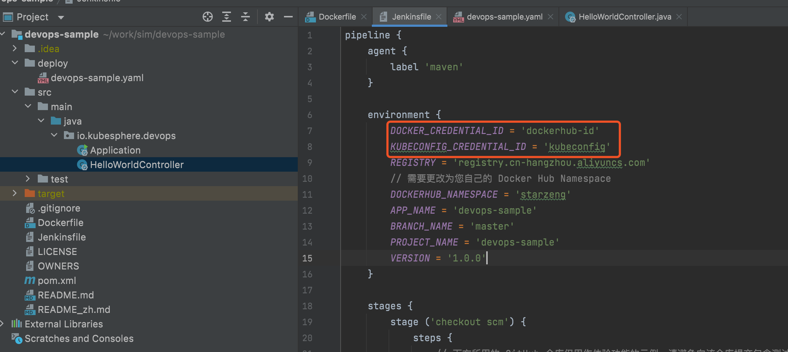


#### 4> 创建项目和 devops 项目

创建项目和 devops 项目， 使用默认配置即可

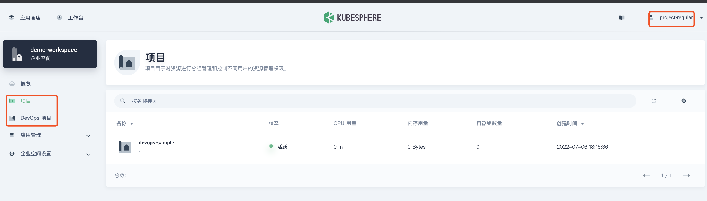


#### 5> 编辑流水线

点开 devops 下的项目 devops-sample

复制 springboot 项目中的 jenkinsfile文件内容到 编辑Jenkinsfile中

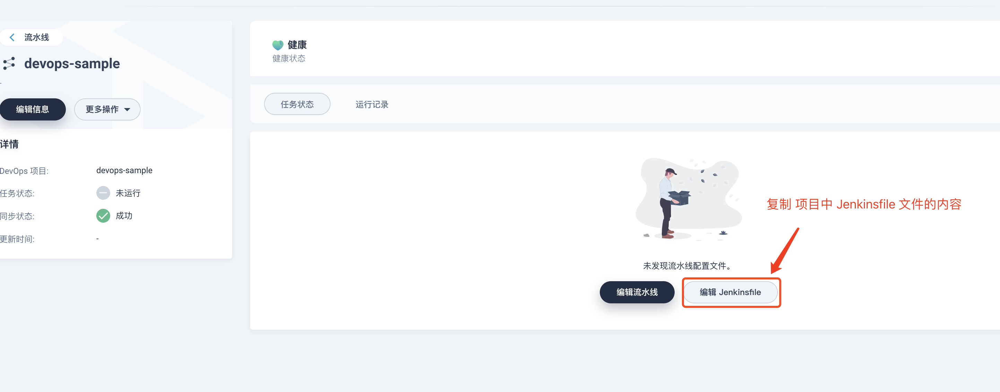


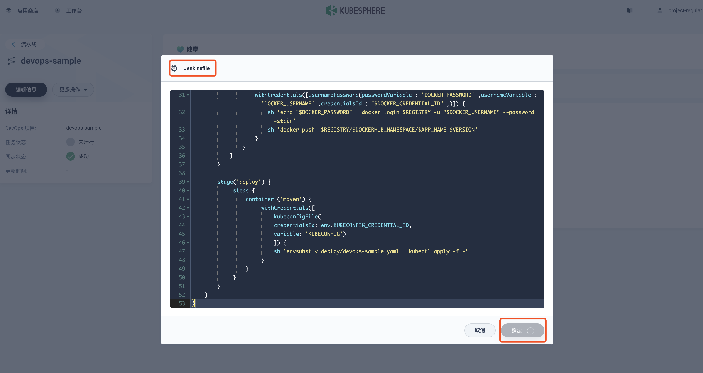


生成流水线， 点击 **编辑流水线**

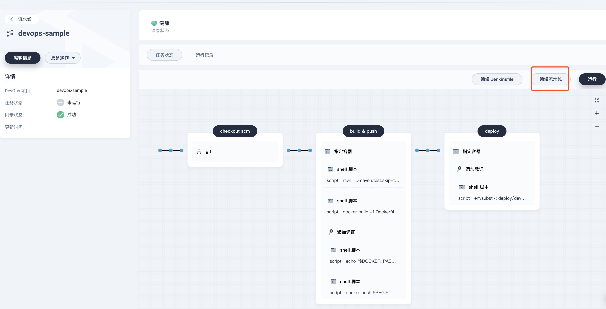


**流水线添加 git 凭证，完成后一直确定**

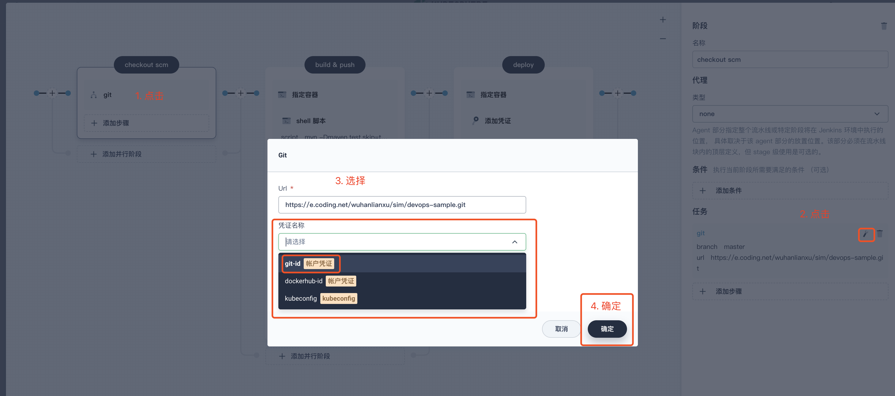


#### 6> 运行

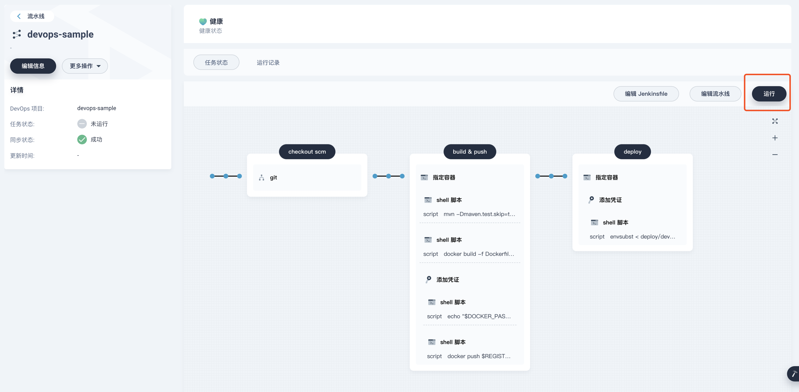

第一次部署比较久，请耐心等待

发布成功后，打开项目网关，配置外部访问

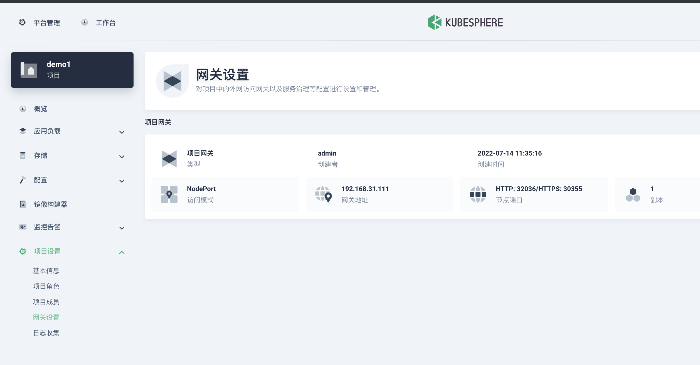

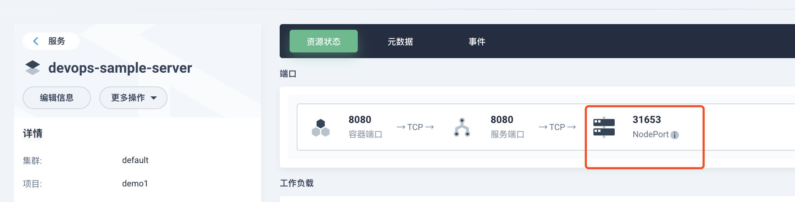


#### 7> 浏览器访问

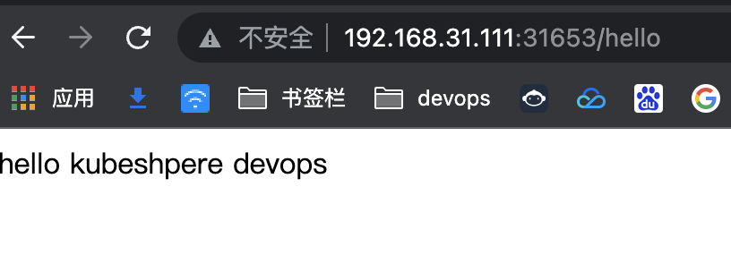


### 3. devops 问题

#### 1> 运行失败，devops-jenkins 重启问题解决方案

**clusterconfiguration  >  ks-install 中 devops 配置修改**

```yaml
spec:
  devops:                  
    enabled: true            
    jenkinsMemoryLim: 4Gi      # 原来为 2Gi
    jenkinsMemoryReq: 2500Mi 	 # 原来为 1500Mi
    jenkinsVolumeSize: 40Gi    # 8Gi     
    jenkinsJavaOpts_Xms: 2000m # 1200m 
    jenkinsJavaOpts_Xmx: 2000m # 1600m
    jenkinsJavaOpts_MaxRAM: 4g # 2g
```


#### 2> 运行成功，最小副本不可用，容器未准备就绪

**查看pod状态**

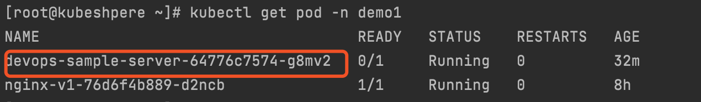

**执行 ` kubectl logs <pod name> -n <namespace name>`**

```bash
[root@kubeshpere ~]# kubectl logs devops-sample-server-5d6cffbc8f-l7hgk -n demo1
```

**查看pod日志，启动成功**

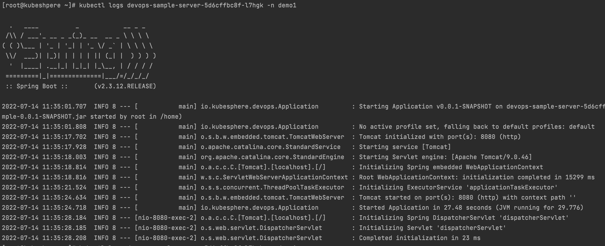

**查看pod描述**

**执行 ` kubectl describe pod <pod name> -n <namespace name>`**

```bash
[root@kubeshpere ~]# kubectl describe pod devops-sample-server-64776c7574-g8mv2 -n demo1
```

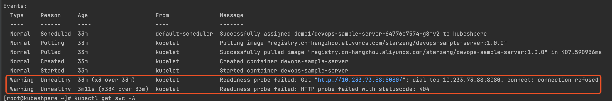

看以上描述：pod启动成功，请求失败，查看部署配置哪里需要请求

探针请求的8080端口已被springboot占用，所以失败，注释就行

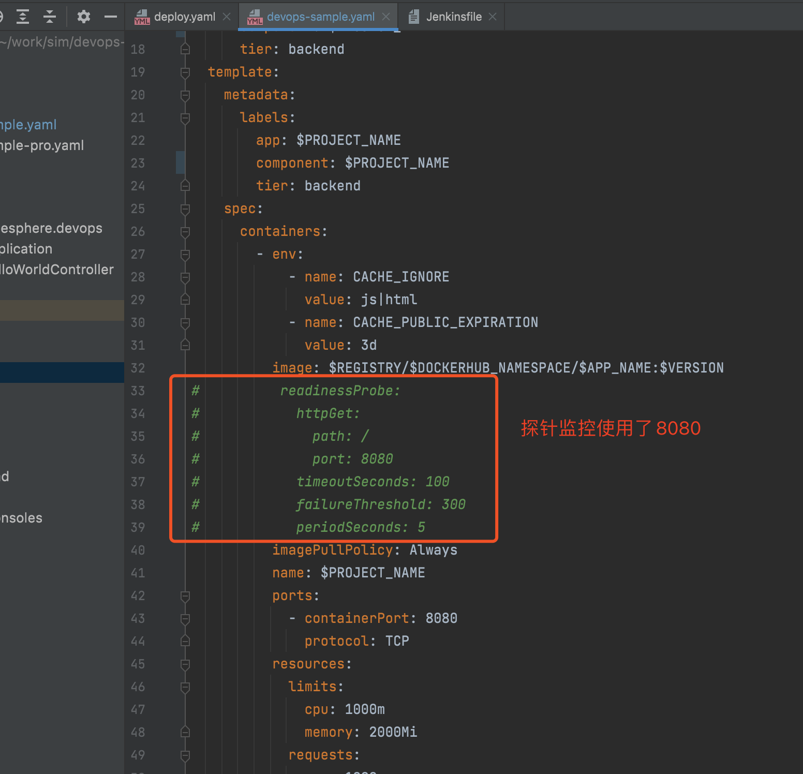


