## KubeSphere 部署 MySQL

KubeSphere 创建的服务，**有状态适合内部访问**，**无状态适合外部访问**。这里配置的是开发环境使用，所以创建**无状态服务**。

### 1. 应用商店安装

官方文档：https://kubesphere.com.cn/docs/v3.3/application-store/

启用 KubeSphere 应用商店，找到 MySQL，点击**应用信息**页面上的**安装**。

### 2. 创建MySQL服务

 登录 KubeSphere 

**请参见 [创建企业空间、项目、用户和角色](https://kubesphere.com.cn/docs/v3.3/quick-start/create-workspace-and-project/)。**

选择部署的项目

#### 创建持久卷

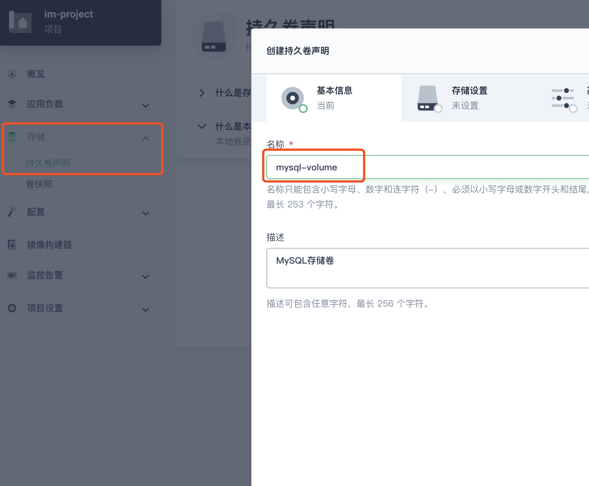

默认下一步

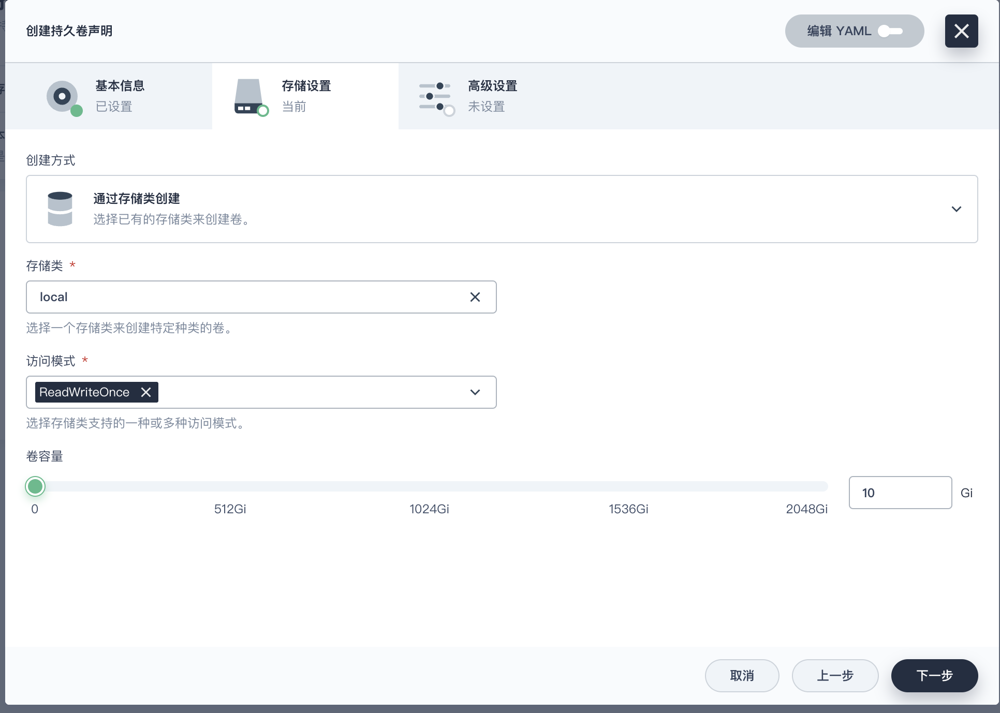

创建完成

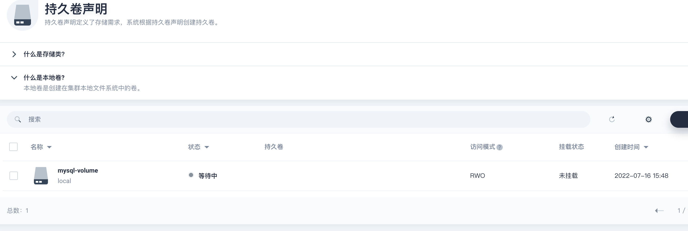

#### 创建有状态服务

**应用负载 > 服务**，创建**有状态服务**

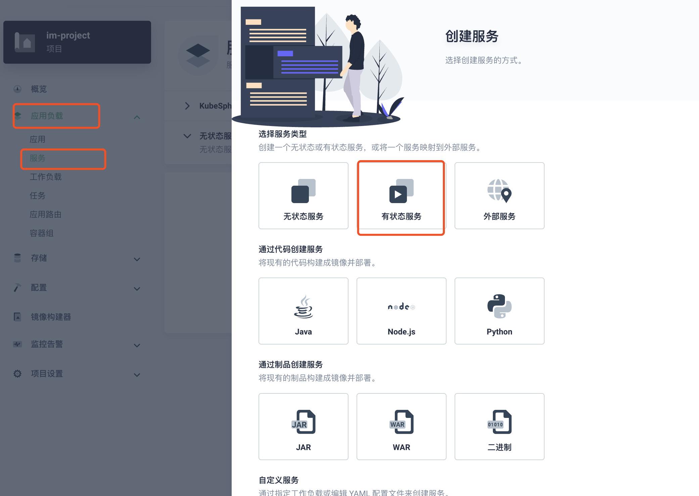

**配置服务**

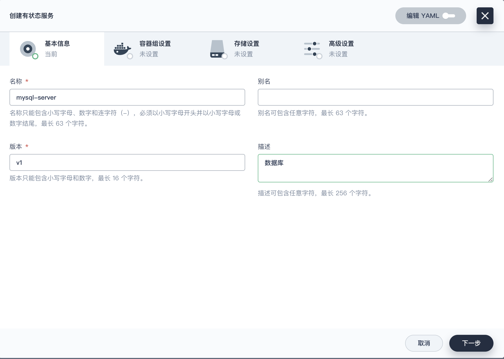

**设置容器**

选择镜像：**mysql:5.7**，按需配置MySQL容器配置

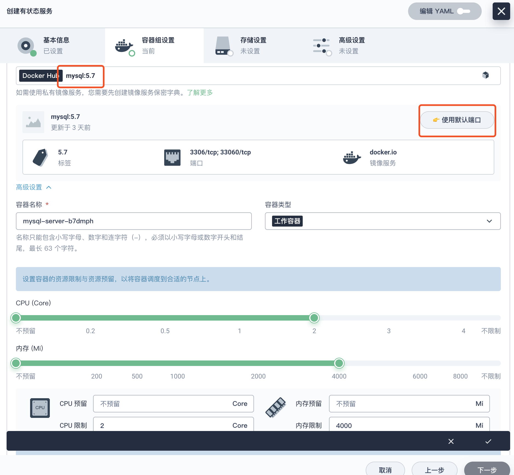

配置环境变量 > MySQL密码：**MYSQL_ROOT_PASSWORD**

勾上**同步主机时区**

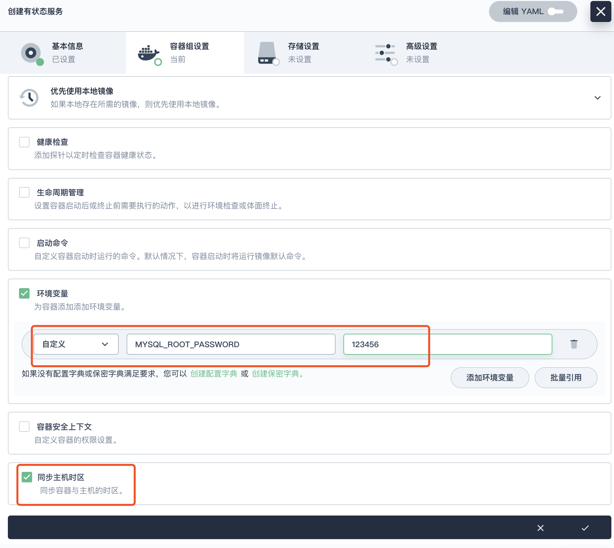

默认下一步，选择之前创建的持久卷

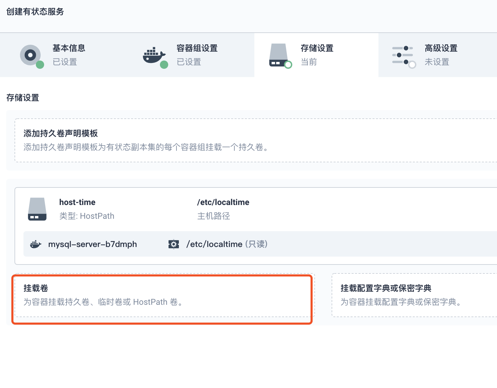

配置挂载路径：**/var/lib/mysql**

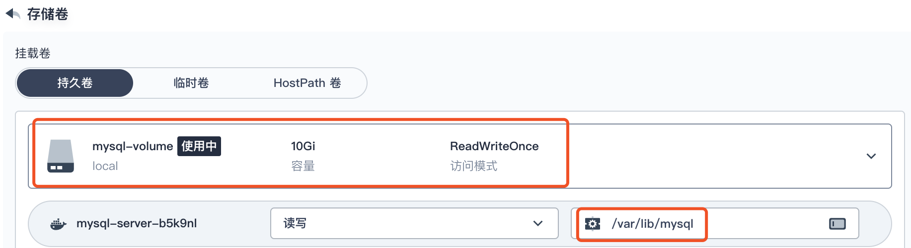

配置好后，直接下一步

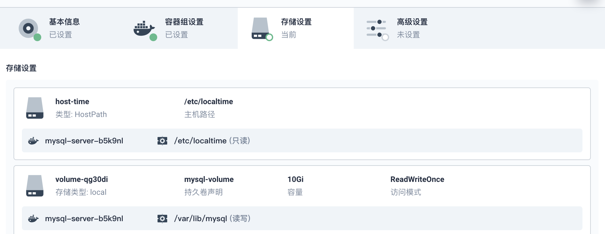

创建成功

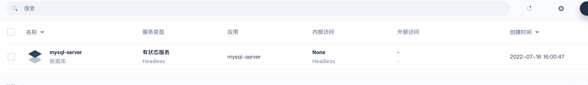

查看服务详情

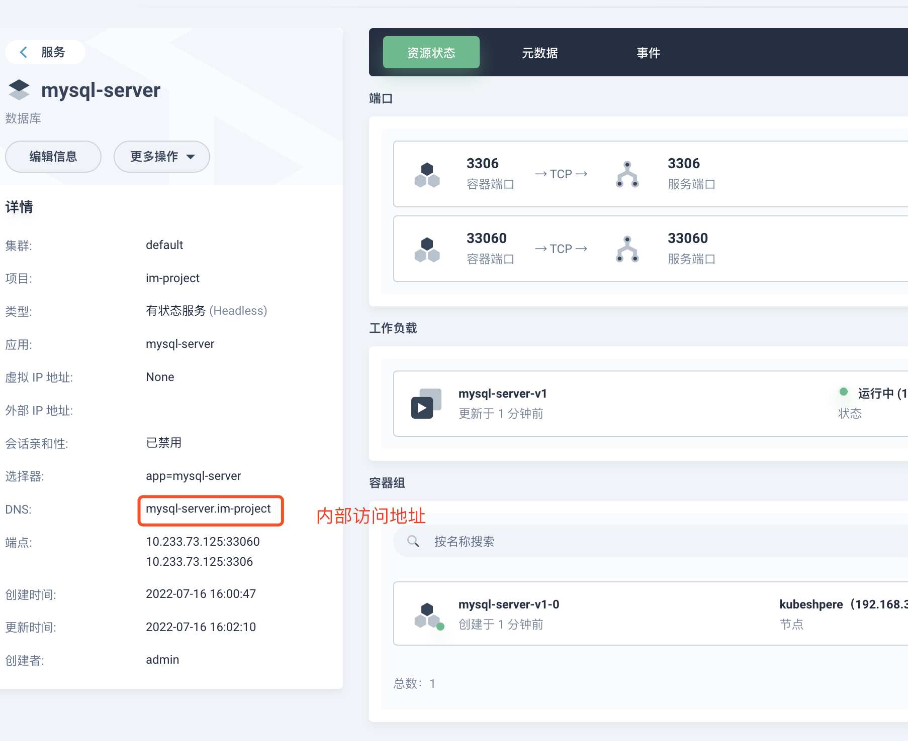

### 3. 访问问题

**上面创建的事有状态服务只适合 k8s 内网访问**

**如果需要外网访问，就需要创建无状态服务，步骤和上面的一样，只是多了配置外网访问**

#### 创建无状态服务

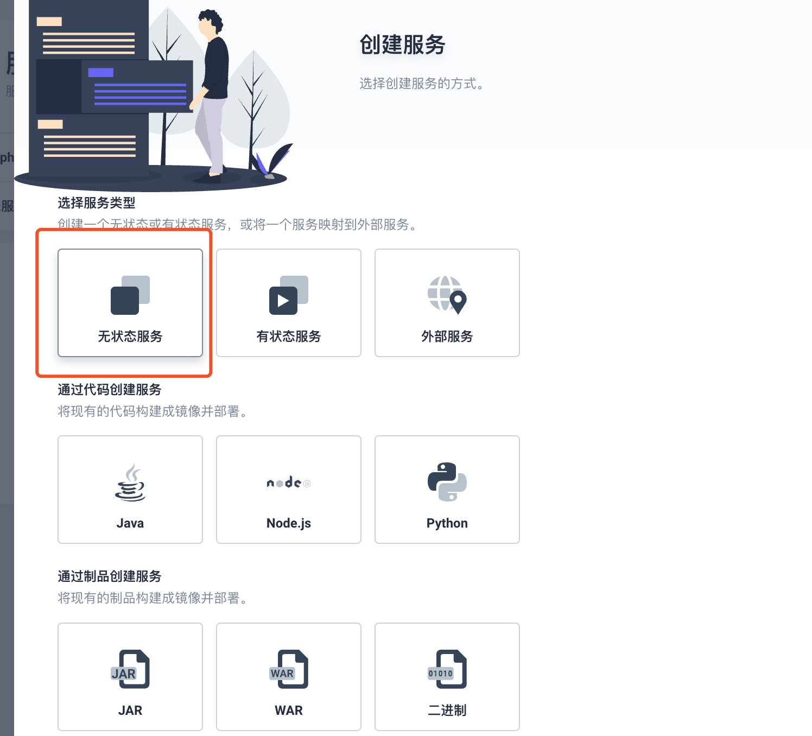

**无状态MySQL服务配置外部问**，前提是**开启了项目网关**

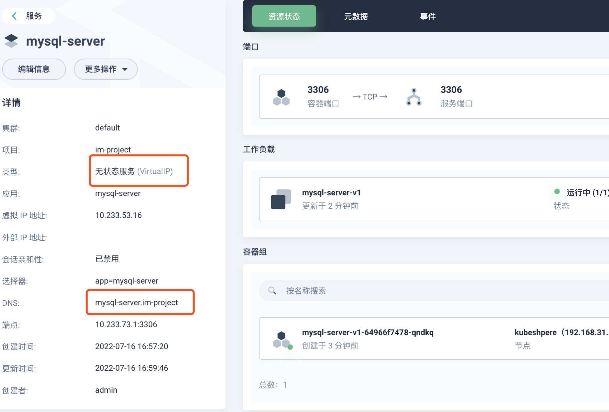

#### 编辑外部访问

选择**NodePort**

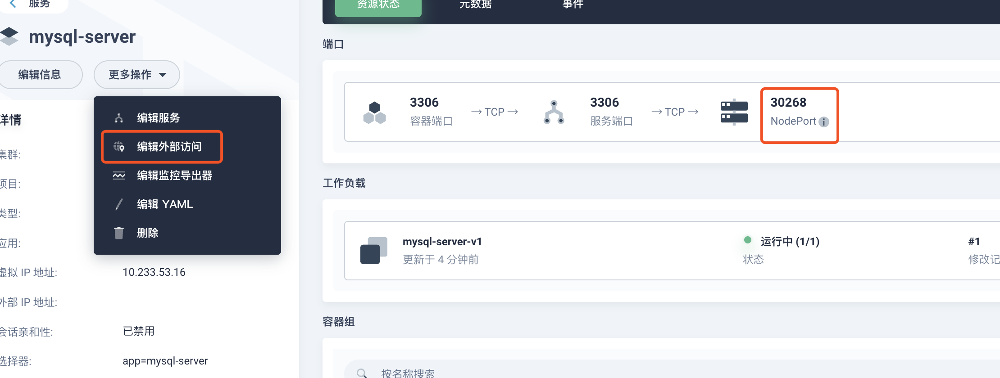

#### 外部访问测试

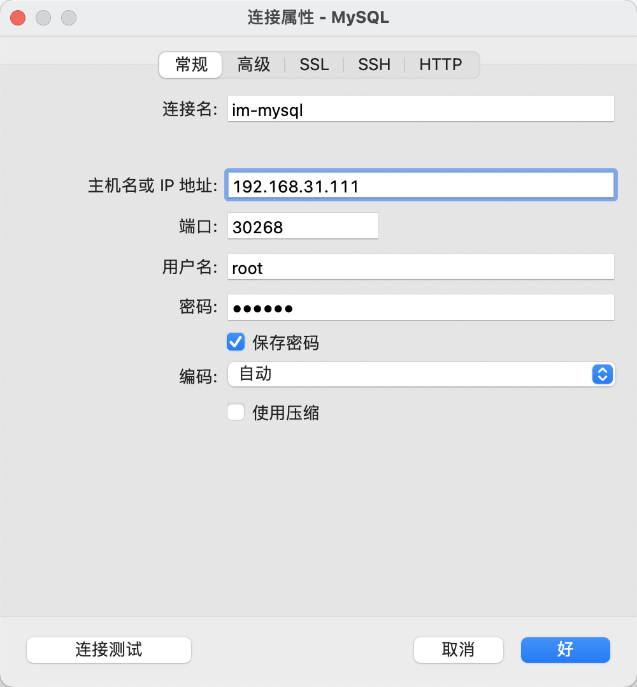

### 4. 集群创建（待续）

