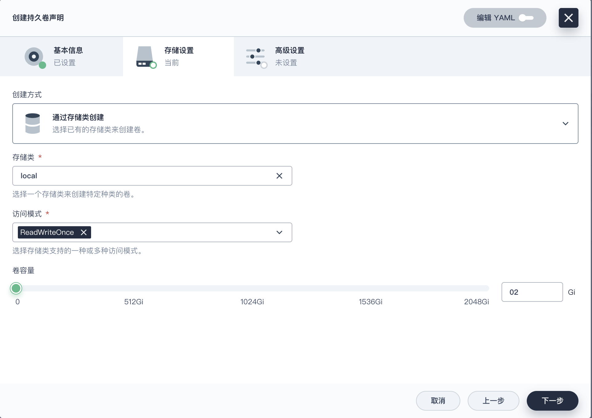
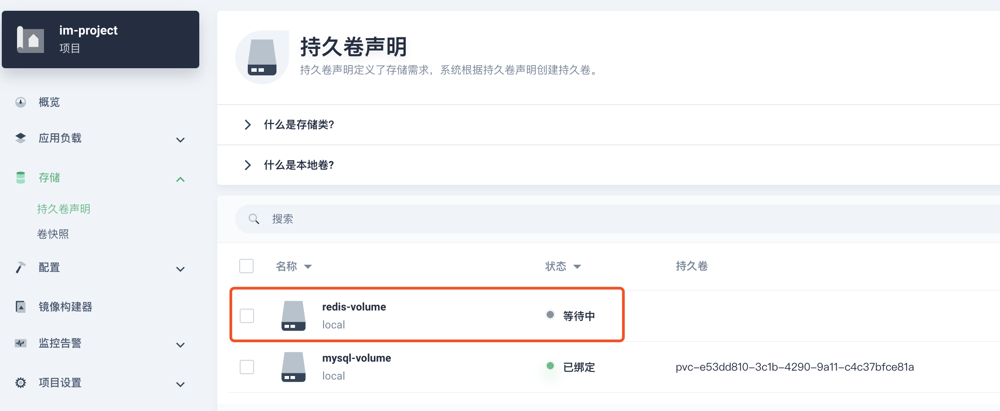
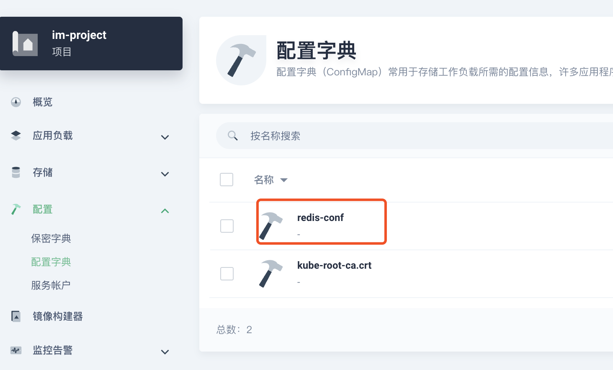
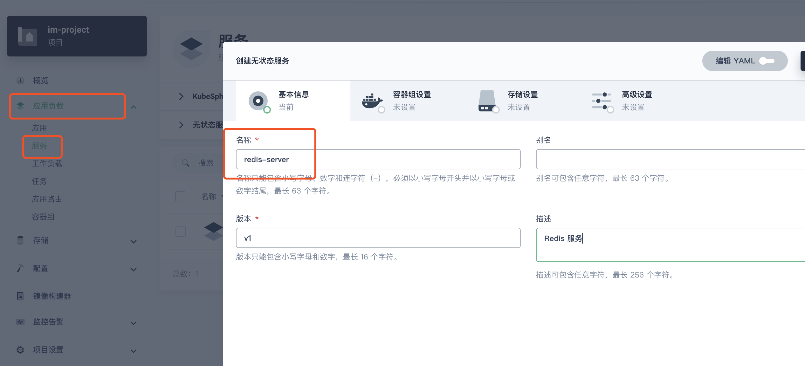
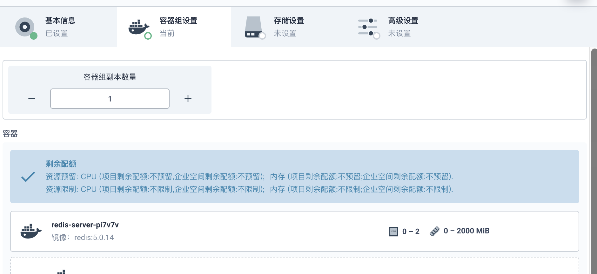
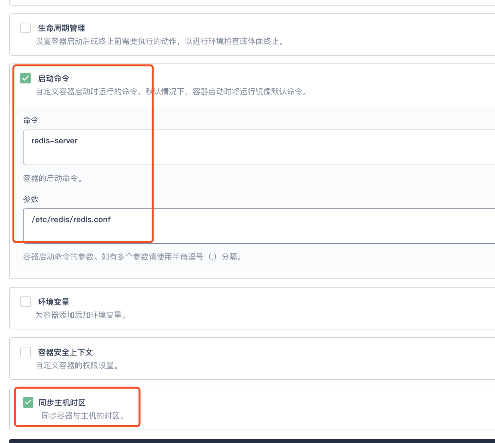
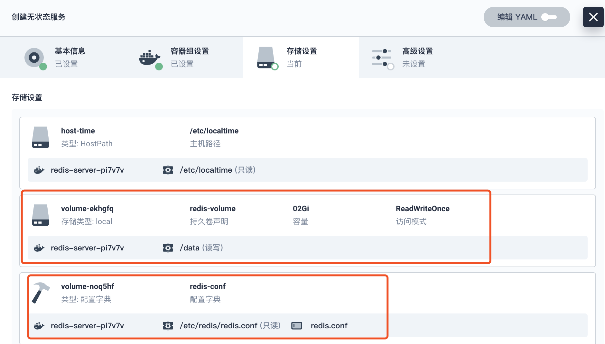
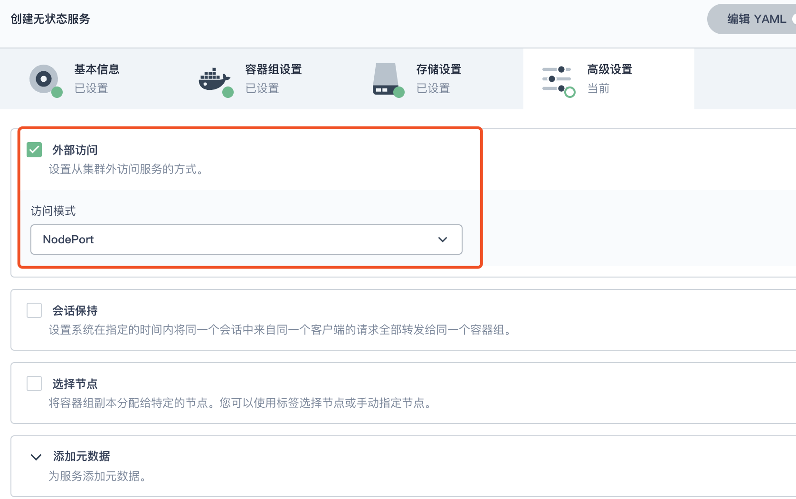
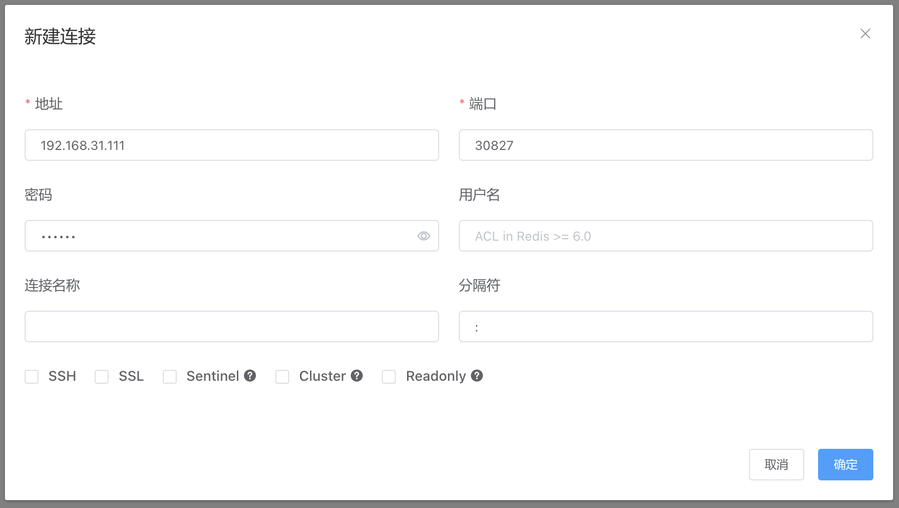
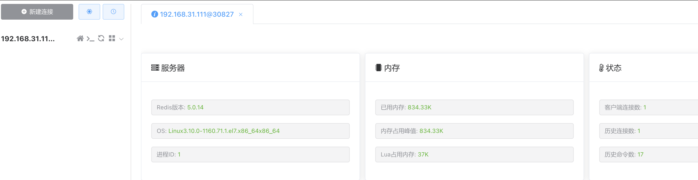

## KubeSphere 部署 Redis

KubeSphere 创建的服务，**有状态适合内部访问**，**无状态适合外部访问**。这里配置的是开发环境使用，所以创建**无状态服务**。


### 1. 应用商店安装

官方文档：https://kubesphere.com.cn/docs/v3.3/application-store/

启用 KubeSphere 应用商店，找到 Redis，点击**应用信息**页面上的**安装**。


### 2. 创建Redis服务

 登录 KubeSphere 

**请参见 [创建企业空间、项目、用户和角色](https://kubesphere.com.cn/docs/v3.3/quick-start/create-workspace-and-project/)。**

选择部署的项目

#### 创建持久卷



创建完成



#### 创建 Redis 配置字典

下载 redis 配置文件：https://github.com/redis/redis/blob/5.0/redis.conf

修改配置文件内容：

```bash
appendonly yes
requirepass 123456
```



#### 创建无状态服务




选择 Redis 镜像：**redis:5.0.14** ，配置启动命令，勾上同步主机时区

```bash
redis-server
/etc/redis/redis.conf
```








配置外部访问



### 3. 访问测试







