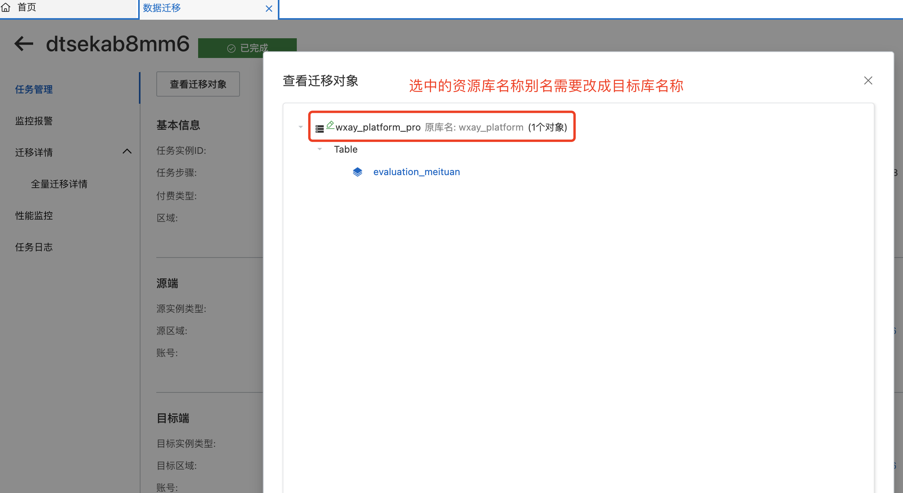

## MySQL数据迁移

### 一. docker容器中所有数据库迁移出来

```bash
 # 进入
 docker exec -it mysql bash
 # 导出所有数据库数据
 mysqldump -uroot -p123456 --all-databases > /tmp/all.sql
 # 退出
 exit
 
 # CP docker 容器中的SQL文件
 docker cp mysql:/tmp/all.sql 本机目录
 
```


### 二. mysqldump 的使用

```bash
# 导出db1中的a1、a2表
mysqldump -uroot -proot --databases db1 db2 >/tmp/db1_and_db2.sql

# 导出表
mysqldump -uroot -proot --databases db1 --tables a1 a2 >/tmp/db1.sql

# 条件导出只能导出单个表
mysqldump -uroot -proot --databases db1 --tables a1 --where='id=1' >/tmp/a1.sql

# 生成新的binlog文件,-F
mysqldump -uroot -proot --databases db1 -F >/tmp/db1.sql

# 只导出表结构不导出数据，--no-data
mysqldump -uroot -proot --no-data --databases db1 >/tmp/db1.sql


# 跨服务器导出导入数据
# 将h1服务器中的db1数据库的所有数据导入到h2中的db2数据库中，db2的数据库必须存在否则会报错
mysqldump --host=h1 -uroot -proot --databases db1 |mysql --host=h2 -uroot -proot db2
# 加上-C参数可以启用压缩传递。
mysqldump --host=h1 -uroot -proot -C --databases test |mysql --host=h2 -uroot -proot test 


# 常用source 命令
# 进入mysql数据库控制台，
 mysql -u root -p
 mysql>use 数据库
# 然后使用source命令，后面参数为脚本文件(如这里用到的.sql)
 mysql>source /data/test.sql


```

### 三. 阿里云DTS迁移


