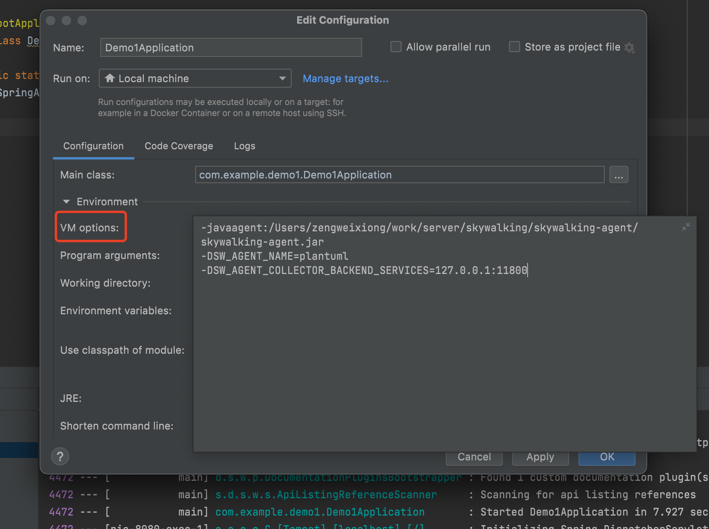

````shell
docker run \
--name skywalking-oap-server \
--restart always \
-p 11800:11800 \
-p 12800:12800 \
-e TZ=Asia/Shanghai \
-v /etc/localtime:/etc/localtime:ro \
-d apache/skywalking-oap-server:9.5.0

docker run \
--name skywalking-ui \
--restart always \
-p 8081:8080 \
--link skywalking-oap-server:skywalking-oap-server \
-e TZ=Asia/Shanghai \
-e SW_OAP_ADDRESS=http://skywalking-oap-server:12800 \
-v /etc/localtime:/etc/localtime:ro \
-d apache/skywalking-ui:9.5.0

# 注意 SW_OAP_ADDRESS 值必须加 http:// 前缀
````




```sh
-javaagent:/Users/zengweixiong/work/server/skywalking/skywalking-agent/skywalking-agent.jar 
-DSW_AGENT_NAME=plantuml 
-DSW_AGENT_COLLECTOR_BACKEND_SERVICES=127.0.0.1:11800

#注意：-D代表JVM参数
```


