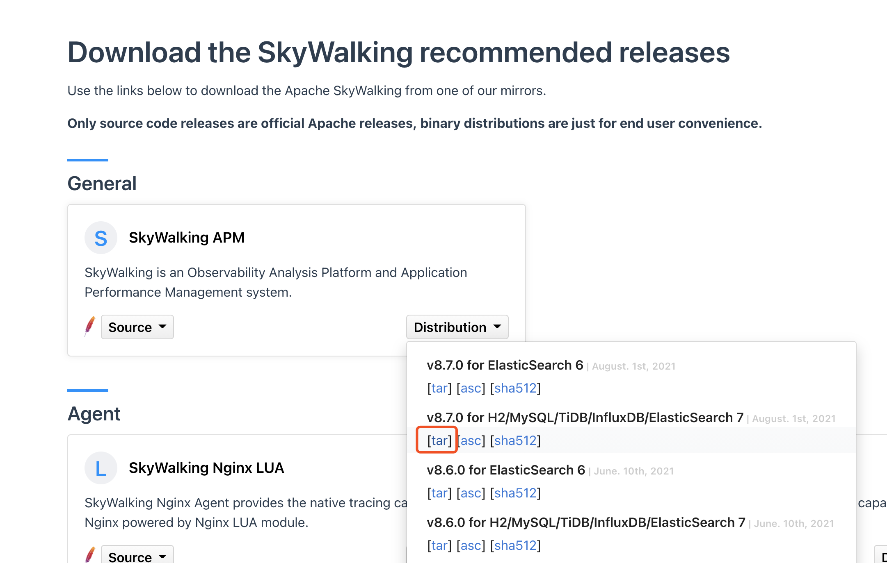

#### 下载

 https://skywalking.apache.org/downloads/



#### 下载tar包解压, 目录简介


#### 配置修改

##### OAP存储修改 

打开 ***config/application.yml*** 文件


##### agent配置添加日志文件,

[agent.config配置参数详解](https://skywalking.apache.org/docs/main/v8.4.0/en/setup/service-agent/java-agent/readme/#table-of-agent-configuration-properties)

打开 *agent/config/agent.config* , 最后面添加

```properties
plugin.toolkit.log.grpc.reporter.server_host=${SW_GRPC_LOG_SERVER_HOST:192.168.3.100}
plugin.toolkit.log.grpc.reporter.server_port=${SW_GRPC_LOG_SERVER_PORT:11800}
plugin.toolkit.log.grpc.reporter.max_message_size=${SW_GRPC_LOG_MAX_MESSAGE_SIZE:10485760}
plugin.toolkit.log.grpc.reporter.upstream_timeout=${SW_GRPC_LOG_GRPC_UPSTREAM_TIMEOUT:30}
```

| 配置名                                            | 解释                                           | 默认值    |
| ------------------------------------------------- | ---------------------------------------------- | --------- |
| plugin.toolkit.log.transmit_formatted             | 是否以格式化或未格式化的格式传输记录的数据     | true      |
| plugin.toolkit.log.grpc.reporter.server_host      | 指定要向其报告日志数据的grpc服务器的主机       | 127.0.0.1 |
| plugin.toolkit.log.grpc.reporter.server_port      | 指定要向其报告日志数据的grpc服务器的端口       | 11800     |
| plugin.toolkit.log.grpc.reporter.max_message_size | 指定grpc客户端要报告的日志数据的最大大小       | 10485760  |
| plugin.toolkit.log.grpc.reporter.upstream_timeout | 客户端向上游发送数据时将超时多长时间。单位是秒 | 30        |

注意HOST和PROT


##### SpringBoot项目添加日志框架及配置修改

###### Maven引入依赖

````xml
 <!-- skywalking -->
<dependency>
    <groupId>org.apache.skywalking</groupId>
    <artifactId>apm-toolkit-trace</artifactId>
    <version>8.7.0</version>
</dependency>

<!-- apm-toolkit-logback-1.x -->
<dependency>
    <groupId>org.apache.skywalking</groupId>
    <artifactId>apm-toolkit-logback-1.x</artifactId>
    <version>8.7.0</version>
</dependency>
````


###### 添加 logback-spring.xml 文件

```xml
<?xml version="1.0" encoding="UTF-8"?>
<configuration>

    <!-- 引入 Spring Boot 默认的 logback XML 配置文件  -->
    <include resource="org/springframework/boot/logging/logback/defaults.xml"/>

    <!-- 控制台 Appender -->
    <property name="CONSOLE_LOG_PATTERN" value="%clr(%d{${LOG_DATEFORMAT_PATTERN:-yyyy-MM-dd HH:mm:ss.SSS}}){faint} %clr(${LOG_LEVEL_PATTERN:-%5p}) %clr(${PID:- }){magenta} %tid %clr(---){faint} %clr([%15.15t]){faint} %clr(%-40.40logger{39}){cyan} %clr(:){faint} %m%n${LOG_EXCEPTION_CONVERSION_WORD:-%wEx}"/>

    <appender name="console" class="ch.qos.logback.core.ConsoleAppender">
        <!-- 日志的格式化 -->
        <encoder class="ch.qos.logback.core.encoder.LayoutWrappingEncoder">
            <layout class="org.apache.skywalking.apm.toolkit.log.logback.v1.x.TraceIdPatternLogbackLayout">
                <Pattern>${CONSOLE_LOG_PATTERN}</Pattern>
            </layout>
        </encoder>
    </appender>

    <!-- 从 Spring Boot 配置文件中，读取 spring.application.name 应用名 -->
    <springProperty name="applicationName" scope="context" source="spring.application.name" />

    <property name="FILE_LOG_PATTERN" value="%d{${LOG_DATEFORMAT_PATTERN:-yyyy-MM-dd HH:mm:ss.SSS}} ${LOG_LEVEL_PATTERN:-%5p} ${PID:- } %tid --- [%t] %-40.40logger{39} : %m%n${LOG_EXCEPTION_CONVERSION_WORD:-%wEx}"/>

    <!-- 日志文件的路径 -->
    <property name="LOG_FILE" value="logs/${applicationName}.log"/>

    <!-- 日志文件 Appender -->
    <appender name="file" class="ch.qos.logback.core.rolling.RollingFileAppender">
        <file>${LOG_FILE}</file>
        <!--滚动策略，基于时间 + 大小的分包策略 -->
        <rollingPolicy class="ch.qos.logback.core.rolling.SizeAndTimeBasedRollingPolicy">
            <fileNamePattern>${LOG_FILE}.%d{yyyy-MM-dd}.%i.gz</fileNamePattern>
            <maxHistory>7</maxHistory>
            <maxFileSize>10MB</maxFileSize>
        </rollingPolicy>
        <!-- 日志的格式化 -->
        <encoder class="ch.qos.logback.core.encoder.LayoutWrappingEncoder">
            <layout class="org.apache.skywalking.apm.toolkit.log.logback.v1.x.TraceIdPatternLogbackLayout">
                <Pattern>${FILE_LOG_PATTERN}</Pattern>
            </layout>
        </encoder>
    </appender>

    <appender name="grpc-log" class="org.apache.skywalking.apm.toolkit.log.logback.v1.x.log.GRPCLogClientAppender"/>

    <!-- 设置 Appender -->
    <root level="INFO">
        <appender-ref ref="console"/>
        <appender-ref ref="file"/>
        <appender-ref ref="grpc-log" />
    </root>

</configuration>
```


###### 片段代码示例

@Trace 和 @Tags注解

```java
 @Trace
 @Tags({
         @Tag(key = "param", value = "arg[0]"),
         @Tag(key = "list", value = "returnedObj")
 })
 @Override
 public List<BugTagDTO> list(BugTagListQuery bugTagListQuery) {
     try {
         return bugTagDAO.list(bugTagListQuery);
     } catch (ServiceException se) {
         se.printStackTrace();
         throw new ServiceException("业务异常");
     }
 }
```


#### 效果展示


#### [注意]

如果没有日志, 请检查依赖包版本是否正确


