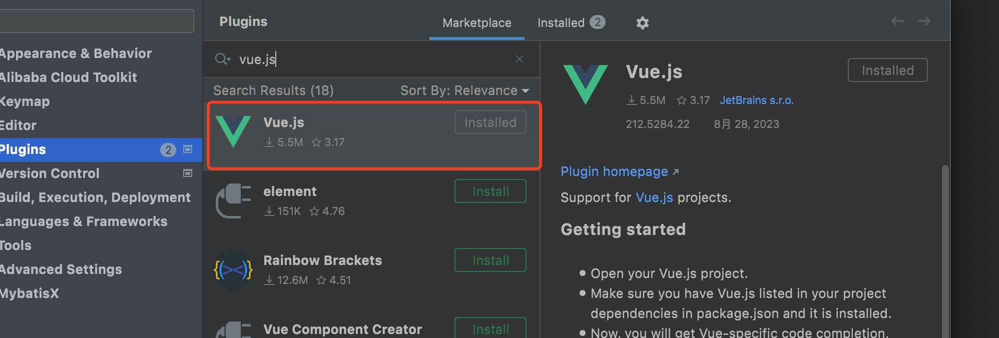
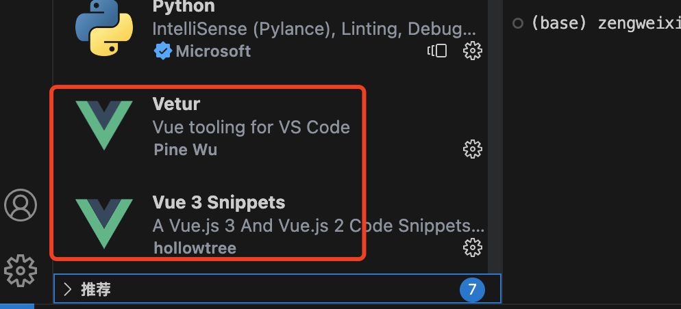
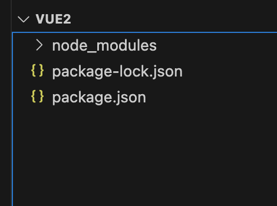

# VUE安装使用

## 1. Nodejs安装

已安装 16.0 或更高版本的 [Node.js](https://nodejs.org/)

更新最新版：https://nodejs.org/en/download/

直接下载安装覆盖


## 2. IDEA 安装VUE插件




## 3. vscode 安装VUE插件




## 4. 创建项目

```shell

npm init -y

npm install vue@^2

npm run dev

npm run build

```




