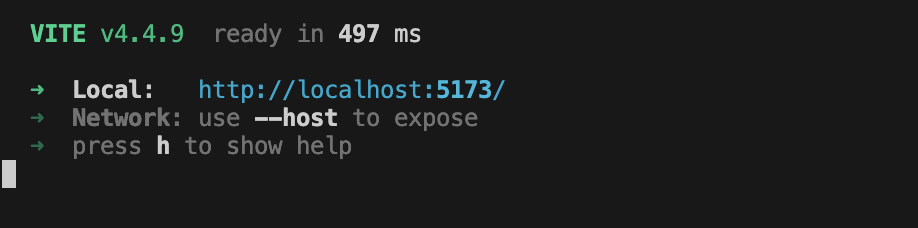

# ElementPlus

## 1. 介绍

官网地址： https://element-plus.org/


## 2. 搭建项目

### 2.1 安装vue3

```shell
# 查看
npm list

# 安装vue3, 选择合适的版本
npm install vue@3.3.4  
```

### 2.2 安装element-plus

```shell
npm install element-plus --save
```

### 2.3 vite脚手架初始化项目

```shell
npm init vite@latest

# 1. 填写项目名称
#  Project name: › vite-project 

# 2. 选择框架vue
# Select a framework: › - Use arrow-keys. Return to submit. 
#    Vanilla
# ❯  Vue
#    React
#    Preact
#    Lit
#    Svelte
#    Solid
#    Qwik
#    Others

# 3. 选择脚本语言JavaScript
#	Select a variant: › - Use arrow-keys. Return to submit.
#	    TypeScript
#	❯   JavaScript
#	    Customize with create-vue ↗
#	    Nuxt ↗

# 开始运行名利
# Done. Now run:
cd test02 # 项目根目录
npm install
npm run dev
npm run bulid
```

### 2.4 运行访问




## 3. 开发后台管理项目


```shell

```


```shell

```


