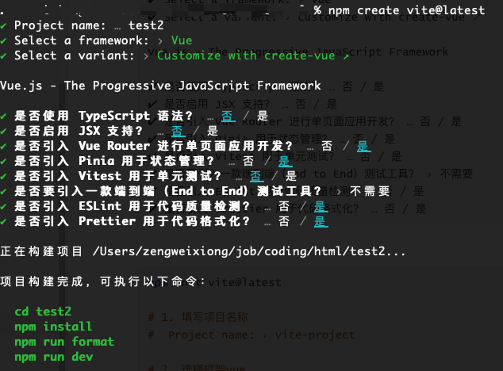
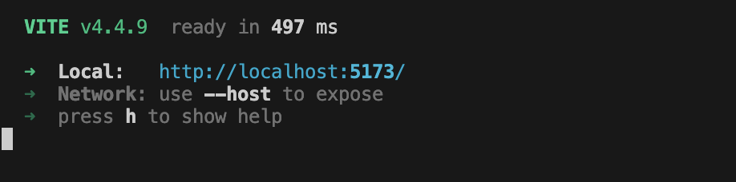
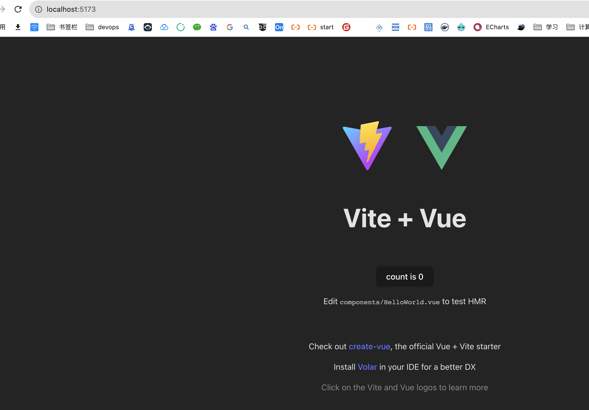

# ElementPlus

## 1. 介绍

官网地址： https://element-plus.org/


## 2. 搭建项目

### 2.1 安装vue3

```shell
# 查看
npm list

# 安装vue3, 选择合适的版本
npm install vue@latest
```


### 2.2 vite脚手架初始化项目



```shell
npm create vite@latest
✔ Project name: … test2
✔ Select a framework: › Vue
✔ Select a variant: › Customize with create-vue ↗

Vue.js - The Progressive JavaScript Framework

✔ 是否使用 TypeScript 语法？ … 否 / 是
✔ 是否启用 JSX 支持？ … 否 / 是
✔ 是否引入 Vue Router 进行单页面应用开发？ … 否 / 是
✔ 是否引入 Pinia 用于状态管理？ … 否 / 是
✔ 是否引入 Vitest 用于单元测试？ … 否 / 是
✔ 是否要引入一款端到端（End to End）测试工具？ › 不需要
✔ 是否引入 ESLint 用于代码质量检测？ … 否 / 是
✔ 是否引入 Prettier 用于代码格式化？ … 否 / 是
```


```shell
npm init vite@latest

# 1. 填写项目名称
#  Project name: › vite-project 

# 2. 选择框架vue
# Select a framework: › - Use arrow-keys. Return to submit. 
#    Vanilla
# ❯  Vue
#    React
#    Preact
#    Lit
#    Svelte
#    Solid
#    Qwik
#    Others

# 3. 选择脚本语言JavaScript
#	Select a variant: › - Use arrow-keys. Return to submit.
#	    TypeScript
#	❯   JavaScript
#	    Customize with create-vue ↗
#	    Nuxt ↗

# 开始运行名利
# Done. Now run:
cd test02 # 项目根目录
npm install
npm run dev
npm run bulid
```


### 2.3 安装element-plus

```shell
npm install element-plus --save
```


### 2.4 运行访问







