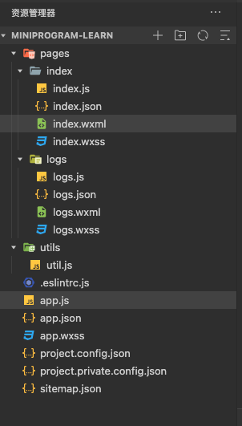

# 小程序模板

## 1. JS

### 目录




## 2. JS-Skyline

### 目录


## 3. TS

### 目录


## 4.TS-Skyline

### 目录


## 5. TS Less

### 目录


## 6. TS Sass

### 目录


## 7. tdesign 组件模板库

### 项目添加tdesign步骤

```sh
# 1. 项目根目录执行，填写对应的信息
npm init -y

# 2. NPM 安装 tdesign-miniprogram 包
npm i tdesign-miniprogram -S --production
```

### 构建NPM配置


### 执行构建NPM


### 构建完成


