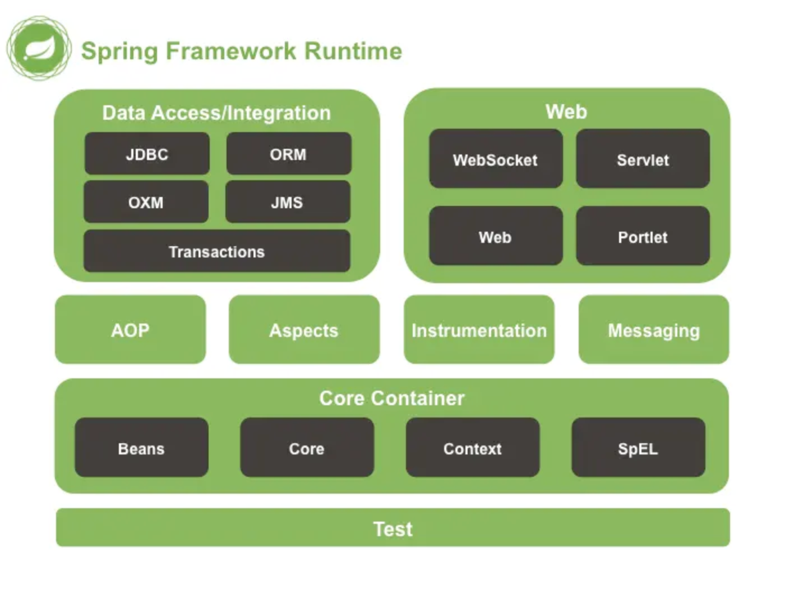
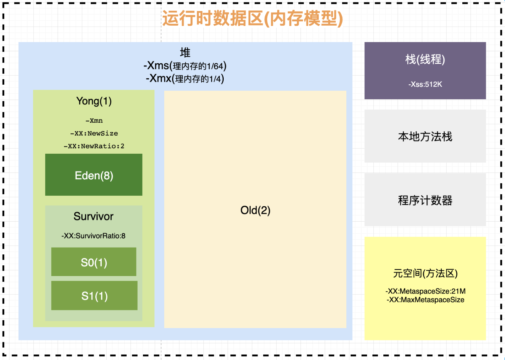

## Spring模块，IOC、AOP的原理及应用场景

https://juejin.cn/post/6844904159724961800

 `核心容器（Core Container）` 

 `AOP（Aspect Oriented Programming）`

`设备支持（Instrmentation）` 

`数据访问与集成（Data Access/Integeration）` 

 `Web`

 `消息（Messaging）` 

 `Test`

IOC就是控制反转，指创建对象的控制权转移给Spring来进行管理。

简单来说，就是应用不用去new对象了，而全部交由Spring自动生产。

IOC有三种注入方式：1、 构造器注入  2、setter方法注入 3、根据注解注入。

- 通过IOC容器，可以方便地将Mock对象注入到测试对象中，从而实现单元测试。

AOP 面向切面。

用于将那些与业务无关，但却对多个对象产生影响的公共行为。抽取并封装成一个可重用的模块。

- 日志记录：通过AOP，可以很方便地在方法调用之前或之后记录日志信息。
- 安全验证：可以通过AOP在方法执行前进行身份验证或权限检查。
- 事务管理：通过AOP，可以实现声明式的事务管理，从而简化代码中的事务管理逻辑。
- 
  异常处理：捕获方法执行过程中的异常，并进行统一处理和日志记录。

AOP的核心就是动态代理。JDK的动态代理  和  CGLIB动态代理。

- 基于JDK的动态代理：对接口实现类进行代理。
- 基于CGLIB的动态代理：对类进行代理。

## JVM线上调优

top查看CPU内存使用情况

- jps -l pid 查看java进程，包括包名 

- jmap
  - jmap -histo pid
    - 查看历史生成实例
  - jmap -heap pid
    - 打印堆信息
      - 查看Eden S0 S1 Old空间使用情况
  - jmap -dump:live,format=b,file=./XXX.hprof pid
    - 使用jvisualvm导入hprof文件分析
- jstack 查看线程信息
- jstat 打印GC情况
- jinfo查看JVM参数

### arthas : 

`java -jar arthas-boot.jar`

`dashboard`

`thread -d` 查看死锁

​	

## MySQL查询优化、索引优化

- explain
  - select_type 
    -  primary 复杂查询 最外层的select 
    - simple 普通查询 
    - subquery 子查询 select后面 
    - derived 衍生查询，零时表 form后面
  - type
    - system
    - const
    - eq_ref
    - ref
    - rang
    - index
    - all
  - 覆盖索引就是查询的结果就在二级索引中，不需要更具主键回表查询
  - 强制索引不一定快，需要看实际查询结果
  - LRU策略
  - like 大概率走索引下推
  - Using index
  - Using filesort文件排序 单路排序：结果集在内存中排序，排完就是结果 双路排序：id,排序字段开始排序，排完回表查询结果集 范围查询属性，建索引放在最后 索引覆盖80%的业务场景
  - trace
  - 读多写少 建3个左右索引 读少写多 建1个左右索引

- 最左列原则
  - 索引顺序排列

## 高并发

## 多线程，线程池原理

## SPI机制

用来启用框架扩展和替换组件

Java SPI ：META-INF/services

Spring SPI ：META-INF/spring.factories

## Rabbitmq消息丢失、重复消费、消息顺序、大规模积压

https://blog.51cto.com/u_15780184/5650933

RabbitMQ避免消息丢失的方法主要是利用**消息确认机制**和**手动签收机制**

消息确认机制 主要是生产者使用的机制，用来确认消息是否被成功消费。

消息签收机制 开启手动签收方式 RabbitMQ的消息是自动签收的，你可以理解为快递签收了，那么这个快递的状态就从发送变为已签收，唯一的区别是快递公司会对物流轨迹有记录，而MQ签收后就从队列中删除了。

### 消息丢失

消息丢失的原因无非有三种：

1）、消息发出后，中途网络故障，服务器没收到；

2）、消息发出后，服务器收到了，还没持久化，服务器宕机；

3）、消息发出后，服务器收到了，消费方还未处理业务逻辑，服务却挂掉了，而消息也自动签收，等于啥也没干。

这三种情况，(1) 和 (2)是由于生产方未开启消息确认机制导致，(3)是由于消费方未开启手动签收机制导致。

解决方案
1）、生产方发送消息时，要try...catch，在catch中捕获异常，并将MQ发送的关键内容记录到日志表中，日志表中要有消息发送状态，若发送失败，由定时任务定期扫描重发并更新状态；

2）、生产方publisher必须要加入确认回调机制，确认成功发送并签收的消息，如果进入失败回调方法，就修改数据库消息的状态，等待定时任务重发；

3）、消费方要开启手动签收ACK机制，消费成功才将消息移除，失败或因异常情况而尚未处理，就重新入队。

### 消息重复

1、出现原因

1）、消息消费成功，事务已提交，签收时结果服务器宕机或网络原因导致签收失败，消息状态会由unack转变为ready，重新发送给其他消费方；

2）、消息消费失败，由于retry重试机制，重新入队又将消息发送出去。

2、解决方案
网上大体上能搜罗到的方法有三种：

1）、消费方业务接口做好幂等；

2）、消息日志表保存MQ发送时的唯一消息ID，消费方可以根据这个唯一ID进行判断避免消息重复；

3）、消费方的Message对象有个getRedelivered()方法返回Boolean，为TRUE就表示重复发送过来的。

我这里只推荐第一种，业务方法幂等这是最直接有效的方式，（2）还要和数据库产生交互，（3）有可能导致第一次消费失败但第二次消费成功的情况被砍掉。

### 消息积压

1、出现原因

1）、消费方的服务挂掉，导致一直无法消费消息；

2）、消费方的服务节点太少，导致消费能力不足，从而出现积压，这种情况极可能就是生产方的流量过大导致。

2、解决方案
1）、既然消费能力不足，那就扩展更多消费节点，提升消费能力；

2）、建立专门的队列消费服务，将消息批量取出并持久化，之后再慢慢消费。

(1)就是最直接的方式，也是消息积压最常用的解决方案，但有些企业考虑到服务器成本压力，会选择第（2）种方案进行迂回，先通过一个独立服务把要消费的消息存起来，比如存到数据库，之后再慢慢处理这些消息即可。

这里单独讲一下本人在工作中使用RabbitMQ的一些心得，希望能有所帮助。

1）、消息丢失、消息重复、消息积压三个问题中，实际上主要解决的还是消息丢失，因为大部分公司遇不到消息积压的场景，而稍微有水准的公司核心业务都会解决幂等问题，所以几乎不存在消息重复的可能；

2）、消息丢失的最常见企业级方案之一就是定时任务补偿，因为不论是SOA还是微服务的架构，必然会有分布式任务调度的存在，自然也就成为MQ最直接的补偿方式，如果MQ一定要实现100%投递，这种是最普遍的方案。但我实际上不推荐中小企业使用该方案，因为凭空增加维护成本，而且没有一定规模的项目完全没必要，大家都小看了RabbitMQ本身的性能，比如我们公司，支撑一个三甲医院，也就是三台8核16G服务器的集群，上线至今3年毫无压力；

3）、不要迷信网上和培训机构讲解的生产者消息确认机制，也就是前面两个概念中讲到的ConfirmCallback和ReturnCallback，这种机制十分降低MQ性能，我们团队曾遇到过一次流量高峰期带来的MQ传输及消费性能大幅降低的情况，后来发现是消息确认机制导致，关闭后立马恢复正常，从此以后都不再使用这种机制，MQ运行十分顺畅。同时我们会建立后台管理实现人工补偿，通过识别业务状态判断消费方是否处理了业务逻辑，毕竟这种情况都是少数，性能和运维成本，在这一块我们选择了性能；

4）、我工作这些年使用RabbitMQ没见过自动签收方式，一定是开启手动签收；

5）、手动签收方式你在网上看到的教程几乎都是处理完业务逻辑之后再手动签收，但实际上这种用法是不科学的，在分布式的架构中，MQ用来解耦和转发是非常常见的，如果是支付业务，往往在回调通知中通过MQ转发到其他服务，其他服务如果业务处理不成功，那么手动签收也不执行，这个消息又会入队发给其他消费者，这样就可能在流量洪峰阶段因为偶然的业务处理失败造成堵塞，甚至标题所讲的三种问题同时出现，这样就会得不偿失。

