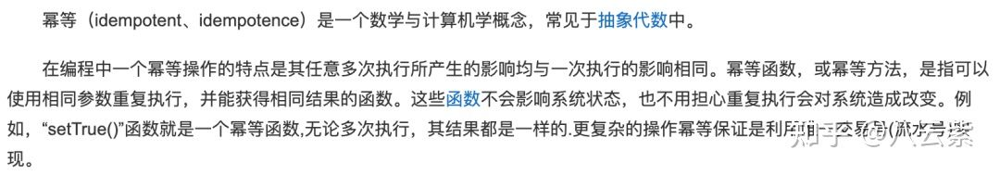

## **一、什么是幂等？**

看一下维基百科怎么说的：

**幂等性：**多次调用方法或者接口不会改变业务状态，可以保证重复调用的结果和单次调用的结果一致。

## **二、使用幂等的场景**

## **1、前端重复提交**

用户注册，用户创建商品等操作，前端都会提交一些数据给后台服务，后台需要根据用户提交的数据在数据库中创建记录。如果用户不小心多点了几次，后端收到了好几次提交，这时就会在数据库中重复创建了多条记录。这就是接口没有幂等性带来的 bug。

## **2、接口超时重试**

对于给第三方调用的接口，有可能会因为网络原因而调用失败，这时，一般在设计的时候会对接口调用加上失败重试的机制。如果第一次调用已经执行了一半时，发生了网络异常。这时再次调用时就会因为脏数据的存在而出现调用异常。

## **3、消息重复消费**

在使用消息中间件来处理消息队列，且手动 ack 确认消息被正常消费时。如果消费者突然断开连接，那么已经执行了一半的消息会重新放回队列。

当消息被其他消费者重新消费时，如果没有幂等性，就会导致消息重复消费时结果异常，如数据库重复数据，数据库数据冲突，资源重复等。

