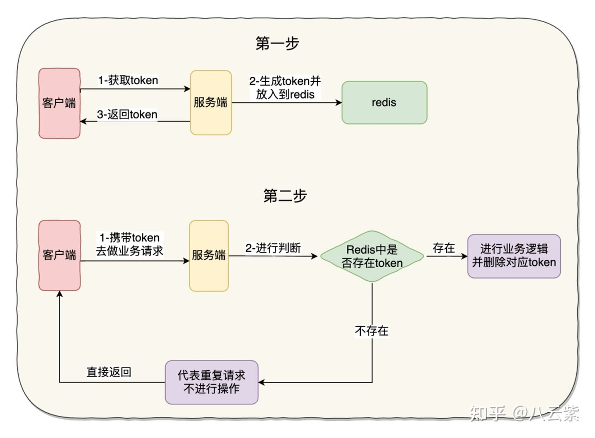
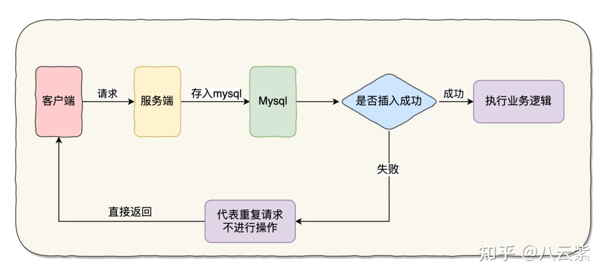
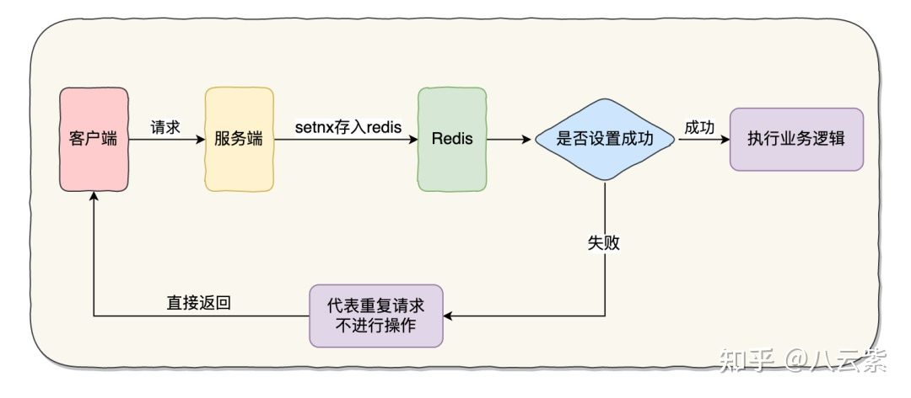

## 解决方案

## **1、token 机制实现**

通过token 机制实现接口的幂等性,这是一种比较通用性的实现方法。

示意图如下：

具体流程步骤：

1. 客户端会先发送一个请求去获取 token，服务端会生成一个全局唯一的 ID 作为 token 保存在 redis 中，同时把这个 ID 返回给客户端
2. 客户端第二次调用业务请求的时候必须携带这个 token
3. 服务端会校验这个 token，如果校验成功，则执行业务，并删除 redis 中的 token
4. 如果校验失败，说明 redis 中已经没有对应的 token，则表示重复操作，直接返回指定的结果给客户端

注意：

1. 对 redis 中是否存在 token 以及删除的代码逻辑建议用 Lua 脚本实现，保证原子性
2. 全局唯一 ID 可以用百度的 uid-generator、美团的 Leaf 去生成

## **2、基于 mysql 实现**

这种实现方式是利用 mysql 唯一索引的特性。

示意图如下：

具体流程步骤：

1. 建立一张去重表，其中某个字段需要建立唯一索引
2. 客户端去请求服务端，服务端会将这次请求的一些信息插入这张去重表中
3. 因为表中某个字段带有唯一索引，如果插入成功，证明表中没有这次请求的信息，则执行后续的业务逻辑
4. 如果插入失败，则代表已经执行过当前请求，直接返回

## **3、基于 redis 实现**

这种实现方式是基于 SETNX 命令实现的

SETNX key value：将 key 的值设为 value ，当且仅当 key 不存在。若给定的 key 已经存在，则 SETNX 不做任何动作。

该命令在设置成功时返回 1，设置失败时返回 0。

示意图如下：

具体流程步骤：

1. 客户端先请求服务端，会拿到一个能代表这次请求业务的唯一字段
2. 将该字段以 SETNX 的方式存入 redis 中，并根据业务设置相应的超时时间
3. 如果设置成功，证明这是第一次请求，则执行后续的业务逻辑
4. 如果设置失败，则代表已经执行过当前请求，直接返回

## **总结**

这几种实现幂等的方式其实都是大同小异的，类似的还有使用状态机、悲观锁、乐观锁的方式来实现，都是比较简单的。

总之，当你去设计一个接口的时候，幂等都是首要考虑的问题，特别是当你负责设计转账、支付这种涉及到 money 的接口，你要格外注意喽