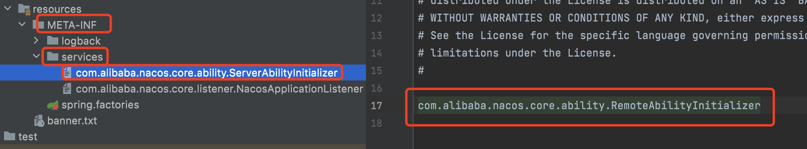
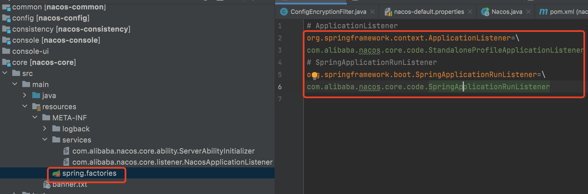

# SPI

## 1. 什么是 SPI

**Service Provider Interface** 扩展点

被第三方实现或者扩展的接口

是"基于接口的编程＋策略模式＋配置文件"组合实现的动态加载机制

是设计模式的生动体现

用来启用框架扩展和替换组件

SPI的作用就是为这些被扩展的API寻找服务实现

推荐模块之间基于接口编程, 模块之间不对实现类进行硬编码, 一旦代码里涉及具体的实现类, 就违反了可拔插的原则, 如果需要替换一种实现, 就需要修改代码


key - value

接口路径 - 接口实现类路径


## Java SPI

META-INF/services



调用

```java
ServiceLoader<XXX> spis = ServiceLoader.load(XXX.class);
spis.forEach(XXX::yyy);
```


## Spring SPI

META-INF/spring.factories



调用

```java
List<SpringSPI> spis = SpringFactoriesLoader.loadFactories(XXX.class, Thread.currentThread().getContextClassLoader());
spis.forEach(XXX::yyy);
```