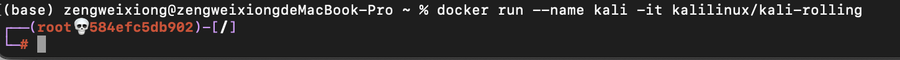

# Web安全


## 1. 使用 kali 工具渗透

Kali Linux是一个开源的、基于Debian的Linux发行版，面向各种信息安全任务，如渗透测试、安全研究、计算机取证和逆向工程。

官网地址：https://www.kali.org/


### 1.1 docker安装kali

```shell
docker pull kalilinux/kali-rolling

docker run --name kali -it kalilinux/kali-rolling
```

**运行效果**



需要安装 vim 等工具

```shell
# 备份
cp /etc/apt/sources.list /etc/apt/sources.list.bak

# 修改 sources.list 文件内容
echo "
#中科大
deb http://mirrors.ustc.edu.cn/kali kali-rolling main non-free contrib
deb-src http://mirrors.ustc.edu.cn/kali kali-rolling main non-free contrib
#阿里云
deb http://mirrors.aliyun.com/kali kali-rolling main non-free contrib
deb-src http://mirrors.aliyun.com/kali kali-rolling main non-free contrib
#清华大学
deb http://mirrors.tuna.tsinghua.edu.cn/kali kali-rolling main contrib non-free
deb-src https://mirrors.tuna.tsinghua.edu.cn/kali kali-rolling main contrib non-free
#浙大
deb http://mirrors.zju.edu.cn/kali kali-rolling main contrib non-free
deb-src http://mirrors.zju.edu.cn/kali kali-rolling main contrib non-free
#东软大学
deb http://mirrors.neusoft.edu.cn/kali kali-rolling/main non-free contrib
deb-src http://mirrors.neusoft.edu.cn/kali kali-rolling/main non-free contrib
#官方源
deb http://http.kali.org/kali kali-rolling main non-free contrib
deb-src http://http.kali.org/kali kali-rolling main non-free contrib
#163 
deb http://mirrors.163.com/debian/ jessie main non-free contrib
deb http://mirrors.163.com/debian/ jessie-updates main non-free contrib
deb http://mirrors.163.com/debian/ jessie-backports main non-free contrib
deb-src http://mirrors.163.com/debian/ jessie main non-free contrib
deb-src http://mirrors.163.com/debian/ jessie-updates main non-free contrib
deb-src http://mirrors.163.com/debian/ jessie-backports main non-free contrib
deb http://mirrors.163.com/debian-security/ jessie/updates main non-free contrib
deb-src http://mirrors.163.com/debian-security/ jessie/updates main non-free contrib
" > /etc/apt/sources.list


```

修改 **sources.list** 文件内容

```shell
#中科大
deb http://mirrors.ustc.edu.cn/kali kali-rolling main non-free contrib
deb-src http://mirrors.ustc.edu.cn/kali kali-rolling main non-free contrib
#阿里云
deb http://mirrors.aliyun.com/kali kali-rolling main non-free contrib
deb-src http://mirrors.aliyun.com/kali kali-rolling main non-free contrib
#清华大学
deb http://mirrors.tuna.tsinghua.edu.cn/kali kali-rolling main contrib non-free
deb-src https://mirrors.tuna.tsinghua.edu.cn/kali kali-rolling main contrib non-free
#浙大
deb http://mirrors.zju.edu.cn/kali kali-rolling main contrib non-free
deb-src http://mirrors.zju.edu.cn/kali kali-rolling main contrib non-free
#东软大学
deb http://mirrors.neusoft.edu.cn/kali kali-rolling/main non-free contrib
deb-src http://mirrors.neusoft.edu.cn/kali kali-rolling/main non-free contrib
#官方源
deb http://http.kali.org/kali kali-rolling main non-free contrib
deb-src http://http.kali.org/kali kali-rolling main non-free contrib
#163 
deb http://mirrors.163.com/debian/ jessie main non-free contrib
deb http://mirrors.163.com/debian/ jessie-updates main non-free contrib
deb http://mirrors.163.com/debian/ jessie-backports main non-free contrib
deb-src http://mirrors.163.com/debian/ jessie main non-free contrib
deb-src http://mirrors.163.com/debian/ jessie-updates main non-free contrib
deb-src http://mirrors.163.com/debian/ jessie-backports main non-free contrib
deb http://mirrors.163.com/debian-security/ jessie/updates main non-free contrib
deb-src http://mirrors.163.com/debian-security/ jessie/updates main non-free contrib
```


